# 2021

## Potilastapaus

Kaksikymmentä vuotta tupakoinut lastentarhaopettaja on flunssan yhteydessä käheytynyt ja ääni on ollut hyvin käheä ja välillä lähes poissa jo kaksi kuukautta, yskä on jo lievittynyt. Yleistila on hyvä, ääni hyvin vuotoinen ja käheä ja työssä pärjääminen hankalaa. Äänihuulien tutkiminen ei voimakkaan yökkäyksen vuoksi onnistu.

Sinun tulee suositella

- a) Viikon sairauslomaa ja äänilepoa
- b) 2 vrk sairauslomaa ja amoksisilliini 500mg x 3, viikon antibioottikuuri
- c) Viikon sairausloma ja lähete äänihuulten arvioon korvalääkärille
- d) 2 vrk sairauslomaa, äänilepoa ja paikallishoitona höyryhengitys sekä yskänlääke

  <button class="solution-button" data-label="Vastaus" data-hide-label="Piilota vastaus">
    Vastaus
  </button>
  

      c

a: Pelkkä sairasloma ei riitä, koska potilas vaatii lisäselvittelyjä. Oireiden tai äänen laadun perusteella ei voi tehdä diagnoosia, vaan kurkunpään tila pitää tutkia viimeistään äänihäiriön pitkittyessä (yli 3 vkoa; potilaalla on nyt jo 2kk ollut äänihäiriö). Potilaan oireiden keston lisäksi hän on tupakoija ja myös sen takia kurkunpään tutkiminen on erityisen tärkeää (syöpäriski)

b: Flunssaan liittyvä laryngiitti ja siten äänihäiriö on useimmiten virusperäinen ja antibioottihoito ei ole rutiinisti indikoitu ilman bakteeri-infektion viitteitä. Antibiootille onkin hyvin harvoin tarvetta laryngiitin hoidossa. Potilaan yskän ja muiden oireiden lievittyminen vielä kuvastaa sitä, että infektiotilanne on jo mennyt ohi ja äänihäiriö on pitkittynyt mahdollisesti jostain toisesta syystä kuin akuutista infektiosta. 

c: Viikon sairausloma on hyvä, koska potilas on äänityöläinen (opettaja; jos ääntä ei tarvitse työssään niin lyhyempi voi riittää). Potilas myös tarvitsee äänihuulten arvion, koska on pitkäaikainen tupakoija sekä oireet ovat pitkittyneet -> syöpäriski.

d: Loma on liian lyhyt, koska potilas on äänityöläinen (opettaja) ja he tarvitsevat usein hieman pidemmän äänilevon ja siten sairausloman. Vastauksessa ei myöskään ole mainintaa jatkotutkimuksista, joita potilas tarvitsee syöpäriskin takia. 
  

## Milloin lapselle tehdään tonsillotomia?

- a) Lapsella on toistuvia korvatulehduksia
- b) Lapsella on nielupaise
- c) Lapsella on suurentuneet, obstruktiota aiheuttavat nielurisat
- d) Lapsella on puheen kehityksen häiriö

  <button class="solution-button" data-label="Vastaus" data-hide-label="Piilota vastaus">
    Vastaus
  </button>
  

      c

Tonsillotomia tarkoittaa nielurisojen osapoistoa (tonsillektomia taas nielurisojen kokopoistoa). 

a: Toistuvat korvatulehdukset eivät ole tonsillotomian aihe – liitetty enemmän kitarisaongelmiin. Adenotomiastakaan ei kuitenkaan ole hyötyä toistuvien otiittien ehkäisyssä. 

b: Lapsilla ensimmäisen nielupaiseen yhteydessä kyllä voidaan harkita risaleikkausta (ns. kuuman vaiheen), mutta se olisi tonsillektomia eikä tonsillotomia. **Tulehdusten hoidossa yleisesti käytetään tonsillektomiaa ja obstruktio-oireissa tonsillotomiaa.**

c: Nielurisojen liikakasvuun liittyvät obstruktiiviset oireet (esim. unenaikainen hengityshäiriö (OSAS) tai uniapneatauti) ovat indikaatio leikkaukselle. Lapsilla nielurisat voivat kitarisan kanssa olla aiheuttamassa hengitysteiden obstruktio-oireita, jolloin tapauskohtaisesti harkitaan tehdäänkö lapselle kitarisan poisto (adenotomia),  nielurisojen osapoisto (tonsillotomia; yleisin nielurisaleikkaus obstruktion yhteydessä) tai poisto kokonaan (tonsillektomia; harvemmin obstruktio-indikaatiolla).  

d: Nielurisojen ongelmat eivät tyypillisesti johda puheen kehityksen häiriöihin eikä täten ole indikaatio leikkaukselle. 

  

## Potilastapaus 

45-vuotiaalla verenpainetautia sairastavalla naisella on äkillisesti alkanut kiertävä huimaus ja pahoinvointi. Lisäksi potilas raportoi jonkin verran päänsärkyä kohtaukseen liittyen.

- a) Tutkit potilaan statuksen ja tilanne sopii vestibulaarineuroniittiin. Potilas on kotikuntoinen ja kotiutat potilaan hoito-ohjein.
- b) Dix-Hallpiken testissä ei löydöstä. Sopii asentohuimaukseen ja kotiutat potilaan asentohoito-ohjeiden kera.
- c) Lähetät potilaan ESH:oon tarkempiin tutkimuksiin päivystyksenä.
- d) Pään nykäisytesti on poikkeava ja lähetät potilaan neurologin arvioon kiireellisenä (1-7pv)

  <button class="solution-button" data-label="Vastaus" data-hide-label="Piilota vastaus">
    Vastaus
  </button>
  

      c

Äkillisesti alkanut kiertohuimaus + pahoinvointi **yhdessä päänsäryn kanssa** ja potilaalla verenpainetauti → aina herättää huolen keskushermostoperäisestä huimauksesta, erityisesti aivorungon tai pikkuaivojen infarktista. Tällöin potilas ei ole kotiutettavissa, vaan tarvitsee päivystyksellisen arvioinnin erikoissairaanhoidossa.

Jos aiemmin terveen potilaan ainoana oireena on huimaus, eikä potilaalla ole aivoverenkiertohäiriön riskitekijöitä ja hänen neurologinen statuksensa on normaali (pois lukien mahdollinen yhteen suuntaan lyövä nystagmus), ei tilanne anna aihetta epäillä aivoverenkiertohäiriötä.

a: Vestibulaarineuriitti voisi olla akuutisti alkaneen jatkuvan pyörittävän huimauksen ja pahoinvoinnin taustalla. Sen erottaminen varsinkin aivoverenkiertohäiriöstä on erityisen tärkeää perusterveydenhuollossa ja päivystyksessä työskenneltäessä. Vestibulaarineuriittia ei kuitankaan voi vain omatoimisesti todeta PTH:ssa ja kotiuttaa potilasta ilman lähetteitä jatkotutkimuksiin, vaan diagnoosin varmentaminen vaatii mm. otoneurologisen tutkimuksen, joka tehdään joko päivystyksellisesti tai seuraavana aamuna. Potilaalla voisi myös epäillä aivoverenkierron häiriötäkin, joka vaatii päivystyksellistä tutkimusta. 

b: Pelkkä Dix-Hallpike ei riitä poissulkemaan kaikkia huimauksen syitä ja pelkästään sen negatiivisella löydöksellä ei voida todeta asentohuimausta. 

d: Poikkeava pään nykäisytesti yleensä viittaa perifeeriseen huimaukseen, joka olisi pääasiassa KNK:n asioita (ei neurologin). Pelkkä poikkeava nykäisytesti ei myöskään poissulje sentraalisen huimauksen mahdollisuutta ja potilas vaatii sen lisäselvittelyjä. 

  

## Potilastapaus 

Potilaasi on 63-vuotias, joka tulee vastaanotollesi vasemmanpuoleisen pari kuukautta jatkuneen kurkkukivun takia. Toteat vasemman nielurisan olevan selvästi kookkaampi, limakalvo on rikkoutunut ja nielurisa on palpoiden arka ja kova. Mitkä ovat potilaasi todennäköisimmät nielurisan pahanlaatuisen kasvaimen riskitekijät?

- a) Auringonvalon UV-säteily
- b) Tupakkatuotteet
- c) Human papilloma virus (HPV)
- d) Altistuminen jalopuupölylle

  <button class="solution-button" data-label="Vastaus" data-hide-label="Piilota vastaus">
    Vastaus
  </button>
  

      b/c

Tupakka on yleisesti yksi tärkeimmistä riskitekijä suun, nielun ja kaulan alueen maligniteeteille. Wikissä mallivastaus on b, mutta nykyään c voisi olla myös oikea vastaus, koska HPV on yleistynyt merkittävästi. 

a: Auringonvalo ei pääasiassa osu nieluun, joten ei ole nielutuumoreiden taustalla. 

c: **HPV etiologinen tekijä jo yli puolessa uusista suunielusyöpätapauksista.** HPV-infektion myötä suunielusyöpään sairastuu yhä enemmän myös alle 45-vuotiaita ja tupakoimatonta väestöä. Tupakointi ja siihen liittyvä pään ja kaulan syöpä vähenevät, mutta suunielusyövän ilmaantuvuus lisääntyy; merkittävin syy tälle on HPV. Länsimaissa ja myös Suomessa valtaosa uusista tapauksista on HPV-positiivisia, kun taas vuoteen 1995 asti HPV-positiivisten suunielusyöpien osuus oli vain 32 %. 

Suunielusyöpä on vuodesta 2016 lähtien luokiteltu kahteen erilliseen alatyyppiin, HPV-positiiviseen ja HPV-negatiiviseen. HPV-positiivisen suunielusyövän ennuste on näistä parempi, viiden vuoden kuluttua diagnoosista elossa on noin 80 % potilaista, kun HPV-negatiivisen suunielusyövän yhteydessä osuus on vain noin 50 % 

d: On mahdollinen riskitekijä puualan ammattilaisilla, mutta ei ole merkittävin yleisesti. Kovapuupöly myös useimmiten altistaa nenän ja nenän sivuonteloiden syövälle, ei nielurisan maligniteeteille. 
  

## Epäilet lapsella toimenpidettä vaativaa kitarisahypertrofiaa. Mikä seuraavista ei sovi epäilyysi?

- a) Suuhengitys
- b) Kuorsaus
- c) Nasaalinen puhe
- d) Syömisongelmat

  <button class="solution-button" data-label="Vastaus" data-hide-label="Piilota vastaus">
    Vastaus
  </button>
  

      d

Syömisongelmat ovat sinänsä enemmänkin vaikean nielurisahypertrofian aiheuttamia, jos hypertrofia on niin suurta, että se aiheuttaa nielemisvaikeuksia. Kitarisahypertrofia kuitenkin voi häiritä hajuaistia, mikä heikentää ruoasta saamaa nautintoa. 

a: Kitarisahypertrofia aiheuttaa nenän kautta hengityksen estymistä, mikä johtaa jatkuvaan suuhengitykseen. 

b: Nenän tukkoisuus voi aiheuttaa kuorsausta ja uniapneaa. 

c: Nenän tukkoisuus kitarisahypertrofiasta johtuen voi aiheuttaa nasaalista puhetta (samoin kuten flunsassa ollessa); tarkalleen ottaen hyponasaalista puhetta, joka johtuu nenän tukkoisuudesta. Hypernasaalisessa puheessa taas liikaa ilmaa vapautuisi nenän kautta. 
  

## Ménièren taudissa tyypillinen löydös tai oire on

- a) Pysyvä kuulon lasku korkeilla taajuuksilla
- b) Kuulon fluktuaatio
- c) Keinuttava huimaus kävellessä
- d) Jatkuva korkeataajuinen tinnitus

  <button class="solution-button" data-label="Vastaus" data-hide-label="Piilota vastaus">
    Vastaus
  </button>
  

      b

Ménièren taudin tyypilliseen taudinkuvaan kuuluu kuulo- että tasapainoelinperäiset oireet **kohtaustyyppisesti.** Tyypillisimmät oireet ovat huimaus (Voimakas kiertohuimaus), humina, huonokuuloisuus _matalilla äänillä_ (sensorineuraalinen) ja huonovointisuus. Tärkeimmät oireet voi siis muistaa ns. **4H:n triadina: Huimaus, Humina, Huonokuuloisuus, Huono vointi**. Lisäksi voi olla korvan täyteyden tai kivun tunnetta. Yleensä oireet ilmenevät vain toisessa korvassa. 

Menieren tauti on melko yleinen sairaus (n. 2-5:llä 1000:sta). Sen ajatellaan johtuvat endolymfan heikosta resorptiosta. Tämä johtaa lisääntyneeseen endolymfavolyymiin ja siten paineseen -> endolymfaattisen järjestelmän distensio -> vaurio vestibulaarisiin ja kokleaarisiin sisäkorvan osiin (Ménièren tauti = idiopaattinen endolymfaattinen hydrops). 
 

a: Alkuun tyypillistä on kohtauksittainen kuulovika, tavallisesti pienillä taajuuksilla. Pidempään edenneessä taudissa voi olla jo tasainen kuulonalenema, mutta ei siis pelkästään korkeilla taajuuksilla. 

b: Kuulon fluktuaatio = kohtauksittainen kuulovika; tämä on tyypillistä Menieren taudille varsinkin alkuvaiheissa

c: Huimauskohtaus on tyypillisesti kiertohuimaustyyppistä ja kesto on tuntien suuruusluokkaa; oirekohtaukset eivät ole yhteydessä kävelemiseen. 

d: Menieren taudille on tyypillistä matalataajuinen humina tai suhina, ei korkeataajuinen soiminen. Tämä oire ei myöskään ole tyypillisesti jatkuva, vaan muiden oireiden kaltaisesti episodinen. 

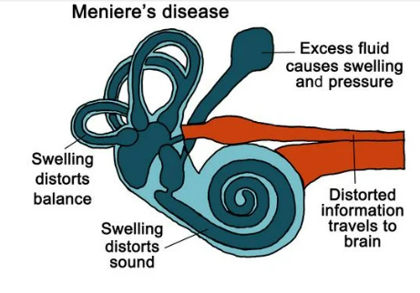
  

## Potilastapaus

4-vuotiaalla tytöllä on ollut 2kk ajan jatkuvaa oikeanpuoleista nenän tukkoisuutta sekä märkäistä vuotoa oikeasta sieraimesta. Mikä seuraavista vaihtoehdoista on todennäköisin etiologia?

- a) Nenän vierasesine
- b) Hammasperäinen rinosinuiitti oikealla puolella
- c) Kallonpohjan läpi pullistuva meningoseele oikeassa sieraimessa ja siihen liittyvä infektio
- d) Juveniili papillooma oikeassa sieraimessa

  <button class="solution-button" data-label="Vastaus" data-hide-label="Piilota vastaus">
    Vastaus
  </button>
  

      a
      
Jos pikkulapsen nähdään panevan jotain nenäänsä, annetaan ohjeeksi tuoda lapsi viipymättä vastaanotolle oireita odottamatta. Jos tapahtumaa ei ole nähty ja siitä on kulunut pitkä aika, tilanne voi tulla lääkärin eteen ilman vierasesineeseen viittaavia esitietoja esimerkiksi infektio-ongelmana. Silloin tyypillisiä oireita ovat yleensä toispuolinen märkäinen ja pahanhajuinen, joskus verinen nenäneritys ja sierainaukon ärtynyt ihotulehdus. 

Diagnostiikassa tärkeintä on eturinoskopia. 

b: Hammasperäiset sinuiitit ovat selvästi yleisempiä vanhemmilla lapsilla ja aikuisilla, ei oikein 4-vuotiaalla vielä. Etenkin aikuispotilaan erotusdiagnooseja ovat nenän kasvaimet ja toispuolinen (mahdollisesti hammasperäinen) märkäinen rinosinuiitti. 

c: Meningoseele eli aivokalvojen pullistuma voi työntyä cribriform platen läpi nenäonteloon ja aiheuttaa sen tukkoisuutta; siihen voi liittyä kirkasta likvorin kaltaista vuotoa, ei kuitenkaan yleensä märkäistä tai infektoitunutta eritettä. Meningoseelet ovat myös suhteellisen harvinaisia eikä ole ykkösenä listalla nenän tukkoisuutta ajatellessa. Ne ovat yleisempiä kyllä pediatrisessa populaatiossa ja usein taustalla on synnynnäinen defekti kallonpohjassa, joka mahdollistaa pullistuman. Meningoseelet ovat hyvin harvinaisia aikuisilla ja yleensä syntyvät traumapohjaisesti. 

d: Ei yleensä puhuta "juveniileista papilloomista", vaan papilloomat esiintyvät yleensä aikuisilla.
  

## Päädyt tekemään 50-vuotiaalle rinosinuiittioireista kärsivälle potilaalle poskiontelopunktion. Minne punktioneula asetetaan punktiota tehtäessä?

- a) Alakäytävään
- b) Keskikäytävään
- c) Valvulakulmaan
- d) Osteomeataalisen yksikön alueelle

  <button class="solution-button" data-label="Vastaus" data-hide-label="Piilota vastaus">
    Vastaus
  </button>
  

      a

Lievät ja kohtalaiset oireet hoidetaan oireenmukaisesti supistavalla nenäsuihkeilla, nenäkannulla ja nenäkortikosteroidilla. Voimakkaissa oireissa ja märkäiseen tulehdukseen viittaavissa löydöksissä suositellaan viikon antibioottikuuria (esim. amoksisilliini, doksisykliini tai amoksisilliini-klavulaanihappo). 

Poskiontelopunktio tehdään, jos perushoito ei auta, oireet ovat voimakkaita ja tarvitaan mikrobiologinen näyte. Toimenpide helpottaa painetta ja mahdollistaa taudinaiheuttajan tunnistamisen. 

Alakäytävä puudutetaan, ja tarvittaessa turvotusta vähennetään adrenaliiniliuoksella. Neula viedään poskionteloon varovasti, neulaosa poistetaan ja poskiontelo huuhdellaan onton mandriinin kautta steriilillä keittosuolaliuoksella.

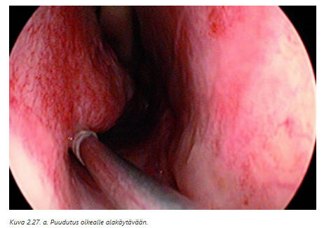
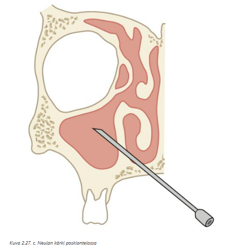
  

## Syvän kaulainfektion aiheuttaja

- a. jää yleisimmin tuntemattomaksi.
- b. on usein hoitamattomista hampaista johtuva periapikaalinen tulehdus.
- c. on usein ihon tulehtunut aterooma.
- d. selviää usein ottamalla thx-rtg-kuva.

  <button class="solution-button" data-label="Vastaus" data-hide-label="Piilota vastaus">
    Vastaus
  </button>
  

      b

Aikuisten syvien kaulainfektioiden yleisin lähtökohta on odontogeeninen (dentogeeninen, hammasperäinen) infektio, erityisesti periapikaalinen tulehdus ala- tai yläleuan molaareista. Syvä kaulainfektio voi olla myös nielutulehdusperäinen, mutta märkäviljelyn bakteerilöydösten perusteella jopa kaksi kolmasosaa tulehduksista ovat hammasperäisiä. 

a: Syvissä kaulainfektioissa infektion alkuperä löydetään valtaosassa tapauksia, ja yleisin on hammasperäinen. Tuntemattomia on vain pieni osa (alle 10%).

b: Ihon ateroomat voivat johtaa paikallisiin paiseisiin, mutta ne eivät tyypillisesti aiheuta syviä kaulainfektioita.

c: Thorax-kuvasta ei selvitetä syvän kaulainfektion aiheuttajaa. Sitä voidaan käyttää, jos epäillään esim. mediastiniittia, mutta ei etiologian selvittämiseen (syvä kaulainfektio leviää helposti rintaontelon sisälle välikarsinaan, sillä kaulan kudoksista retrofaryngeaalitilassa on eristämätön yhteys rintaonteloon).

  

## Miten voit parantaa näkyvyyttä äänihuulten tasolle, jos potilaalla on herkkä oksennusrefleksi?

- a) Pyydät potilasta hengittämään nenän kautta
- b) Pyydät potilasta hengittämään suun kautta
- c) Pyydät potilasta nojaamaan taaksepäin
- d) Pyydät potilasta pidättämään hengitystä

  <button class="solution-button" data-label="Vastaus" data-hide-label="Piilota vastaus">
    Vastaus
  </button>
  

      b

Kun potilas hengittää suu auki ja rauhallisesti suun kautta, nielu relaksoituu ja oksennusrefleksi vähenee. Tämä on standardi keino parantaa näkyvyyttä nielun ja äänihuulten tasolle esimerkiksi peilitutkimuksessa tai fiberoskopiassa. Samalla kieli painuu luonnollisesti alaspäin ja nielu pysyy avoimempana.

a: Nenähengitys voi stimuloida pehmeää suulakea ja takanielua, mikä ei lievitä oksennusrefleksiä, vaan voi jopa aktivoida sitä herkemmillä potilailla.

c: Taaksepäin nojaaminen ei vähennä oksennusrefleksiä, ja lisäksi kielen tyvi voi painua taaksepäin, jolloin näkyvyys huononee. Potilasta kannattaa oikeastaan pyytää nojaamaan eteenpäin, mikä auttaa näkyvyydessä. 

d: Hengityksen pidättäminen ei rentouta nielua. Se usein lisää jännitystä ja voi pahentaa oksennusrefleksiä. Lisäksi se ei paranna näkyvyyttä.

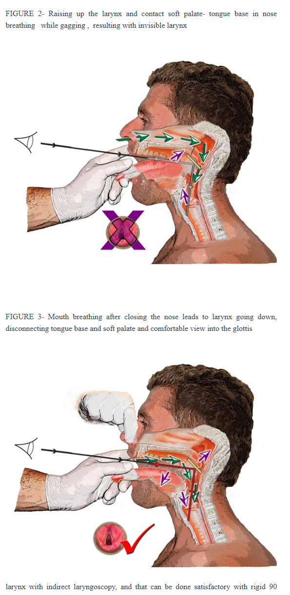

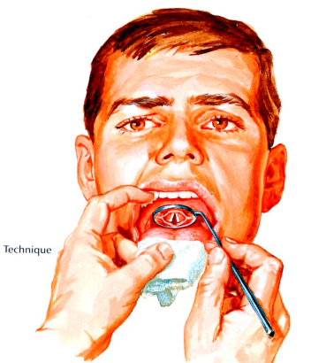
  

## Potilastapaus

25-vuotias nainen, joka työskentelee päiväkodissa, tulee huhtikuussa vastaanotollesi toista viikkoa jatkuneen voimakkaan oireilun vuoksi. Nenä on tukossa, kutisee ja vuotaa kirkasta eritettä. Myös silmät vuotavat ja ovat turpeat. Kertoo useampana keväänä kärsineensä vastaavista oireista. Mikä seuraavista vaihtoehdoista on
todennäköisin diagnoosi?

- a) Vasomotorinen nuha ja siihen liittyvä konjunktiviitti
- b) Allerginen rinokonjunktiviitti
- c) Adenovirusinfektio, joka peräisin päiväkodin lapsilta
- d) Sisäilmaongelma työpaikalla

  <button class="solution-button" data-label="Vastaus" data-hide-label="Piilota vastaus">
    Vastaus
  </button>
  

      b

Potilaan oirekuva sopii hyvin allergiseen nuhaan ja vielä kausi- eli siitepölyallergiaan (tyypilliset oireet keväisin). Tyypillisiä oireita ovat juuri nenän kutina, aivastelu, kirkas erite, tukkoisuus ja suurella osalla on myös silmäoireita. 

a: Vasomotorinen nuha, eli yliherkkyysnuha, on tila, jossa nenän limakalvot reagoivat voimakkaasti ärsykkeisiin (lämpötila, hajut, pöly, tupakansavu, stressi), aiheuttaen vuotamista, tukkoisuutta ja aivastelua ilman allergista syytä. Vasomotorisen nuhan tavallisin oire on nenän vuotaminen esimerkiksi ulkona kylmällä ilmalla. Silmäoireet eivät ole tyypillisiä ja oireilu ei ole yhteydessä kevääseen tyypillisesti. 

c: Adenovirusinfektiolle ei ole tyypillistä tällainen vuodenaikatoistuvuus keväästä (adenovirustartunnan voi saada mihin aikaan vuodesta tahansa, mutta tartuntoja tavataan eniten talvella) eikä oireile ihan tällä tavalla. Adenovirukset kuitenkin ovat erittäin tarttuvia ja leviävät helposti etenkin lasten keskuudessa päiväkodeissa ja kouluissa, mutta myös aikuiset voivat saada tartunnan.

Adenovirukset aiheuttavat yleensä ylempien hengitysteiden tulehduksen (usein lievä), jonka oireena on kuume. Lapsilla saattaa esiintyä kuumekouristuksia. Adenovirusinfektio voi johtaa myös nielurisa- ja korvatulehdukseen sekä keuhkokuumeeseen. Osa adenoviruksista aiheuttaa ripulia sekä silmä- ja virtsatietulehduksia.

d: Sisäilmaoireisiin kuuluu enemmän kurkun kuivuutta, päänsärkyä yms eikä tyypillisesti silmien kutinaa ja vetistystä. Ei myöskään yleensä näin selkeää kausivaihtelua.
  

## Nenävammapotilaalla nopeaa (samana päivänä tapahtuvaa) korvalääkärikonsultaatiota edellyttävä diagnoosi on

- a) virheasennossa oleva nenämurtuma
- b) ulkoinen mustelma nenänselän iholla
- c) septumhematooma
- d) alakuorikkolimakalvojen punoitus

  <button class="solution-button" data-label="Vastaus" data-hide-label="Piilota vastaus">
    Vastaus
  </button>
  

      c

Nenäluun murtumat ovat tavallisimpia kasvoluiden murtumia, ja nenä on ulkonevan rakenteensa takia altis myös pehmytosavammoille. Nenävammojen tunnistaminen ja hoito ovat tärkeitä nenän toiminnallisen ja kosmeettisen haitan estämiseksi. Riippuen vammasta ja sen mekanismista vamma hoidetaan päivystyksellisesti tai viimeistään noin viikon kuluessa.

Diagnoosi perustuu esitietojen lisäksi tarkasteluun ja tunnusteluun. Uusi asentovirhe, nenäluussa tuntuva rahina ja tunnusteluun liittyvä kipu viittaavat nenän murtumaan. Nenän rustoisen ns. keskiholvin vammoihin voi liittyä nenän sivuprofiilissa näkyvä madaltuma tai nenän selkä voi olla leventynyt. Nenä voi olla epästabiili ja hetkuva. 

**Nenävammaa tutkittaessa ei tarvita kuvantamisia, jos muita kasvonluiden murtumia ei epäillä.** Eturinoskopiassa saattaa näkyä rustovamman merkkinä mustelmaa väliseinäruston alueella tai rusto voi olla paljaana. Nenän väliseinää voi tutkia sopivalla instrumentilla tunnustelemalla, jolloin etsitään mahdollisia epästabiiliuksia ja turvotusta. Limakalvojen supistaminen lidokaiini-adrenaliiniliuoksella parantaa näkyvyyttä. Väliseinän voimakas turvotus ja vaikea tukkoisuus viittaavat väliseinän hematoomaan. Varsinkin korkeaenergisissä vammoissa nenän tyven dislokoituneeseen murtumaan saattaa liittyä myös kallonpohjan tai silmäkuopan murtuma.

Nenän ihohaavat pyritään korjaamaan ompelemalla haavan reunat mahdollisimman tarkoin kohdistaen. Jos kiristyksetön suora sulku ei onnistu tai haavaan liittyy merkittävä rustovaurio, potilas ohjataan päivystävään KNK-yksikköön hoitoon. Kudospuutoksen korjaus saattaa vaatia rustorekonstruktion ja ihokielekkeitä. Puremahaavoissa huolellinen puhdistus ja antibioottihoito amoksisilliini-klavulaanihapolla on perusteltu ompelun lisäksi. Lisäksi annetaan tarvittaessa jäykkäkouristusrokote. 

**Nenän väliseinän hematooma hoidetaan päivystyksellisesti infektioriskin ja väliseinän myöhemmän paksuuntumisen tai ruston tuhoutumisen riskin takia (veri kertyy ruston ja perikondriumin väliin → nenän väliseinän rusto menettää verenkiertonsa). Hematooma voi ilmaantua 1-2 vuorokauden viiveellä oireillen lisääntyvällä tukkoisuudella ja kivulla. Hoito tapahtuu päivystyksellisesti erikoissairaanhoidossa: paikallispuudutuksessa avataan limakalvo, tyhjennetään hematooma imulla ja asetetaan kevyesti komprimoiva tamponi pariksi vuorokaudeksi.**

a: Yleisesti nenäluun murtumat hoidetaan erikoissairaanhoidossa suljetulla **repositiolla viikon kuluessa**, jonka takia nenämurtumassa tehdään useimmiten lähete 1-7vrk kiireellisyydellä korvaklinikkaan. Arviota hoidon tarpeesta vaikeuttaa toisinaan voimakas turvotus, jonka laskemista voidaan odottaa muutamia päiviä, mikäli toimenpidettä ei päästä tekemään heti vamman jälkeen, kun turvotusta ei vielä ole kehittynyt. Turvotuksen laskettua on helpompaa arvioida nenän asento yhdessä potilaan kanssa. Reponoinnin tavoitteena on palauttaa nenän symmetria ja muoto vammaa edeltävään tilanteeseen. Nenä voidaan tukea ulkoisella teippauksella ja/tai sisäisellä tamponaatiolla. Jos hoito ei tuo tyydyttävää tulosta, uusi repositioyritys voidaan tehdä vielä parinkin viikon kuluttua ensimmäisestä. Avomurtumat, hyvin epästabiili nenä tai runsas verenvuoto ovat aiheita päivystyslähetteelle KNK-yksikköön. Pirstaleiset tai hetkuvat nenämurtumat saattavat vaatia hoidokseen rinoplastisen korjauksen.

b: Pelkällä ulkoisella mustelmalla ei ole akuuttia hoidon tarvetta. Se on yleinen nenävammoissa, eikä vaadi kiireellistä arviota. 

d: Limakalvoreaktio ei vaadi päivystysluonteista arviota eikä liity välittömään komplikaatioriskiin.
  

## Mikä seuraavista väittämistä ei pidä paikkaansa?

- a) Uniapnea johtuu ylähengitysteiden osittaisesta tai täydellisestä ahtautumisesta (alaleukaan kiinnittyvien lihasten veltostuessa unen aikana)
- b) Uniapnea on yleisempää keski-ikäisillä miehillä, mutta vaihdevuosien jälkeen esiintyvyys naisilla nousee miesten tasalle
- c) Uniapneassa syvän unen vaiheiden lisääntyminen johtaa päiväväsymysoireisiin
- d) Kuorsauksen ajatellaan olevan uniapnean esiaste

  <button class="solution-button" data-label="Vastaus" data-hide-label="Piilota vastaus">
    Vastaus
  </button>
  

      c

a: Obstruktiivisen uniapnean perusmekanismi on ylähengitysteiden kollapsi unen aikana, kun erityisesti alaleukaan kiinnittyvät pehmytkudokset ja lihakset veltostuvat. Tämä aiheuttaa unenaikaisen hengityskatkoksen, joka päättyy yleensä havahtumiseen (ei heräämiseen) ja siitä johtuvaan lihasjänteyden palautumiseen.

b: 4% miehistä ja 2% naisista sairastaa uniapneaa, tyypillisesti 40-65v. Vaihdevuosien jälkeen naisten sairastuvuus nousee miesten tasolle. 

c: Uniapnea ei lisää syvän unen (N3) vaiheita. Toistuvat hengityskatkokset päinvastoin aiheuttavat havahtumisia, katkovat unta ja vähentävät syvää unta. Juuri syvän unen puute on keskeinen mekanismi, joka johtaa päiväväsymykseen. 

d: Kuorsaaminen on merkki tilapäisestä lisääntyneestä vastuksesta ylähengitysteissä unen aikana (taustalla mekaaninen tai toiminnallinen hengitystie-este). Pitkään jatkunut ylähengitystieahtauma saattaa veltostuttaa nielun pehmytosia niin, että kuorsausäänen taajuus pienenee. Kun kuorsausääni saavuttaa nollataajuuden, kyseessä on obstruktiivinen uniapnea, ja ilmatiet pysyvät tukossa koko sisäänhengityksen ajan. 

  

## Mikä seuraavista ei ole kroonisen laryngiitin aiheuttaja?

- a) Sieni-infektio
- b) Inhaloitava kortikosteroidi
- c) HPV-infektio
- d) Refluksitauti

  <button class="solution-button" data-label="Vastaus" data-hide-label="Piilota vastaus">
    Vastaus
  </button>
  

      c

Krooninen laryngiitti eli pitkäaikainen kurkunpäätulehdus on minkä tahansa epäspesifin ärsytyksen aiheuttama pitkittynyt tulehdusreaktio kurkunpäässä. Potilaat ovat usein pitkään tupakoineita ja tavallisimmin miehiä, joiden oireena on äänen käheys ja joskus myös rykimisen tarve. Oireita todetaan viikkojen, kuukausien tai vuosien ajan vaihtelevasti. 

a: Esimerkiksi Candida albicans voi aiheuttaa kroonista laryngiittia, etenkin immunosupressoiduilla tai ICS-käyttäjillä. 

b: Inhaloitava kortikosteroidi (ICS) voi johtaa limakalvoärsytykseen tai paikallisen immunosuppression kautta myös sekundaariseen kandida-infektioon ja näiden kautta krooniseen laryngiittiin. Sienilääkekuuri voi olla tarpeen kroonisen laryngiitin hoidossa, jos punakalla limakalvolla on vaaleita katteita ja potilas käyttää inhaloitavia steroideja. 

c: HPV aiheuttaa kurkunpään papillomatoosia (papilloomia), ei kroonista laryngiittia. Kyseessä on kasvainmuodostus, ei tulehduksellinen krooninen laryngiitti.

d: Refluksitauti ja erityisesti laryngofaryngeaalinen refluksi (LPR) eli mahanesteen nousu kurkunpäähän asti voi olla kroonisen laryngiitin taustalla. Hoitona tärkeää on ruokavalion korjaaminen (refluksin vähentämiseksi; tulee välttää esim. kofeiinipitoisia juomia, suklaata, alkoholia, raskaita aterioita yms.) ja PPI-lääkitys (yhtäjaksoisesti
vähintään 3 kk:ksi esim. esomepratsoli 40 mg/vrk). Lisäksi Gaviscon/Galieve tai vastaava paikallishoitona ruokailujen jälkeen ja ennen nukkumaanmenoa. 

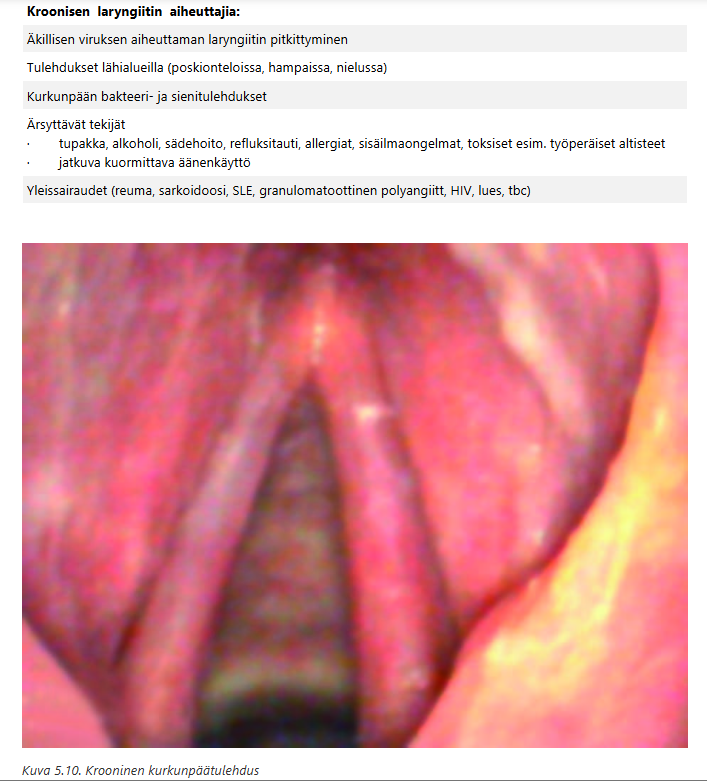
  

## Vanhemmat tuovat 2-vuotiaan Ilonan terveyskeskukseen kuorsauksen vuoksi. Vastaanotolla Ilona istuu suu jatkuvasti avoinna. Mistä tämä todennäköisimmin johtuu?

- a) Ilonalla on purentavirhe, jonka vuoksi suu ei sulkeudu kunnolla.
- b) Ilonalla on astma ja sen vuoksi hän joutuu hengittämään suun kautta.
- c) Ilonalla on coana-atresia ja hän ei sen vuoksi pysty hengittämään nenän kautta.
- d) Ilonalla on kookas kitarisa ja hän on sen vuoksi suuhengittäjä.

  <button class="solution-button" data-label="Vastaus" data-hide-label="Piilota vastaus">
    Vastaus
  </button>
  

      d

Pienillä lapsilla kookas adenoidi (kitarisa) ja/tai kookkaat nielurisat on yleisin syy kuorsaukseen, nenähengityksen vaikeuteen ja suun kautta hengittämiseen, koska kitarisahypertrofia obstruktoi ilmavirtausta nenän kautta. Päivällä suu jää luonnollisesti auki, koska ilma ei kulje kunnolla nenän kautta. Tämä oireyhdistelmä (pikkulapsi + kuorsaus + suuhengitys) on klassinen kitarisahyperplasian kuva.

Kuorsauksen kirurginen hoito lapsilla on kita- ja/ tai nielurisojen poisto (yleensä nielurisojen osapoisto). Suurimmassa osassa tapauksista tämä riittää, eikä muita tutkimuksia tai hoitoja tarvita.

a: Purentavirheet eivät aiheuta kuorsausta eivätkä yleisesti pakota lasta hengittämään suun kautta.

b: Astma ei aiheuta suuhengitystä levossa, eikä selitä jatkuvaa suun auki olemista. Astmaoireet liittyvät uloshengitysvaikeuteen, ei yläilmatien tukkeutumiseen sisäänhengittäessä (kuorsaus).

c: Coana-atresia tarkoittaa synnynnäistä tukkeumaa nenän takaosassa, nenäontelon ja nenänielun välisessä yhteydessä (koaanoissa), joka johtuu usein luusta tai sidekudoksesta; tyypillisesti kyseessä on nenäontelon takaosan ja alkusuun välisen membrana bucconasaliksen puhkeamishäiriö. Se on harvinainen tila, ja voi olla unilateraalinen (yleisempi) tai bilateraalinen. Bilateraalisena se estää vauvaa hengittämästä nenän kautta, mikä aiheuttaa hengenahdistusta ja vaatii usein välitöntä hoitoa, koska vastasyntyneet hengittävät preferentiaalisesti nenän kautta. Koska vastasyntynyt hengittää nenän kautta, molemminpuolinen atresia aiheuttaa hengitysvaikeuden ja syanoosin, ja molemminpuoleinen koanaaliatresia on pediatrinen hätätilanne ja vaatii päivystyksellistä hoitoa, kuten intubaatiota ja kiireellistä leikkaushoitoa.  Myöskään imeminen ja siten omatoiminen juominen ja syöminen eivät onnistu nenähengityksen puuttumisen vuoksi. Ruokintaletku on välttämätön. Atresia voidaan diagnosoida alustavasti koettamalla asettaa katetri nenän kautta nieluun. Varmistus tehdään nenän kautta tähystämällä. Hoito molemminpuolisessa koanaaliatresiassa on useimmiten endonasaalinen, tähystysavusteinen atresioiden avaus. Tarvittaessa asetetaan molempien sierainten kautta nenän väliseinän takaa kiertävä katetri estämään tehtyjen aukkojen kiinnikasvamista. Katetri poistetaan parin kuukauden kuluttua, kun limakalvot ovat parantuneet. 

Toispuolinen atresia voi olla vähäoireinen ja tulla ilmi vasta vuosienkin kuluttua. Hoito on vastaavanlainen kuin molemminpuolisessa. Toispuoleisen atresian leikkaushoidolla ei usein ole kiire, ja toimenpide voidaan tehdä vasta lähempänä kouluikää, tarvittaessa kuitenkin jo ½–1 vuoden iässä.

  

## Potilastapaus 

41-vuotias tupakoimaton mies tulee tk-vastaanotollesi pikkuhiljaa 3-4 viikon aikana vasemmalle kaulalle kasvaneen kyhmyn vuoksi. Palpoiden toteat 2-3 cm kokoisen mobiilin resistenssin leukakulman ala. KNK-status on normaali. Mitä teet?

- a) lähete UÄ-tutkimukseen, jonka yhteydessä ohutneulanäyte
- b) nieluviljelyn perusteella antibioottikuuri 5-7 vrk
- c) kontrollikäynti n. 3 kk
- d) lähete hammaslääkärin tarkastukseen

  <button class="solution-button" data-label="Vastaus" data-hide-label="Piilota vastaus">
    Vastaus
  </button>
  

      a

Pään ja kaulan alueen syövän ensioireena on usein kyhmy kaulalla. Jos potilaalla on syöpään viittaava oire yli 3 viikkoa, hänet on ohjattava erikoissairaanhoitoon. Biopsian voi turvallisesti ottaa lähes aina (ONB, stanssi) ja pelkkä epäilykin riittää lähetteeseen. Ultraääniohjauksesta on hyötyä. ONB:n tulkinnassa on muistettava, että benigni tulos ei sulje pois malignia kasvainta, vaan tulos on aina suhteutettava potilaan esitietoihin ja kliinisiin tutkimuslöydöksiin.
  

## Potilastapaus

Potilaasi on 46-vuotias, joka kertoo päällimmäisenä oireena olevan epämääräinen jomotus vasemmalla nielun alueella, jota on jatkunut noin 2 kuukauden ajan. Potilas kuvaa alueella turvotuksen tunnetta. Statuksessa nenän ja suun limakalvot ovat tavanomaiset ja ehjät. Nielurisat ovat symmetriset. Hampaat ovat hoidetut. Peilitutkimuksissa ei poikkeavaa. Kaulalla ei palpoidu poikkeavaa. Vasen nielurisan seutu tuntuu palpoiden kiinteämmältä verrattuna oikeaan puoleen. Päädyt tekemään lähetteen KNK-lääkärille. Millä kiireellisyydellä?

- a) Teen päivystyslähetteen.
- b) Oireet herättävät epäilyn pahanlaatuisesta muutoksesta, joten 1-7 vrk kiireellisyys
- c) Oireet herättävät epäilyn pahanlaatuisesta muutoksesta, mutta ei selviä löydöksiä, joten 7-30 vrk kiireellisyys
- d) Ei selviä löydöksiä, joten 1-3 kk kiireellisyys

  <button class="solution-button" data-label="Vastaus" data-hide-label="Piilota vastaus">
    Vastaus
  </button>
  

      b

Nielurisan ja kielentyven syövässä voidaan havaita kudokseen infiltroiva haavauma tai kraateri, eksofyyttinen tuumori tai **lähes intaktin limakalvon alla tuntuva kasvain.** Toispuoleista selvää nieluoiretta valittavan potilaan nielu onkin tutkittava herkästi tähystäen. Selkeä nielurisan epäsymmetria on myös aina tutkittava.

Hoitoa suunniteltaessa nielun ja kaulan alue kuvannetaan lähes aina MRI-tutkimuksen avulla; TT on hieman epätarkempi vaihtoehto. Koska suunielun syöpä metastasoi hyvin varhaisessa vaiheessa kaulan imusolmukkeisiin, kaulan alue on aina hoidettava ja siksi tehdään joko kauladissektio tai annetaan sädehoito; tämä riippuu primaarikasvaimen hoidosta. Merkittävänä tekijänä hoitopäätöksiä tehtäessä on hoitojen jälkeinen odotettavissa oleva elämänlaatu, mutta syövän sijainnilla on myös merkitystä.

Kasvainta epäiltäessä ja oireiden vähänkin pitkittyessä (= yli 2 viikkoa) → Konsultaatiolähete (vahva epäily: 1-7 vrk tai lievä epäily: 8-30 vrk). Kliinisesti poikkeava palpaatiolöydös nyt ohjaa lähetteen kiireellisyyden 1-7vrk:een. 
  

## Trakeostomoidun potilaan hoidon erityispiirteet

- a. Trakeostomoidun potilaan hengitysilman kostutuksesta on huolehdittava
- b. Tukkeutunut trakeostomiakanyyli on syytä puhdistaa imulla pitämällä sisäkanyyli aina paikallaan
- c. Trakeostomiakanyyli ei voi yskiessä nousta pois paikaltaan
- d. Reiällisellä ns. puhekanyylillä voidaan välttää huonosta nielemisfunktiosta johtuva mahdollinen aspiraatio

  <button class="solution-button" data-label="Vastaus" data-hide-label="Piilota vastaus">
    Vastaus
  </button>
  

      a

Trakeostomia tarkoittaa siis henkitorviavannetta. Suoritetaan avaamalla henkitorvi (trakeatomia) ja asettamalla trakeakanyyli. Trakeotomian jälkihoidossa sekä henkitorviavanne että trakeakanyyli vaativat päivittäistä hoitoa. Erityisesti on huolehdittava hengitysilman kostuttamisesta. Iho trakeotomian ympärillä puhdistetaan päivittäin. Trakeotoomatoimenpiteen jälkeen kanyylin kuffi tyhjennetään ensimmäisenä päivänä, ja kun potilaan vointi sallii, vaihdetaan kuffiton kanyyli. Yleensä odotetaan muutama päivä ennen ensimmäistä kanyylin vaihtoa.

b: Trakeakanyyli saattaa tukkeutua limasta tai kuivuneesta verestä. Tukkeutunut kanyyli avataan poistamalla sisäkanyyli ja puhdistamalla se sekä tarvittaessa imemällä sisäkanyylin kautta. Jos tämäkään ei auta, tai jos käytössä on yksinkertainen kanyyli, koko kanyyli poistetaan. Trakeakanyyleja on siis yksinkertaisia ja sisäkanyylillisia. 

c: Väärin, trakeakanyyli voi yskiessä nousta pois paikaltaan. 

d: Puhekanyylin idea on ohjata ilmaa äänihuulten kautta, jotta potilas voi puhua; se ei estä aspiraatiota. Aspiraatioriskiin vaikuttavat nielemisfunktio ja mansetin (cuffin) käyttö, ei puhereikä. Mikäli potilas pystyy puhumaan eikä aspiroi, käytetään kuffitonta kanyylia tai varsinaista puhekanyylia. 
  

## Potilastapaus

67-vuotias Pertti on kova tupakoitsija ja alkoholiakin menee joskus reippaasti. Viime aikoina nielemisessä on alkanut esiintyä hankaluutta ja kipua. Suuret lihanpalat ja tabletit eivät mene kunnolla alas ja sulamatonta ruokaa on alkanut nousta takaisin nieluun. Mitä teet? Valitse paras vaihtoehto. 

- a) Lähetän potilaan KNK-klinikkaan ruokatorven varjoainetutkimukseen, koska regurgitaatio viittaa Zenkerin divertikkeliin.
- b) Lähetän potilaan esofagogastroskopiaan, koska potilaan anamneesi huomioiden ruokatorven pahanlaatuinen tauti on mahdollinen.
- c) Lähetän potilaan kaularangan röntgentutkimukseen, koska kaularangan osteofyytti voi estää kookkaiden palojen nielemisen.
- d) Lähetän potilaan KNK-klinikkaan jäykällä tähystimellä tehtävää tutkimusta varten, koska se on ensisijainen tutkimusmenetelmä epäiltäessä ruokatorven yläsulkijalihaksen toimintahäiriötä

  <button class="solution-button" data-label="Vastaus" data-hide-label="Piilota vastaus">
    Vastaus
  </button>
  

      b

Pertti on tupakoitsija+juo alkoholiakin. Tämä kombo nostaa ruokatorven syövän riskiä merkittävästi, koska tupakalla ja alkoholilla on amplifikoiva vaikutus esofaguskarsinooman ja erityisesti levyepiteelikarsinooman aiheuttajina. Pertti on myös 67-vuotias, joten syöpäriski on kohonnut iänkin puolesta. 

Oireet kuten dysfagia ja odynogafia ja uusi regurgitaatio ovat myös punaisen lipun oireita, jotka vaativat nopeaa gastroskopiaselvittelyä. 

a: Zenkerin divertikkeli (ruokatorven yläsulkijatason posterioripuolelle kehittynyt
umpipussi) voi aiheuttaa regurgitaatiota, mutta Pertin riskiprofiili ja kivulias dysfagia herättävät selkeän maligniteettiepäilyn eikä endoskopiaa tule viivyttää. 

c: Kaularangan anterioriset osteofyytit voivat joskus aiheuttaa dysfagiaa ja jopa kipua tai regurgitaatiota, mutta syöpäselvittelyt kuuluu Pertille tehdä. 

d: Ruokatorven yläsulkijan kireys eli cricofaryngeyuslihaksen dysfunktio on yksi syy dysfagialle. Sen taustalla voi olla useita eri etiologioita ja se voidaan hoitaa dilataatiolla tai botoxilla. Sen selvittely ei kuitenkaan ole nyt syöpäselvittelyjä tärkeämpää.  
  

## Yleisin bakteriellin rinosinuiitin aiheuttaja 

27-vuotiaalla miehellä, jolla ei aiempaa pitkäaikaista nenäoireilua, alkoi 10 vrk sitten flunssaoireisto. Viimeisten parin päivän ajan hänen nenänsä on ollut täysin tukossa ja nenäerite on muuttunut paksummaksi. Lisäksi poskia pakottaa voimakkaasti, päätä särkee ja eilen nousi myös kuume ad. 38 astetta. Toteat nielun takaseinämässä limavanan. Epäilet bakteeriperäistä poskiontelotulehdusta. Mikä seuraavista on todennäköisin bakteeriperäinen taudin aiheuttaja?

- a) Hemofilus influenzae
- b) Staphylococcus aureus
- c) Streptococcus pyogenes
- d) Pseudomonas aegurinosa

  <button class="solution-button" data-label="Vastaus" data-hide-label="Piilota vastaus">
    Vastaus
  </button>
  

      a
      
Poskiontelotulehduksen yleisin aiheuttaja on virus, tyypillisesti sama virus joka aiheuttaa tavallisen flunssan eli yleisimpiä ovat rinovirukset. Bakteeriperäisen sinuiitin/rinosinuiitin aiheuttaja on useimmiten peräisin nenästä, sinuksesta tai hampaista. Yleisimmät aiheuttajabakteerit ovat Haemophilus influenzae, Streptococcus pneumoniae, Moraxella catarrhalis ja Staphylococcus aureus.

Monien lähteiden mukaan S. pneumoniae on yleisin rinosinuiitin aiheuttaja ja H. influenzae 2. yleisin. Toisissa taas niiden esiintyvyys on sama (n. kolmannes kaikista bakterielleistä rinosinuiiteista)

  

## Potilastapaus

TK-vastaanotollesi tulee 32-vuotias mies, jolla on vajaa kuukauden ajan ollut alahuulessa 1,5 cm resistenssi, joka kasvoi nopeasti. Kertaalleen hävinnyt, mutta kasvanut nopeasti uudelleen ja resistenssi osuu helposti hampaisiin. Tupakoi ½ askia vrk:ssa, alkoholin käyttö sosiaalista. Toteat alahuulessa limakalvopuolella tämän resistenssin.

- a) epäilet syöpää ja lähetät erikoissairaanhoitoon
- b) epäilet hammasjuuren kystaa ja lähetät hammaslääkärille
- c) epäilet ranulaa ja poistat sen toimenpidehuoneessa (tai teet lähetteen erikoissairaanhoitoon)
- d) epäilet kasvainta ja otat siitä ultraääni- ja ONB-tutkimuksen

  <button class="solution-button" data-label="Vastaus" data-hide-label="Piilota vastaus">
    Vastaus
  </button>
  

      c

Pienissä sylkirauhasissa, erityisesti huulissa ja posken limakalvoissa, esiintyy limarakkuloita (mukoseele) ja retentiokystia, jotka syntyvät pienten sylkiteiden tukoksesta. Retentiokystia ympäröi epiteeli, mutta mukoseelessä lima työntyy viereisiin kudosrakenteisiin ilman ympäröivää epiteeliä. **Ranula on kielenalussylkirauhasen retentiokysta** (ja täten ei sinänsä yleensä ilmene alahuulessa, mutta tehtävässä on todennäköisesti tarkoitettu yleisesti mukoseelejä ja retentiokystia). Hoitona on usein ranulan poisto ja usein myös kielenalussylkirauhasen poisto, mikä estää sen toistumisen. 

a: Suusyöpä ei tyypillisesti häviä itsestään ja tule takaisin eikä yleensä kasva ihan näin nopeasti. Potilaalla on kylläkin useita punaisia lippuja (tupakointi, sijainti yleisessä suusyövän lokaatiossa alahuulessa). Potilaan ikä myös puhuu syöpää vastaan. Siitä voisi mahdollisesti ottaa koepalan, mutta todennäköisesti kyseessä on mukoseele. 

b: Juurenpääkysta (cysta radicularis) on yleisin leukakysta. Se syntyy tulehduksen indusoimasta hammasta ympäröivän epiteelin uudiskasvusta, ja se voidaan tavata jäänteenä myös hampaattomassa leuassa. Jäännöskysta (cysta residualis) muodostuu leukaluuhun infektoituneen hampaan poiston jälkeen, jos leuan alueelle jää juurenpään granulooman epiteeliä. Tämän vuoksi residuaalikysta on hyvin yleinen hampaattomassa leuassa

Hammasjuuren kysta on yleensä hidas kasvaja, usein oireeton, eikä se ilmesty nopeasti kuukauden aikana. Usein kystat tulevat ilmi sivulöytönä röntgenkuvauksessa.

Potilaan resistenssi on limakalvolla, ei submukoosisesti tai luun sisällä → hammasjuurikystan epäily ei sovi.

d: Muutoksesta voisi kyllä ottaa ohutneulanäytteen, mutta kliinisesti vaikuttaa retentiokystalta. 
  

## Potilastapaus

Toteat 49-vuotiaalla nenän tukkoisuutta valittavalla miehellä septumissa selvän deviaation, mikä ahtauttaa oikeaa puolta. Lisäksi vasemman puolen alakuorikko on selvästi kookkaampi kuin oikeanpuoleinen. Potilas kertoo muidenkin lääkäreiden useaan otteeseen tästä maininneen. Mistä tämä todennäköisesti johtuu?

- a) Nenäsyklistä
- b) Kroonisesta ei-allergisesta nuhasta
- c) Kompensatorisesta alakuorikon liikakasvusta
- d) Vasomotorisesta nuhasta

  <button class="solution-button" data-label="Vastaus" data-hide-label="Piilota vastaus">
    Vastaus
  </button>
  

      c

Kun nenän väliseinä on vinossa (septumdeviaatio) ja ahtauttaa toisen sierainkäytävän, vastakkaisen puolen alakuorikko kasvaa usein kompensatorisesti suuremmaksi. Eli jos septum poikkeaa oikealle (ahtauttaa oikean puolen), vasen alakuorikko hypertrofioituu kompensaationa ja näyttää kookkaammalta.

a: Nenäsykli: Nenäkäytävät hengittävät vuorotellen, n. 1–4 t:n sykleissä, jolloin tukkoisemman puolen limakalvo toipuu ilmavirran aiheuttamasta rasituksesta. Kylkiasennossa alempi puoli säätyy tukkoisemmaksi. Pääpuolen kohottaminen vähentää kuorikoiden kongestiota. Tukkoisuus ei siis ole pysyvää tietyllä puolella, kuten potilaalla. 

b: Krooninen riniitti (nuha) yleensä aiheuttaa bilateraalista alakuorikon liikakasvua. Ei-allerginen riniitti on kattotermi etiologialtaan hyvin yleisille ja erilaisille nenäontelon kroonisille tiloille. Taudinkuva ja oireet voivat vaihdella yksilöitään ja eri etiologioiden mukaan. Taustalla voi olla esim. infektiot, hengitysilman ominaisuudet (pölyisyys yms), ravinto, alkoholi, lääkkeet. 

d: Krooninen riniitti (nuha) yleensä aiheuttaa bilateraalista alakuorikon liikakasvua. Vasomotorinen nuha on ei-allergisen riniitin alaluokka. Se on eosinofiilitön yliherkkyysnuha, jossa nenän limakalvot ovat hyperaktiivisia ärsykkeille, kuten hajuille, pölylle, tupakansavulle, lämpätilanvaihteluille, fyysiselle rasitukselle yms. Oireena on kirkas ja vetinen nuha. 

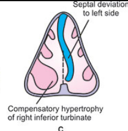
  

## Mikä seuraavista oireista ei ole tyypillinen komplisoituneessa, kroonisessa välikorvan tulehduksessa?

- a) Kova korvakipu
- b) Nopeasti tullut kuulonlasku
- c) Kasvohermohalvaus
- d) Posken turpoaminen

  <button class="solution-button" data-label="Vastaus" data-hide-label="Piilota vastaus">
    Vastaus
  </button>
  

      d

Välikorvatulehdus paranee yleensä hyvin. Kuitenkin se voi joskus aiheuttaa vakavia, jopa hengenvaarallisia komplikaatioita. Nämä voivat olla intratemporaalisia (äkillinen kartiolisäkkeen tulehdus, kasvohermohalvaus, sisäkorvatulehdus) tai intrakraniaalisia (sinustromboflebiitti, märkäinen aivokalvontulehdus, aivopaise). Erittäin tärkeää on, että nämä harvinaiset komplikaatiot tunnistetaan ajoissa ja hoidetaan viivytyksettä.

a: Äkillinen kartiolisäkkeen tulehdus on yleisempi äkillisen välikorvatulehduksen kuin kroonisen välikorvatulehduksen tai kolesteatooman komplikaatio. Tämä bakteerin aiheuttama tulehdus leviää välikorvasta kartiolisäkkeen lokeroihin ja täyttää ne märkäeritteellä. Vähitellen kartiolisäkkeen lokeroiden luuseinät tuhoutuvat ja syntyy luukalvotulehdus, periostiitti. **Klassiset kartiolisäkkeen tulehduksen oireet ovat korvan ja korvantauksen kipu, kartiolisäkkeen päällä olevan ihon punoitus ja turvotus.** Etenkin lapsilla korvanlehti siirrottaa. Lisäksi potilaalla on kuumetta ja yleistila huononee. Aikuisilla kuumeilu ja muut yleisoireet ovat vähäisempiä. Kartiolisäkkeen tulehdus voi muistuttaa pelkästään pitkittynyttä välikorvatulehdusta etenkin silloin, jos potilas on saanut pitkään antimikrobilääkitystä. Kartiolisäketulehdusta epäiltäessä potilas on lähetettävä välittömästi lähimpään KNK-yksikköön. Siellä tehdään tärykalvoon joko laaja parasenteesi tai tympanostomia. 

b: Sisäkorvatulehdus on välikorvatulehduksen harvinainen komplikaatio. Siinä voimakas tulehdusreaktio tai bakteeritoksiinit etenevät pyöreän ikkunan kalvon lävitse perilymfatilaan ja ärsyttävät sisäkorvaa. Sisäkorvatulehdus voi olla seurausta äkillisestä välikorvatulehduksesta, jonka tavallisin aiheuttaja niissä tapauksissa on beetahemolyyttinen A-ryhmän streptokokki. Tavallisimmin sisäkorvatulehdus syntyy kroonisen välikorvatulehduksen ja helmiäisen aiheuttaman sisäkorva-avanteen (fistula labyrinthi) seurauksena. Potilaan oireita ovat kiertohuimaus ja sisäkorvatyyppinen kuulonlasku. Huimaus ja nystagmus saadaan esille, jos korvakäytävän suuta painetaan tiiviisti kiinni tai pneumaattisen suppilon avulla painetaan ilmaa korvakäytävään (fistelikoe).

Äkilliseen välikorvatulehdukseen liittyvässä sisäkorvatulehduksessa tehdään laaja parasenteesi tai tärykalvoon asetetaan ilmastointiputki sekä aloitetaan laskimonsisäinen antibiootti- ja steroidihoito. Mikäli sairaus siitä huolimatta etenee ja kuulo huononee, tehdään korvan saneerausleikkaus. Sisäkorvakomplikaation syynä oleva krooninen välikorvatulehdus tai helmiäinen hoidetaan

c: Kasvohermohalvaus voi syntyä sekä akuutin että kroonisen välikorvatulehduksen tai helmiäisen komplikaationa. Äkillisen välikorvatulehduksen aiheuttaman kasvohermohalvauksen taustalla on usein hermokanavan synnynnäinen luupuutos. Silloin kasvohermon suojana on vain välikorvan limakalvo. Potilas on lähetettävä päivystyksenä KNK-yksikköön. Hoito on laaja parasenteesi tai tympanostomia sekä aluksi laskimoon annettava antibioottihoito. Hermon turvotusta pyritään vähentämään suun kautta otettavalla steroidilääkityksellä. Infektion rauhoituttua hermon toiminta palautuu normaaliksi yleensä muutamassa viikossa.

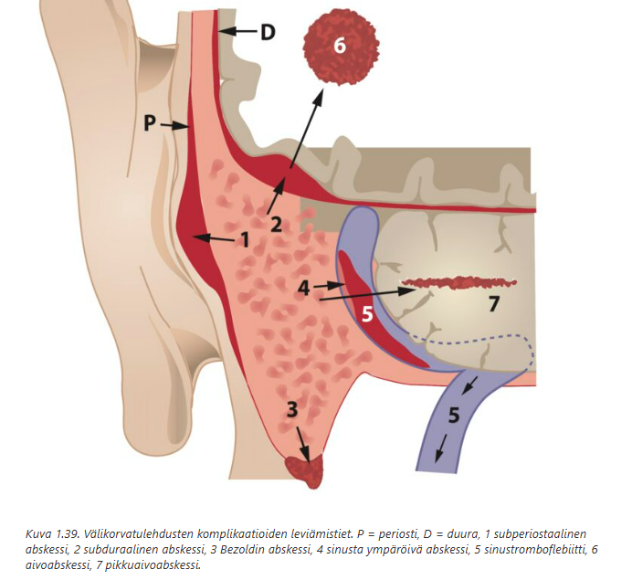
  

## Potilastapaus 

Päivystysvastaanotolla on potilas, jolla ei ole kuumetta, mutta olo on flunssainen ja väsynyt. Lievää yskää ja kurkkukipua on jo kolmatta päivää. Burana 400 mg on vähän lievittänyt kipua. Tonsillat ovat pienehköt, mutta nielu on kauttaaltaan punainen. Nielurisoissa ei ole peitteitä. Kaulan palpaatiossa ei tunnu poikkeavaa. Rha-löydös on siisti, korvat terveet. LI:ssa näet vilaukselta epiglottiksen ja se näyttää tavalliselta. Rhp:ssa limakalvo näyttää myös punoittavalta.

- a) Tauti on todennäköisesti virusperäinen faryngiitti. Tässä vaiheessa ei tarvita tutkimuksia, oireenmukainen hoito: lepoa ja särkylääkettä.
- b) Taudinaiheuttajan selvittämiseksi otan nieluviljelyn. Sen valmistumiseen asti neuvon oireenmukaisen hoidon: lepoa ja särkylääkettä.
- c) Epäilen streptokokin aiheuttamaa tonsilliittia. Otan nieluviljelyn ja aloitan varalta jo antibiootiksi penisilliinin, soitan seuraavana päivänä viljelyvastauksesta.
- d) Tutkin nieluviljelyn, mononukleoosi-pikatestin, CRP:n, perusverenkuvan ja nestearvot ja suunnittelen jatkohoidon tutkimustulosten selvittyä.

  <button class="solution-button" data-label="Vastaus" data-hide-label="Piilota vastaus">
    Vastaus
  </button>
  

      a

Ei merkittävää kuumetta, flunssainen olo, lievä yskä (yskää ei klassisesti tule streptokokkitonsilliitissa), nielu punainen ja peitteetön, tonsillat pienet, ei kaulan imusolmukesuurentumia, normaali epiglottis... → Virusfaryngiitti on ylivoimaisesti yleisin syy tällaisiin oireisiin

Taudin alkuvaihe (ei pitkittynyt) + lievä oireisto → ei tarvetta lisätutkimuksille tai antibiooteille → oireenmukainen hoito (kipulääke, lepo, nesteytys)

b: Centor 0 → ei tarvitse vielä nieluviljelyä. 

c: StrA:n aiheuttaman nielutulehduksen tyypillisiä löydöksiä ovat oireiden nopea alku, nielukipu, kuume (yli 38 °C), nielurisojen valkoiset pilkut tai katteet, leukakulman alaisten imusolmukkeiden aristus ja turvotus sekä päänsärky ja etenkin lapsilla vatsakipu, pahoinvointi ja oksentelu. Näitä oireita ei potilaalla ole ja Centor-pisteet ovat 0 → epäillään virusfaryngiittia. 

d: Ei ole oirekuvan perusteella syytä epäillä bakteeriperäistä infektiota tai mononukleoosia. CRP:n määrityksestä ei ole apua faryngiitin diagnostiikassa. Perusterveeltä ei myöskään tarvitse tutkia PVK tai "nestearvoja". 

  

## Potilastapaus

Kaksikymmentä vuotta tupakoinut lastentarhaopettaja on flunssan yhteydessä käheytynyt ja ääni on lähes täysin poissa jo viidettä päivää, yskä on jo lievittynyt. Yleistila on hyvä, ääni hyvin vuotoinen ja käheä. Äänihuulien tutkiminen ei voimakkaan yökkäyksen vuoksi onnistu. Sinun tulee suositella

- a) Viikon sairauslomaa ja äänilepoa
- b) vrk sairauslomaa ja amoksisilliini 500mg x 3, viikon antibioottikuuri
- c) Viikon sairausloma ja lähete äänihuulten arvioon korvalääkärille
- d) 2 vrk sairauslomaa, äänilepoa ja paikallishoitona höyryhengitys sekä yskänlääke

  <button class="solution-button" data-label="Vastaus" data-hide-label="Piilota vastaus">
    Vastaus
  </button>
  

      a

Akuutin laryngiitin aiheuttamassa käheydessä 2-3 päivää sairauslomaa voi monille riittää, mutta puhetyöläisille (esim. opettajat) helposti heti alkuun viikon sairausloma ja äänilepo. Kyseessä ei vielä ole oikein kroonistunut tilanne, koska eletään vasta viidettä päivää sairastumisesta. Yleistila on myös hyvä eikä ole havaittavissa mitään varoittavia oireita, kuten hengitysvaikeuksia. Keskeinen hoito on äänilepo ja oireenmukainen hoito. 

b: Akuutti laryngiitti on useimmiten virusperäinen → antibiootista ei rutiinisti hyötyä. Tupakoijilla kyllä todetaan useammin bakteeriperäisiä infektioita, mutta tässä nyt ei ole viitteitä bakteeri-infektiosta. 

c: Ei tarvetta erikoissairaanhoitoon, jos äänihuulien toimintaongelma paranee järkevässä ajassa. Jos kuitenkin käheys jatkuisi yli 3 viikkoa, niin silloin kurkunpään tila tulisi viimeistään tutkia. 

d: Laryngiitti vaatii pidemmän toipumisajan kuin 2vrk, jos potilas on äänityöläinen (kuten lastentarhaopettaja). Potilaalla ei myöskään enää ole yskää, joten yskänlääkettä ei tarvitse määrätä.
  

## Potilastapaus 

20-vuotias Alma on ottanut korvalehden lävistyksen anthelixruston läpi 2 viikkoa aiemmin. Nyt lähes koko korvalehti on turvonnut ja punoittava, erityisesti lävistyksen ympäristö. Ei yleisoireita.

- a) kirjoitat paikallis- ja/tai per os. kortisonikuurin vierasesinereaktion hoidoksi
- b) kirjoitat lähetteen ESH:oon/KNK-klinikalle päivystyksenä
- c) kirjoitat per os amoksisilliini-klavuaanihappo -kuurin ja paikallishoidon
- d) poistat lävistyksen ja neuvot oireenmukaisen hoidon

  <button class="solution-button" data-label="Vastaus" data-hide-label="Piilota vastaus">
    Vastaus
  </button>
  

      b

Korvanlehden rustokalvotulehdus, perikondriitti (perichondritis auriculae) voi syntyä korvanlehden vamman tai hematooman infektoitumisen seurauksena. Korvanlehti on punottava, erittäin arka ja turvoksissa. Potilas on välittömästi lähetettävä erikoissairaanhoitoon. Antibioottihoito ja monesti laaja kirurginen avaus on välttämätöntä. Hoitamattomana tauti etenee nopeasti koko ruston alueelle ja kehittyy paiseeksi, joka tuhoaa korvarustoa. Silloin seurauksena on pysyvä korvanlehden deformiteetti.

a: Kyse ei ole vierasainereaktiosta, vaan bakteeri-infektiosta rustossa. Kortisoni pahentaisi tilannetta. 

c: Perikondriitin taustalla voi usein olla Pseudomonas aeruginosa, joten siihen tehoamatonta Amoxin compia ei kannata rutiinisti määrätä tässä tilanteessa. Sopiva ab-hoito päätetään ESH:ssa ja siellä arvioidaan myös kirurgisen avauksen tarve. 

d: Oireenmukainen hoito on riittämätöntä vaarallisen bakteeri-infektion takia. 
  

## Epäilet 1-vuotiaalla Eerolla akuuttia kurkunpääntulehdusta. Miksi?

- a) Hänellä on nuha ja limainen yskä.
- b) Hänellä on limainen yskä ja sisäänhengitys vinkuu.
- c) Hänellä on kumea, haukkuva yskä.
- d) Hänellä on nuha ja kuiva yskä.

  <button class="solution-button" data-label="Vastaus" data-hide-label="Piilota vastaus">
    Vastaus
  </button>
  

      c

Lasten laryngiitin erityispiirre on äänihuulten alaisen ahtaan alueen (subglottisen tilan) limakalvon turpoaminen. Taudista on käytetty myös nimitystä pseudokruppi (laryngitis acuta pseudocrouposa). Oireena on käheä, kuiva ja haukkuva yskä **(seal bark cough),** joka alkaa äkillisesti ja pahenee usein yöllä, sekä joskus myös sisäänhengitysvaikeus ja vinkuminen. Diagnoosi on kliininen. Yleisin sairastumisikä on 6 kuukautta – 3 vuotta.

Lieväoireiset lapset hoidetaan kotona. Kylmä hengitysilma ja kohoasento helpottavat lapsen oloa. Perinteisesti hengitysilmaa on myös kostutettu, joskaan sairaalaolosuhteissa tehdyissä tutkimuksissa höyryhengityksestä ei ole todettu olevan hyötyä. 
Oireiden vaikeutuessa annetaan kerta-annos beetametasonia tai deksametasonia suun kautta tai lihakseen. Lapsen annetaan hengittää adrenaliinia (levoadrenaliini 1:1 000 sellaisenaan) höyrystävällä inhalaattorilla. Seurannassa tarkkaillaan hengitystiheyttä, happisaturaatiota ja pulssia. Jos tila ei helpota ja/tai lapsi vaikuttaa levottomalta tai väsähtäneeltä, hänet kuljetetaan istuvassa asennossa sairaalahoitoon. Lapsi voidaan ottaa osastoseurantaan, ja joskus jopa teho-osastolle. Intubaatiota pyritään välttämään, jottei lisättäisi subglottisen tilan turvotusta ja aiheutettaisi sinne limakalvovauriota. Trakeotomioita tarvitaan lapsille akuutin laryngiitin vuoksi nykyään erittäin harvoin. Erotusdiagnostisesti on syytä muistaa hengitysteiden vierasesineet, epiglottiitti ja muihin nielun ja kaulan alueen infektioihin liittyvä kurkunpään turvotus.

Antibiottihoitoa ei aloiteta, koska tyypillisesti kyseessä on virusinfektio (yleisimpänä parainfluenssavirus). 

a: Nuha ja limainen yskä → Tyypillistä viruksen aiheuttamalle tavalliselle flunssalle, ei kurkunpääntulehdukselle

b: Yskä on pseudokrupissa yleensä kuiva. Sisäänhengitys kyllä voi vinkua ja se voidaan kohtalaisen vaikeassa taudinkuvassa todeta myös levossa. 

d: Nuha ja kuiva yskä → Ei riittävän spesifi, voi liittyä mihin tahansa ylähengitystieinfektioon
  

## Alakuorikoiden pienennystmp

38-vuotiaalla miehellä on pitkällistä molemminpuoleista nenän tukkoisuutta, johon nenästeroidisuihke ei auta. Harkitset lähetettä korva-, nenä- ja kurkkutaudeille alakuorikkokirurgian harkintaan. Mikä seuraavista vaihtoehdoista on tärkein alakuorikoiden pienennystoimenpiteen aihe?

- a) Krooniseen riniitin pohjalta hypertrofiset limakalvot, jotka eivät reagoi lääkehoitoon
- b) Kroonisen riniitin pohjalta atrofiset limakalvot, jotka eivät reagoi lääkehoitoon
- c) Vasomotorisen riniitin pohjalta voimakkaasti kirkasta eritettä vuotavat limakalvot, jotka eivät reagoi lääkehoitoon
- d) Krooninen polypoottinen rinosinuiitti, joka ei reagoi lääkehoitoon

  <button class="solution-button" data-label="Vastaus" data-hide-label="Piilota vastaus">
    Vastaus
  </button>
  

      a

Ensisijainen hoito oireellisten hypertrofisten kuorikoiden hoidossa on kortisonisuihke 3kk ajan säännöllisesti. Jos tämä ei riitä, niin kuorikoiden pienennystoimenpide tai ensisijaisesti lämpökäsittely (RF-hoito) voidaan toteuttaa. Alakuorikoiden limakalvon alaista paisuvaiskudosta voi arpeuttaa lämpökäsittelyllä (radio frequency ablation, RFA) jolloin kuorikko pienenee. Hoito onnistuu paikallispuudutuksessa polikliinisesti. Vaihtoehtoisesti leikkaussalissa voidaan toimenpide tehdä laserilla tai mikroshaverilla. Alakuorikkoa voi myös siirtää lateraalisemmin murtamalla.

Syyt hypertrofialle: Nenän väliseinän deviaation vastakkaisella puolella nenäkuorikkojen limakalvot ovat lähes aina kompensatorisesti kasvaneet (hypertrofioituneet), ja sen vuoksi väliseinäleikkaukseen voidaan liittää kuorikoiden pienennystoimenpide tai lämpökäsittely. Myös krooninen (esim. vasomotorinen) riniitti voi johtaa alakuorikoiden hypertrofiaan.

b: Ongelma on päinvastainen (liian vähän kudosta), ei leikkausaihe. 

Jos nenän limakalvo on atrofinen, limaa muodostuu liian niukasti. Atrofia voi olla primaarista (iän mukaista, hormonaalista) tai sekundaarista, esimerkiksi nenäkirurgiaan tai sädehoitoon liittyvää. Monet lääkkeet sekä liian lämpimäksi säädetty sisäilma aiheuttavat sivuvaikutuksenaan eritteiden kuivumista.  

Hoito: Paikallisesti nenään käytettävät vesi- ja öljypohjaiset suihkeet ovat kuivan limakalvon suositeltavia hoitoja. Tavallista ruokaöljyäkin voi käyttää. Nenähuuhteluista fysiologisella suolaliuoksella on eniten hyötyä karstojen poistossa. Iäkkään potilaan nenän kuivien limakalvojen hoidossa käytetään kostuttavia valmisteita.  Nenäkortikosteroidivalmisteen tai muiden lääkkeiden annosta pienennetään tai lopetetaan kokonaan.

c: Vasomotorinen riniitti ja kirkas runsas eritys → hoito ensisijaisesti lääkkeellinen; toimenpide ei kohdistu eritysoireeseen

d: Krooninen polypoottinen rinosinuiitti → hoito on polyyppikirurgiaa, ei alakuorikoiden pienennys. 
  

## Mihin kasvojen alueen neuralgiaan liittyy kivun provosoituminen kasvojen ihon koskettamisesta, hampaiden pesusta, syömisestä tai välillä jopa puhumisesta?

- a) Hortonin neuralgia
- b) Trigeminusneuralgia
- c) Sluderin neuralgia
- d) Postherpeettinen neuralgia

  <button class="solution-button" data-label="Vastaus" data-hide-label="Piilota vastaus">
    Vastaus
  </button>
  

      b
      
Trigeminusneuralgia (kolmoishermosärky) on CN V:n sairaus, jolle on tyypillistä toistuvat, toispuoleiset lyhytaikaiset sähköiskumaiset kivut erityisesti n. maxillariksen (CN V2) tai n. mandibulariksen (CN V3) alueella (harvoin V1 eli n. ophtalmicuksen alueella ja aiheuttaa kipua otsassa ja silmän ympärillä). Kipukohtaukset ovat yleensä unilateraalisia. Kipujakso kestää yhdestä sekunnista n. 2 min:iin ja se voi toistua lukuisia kertoja päivän mittaan. Oireilu voi kestää viikkoja tai kuukausia. Kipu on yleensä erittäin voimakas estäen pahimmillaan mm. syömisen.

Tyypillisesti alkaa n. 50-60-vuotiailla ja on yleisempi naisilla kuin miehillä. Prevalenssi on n. 0,3%. 

Valtaosalla potilaista trigeminusneuralgian oireisto **selittyy kolmoishermon juuren verisuonikompressiolla aivorungossa;** tätä kutsutaan _klassiseksi kolmoishermosäryksi._ Aivorunkoon liittyessään kolmoishermon Schwannin myeliini korvautuu keskushermoston oligodendrosyyteillä. Tämä liitoskohta on herkkä vaurioille ja demyelinaatiolle. Kun myeliini vaurioituu paikallisesti, aksoni muuttuu herkemmin depolarisoituvaksi ja voi tapahtua kipuradan herkistymistä

Diagnoosi on kliininen ja perustuu anamneesiin sekä kliiniseen tutkimukseen. Diagnoosi ja lääkealoitus voidaan tehdä perusterveydenhuollossa. Ensilinjan hoito on karbamatsepiini aloitusannoksella 100mg x2 ja nostetaan tarpeen mukaan tasolle 1 200 mg/vrk. Kolmoishermosäryssä karbamatsepiinilla on 100 %:n korvattavuus neurologin lausunnon perusteella. Karbamatsepiinin vaihtoehtona – erityisesti, jos siitä tulee haittavaikutuksia (väsymys, huimaus) tai kun on tarvetta välttää sen interaktioita muiden lääkkeiden kanssa – on okskarbatsepiini (ei kuulu erityiskorvattavuuden piiriin) 

Ellei lääkitykselle saada hoitovastetta, voidaan tehdä lähete neurologian poliklinikkaan jatkotutkimuksia varten. Tuolloin tarkistetaan MK:lla neurovaskulaarikontaktin mahdollisuus. Jos tilanne on hoitoresistentti ja/tai on todettu oireinen, aivojen MK:ssa näkyvä neurovaskulaarinen kompressio, potilas saatetaan lähettää neurokirurgian klinikkaan arvioon. Käytetyimmät neurokirurgiset hoitomenetelmät ovat mikrovaskulaarinen dekompressio eli valtimonmutkan aiheuttaman kolmoishermon tyven kompression poistaminen mikrokirurgisesti sekä trigeminusganglion koagulaatio. 

a: Hortonin neuralgia eli sarjoittainen päänsärky (cluster headache) ei provosoidu kosketuksesta, vaan kohtaus voi alkaa ilman ärsykettä tai mm. alkoholista, tupakoinnista tai vahvoista hajuista. Hortonin neuralgialle on tyypillistä oireena voimakas, toispuoleinen päänsärky (yleensä silmän takana polttavana), johon liittyy usein autonomisia oireita (silmän verestys, kyynelvuoto, nenän tukkoisuus). 

c: Sluderin neuralgia (sphenopalatine neuralgia) on harvinainen nenän alueen neuralgia, jossa kipu on lokalisoitunut nenän ja silmän seudulle, ja siihen liittyy autonomisia oireita, mutta ei tyypillisesti triggeröidy kosketuksesta tai arkipäiväisistä toiminnoista. Johtuu tyypillisesti ganglion pterygopalatinumin ärsyyntymisestä esim. infektion takia. 

d: Postherpeettinen neuralgia on vyöruusun jälkeinen kiputila, joka aiheuttaa **jatkuvaa, polttavaa kipua,** johon voi liittyä allodynia, mutta kipu ei ole yhtä selvästi laukaistavissa kevyellä kosketuksella tai muilla mainituilla toiminnoilla kuin trigeminusneuralgiassa. 

  

## Potilaalla on voimistuvaa kurkkukipua ja kuumetta. Potilas kertoo, että on syönyt kalaa neljä päivää sitten. Nyt myös nieleminen tuntuu vaikealta. Miten toimit?

- a) Otat nieluviljelyn.
- b) Epäilet ruodon raapaisun aiheuttamaa tulehdusta tonsillassa. Aloitat penisilliinin suun kautta.
- c) Epäilet ruokatorven yläosan vierasesineen aiheuttamaa perforaatiota ja mediastiniittia. Lähetät potilaan
sairaalaan.
- d) Tähystät alanielun peilillä, ruotoa ei näy. Kotiutat potilaan oireen mukaisella lääkityksellä.

  <button class="solution-button" data-label="Vastaus" data-hide-label="Piilota vastaus">
    Vastaus
  </button>
  

      c

Pelkästään tällä tehtävänannon tiedolla (ei esim kuvattu suulöydöstä ollenkaan, potilaallahan voi vain olla normaali flunssa ja kurkku on hieman kipeä) on hieman tylsää lähettää potilas sairaalaan, mutta tässä on todennäköisesti haettu, että kalaa syödessä ruoto on jäänyt kiinni ruokatorveen ja aiheuttanut sen perforaation tai aiheuttanut syvän kaulainfektion, joka voi mahdollisesti levitä mediastinumiinkin -> ns. do not miss -diagnoosi. 

**Kalan ruodon nieleminen on yksi yleisimmistä ruokatorven perforaation aiheuttajista (n. 12%).** Se ilmenee merkittävänä kurkku-/kaulakipuna ja nielemiskipuna, kuumeena ja mediastiniitissa dyspneana ja rintakipunakin. 

Voidaan myös ajatella retrofaryngeaalista absessia eli kyseessä voisi  olla kalanruodon aiheuttama retrofaryngeaalinen trauma ja siitä johtuva retrofaryngeaalinen infektio. Retrofaryngeaalinen tila on suoraan yhteydessä mediastinumiin ja voi sinne levitä -> hengenvaarallinen tilanne. Tulehdus myös häiritsee nielemistä, nostaa kuumetta, voi aiheuttaa leukalukkoa (trismus) ja nielemisen vaikeudesta johtuvaa kuolaamistakin. Tehtävänannossa "nieleminen tuntuu vaikealta" on yhteistä ihan tyypillisille tonsilliiteillekkin, mutta tässä todennäköisesti haetaan sitä, että osaa tunnistaa vaarallisen syvän kaulan alueen infektion tai ruokatorviperforaation.

a: Nieluviljely liian hidas eikä myöskään oikein auta vaarallisten komplikaatioiden havaitsemisessa tai hoidossa. 

b: Kotiutus pelkällä antibiootilla -> ohitetaan vaarallinen diagnoosi ilman sen poissulkemista. 

d: Se, että peilillä ei ruotoa näy, ei tarkoita, että ruotoa ei olisi. 
  

## Keskikaulalle tulleen iskun tai kuristusvamman kärsinyt potilas on syytä

- a) kotiuttaa moitteettoman keuhkoauskultaatiotuloksen jälkeen
- b) tutkia glottiselle tasolle mahdollisesti muodostuvan ilmankulkua rajoittavan hematooman varalta ja lähettää herkästi ilmateiden turvaamisen hyvät valmiudet tarjoavaan hoitoyksikköön
- c) trakeostomoida ns. etupainotteisesti, jos epäillään kilpirustomurtumaa
- d) pääsääntöisesti kuvantaa magneettikuvantamisela pään ja kaulan alue mukaan ulottaen

  <button class="solution-button" data-label="Vastaus" data-hide-label="Piilota vastaus">
    Vastaus
  </button>
  

      b

Kaulavammoissa vaarallisinta on viivästynyt hengitysteiden ahtautuminen (turvotus, hematooma, kurkunpään vamma). Alkuvaiheessa potilas voi näyttää yllättävän hyväkuntoiselta → tila voi huonontua nopeasti. Siksi matala kynnys seurannalle ja hoitoyksikköön lähettämiselle, jossa intubaatio/trakeostomia onnistuu tarvittaessa heti

a: Normaali keuhkoauskultaatio ei kerro mitään ylähengitysteiden tilanteesta

c: Ilmateitä ei turvata operatiivisesti etupainotteisesti. Sitä voidaan kyllä miettiä, mikäli kurkunpään vauriot ovat laajat ja intubaatio on hankala ja aiheuttaisi lisävaurioita. 

d: Kaulavammapotilaan kuvantaminen tehdään erikoissairaanhoidossa tapauskohtaisesti. MRI ei myöskään ole ensisijainen päivystyksessä (hidas, huono akuuttiin arvioon); tarvittaessa CT on käytännöllisempi. 
  

## Kurkunpääsyöpä

- a) Tyypillisin ensioire on käheys
- b) Diagnosoidaan usein pitkälle edenneenä
- c) Hoidetaan tavallisimmin endoskooppisella kirurgialla
- d) Esiintyvyys lisääntyy

  <button class="solution-button" data-label="Vastaus" data-hide-label="Piilota vastaus">
    Vastaus
  </button>
  

      a

Kurkunpääsyövän ensioire on varhainen ja pitkittynyt käheys → siksi tämä syöpä usein huomataan ajoissa. Tulee kuitenkin ymmärtää, että kurkunpääsyövät jaetaan anatomisen alueen mukaan supraglottiseen, glottiseen ja subglottiseen syöpään ja nämä ilmenevät eri tavoilla. Tällä hetkellä noin 60 % diagnosoiduista kurkunpään syövistä on glottisia, 40 % on supraglottisia ja subglottisia vain muutaman prosentin verran. 

Supraglottinen syöpä diagnosoidaan usein pitkälle edenneenä, koska se aiheuttaa vasta myöhään oireita. Kaulan etäpesäkkeiden esiintyvyys diagnoosihetkellä on 25–35 %, koska alueella on runsas veri- ja imusuonitus. 

Glottisessa kurkunpään syövässä on varhaisessa vaiheessa oireena äänen käheys. Glottisella alueella imusuonitus on huomattavan vähäistä, etäpesäkkeitä ei juurikaan tavata diagnoosihetkellä harvoin ja ennuste on supraglottista parempi. Äänihuulitason yläpuolisen alueen syövässä palan tunne on klassinen oire.

Subglottisen alueen syöpä käyttäytyy aggressiivisemmin ja lähettää etäpesäkkeitä kaulan imusolmukkeisiin varhaisessa vaiheessa. Tyypillinen ensioire on hengenahdistus. Subglottisen syövän hoidossa käytetään useimmiten kemosädehoitoa ja tarvittaessa totaalilaryngektomia. 

b: Ei sinänsä ole väärin sanoa näin, koska supraglottiset syövät diagnosoidaan usein pitkälle edenneenä. Kysymyksessä kuitenkin haetaan enemmän glottisia syöpiä ja äänen käheyttä. 

c: Kurkunpään levyepiteelikarsinoomassa on nykyään useita hyväksyttyjä hoitomenetelmiä: sädehoito, kemosädehoito, endoskooppinen resektio, kurkunpään erityyppiset avoimet osapoistot sekä laryngektomia eli koko kurkunpään poisto. Hoidon valintaan vaikuttavat kasvaimen tarkka sijainti ja koko, TNM-luokitus, potilaan yleistila ja muut sairaudet sekä hyvin vahvasti myös potilaan mielipide.

d: Kurkunpääsyövän esiintyvyys on vähentynyt monissa maissa, pääasiassa tupakoinnin vähenemisen vuoksi
  

## Epäilen nielupaisetta potilaalla. Diagnoosin todennäköisyyttä voi arvella jo ennen suuhun katsomistakin. Mikä oireyhdistelmä viittaa vahvimmin nielupaiseeseen?

- a) Kaula punoittaa, pää kääntyy huonosti ja kaulan palpaatiossa tuntuu toispuoleisesti selkeä turvotus
- b) Kipu säteilee korvaan, suun avaaminen on rajoittunutta ja puhe on hieman puuromaista.
- c) Kipu on toispuoleista, potilaalla on korkea kuume ja hengityksessä on kauas asti tuoksuva imelä haju
- d) Leukakulmassa on palpaatioarkuutta, kipu on pahentunut toispuoleiseksi useamman päivän aikana ja kipu säteilee hampaisiin

  <button class="solution-button" data-label="Vastaus" data-hide-label="Piilota vastaus">
    Vastaus
  </button>
  

      b

Yhdistelmä oireita, joka vahvimmin viittaa peritonsillaariseen absessiin ennen suun tutkimista, on: kuume, voimakas kurkkukipu, nielemisvaikeus (dysfagia), trismus (suun avauksen vaikeus) ja "kuuma peruna" -ääni eli puuroutunut ääni (muffled voice). 

Kipu on usein merkittävämpää toisella puolella ja voi säteillä korvaankin. Kun katsoisi nieluun, niin voisi nähdä toispuolisen turvotuksen ja sen aiheuttaman uvulan deviaation toiselle puolelle. 

a: Viittaa ennemmin syvään kaulainfektioon

c: Imelä haju viittaa nekroottiseen infektioon (esim. fusobakteeri) (tai jopa ketoasidoosihengitykseenkin), ei spesifisesti nielupaiseeseen

d: Sopii paremmin hammasperäiseen infektioon 

  

## Nenän tukkoisuus ja paineen tunne flunssan jälkeen

Vastaanotollesi tulee 42-vuotias mies, jolla 6 viikkoa sitten tuli aluksi flunssa, josta alkoi oireilu, joka jatkuu edelleen. Oireena nenän tukkoisuutta, liman valumista kurkkuun ja paineoireita kasvoilla. Lisäksi hän kokee hajuaistin heikentyneen. Statuksessa toteat nenässä lievää limakalvoturvotusta ja sivuonteloiden ultraäänessä molemmin puolin kaiun 1,5cm etäisyydellä. Potilaalla on penisilliiniallergia. Miten hoidat potilasta?

- a) Aloitan flutikasonisuihkeen nenään paikallisesti
- b) Aloitan empiirisesti doksisykliini-antibioottikuurin viikoksi
- c) Aloitan empiirisesti amoksisilliini-antibioottikuurin viikoksi
- d) Aloitan pitkittyvän tulehduksen hoitoon suolavesihuuhtelut kannulla 2 kertaa vrk:ssa

  <button class="solution-button" data-label="Vastaus" data-hide-label="Piilota vastaus">
    Vastaus
  </button>
  

      a

Tila vaikuttaa pitkittyneeltä rinosinuiitilta ilman merkkejä akuutista bakteerikomplikaatiosta. UÄ:ssäkin todetaan etuseinäkaiku eikä poskiontelot vaikuta olevan täynnä mönjää.

Ensisijainen hoito on nenään annosteltavat kortikosteroidisuihkeet ja nenän huuhtelu keittosuolaliuoksella. Kroonisen rinosinuiitin hoidossa keskeistä on huolehtia siitä, että hoito on asianmukaista taudin vaikeusasteeseen ja oireisiin nähden, lääkkeenottotekniikka on hyvä ja liitännäissairaudet, kuten astma ja allergia, ovat tutkittu ja hoidettu. Tupakoinnin lopettaminen on tärkeää. Ärsykkeitä vältetään yksilöllisesti. Mikäli näistä huolimatta oireiden hallinta ei ole riittävää, voidaan potilas lähettää erikoissairaanhoitoon; tyypillisesti jos oireet kestää yli 12 viikkoa.

b ja c: Antibioottihoito ei ole indikoitu, ellei ilmene vaikeita, pahenevia tai komplisoituneita oireita (esim. korkea kuume, silmäoireet, voimakas kasvojen kipu, märkäinen vuoto).

d: Runsasvolyyminen nenän suolaliuoshuuhtelu on kyllä suositeltua, koska se parantaa limakalvojen puhdistumista ja vähentää oireita. Se vain ei ole ainoa hoito ja kortikosteroidi tulee myös aloittaa. 
  

## Vanhuksen tukkoinen nenä

81-vuotias mies tulee vastaanotollesi ja valittaa jatkuvaa nenän tukkoisuutta. Toteat anteriorisessa rinoskopiassa erittäin avarat nenäontelot molemmin puolin. Limakalvot ovat väriltään kalpeat ja kuivat. Toteat myös hieman karstaa. Mikä on diagnoosi ja miten hoidat potilasta?

- a) Atrofinen nuha ja siihen liittyvä paradoksaalinen nenän tukkoisuus. Suosittelen potilaalle kosteuttavia nenäsuihkeita
- b) Atrofinen nuha ja siihen liittyvä inflammaatiosta aiheutuva nenän tukkoisuus. Aloitan mometasonifuroaattinenäsuihkeen säännölliseksi lääkkeeksi
- c) Atrofinen nuha ja siihen liittyvästä hyperreaktiviteetista aiheutuva nenän tukkoisuus. Aloitan ipratropiumbromidinenäsuihkeen säännölliseksi lääkkeeksi
- d) Atrofinen nuha ja siihen liittyvä voimakkaasta infammaatiosta aiheutuva nenän tukkoisuus. Aloitan flutikasoninenätipat säännölliseksi lääkkeeksi

  <button class="solution-button" data-label="Vastaus" data-hide-label="Piilota vastaus">
    Vastaus
  </button>
  

      a

Nenän limakalvojen atrofia voi olla primaarista (iän mukaista (ns. mummonuha), hormonaalista) tai sekundaarista, esimerkiksi nenäkirurgiaan tai sädehoitoon liittyvää. Tässä tapauksessa nyt on iästä johtuvaa. 

Jos nenän limakalvo on atrofinen, limaa muodostuu liian niukasti ja sen lisäksi värekarvatoiminta hidastuu -> limaa kerääntyy nenänieluun. Nenäontelossa staattinen lima karstoittuu ja aiheuttaa tukkoisuutta. Taustalla ei siis ole sinänsä limakalvojen turpeutta -> ns. paradoksaalinen nenän tukkoisuus. Tyypillinen eturinoskopialöydös on himmeä limakalvo, joka voi olla väriltään tavallista kalpeampi. Atrofisessa nuhassa (rhinitis atrophicans) limakalvo voi näyttää silkkipaperimaiselta. Väliseinässä ja kuorikoiden etuosissa näkyy usein kuivia eritteitä juosteina tai karstoina. 

Hoitona on limakalvojen kosteutus. Paikallisesti nenään käytettävät vesi- ja öljypohjaiset suihkeet ovat kuivan limakalvon suositeltavia hoitoja. Tavallista ruokaöljyäkin voi käyttää. Nenähuuhteluista fysiologisella suolaliuoksella on eniten hyötyä karstojen poistossa. Iäkkään potilaan nenän kuivien limakalvojen hoidossa käytetään kostuttavia valmisteita. 

a ja d: Nenäkortikosteroidivalmisteen tai muiden lääkkeiden annosta pienennetään tai lopetetaan kokonaan atrofisessa riniitissä, koska ne vain kuivattavat enemmän. 

c: Potilas voi hyötyä ipratropiumsuihkeesta, mikäli ei-allergisen nuhan pääoireena on runsas ja kirkas nuhaerite eikä ole tässä tapauksessa ensisijainen. Iäkkäillä potilailla on myös syytä muistaa antikolinergisen lääkityksen haitat ja vasta-aiheet. 

  

## Ns. Le Fort-murtumat

- a) ovat mandibulamurtumia, joissa murtumalinja sijaitsee usein joko nivellisäkkeessä tai leukakulmassa
- b) aiheuttavat tyypillisesti facialishermon vaurion ja tulevat esille kasvojen motoriikkaa testattaessa
- c) aiheuttavat tyypillisesti kuulotasapainohermon vaurion johtaen voimakkaaseen huimaukseen ja
sensorineuraaliseen kuulonalenemaan
- d) ovat keskikasvomurtumia, joissa maxillan murtunut osuus voi liikuttelutestissä olla mobiili anteroposteriorisuunnassa

  <button class="solution-button" data-label="Vastaus" data-hide-label="Piilota vastaus">
    Vastaus
  </button>
  

      d

Keskikasvomurtumien poikkimurtumat jaotellaan klassisesti Le-Fort-luokituksen mukaan tyyppeihin I-III, jotka eroavat toisistaa murtumalinjan kulun perusteella. 

Le Fort I -murtuma = matala, horisontaalinen maksillamurtuma. Yläleuan hampaallinen alue on irti keskikasvoista poskionteloiden ja nenänpohjan tasolta. Yläleuka saattaa hetkua (floating palate)

Le Fort II -murtuma = maksillan pyramidaalinen murtuma; floating maxilla. 

Le Fort III -murtuma = murtumalinja kulkee yläkasvojen halki korkealla silmäkuopissa ja nenän tyvessä ja näin irrottaa keskikasvot kallonpohjasta (floating face). 

Keskikasvomurtumat ovat usein  tyyppien I-III sekamuotoja (kasvojen toisella puolella voi esim. olla tason I ja toisella tason III murtuma) ja usein pirstaleisia. Korkeaenergisissä vammoissa usein myös alaleuka on murtunut. 

a: Eivät ole mandibulamurtumia, mutta mandibulamurtumia voi olla Le Fort-murtumien yhteydessä

b: Facialishermon vaurio liittyy useammin parotisalueen tai ohimoluun alueen vammoihin, ei tyypillinen Le Fort

c: Kuulo- ja tasapainohermovauriot liittyvät yleensä ohimoluun murtumiin, eivät keskikasvomurtumiin

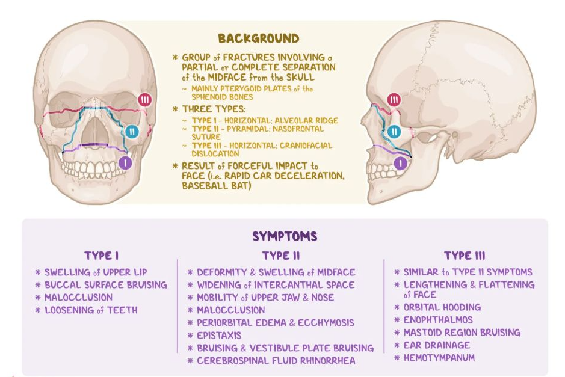

Le Fort murtumien linjoja myös seurataan monissa leikkauksissa eli Le Fortin osteotomioissa, joita käytetään keskikasvojen deformiteettien hoidossa ja looksmaxxingissa. Tässä tehty Le Fort II -osteotomia 

  

## Mihin osaan tärykalvoa tärykalvopistoa EI tule tehdä?

- a) Taka-alaosaan
- b) Etuyläosaan
- c) Takayläosaan
- d) Etualaosaan

  <button class="solution-button" data-label="Vastaus" data-hide-label="Piilota vastaus">
    Vastaus
  </button>
  

      c

Tärykalvopisto tehdään veitsellä tärykalvon etualaosaan. Mikäli siihen ei korvakäytävän etuosan kaarevuuden vuoksi saada riittävää näkyvyyttä, parasenteesi tehdään tärykalvon taka-alaosaan. Piston jälkeen välikorva imetään eritteestä.

Tärykalvopistoa ei saa tehdä tärykalvon takayläosaan, jotta ei vaurioiteta kuuloluuketjua tai sisäkorvaikkunaa. Imulla tai veitsellä ei tule myöskään koskettaa vasaran vartta.

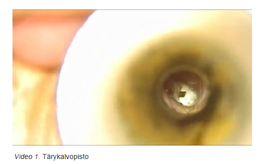

  

## Kurkussa ylimääräisen tunne

Vastaanotollesi tulee yksityisyrittäjä Petri 36 v., jolla on muutaman kuukauden ajan tuntunut ajoittain kurkussa ylimääräisen tuntu, kuin ruokaa olisi jäänyt aataminomenan tasolle jumiin. Ruoan ja juoman nieleminen onnistuu kuitenkin ongelmitta. Oiretta kestää tyypillisesti 1-3 päivää kunnes se helpottaa. Kaulan palpaatiossa ei tunnu
poikkeavaa, katsot peilillä onnistuneesti kurkunpäähän ja saat kaikki kurkunpään rakenteet näkymään hyvin ja ne ovat täysin siistit. Teetät kaulan UÄ-tutkimuksen, jossa radiologi ei totea poikkeavaa. Mistä todennäköisesti on kyse ja mitä teet?

- a) Kyseessä on todennäköisesti kilpirauhasen vajaatoiminta, otan kilpirauhaskokeet ja suunnittelen jatkohoidon niiden perusteela
- b) Kyseessä on todennäköisesti krooninen tonsilliitti; jos potilaan oireet ovat vaikeat, teen lähetteen nielurisaleikkaukseen.
- c) Kyseessä on todennäköisesti krooninen laryngiitti, informoin potilasta motivoivasti tupakoinnin haitoista ja suunnittelemme tupakoinnin lopetusta
- d) Kyseessä on todennäköisesti globus-oire, informoin vaivan toiminnallisesta luonteesta ja aloitan happosalpaaja-hoitokokeilun

  <button class="solution-button" data-label="Vastaus" data-hide-label="Piilota vastaus">
    Vastaus
  </button>
  

      d

Palan tunne kurkussa = globus pharyngeus. Siihen ei liity nielemiskipua (odynofagia) tai nielemisvaikeutta (dysfagia). Globusta ei yleensä koeta kipuna vaan pikemminkin pitkäkestoisena, vaikeasti määriteltävänä, epämiellyttävänä painon ja kuristuksen sekaisena palan tunteena syvällä kurkussa. 

Oire esiintyy tyypillisesti ruokailujen välillä tyhjää niellessä ja voi aiheuttaa toistuvasti ilmenevän nieluun takertuneen ruuan tunteen. On tavanomaista, että palan tunne tulee esille tyhjää tai sylkeä nielemällä. Potilaat usein nieleskelevätkin tiheästi joko tunnustellakseen oirettaan tai lievittääkseen kurkun kuivuutta. Syöminen ja juominen helpottavat yleensä oiretta tai siihen ei ruokaillessa kiinnitä huomiota. Erityisestä tämä erottaa oireen dysfagiasta.

Perustutkimuksina kliininen status: suun ja nielun inspektio, suunpohjan, kielen ja tonsilla-alueen palpaatio, kaulan palpaatio. Osalla potilaista palan tunteen pystyy paikantamaan kaulan kipeitä lihaksia palpoidessa. Alanielun ja kurkunpään epäsuora peilitähystys aiheellisia myös. Kuvantamis- ja laboratoriotutkimukset vain tarvittaessa (esim. punaisen lipun oireita; merkittävä alkoholinkäyttö- ja tupakointihistoria). Tutkiessa on huomioitava, että tyhjää niellessä on normaalia tuntea ns. pala nielun rakenteiden supistuessa. 

Tyypillinen potilas, jonka oireena on palan tunne, ei tarvitse kliinisen KNK-alueen tutkimisen ja kaulan palpaation lisäksi jatkotutkimuksia. Yleisimpiä aiheuttajia ovat mm. lihasperäinen (niskan, kaulan alueen ja purentalihasten jännitys) sekä refluksitauti. Muita ovat mm. pään ja kaulan alueen kasvain, kilpirauhasen liikakasvu, äänen kuormittuminen, nielun alueen infektion jälkeinen limakalvojen ärtyminen, nielun limaisuus (mm. allergia, poskiontelotulehdus), pitkä uvula, suurentunut kielirisa, kuivat limakalvot...

Koska refluksitauti ja varsinkin laryngofaryngeaalinen refluksi (ns. hiljainen refluksi) on sen verran yleinen, niin sitä voidaan hoitaa empiirisesti PPI. Muuten potilaan hoidossa tärkeintä on tunteen hyvänlaatuisuudesta kertominen. 

a: Kilpirauhasen vajaatoiminta ei selitä ajoittaista globus-tyyppistä tunnetta

b: Tonsilloihin liittyviä löydöksiä tai infektioita ei ole

c: Kurkunpää on täysin siisti, ei käheyttä
  

## Jatkuva flunssaoireisto ja nenän tukkoisuus 

37-vuotias perusterve mies, jolla ei allergioita, tulee vastaanotolle jo noin 10 päivää jatkuneen flunssaoireiston vuoksi. Nenä on tukossa ja räkä on muuttunut paksummaksi ja vihertäväksi. Lisäksi on kevyttä painon tunnetta poskissa ja hakkaavaa yskää. Ei kuumetta. Tutkimuksessa et totea eritettä nielussa tai nenän keskikäytävien suunnalla. Poskionteloiden uä-tutkimuksessa toteat molemmin puolin kaiun 1,5cm etäisyydellä. Mikä seuraavista vaihtoehdoista on suositeltavin hoito?

- a) Doksisykliini-antibioottikuuri
- b) Mometasonifuroaatti-nenäsumute vähintään 2-3 viikkoa
- c) Amoksisilliini-antibioottikuuri
- d) Poskiontelopunktio l.a

  <button class="solution-button" data-label="Vastaus" data-hide-label="Piilota vastaus">
    Vastaus
  </button>
  

      b

Oireet ovat kestäneet jo 10 päivää, joka on hälyttävää bakteriellin rinosinuiitin suhteen, jos flunssaoireet kestävät niin kauan. Ei kuitenkaan ole oirekuvassa kuumetta tai voimakasta kipua. Märkää ei myöskään ole varmasti osoitettavissa (ei niin rinoskopiassa kuin ultraäänelläkään, koska 1,5cm kuvastaa etuseinäkaikua) ja märkäisyyden osoittaminen on suurimmassa osassa kriteeristöjä bakteriellin sinuiitin kriteeri. 

Tilanne sopii parhaiten **postviraaliseen rinosinuiittiin,** joka ei suoraan tarkoita, että kyseessä olisi bakteeri-infektio. Hoito on on oireenmukainen eli paikallinen kortikosteroidi, joka vähentää limakalvoturvotusta, parantaa onteloiden ilmastoitumista sekä lievittää painon tunnetta ja tukkoisuutta. Kannulla huuhtelua ja supistavia nenäsuihkeita (esim. dekongestantit kuten ksylometatsoliini tai pseudoefedriini) voidaan myös suositella.

a ja c: Voimakkaissa oireissa ja märkäiseen tulehdukseen viittaavissa löydöksissä suositellaan viikon antibioottikuuria (esim. amoksisilliini, doksisykliini tai amoksisilliini-klavulaanihappo). Erityistapauksissa voidaan antaa sulfa-trimetopriimia, kefalosporiinia tai makrolidia.

d: Poskiontelopunktio tehdään, jos perushoito ei auta, oireet ovat voimakkaita ja tarvitaan mikrobiologinen näyte. Toimenpide helpottaa painetta ja mahdollistaa taudinaiheuttajan tunnistamisen.

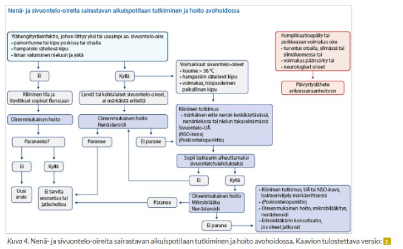

  

## Vuotavat tärykalvoputket 

3-vuotias Iida on saanut tärykalvoille ilmastointiputket 4 kk aiemmin. Nyt hänellä on ollut nuhaa, yskää ja kurkkukipua viikon ajan, ja nyt aamulla äiti huomasi tyynyliinalla eritettä. Tutkittaessa toteat märkäistä eritettä korvakäytävässä ja tympanumin pohjalla ja putki on auki.

- a) kirjoitat painonmukaisen amoksisilliinikuurin (huom. ei penisilliiniallergiaa) ja tarvittaessa kipulääkityksen
- b) otat bakteeriviljelynäytteen, kirjoitat antibiootti-kortisonikorvatipat ja tarvittaessa kipulääkityksen
- c) kirjoitat/kehoitat hankkimaan oireenmukaisen lääkityksen
- d) poistat ilmastointiputken/teet siitä lähetteen ESH/KNK

  <button class="solution-button" data-label="Vastaus" data-hide-label="Piilota vastaus">
    Vastaus
  </button>
  

      b

Jos putkitetun korvan vuodon ilmenemisellä on yhteys ylähengitystieinfektioon, niin kyseessä on äkillinen välikorvatulehdus (AOM). Putkitettu korva ja toteat märkäistä vuotoa putkesta -> ensisijainen hoito on paikallishoito antimikrobisilla tipoilla n. 5-7vrk (esim. siprofloksasiini + hydrokortisoni tai siprofloksasiini + fluosinoloni). Tippoja käytetään 3-5 tippaa 2–3 kertaa päivässä ainakin niin kauan kuin vuotoa jatkuu ja yleensä muutaman päivän tämän jälkeen. 

Korvakäytävä tulisi varovasti myös imeä tyhjäksi. Liian läheltä ilmastointiputkea ei kuitenkaan saa imeä, sillä imukärki voi vahingossa poistaa putken tai työntää sen välikorvaonteloon. Imusta on helppo ottaa bakteeriviljelynäyte. 
 
Hoitoon tulee liittää suun kautta otettava antibiootti, jos lapsi on yleissairas tai vuoto jatkuu tippahoidosta huolimatta. Antibioottiin voi harkinnan mukaan liittää lyhyen steroidikuurin (prednisoloni 2 mg/kg/vrk 3 päivän ajan, maksimi 60 mg/vrk), joka nopeuttaa vuodon loppumista. Vuodon loputtua korva olisi hyvä tarkastaa putkitukoksen sulkemiseksi pois. 

a: P.o. lääkitys ei ole ensisijainen lievissä tilanteissa. 

c: Pelkkä oireenmukainen lääkitys ei ole ensisijainen vaan selvä märkäinen tulehdus hoidetaan mahdollisuuksien mukaan antibiooteilla (samoin kuten ei-putkitetun korvan tapauksessakin). 

d: Pitkäkestoisen vuodon yhteydessä tärykalvoon putken ympärille voi muodostua granulaatiokudosta. Tällainen potilas on syytä lähettää KNK-yksikköön. Simppeli vuoto ei kuitenkaan ole aihe lähetteelle. 
  

## Toteat 49-vuotiaalla oikeanpuoleista nenän tukkoisuutta valittavalla miehellä septumissa selvän deviaation, mikä ahtauttaa oikeaa puolta. Mikä seuraavista väitteistä pitää paikkansa?

- a) Septumdeviaatio on väestössä harvinainen löydös
- b) Septumdeviaatio aiheuttaa aina toispuoleista nenän tukkoisuuden tunnetta
- c) Septumin keski- ja takaosien deviaatiot ovat kliinisesti kaikista merkityksellisimpiä
- d) Septumin etuosan deviaatiot ovat kliinisesti kaikista merkityksellisempiä

  <button class="solution-button" data-label="Vastaus" data-hide-label="Piilota vastaus">
    Vastaus
  </button>
  

      d

Nenän etuosa on ahtain alue ja tietysti ahtaimman alueen vinoudet ovat merkittävimpiä. Etuosan septumin vinous voidaan todeta eturinoskopiassa.
      
a: Septumdeviaatio on hyvin yleinen (jopa n. 80%) löydös väestössä

b: Septumdeviaatio ei aina aiheuta oireita – suurin osa on täysin oireettomia

c: Takaosadeviaatio aiheuttaa yleensä vähemmän oireita (tilavampi alue). Tämän takia myös mahdollisen korjausleikkauksen tuoma hyöty on vähäisempi. 
  

## Heikentynyt kuulo

75-vuotias tehdastyötä aikoinaan tehnyt mies tulee vastaanotolle, koska kuulo on hiljalleen heikentynyt. Tulehduksia, pään vammoja tai korvien toimenpiteitä ei ole ollut. Varsinkin hälyisissä tilanteissa on vaikea saada muiden puheesta selvää ja hän joutuu usein pyytämään muita toistamaan. Lisäksi varsinkin iltaisin hiljaisessa ympäristössä molemmista korvista kuuluu tasaista vinkunaa, joka ajoittain tuntuu häiritsevältä. Tutkimuksissa korvat ovat terveet, tärykalvolla on vasemmalla tympanoskleroosia, tympanometri piirtää molemmin puolin A-käyrät. Äänirautakokeet ovat normaalit, audiogrammissa todetaan korkeita taajuuksia kohden laskeva sensorineuraalinen kuulo, keskiarvot puhealueelta ovat 45/42 dB. Mikä on jatkosuunnitelmasi?

- a) Kuulokojekriteerit eivät täyty, joten jäädään seurantalinjalle
- b) Ohjelmoin tinnituksen vuoksi pään MRI-tutkimuksen kiireellisenä
- c) Potilas hyötyisi kuulokojeista, joten teen lähetteen KNK:lle
- d) Kontrolloin kuulokäyrän ja vasemman korvan statuksen 1 kk kuluttua

  <button class="solution-button" data-label="Vastaus" data-hide-label="Piilota vastaus">
    Vastaus
  </button>
  

      c

Nyrkkisääntö kuulon kuntoutuksen perusteelle julkisessa terveydenhuollossa aikuisille on paremman korvan kuulokynnysten keskiarvo 30 dB tai suurempi. Eli BEHL4 (Better Ear Hearing Lever = PTA (pure tone average) taajuuksilta 0.5, 1, 2 ja 4kHz) ≥ 30 dB

a: Kuulokojekriteerit täyttyvät koska BEHL ≥ 30 dB

b: Korvien soiminen on hyvin tavallista; lähes kaikilla korvat ovat joskus soineet. Täysin hiljaisessa äänieristetyssä tilassa yli 90 % ihmisistä korvat alkavat soida muutaman minuutin jälkeen. Tämä on vielä yleisempää kuulovammaisilla, kun aivot yrittävät kompensoida menetettyä ääni-inputtia tinnnituksella. 

d: Ei ole epäselvä tilanne → kontrolli ei tuo lisäarvoa ilman hoitoa
  

## 92-vuotiaalla Hildalla on ongelmia ruokailussa. Ruoka jää pyörimään suuhun ja hän on siirtynyt syömään pehmeää ja sosemaista ruokaa. Mikä seuraavista syistä näillä tiedoilla on todennäköisin?

- a) Hildalla on motoneuronitauti
- b) Hildalla on iän mukana heikentynyt nielemisen motoriikka
- c) Hildalla on esofaguskarsinooma
- d) Hildalla on hiatushernia ja siitä johtuva esofagiitti

  <button class="solution-button" data-label="Vastaus" data-hide-label="Piilota vastaus">
    Vastaus
  </button>
  

      b

Kuvaus sopii oraalivaiheen nielemishäiriöön eli ruokaa ei saada siirrettyä ruokatorveen. Oireet ovat myös vähitellen kehittyneitä, ei äkillisiä. Tämä on hyvin tavallinen ilmiö vanhuksille eli kyseessä on ns. **presbyfagia** = ikääntymisen aiheuttama nielemisvaikeus. 

a: Motoneuronitauti on harvinaisempi ja toisi myös usein muitakin neurologisia oireita. 

c: Esofaguskarsinooma aiheuttaa tyypillisesti ruoan takertumisen ruokatorveen, ei suun vaiheessa

d: Hiatushernia/esofagiitti -> närästystä, refluksia; ei “ruoka pyörii suussa” -oiretta
  

## CEO:lla korvakipua ja uniongelmia/narskuttelua 

57-vuotias toimitusjohtaja tulee vastaanotolle. Hänellä on kiusallista korvakipua molemmilla puolilla jo parin kuukauden ajan. Vasen puoli on pahempi. Kyselet taustatietoja: hän ei tupakoi, alkoholia kuluu vain lauantaisin oluttölkki tai pari. Töissä on ollut hieman stressiä ja nukkuminen on levotonta. Vaimon mukaan hän narskuttelee hampaita öisin. Tärykalvot ovat terveen näköiset ja liikkuvat hyvin. Et havaitse muutakaan selkeästi poikkeavaa KNK-statuksessa. Mikä olisi seuraava selvittely?

- a) KNK-erikoislääkärillä käynti ja kuulokäyrä
- b) Hammaslääkärillä käynti
- c) Vakuuttelen potilaalle, että jatkotutkimuksia ei tarvita, koska korvat ovat terveet
- d) Leukanivelten magneettitutkimus

  <button class="solution-button" data-label="Vastaus" data-hide-label="Piilota vastaus">
    Vastaus
  </button>
  

      b

Pitkittynyt korvakipu molemmin puolin, ilman korvalöydöksiä → kannattaa ajatella heijastekipua. Bruksismi (hampaiden narskuttelu), stressi ja huono uni ovat vahvoja vihjeitä leukanivel- ja purentalihasperäisestä kivusta, joka säteilee usein korvaan. Tilanne sopii siis ns. TMD:ksi eli temporomandibulaarisen nivelen toimintahäiriöksi, jota enemmän kutsutaan nimellä purentaelimistön kipu ja toimintahäiriöt. Se on yhteisnimitys leukanivelten, puremalihasten, hampaiston ja niihin läheisesti liittyvien kudosten sairaus- ja kiputiloille sekä toimintahäiriöille. 

Tilannetta voisi tutkia mm. kyselemällä leuan/ohimoiden/kasvojen kivusta, kivusta pureskellessa, leuan jumitustunteista ja päänsärystä. Tutkitaan myös suun maksimaalinen avaus, suun devioitumista avauksen aikana, leukanivelten palpointi ja niveläänet... 

TMD:n hoidon ennuste on yleensä hyvä. Potilaan informoiminen, omahoito-ohjeiden antaminen, alaleuan liikeharjoitusten ohjeistaminen ja fysioterapeuttiset hoidot sekä tarvittaessa kipulääkkeet ja purentakiskon valmistaminen ovat suositeltavia ensi vaiheen hoitomuotoja. Potilas vielä narskutaaa hampaitaan, joten ensisijaisena hoitomuotona yksilöllinen purentakisko -> hammaslääkärille. 

a: KNK + audiogrammi ei oikein käy järkeen vielä, koska ei kuulo-oireita eikä korvalöydöksiä

c: Korvat kyllä ovat todennäköisesti terveet, mutta oirekuvalle tarjoutuu järkevä syy ja sen hoitoa kannattaa ajaa 

d: Leukanivelten MRI varataan erikoistilanteisiin, ei ensilinjan tutkimus. TMD:n diagnoosi perustuu oireiden selvittämiseen ja tarkkaan kliiniseen tutkimukseen, joita täydennetään vain tarvittaessa muun muassa kuvantamistutkimuksilla. 
  

## Pahanhajuiselle hengitykselle eli halitoosille on lukuisia syitä, joista valtaosa hoituu muilla keinoin kuin kirurgisilla interventioilla. Mihin seuraavista leikkaushoidolla voi kuitenkin olla apua?

- a) Risojen krooninen tulehdus ja proput
- b) Sjögrenin syndrooma ja pienet sylkirauhaset
- c) Proteesiongelmat
- d) Alkoholin ja tupakan käyttö

  <button class="solution-button" data-label="Vastaus" data-hide-label="Piilota vastaus">
    Vastaus
  </button>
  

      a

Kroonisesti tulehtuneet nielurisat ja tonsillikivet (casea, “proput”) ovat yleinen ja tunnettu halitoosin syy (anaerobibakteerit hajottavat kudosta → pahanhajuisia rikkiyhdisteitä). Kroonisissa tonsilliiteissa (>3kk) harkitaan tonsillektomiaa hoitokeinona ja se voi samalla selvästi helpottaa tai poistaa halitoosin. 

b: Sjögrenin syndrooma on autoimmuunisairaus, jonka hoito on ensisijaisesti oireenmukaista, ei kirurgista. 

c: Proteesiongelmissa suuhygienia, proteesin istuvuuden varmistaminen ja puhdistus ovat tärkeimpiä. 

d: Alkoholin ja tupakan leikkaaminen pois ei ole kirjaimellisesti leikkaamista
  

## Ylimääräisen tunne nielussa nuorella stressaantuneella opiskelijalla

25-vuotias Marko viimeistelee pro gradu -työtään. Hän on viettänyt pitkiä päiviä tietokoneen ääressä. Lopputyön lisäksi hän on muuttamassa toiselle paikkakunnalle töihin ja ilat kuluvat pakatessa. Viime aikoina Markolla on ollut ylimääräisen tunne nielussa. Tämä tuntuu erityisesti tyhjää niellessä. Syöminen sujuu hyvin. Marko tulee vastaanotollesi terveyskeskukseen. Mitä teet?

- a) Lähetän Markon KNK-klinikkaan alanielun tähystystä varten, koska maligniteetti pitää ensisijaisesti poissulkea
- b) Lähetän Markon gastroskopiaan, koska globustuntemuksen aiheuttaa yleisimmin refluksitauti
- c) Teen huolellisen KNK-statuksen, jossa en totea mitään poikkeavaa, ja kerron potiaalle, että kyseessä hyvänlaatuinen oire, joka ei vaadi tässä tilanteessa lisätutkimuksia
- d) Lähetän Markon kaulan ultraäänitutkimukseen, koska syynä voi olla tässä potilasryhmässä yleisesti esiintyvä kilpirauhasen liikakasvu

  <button class="solution-button" data-label="Vastaus" data-hide-label="Piilota vastaus">
    Vastaus
  </button>
  

      c

Oirekuva on klassinen globus-tuntemus eli ylimääräisen tunne nielussa, joka tuntuu erityisesti tyhjää niellessä, mutta syöminen sujuu hyvin ja kivuttomasti ja jopa poistaa tuntemuksen. Potilaalla ei myöskään ole mitään muita hälyttäviä oireita, kuten käheyttä, veriysköksiä tai merkittävää painonlaskua.

Globus-oireisilla tehdään huolellinen KNK-status ja jos se on normaali, niin kyseessä on todennäköisesti hyvänlaatuinen ja toiminnallinen oire. Tällä kyseisellä potilaalla kyseessä on todennäköisesti stressin aiheuttama lihasjännitysperäinen globus-oire. 

a: Maligniteetti erittäin epätodennäköinen 25-vuotiaalla ilman hälytysmerkkejä

b: Gastroskopia ei ole ensilinjan tutkimus isoloituneessa globus-oireessa ilman viitteitä muusta

d: Kilpirauhasen liikakasvu ei ole erityisen yleinen 25-vuotiailla miehillä ja aiheuttaisi usein palpoitavan löydöksen.
  

## Mikä seuraavista oireista EI ole tyypillinen akuutissa A-ryhmän streptokokin aiheuttamassa tonsilliitissa?

- a) kuume
- b) päänsärky
- c) yskä
- d) aristavat imusolmukkeet

  <button class="solution-button" data-label="Vastaus" data-hide-label="Piilota vastaus">
    Vastaus
  </button>
  

      c

Centor-pisteytyksen yksi osa on yskän puuttuminen, koska yskä on tyypillisempää ylähengitysteiden virusinfektioille ja laskee siten streptokokki-infektion todennäköisyyttä. Centor-pisteytystä käytetään arvioimaan nielunäytteen tarpeellisuutta nielutulehduksessa, koska se ennustaa Streptokokki A-infektion todennäköisyyttä (4p on n. 60% ja 0p on n. 7%). Pisteytyksen osa-alueita ovat: yskän puuttuminen, leukakulman alaisten imusolmukkeiden aristus ja turvotus, nielurisojen turvotus ja peitteet, esitietoihin perustuva tai mitattu yli 38C:n kuume. 

a: Esitietoihin perustuva tai mitattu yli 38C:n kuume on yksi Centor-pisteytyksen osa-alueista. 

b: Päänsärky on tyypillistä melkein mille tahansa infektiolle. 

d: Leukakulman alaisten imusolmukkeiden aristus ja turvotus on yksi Centor-pisteytyksen osa-alueista. 

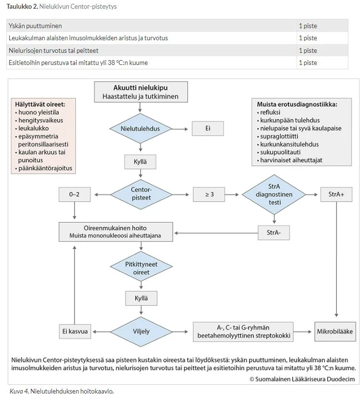
  

## Syanoottisella vastasyntyneillä todetaan koanaaliatresia molemmin puolin. Mikä selittää vauvan hengitysvaikeuden?

- a) Vastasyntynyt hengittää normaalisti nenän kautta
- b) Tilaan liittyy kurkunpään spasmitaipumus lapsen itkiessä
- c) Tilaan liittyen ainoastaan lapsen syödessä ylähengitystiet ovat auki
- d) Vastasyntynyt hengittää normaalisti suun kautta

  <button class="solution-button" data-label="Vastaus" data-hide-label="Piilota vastaus">
    Vastaus
  </button>
  

      a

Coana-atresia tarkoittaa synnynnäistä tukkeumaa nenän takaosassa, nenäontelon ja nenänielun välisessä yhteydessä (koaanoissa), joka johtuu usein luusta tai sidekudoksesta; tyypillisesti kyseessä on nenäontelon takaosan ja alkusuun välisen membrana bucconasaliksen puhkeamishäiriö. Se on harvinainen tila, ja voi olla unilateraalinen (yleisempi) tai bilateraalinen. **Bilateraalisena se estää vauvaa hengittämästä nenän kautta, mikä aiheuttaa hengenahdistusta ja vaatii usein välitöntä hoitoa, koska vastasyntyneet hengittävät preferentiaalisesti nenän kautta.** Koska vastasyntynyt hengittää nenän kautta, molemminpuolinen atresia aiheuttaa hengitysvaikeuden ja syanoosin (mutta vauva muuttuu taas pinkiksi itkiessä, koska itkiessä vauva hengittää suun kautta), ja molemminpuoleinen koanaaliatresia on pediatrinen hätätilanne ja vaatii päivystyksellistä hoitoa, kuten intubaatiota ja kiireellistä leikkaushoitoa. Myöskään imeminen ja siten omatoiminen juominen ja syöminen eivät onnistu nenähengityksen puuttumisen vuoksi. Ruokintaletku on välttämätön.

Atresia voidaan diagnosoida alustavasti koettamalla asettaa katetri nenän kautta nieluun. Varmistus tehdään nenän kautta tähystämällä. Hoito molemminpuolisessa koanaaliatresiassa on useimmiten endonasaalinen, tähystysavusteinen atresioiden avaus. Tarvittaessa asetetaan molempien sierainten kautta nenän väliseinän takaa kiertävä katetri estämään tehtyjen aukkojen kiinnikasvamista. Katetri poistetaan parin kuukauden kuluttua, kun limakalvot ovat parantuneet. 

_Toispuolinen atresia voi olla vähäoireinen ja tulla ilmi vasta vuosienkin kuluttua._ Hoito on vastaavanlainen kuin molemminpuolisessa. Toispuoleisen atresian leikkaushoidolla ei usein ole kiire, ja toimenpide voidaan tehdä vasta lähempänä kouluikää, tarvittaessa kuitenkin jo ½–1 vuoden iässä.

  

## 55-v. tupakoimaton, perusterve mies hakeutuu päivystykseen tänään alkaneen kiertohuimauksen ja oksentelun vuoksi. Tutkiessa havaitset oikealle lyövän spontaaninystagmuksen ja päännykäisytesti on poikkeava vasemmalla. Neurologisessa statuksessa tai pään TT:ssä ei ole poikkeavaa. Todennäköisin diagnoosi on:

- a) Posteriorisen kaarikäytävän asentohuimaus
- b) Vestibulaarineuroniitti vasemmalla
- c) Vestibulaarineuroniitti oikealla
- d) Ménièren tauti

  <button class="solution-button" data-label="Vastaus" data-hide-label="Piilota vastaus">
    Vastaus
  </button>
  

      b
      
Vestibulaarineuroniitti on nimitys tilanteelle, jossa tasapainoelin ja erityisesti vestibulaarihermo lakkaa äkisti toimimasta toisella puolella, mikä johtaa huimaukseen; taustalla ajatellaan olevan virusetiologia. **Nystagmus on horisontaalinen (usein rotatorista komponenttia havaittavissa myös) ja lyö terveen korvan suuntaan vestibulaarineuriitissa ja päännykäisytesti on poikkeava sairaan korvan puolelle.**

---

Kiertohuimauksen (vertigon) erotusdiagnostiikassa on tärkeintä osata napata sentraaliset syyt ja erityisesti niistä aivoverenkiertohäiriöt (AVH), koska stroke voi aiheuttaa huimausta. Kolme yleisintä perifeeristä syytä vertigolle ovat yleisyysjärjestyksessä hyvänlaatuinen asentohuimaus (HAH, BPPV), vestibulaarineuroniitti (eli vestibulaarineuriitti) ja Menieren tauti (harvinainen ja kaksi ensimmäistä ovat tärkeimmät). 

---

Erotusdiagnostiikka alkaa anamneesilla (kesto, muut oireet yms) ja oireen kuvauksella (kaikki eivät tarkoita huimauksella sinänsä kiertohuimausta, vaan voi olla paljon epämääräisempi). On heti tärkeää poissulkea selvimmät aivoverenkiertohäiriöön viittaavat oireet. Sentraalista vertigoa ja varsinkin aivorunko-/pikkuaivoinfarktia tulee epäillä, jos potilaalla on seuraavia liitännäisoireita: 

Merkittävä päänsärky (mahd. pikkuaivohemorragia) tai merkittävä niskakipu (mahd. kaulavaltimodissektio)

Ei pysty seisomaan/kävelemään ilman apua (muista aina kävelyttää potilas, jos se on mahdollista)

Fokaalinen heikkous tai parestesia kasvoissa tai raajoissa

Takaverenkierron häiriön Deadly D's: dysartria, diplopia/dyskonjugaatio, dysfagia, dysmetria/dysdiadokokinesia, dysfonia

Spontaani vertikaalinen nystagmus

---

Seuraavaksi jos näitä ei ole todettavissa, niin ei tarvitse välittömästi kuvantaa potilasta, vaan voidaan tutkia statusta tarkemmin. Yksi isoimmista erottelevista löydöksistä on nystagmus, joka voi olla joko jatkuvaa tai jaksoittaista. Nystagmuksesta huomioidaan myös sen suunta, joka määritetään silmävärveen nopeamman komponentin suuntana. Huomioidaan myös mahdollinen rotatorinen osuus. Jos nystagmus on vertikaalista, se viittaa sentraaliseen syyhyn (kts. yllä).

Jos nystagmus ja vertigo on jatkuvaa, niin tulee ensisijaisesti erottaa toisistaan sentraalinen syy ja vestibulaarineuriitti. Jos nystagmus tapahtuu vain jaksoittaisten ja lyhytkestoisten vertigokohtausten yhteydessä, on kyseessä todennäköisesti BPPV. 

--- 

Vestibulaarineuriitti ja takaverenkierron häiriö usein ilmenevät samankaltaisesti, jonka takia tilaa voi usein kutsua yhteisnimellä akuutti vestibulaarioireyhtymä (AVS), jos todetaan pitkittynyttä jatkuvaa vertigoa ja spontaanista/katseen siirtämisen indusoimaa nystagmusta (pikkuaivoinfarktissa ei siis aina ole neurologisia puutosoireita, joiden perusteella siirryttäisiin suoraan kuvantamistutkimuksiin). Sentraalisen syyn ja vestibulaarineuriitin erotusdiagnostiikassa ensisijainen tutkimusprotokolla on HINTS plus-tutkimus. 

Suurimmalla osalla AVS-potilaista on vestibulaarineuriitti. Pienemmällä osalla on selvä stroke, jota voi epäillä liitännäisoireiden perusteella (esim. diplopia, dysartria yms.). Vielä pienemmällä osalla on stroke, joka ei ilmene suoraan liitännäisoireista ja tällöin tarvitaan HINTS plus-tutkimusta erottamaan vestibulaarineuriitti ja stroke toisistaan. HINTS plus koostuu neljästä eri komponentista, joiden perusteella tutkimus on nimettykin: Head Impulse test (HIT, päännykäisytesti, impulssitesti), Nystagmus, Test of (vertical) Skew ja plus (kuulon arviointi bedside). HINTS plus tulisi tehdä vain, jos potilaalla on spontaani nystagmus ja jatkuva huimaus. Sitä EI tule tehdä kohtauksittaisesta huimauksesta kärsivälle, jolla ei ole spontaania nystagmusta (ei nystagmusta -> ei HINTSiä). Jos potilaalla on jaksoittaista lyhytkestoista huimausta ja vain niiden yhteydessä nystagmusta, diagnosoidaan tilanne ensisijaisesti Dix-Hallpiken testillä. 

---

HIT:ssä potilaan katse kohdistetaan suoraan eteen tutkijan nenään ja pää nykäistään nopeasti sivulle (molempia puolia testataan epäsäännöllisessä rytmissä). Samalla arvioidaan tapahtuuko korjausliikettä (epänormaali) vai säilyykö katse fiksoituna. Arvioidaan siis, että toimiiko okulovestibulaarinen refleksi, joka mahdollistaa katseen pitämisen kohteessa, vaikka päätä käännetään siitä pois. HUOM! normaali HIT on huolestuttava löydös ja viittaa sentraaliseen syyhyn. Jos taas löydös on epänormaali, niin se viittaa taas enemmän vestibulaarineuriittiin, joka häiritsee okulovestibulaarista refleksiä (löydös on epänormaali affisioidulle puolelle käännettäessä). 

Nystagmuksen arvioimisessa arvioidaan tietysti jo aikaisemmin tarkasteltua, eli onko kyseessä jatkuva tai jopa vertikaalinen nystagmus. Erityisesti nyt kuitenkin arvioidaan, että onko nystagmus bidirektionaalinen eli suuntaa vaihtava. Sentraalisessa syyssä nystagmus vaihtaa suntaa katsetta kohdistettaessa ensin toiselle sivulle ja sitten toiselle, kun taas vestibulaarineuriitissa on unilateraalinen nystagmus (nopea komponentti aina samaan suuntaan). 

Skew:n testauksessa potilas kohdistaa katseen tutkijan nenään ja peitetään toinen potilaan silmistä, jota seuraten parin sekunnin välein vaihdetaan peitettävää silmää. Vaihtojen aikana arvioidaan juuri paljastettua silmää. Sentraaliseen vertigon syyhyn viittaa dyskonjugaatio eli voidaan havaita paljastetun silmän vertikaalista korjausliikettä (Kun silmä on peitettynä, se hakeutuu vertikaaliseen virheasentoon (usein alaspäin osoittavaan asentoon). Kun peitto poistetaan ja siirretään käsi toisen silmän päälle, niin paljastettu silmä lähtee korjaamaan virheasentoaan -> vertical skew. Pelkästään horisontaaliset korjaukset ovat benignejä). 

"Plus"-osa HINTS plus -tutkimusta tarkoittaa kuulon tutkimista bedside (esim. kuuleeko potilas sormien hieromisen korvien lähellä symmetrisesti ja normaalisti). Jos potilaalla on uusi kuulovika vertigon yhteydessä, niin se herättää epäilyn sentraalisesta syystä. Kuulon tutkiminen on lisätty perinteiseen HINTS-tutkimukseen sen takia, että voitaisiin napata herkemmin kiinni AICA (Anterior Inferior Cerebellar Artery) stroket, sillä ne voivat aiheuttaa unilateraalista kuulonalenemaa. Myös perifeerinen syy, erityisesti labyrintiitti, voi aiheuttaa samanlaisen ilmenemisen, mutta se on hyvin harvinainen -> uusi kuulonalenema äkillisen jatkuvan vertigon yhteydessä tulisi primäärisesti herättää epäily AVH:sta. 

--- 

*Miksi nystagmys lyö terveelle puolelle vestibulaarineuriitissa, kun BPPV lyö sairaalle puolelle? 

Jos ajatellaan fysiologiaa, niin pään ollessa suorassa molemmat vestibulaarihermot lähettävät signaaleita aivoihin samalla tahdilla, jolloin aistitaan pään olevan suorassa. Jos taas käännetään päätä esim. oikealle, niin oikea hermo alkaa signaloimaan tiheämpää tahtia ja vasen hermo hitaampaa -> tämä aistitaan pään kääntönä oikealle. Pään kääntyessä oikealle silmät taas kääntyvät vasemmalle, jos halutaan pitää katse suoraan eteenpäin (vestibulo-okulaarinen refleksi). 

Jos taas vestibulaarineuriitista johtuen toisen puolen vestibulaarihermo ei enää toimi ja lähettää signaaleita merkittävästi hitaammin kuin terve puoli, niin silloin lepotilassakin pään ollessa suorassa aistitaan, että pää olisi kääntynyt terveelle puolelle, joka signaloi normaaliin tahtiin. Jos esimerkiksi vasen vestibulaarihermo on heikosti toimiva vasemmanpuolisen vestibulaarineuriitin takia, niin tämä aistitaan pään kääntönä oikealle. Silmät yrittävät vastata tähän aistimukseen vetäytymällä vasemmalle. Pää ei kuitenkaan oikeasti ole kääntynyt, joten tämä silmien virheliike korjataan nopeasti, jolloin silmät palaavat takaisin oikealle (eli tässä esimerkissä terveen korvan suuntaan) ja tämä havaitaan nystagmuksen nopeana komponenttina -> nystagmus on terveen korvan suuntaan horisontaalinen ja sen mukana on usein vaihtelevan vahvuinen rotatorinen komponentti, jonka suunta on myös terveen korvan suuntaan. 

  

## Etukumara asento nenäverenvuotopotilaalla (nenää kotona puristaessaan) on tärkeää

- a. vaatteiden tahriintumisen välttämiseksi
- b. pahoinvointiin johtavan vuotavan veren nieleskelyn välttämiseksi
- c. septumhematooman kehittymisen estämiseksi
- d. vuotavan veren keräämiseksi nenäkäytävän pohjalle ja hajuaistiepiteelin varjelemiseksi

  <button class="solution-button" data-label="Vastaus" data-hide-label="Piilota vastaus">
    Vastaus
  </button>
  

      b

Etukumara asento estää veren valumisen nieluun, mikä muuten johtaa helposti veren nielemiseen. Nieleskelty veri aiheuttaa pahoinvointia ja oksentelua, ja pahentaa potilaan vointia.  
  

