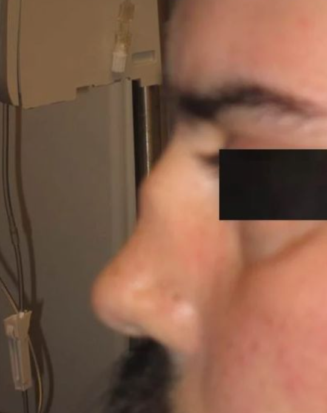
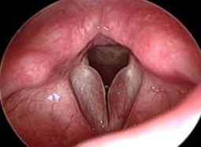
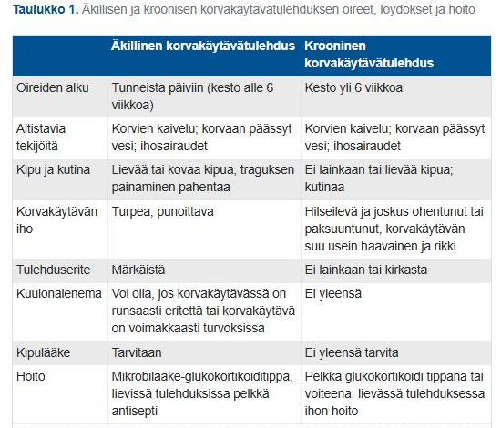

# 2023, tentti 1 

Tentit ovat C8:lla blokeittain, joten samana vuonna on useita tenttejä, jotta eri blokeilla olisi eri kysymykset. Tässä vuoden 2023 blokin 1 tentti, seuraavassa kappaleessa tentti 2. 

Kolme kysymystä ovat samoja kuin aikaisemmassa vuoden 2021 tentissä, joten ne jätetty tästä pois (sen takia kysymyksiä 47 eikä 50).

## Mikä on äänesaudiometrian mittaustarkkuus desibeleissä?

- a. 5 dB
- b. 15 dB
- c. 10 dB
- d. 0 dB

  <button class="solution-button" data-label="Vastaus" data-hide-label="Piilota vastaus">
    Vastaus
  </button>
  

      a

Puhtaiden äänien audiometrian mittaustarkkuus on ±5 dB useimmilla taajuuksilla, kun testi suoritetaan kliinisissä olosuhteissa standardoidulla laitteistolla ja asianmukaisesti kalibroiduilla kuulokkeilla. Äänitaso on myös yleensä säädettävissä 5 dB:n askelmin.

Mittaustarkkuus voi heikentyä korkeilla taajuuksilla (esim. 6–8 kHz), jolloin vaihtelu voi olla jopa ±5–10 dB, erityisesti jos käytetään supra-auraalisia kuulokkeita tai testausolosuhteet eivät ole optimaaliset.
  

## Pienileukainen kuorsaaja

Vastaanotollesi tulee 45-vuotias varastomies, jonka BMI on 25. Puoliso valittaa kovaäänisestä kuorsauksesta. ESS-kyselyssä pisteet 12. Yöpolygrafiassa apnea-hypopnea-indeksi AHI on 20/h. Nielussa keskikokoiset tonsillat, uvula kookas ja suulaki laskeutuu alas. Alaleuka vaikuttaa pieneltä, mitä teet?

- a. Lähetän potilaan korvaklinikalle arvioon ja suulakitoimenpidettä varten.
- b. Lähetän potilaan keuhkotaudeille CPAP-laitehoidon aloitusta varten.
- c. Annan potilaalle ohjeet laihduttamisesta ja sovin kontrollikäynnin puolen vuoden päähän.
- d. Lähetän potilaan suu- ja leukasairauksien yksikköön alaleuan ortognaattista kirurgiaa varten

  <button class="solution-button" data-label="Vastaus" data-hide-label="Piilota vastaus">
    Vastaus
  </button>
  

      b

Potilaalla on keskivaikea (AHI 16-30) uniapnea, joka aiheuttaa merkittävää uneliaisuutta (ESS yli 9). Laskeutunut suulaki ja erityisesti pieni alaleuka viittaavat tyypilliseen ylähengitystieobstruktioon, joka on oireiden taustalla. 

CPAP-hoito on uniapnean ensisijainen hoito erityisesti keskivaikeista tai vaikeista oireista kärsivillä ja niillä, joilla AHI on yli 15/h. CPAP (continuous positive airway pressure) tarkoittaa jatkuvaa ilmatiepainetta, joka tuotetaan ulkoisella painelaitteella ja johdetaan ilmateihin letkun ja maskin välityksellä. Riittävän ilmatiepaineen avulla ahtautumisalttiit ylähengitystiet on mahdollista pitää auki unen aikana. CPAP-hoidon aloitus kuuluu keuhkotaudeille. 

a: Kirurgisia hoitoja (esim. hypoglossushermon stimulaatio, maxillomandibulaarinen eteenpäin siirto, uvulopalatofaryngoplastia) harkitaan vain, jos CPAP-hoito ei sovi tai on tehoton, tai lisähoitona vaikeissa tapauksissa. 

c: Potilas ei ole merkittävän ylipainoinen (BMI 25), mutta kehonrakenteesta riippuen voi suositella urheilun lisäämistä kylläkin. Tilannetta ei kylläkään voi vain jäädä seuraamaan, koska uniapnean CPAP-hoito on indikoitua. 

d: Leukojen siirtäminen eteenpäin lisää nielun ilmatilaa. Varsin suuri yksimielisyys vallitsee siitä, että riittävän radikaalisti toteutettu molempien leukojen yhtäaikainen siirto eteenpäin on uniapnean tehokkain kirurginen toimenpide trakeostomian ohella. Leukaosteotomialeikkaukset ovat mahdollisesti indikoituja, jos muut temput eivät auta, mutta jos tällaisen haluaisi ensilinjan hoitona esim. looksmaxxing-syistä, niin julkinen puoli ei harmillisesti sitä kustanna. 
  

## Opettaja valittaa sisäilmaongelmista 

Vastaanotollesi tulee 40-vuotias nainen, joka työskentelee opettajana. Potilaalla on jo useamman kuukauden ajan esiintynyt kroonista nuhaa, silmien ärsytysoireita, yskää, ääniongelmia sekä väsymystä. Potilas liittää oireet vahvasti työpaikalla oleiluun. Työpaikalla epäillään kosteusvauriota. Loma-aikana oireisto helpottaa. Mikä seuraavista väittämistä pitää paikkaansa?

- a. Terveydensuojelulain mukaan rakennuksen rakenteiden home- tai mikrobikasvu on terveyshaitta, mikä pitää korjata, vaikka kukaan altistuneista rakennuksen käyttäjistä
ei oireilisi.
- b. Työterveyshuolto ja työsuojeluviranomaiset vastaavat työpaikkojen tutkimisista kosteusvauriota tai muuta sisäilmaongelmaa epäiltäessä.
- c. Useimmiten kosteusvaurioon liittyvän oireilun taustalla on mikrobiallergia tyypillisesti homeelle, mikä pystytään osoittamaan seerumin spesifien IgE-vasta-aineiden määrityksellä.
- d. Kosteusvaurioon liittyvää allergista nuhaa epäiltäessä seerumin mikrobi-IgE-määritykset suunnataan altistumistietojen perusteella

  <button class="solution-button" data-label="Vastaus" data-hide-label="Piilota vastaus">
    Vastaus
  </button>
  

      b

Työpaikan sisäilma- ja kosteusvaurioepäilyjen selvittämisestä vastaa ensisijaisesti työnantaja yhteistyössä kiinteistön omistajan/haltijan ja työterveyshuollon kanssa. Työntekijän tulee ilmoittaa havainnoistaan esihenkilölle ja työsuojeluvaltuutetulle.

a: Terveydensuojelulaki koskee kyllä rakennusten terveyshaittoja, mutta työpaikoilla ensisijainen lainsäädäntö on työturvallisuuslaki. Lisäksi terveyshaitta arvioidaan haitan tai sen vaaran perusteella, ei pelkän löydöksen olemassaolon vuoksi täysin kontekstista irrallaan.

c ja d: IgE-välitteinen herkistyminen sisäilman mikrobeille on harvinaista, eikä spesifejä testejä syy-yhteyden varmistamiseksi ole 
 
  

## Päivystykseen tulee aikuinen potilas, joka on kaatunut liukkaalla jäällä. Vasen etuylähammas on poikki ja teet lähetteen hammaslääkärille. Mikä on hampaan numero?

- a. 32
- b. 21
- c. 12
- d. 41

  <button class="solution-button" data-label="Vastaus" data-hide-label="Piilota vastaus">
    Vastaus
  </button>
  

      b

Kansainvälisen käytännön mukaisesti hampaat tunnistetaan numeroparilla. Numeroparin ensimmäinen numero kuvaa sitä leukaneljännestä, jossa hammas sijaitsee (pysyvässä hampaistossa neljännekset 1–4 ja maitohampaistossa 5–8). Toinen numero kuvaa hampaan järjestysnumeroa keskiviivasta taaksepäin.

  

## Mikä seuraavista ei liity Menieren tautiin? Valitse yksi.

- a. Fluktuoiva kuulonalenema
- b. Sykkivä tinnitus
- c. Sensorineuraalinen kuulonalenema
- d. Huimaus

  <button class="solution-button" data-label="Vastaus" data-hide-label="Piilota vastaus">
    Vastaus
  </button>
  

      b

Tinnitus ei ole sykkivää (viittaa erityisesti verisuoniperäiseen syyhyn), vaan enemmänkin matalataajuista suhinatyyppistä. 

---

Ménièren tauti = idiopaattinen endolymfaattinen hydrops. Tasapainoelimen estetilojen, peri- ja endolymfan ionipitoisuuksien ajatellaan häiriintyvän ja sen seurauksena tasapainoelimen toiminta häiriintyy kohtauksellisesti. Ménièren taudin diagnoosi perustuu kliiniseen kuvaan ja tyypilliset oireet voi muistaa muistisäännöstä 4H: 

Huimaus (voimakas kiertohuimaus); kohtaukset kestävät tyypillisesti n. 20min-12t (vrt. BPPV, jossa huimaus kestää tyypillisesti n. 5-30s ja vrt. vestibulaarineuriitti, jossa oireet ovat jatkuvia eikä kohtauksittaisia)

Humina (suhina, paineen tunne korvassa)

Huonokuuloisuus matalilla äänillä (sensorineuraalinen); Jos potilaan oireisto muistuttaa Ménièren tautia, mutta ei todeta kuulonalenemaa, tulee migreeniin liittyvä huimaus pitää mielessä. Kuulonalenema on alkuun kohtauksittaista, mutta lopulta etenee pysyväksi. Tauti ei kuitenkaan kuurouta korvaa täysin. Yleensä alkaa unilateraalisena (vain toisessa korvassa), mutta etenee suurella osalla bilateraaliseksi

Huonovointisuus, oksentelu
  

## 24-vuotiaalla lääketieteen opiskelijalla on ollut 5 vrk ajan kurkkukipua, nenän tukkoisuutta, räkäisyyttä sekä yskää. Hän epäilee akuuttia poskiontelotulehdusta ja haluaa sen vuoksi, että CRP tarkistettaisiin. Mitä mieltä olet tästä?

- a. Akuutin sivuontelotulehduksen diagnoosia ei tulisi tehdä pelkästään oireiden ja löydösten perusteella. Luotettava diagnoosi edellyttää lisäksi tulehdusarvojen tarkistusta.
- b. CRP:n avulla pystytään erottamaan virusperäinen ja bakteeriperäinen rinosinuiitti toisistaan.
- c. CRP:n sensitiivisyys ja spesifisyys ovat riittämättömiä akuutin sivuontelotulehduksen diagnosoimiseen.
- d. CRP on hyvä tarkistaa, koska sen avulla pystytään melko luotettavasti arvioimaan mahdollisen sivuontelotulehduksen voimakkuutta.

  <button class="solution-button" data-label="Vastaus" data-hide-label="Piilota vastaus">
    Vastaus
  </button>
  

      c

CRP on tarpeeton rinosinuiitin diagnostiikassa. Se ei luotettavasti erottele virus- ja bakteeriperäistä rinosinuiittia, koska useimmissa tapauksissa virusinfektioiden ja lievien bakteeri-infektioiden CRP-arvot voivat olla samankaltaisia. CRP ei myöskään arvioi luotettavasti sinuiitin "voimakkuutta" kliinisen oireiston perusteella – oireet ja kliininen löydös kertovat paremmin potilaan tilasta.

a: Akuutin sivuontelotulehduksen diagnoosi tehdään ensisijaisesti juuri oireiden ja löydösten perusteella. Akuutti bakterielli rinosinuiitti voidaan diagnosoida kliinisesti, jos seuraavat kriteerit täyttyvät: 

1. Potilaalla on sivuontelotulehduksen oireita ja erityisesti siis märkäistä eritettä + joko nenän tukkoisuutta tai kasvojen kipua/paineen tunnetta tai hajuaistin menetystä

ja tämän lisäksi joku näistä: 

2. Oireet kestäneet pitkään (kriteeristöstä riippuen 7-10vrk)
3. Tapahtuu oireiden lievittymistä aluksi, mutta sitten taas oireiden pahentumista (ns. double sickening)
4. Vaikeita oireita ainakin 3 vrk (korkea kuume/hampaisiin säteilevää kipua/voimakas kasvojen kipu)

  

## Peitteinen tonsilliitti ja äkillinen voinnin huonontuminen

Vastaanotollasi terveyskeskuksen päivystyksessä tutkit potilasta, jolla on peitteinen voimakasoireinen tonsilliitti. Potilaalla on myös kaulan imusolmukkeissa turvotusta ja arkuutta ja korkea (yli 39 astetta) kuume. Tutkimuksen jälkeen potilaasi on siirtymässä odottelemaan verikoevastauksia, melko äkillisesti alkaa voida huonosti. Mitkä asiat statuksessa mahdollisesti herättävät huolesi?

- a. nopea syke (yli 90/min)
- b. hengitys yli 10/min
- c. yskä
- d. korkea verenpaine

  <button class="solution-button" data-label="Vastaus" data-hide-label="Piilota vastaus">
    Vastaus
  </button>
  

      a

Potilaalla on vaikeahko infektio (voimakasoireinen tonsilliitti, korkea kuume, imusolmukesuurentumat) ja äkillinen voinnin huononeminen → pitää ajatella sepsistä ja jopa septiseen shokkiin etenemistä. Takykardia on yksi sepsiksen varhaisista merkeistä, kun sydän yrittää kompensoida heikkoa perfuusiota.

b: Yli 10/min on lähes normaalia hengitystiheyttä, normaali 12-20. Takykardia olisi tyypillisempää komplisoituneelle infektiolle. 

c: Perus yskä ei ole sepsiksen tai äkillisen hemodynaamisen romahtamisen keskeinen merkki

d: Päinvastoin matala verenpaine olisi erittäin huolestuttava hemodynaamisen kollapsin kannalta
  

## Mikä seuraavista äänihuulten atrofiaa koskevista väittämistä on oikein?

- a. Esiintyvyys lisääntyy iän mukana.
- b. Tyypillistä äänihuulien liikkeiden hidastuminen.
- c. Äänihuulissa nähdään epäsymmetrinen liike.
- d. Synnynnäinen äänen käheyden aiheuttaja

  <button class="solution-button" data-label="Vastaus" data-hide-label="Piilota vastaus">
    Vastaus
  </button>
  

      a

Äänihuulten atrofia on hyvin tyypillistä ikääntyessä ja on ikääntymiseen liittyvä normaali ilmiö. Se aiheuttaa äänen käheyttä -> presbyfonia eli ikäkäheys, jossa ääni muuttuu pikku hiljaa iän myötä hiljaisemmaksi ja vuotoisemmaksi. Käheyden aiheuttaa äänihuulen mediaalireunojen kovertuminen (atrofia), jolloin äänihuulia on vaikea saada tiiviisti yhteen. 

Hoitona useimmiten riittää, että antaa potilaallen tiedon käheyden hyvänlaatuisesta. Tilanteissa, joissa äänihuulen atrofia johtaa hankalaan kommunikaatio-ongelmaan, on sitä viime vuosina lisääntyvässä määrin hoidettu äänihuulia täyttävällä injektiolla.

Kuvassa näet mediaalista kovertumista atrofiasta johtuen

  

## Toteat 45-vuotiaalla puoli vuotta nenän tukkoisuudesta kärsineellä miehellä nenässä molemmin puolin nenäpolypoosin. Mitä nenäpolypoosilla yleensä tarkoitetaan?

- a. Nenää tukkivaa neoplastista tuumorimassaa
- b. Kroonista polypoottista riniittiä
- c. Kroonista polypoottista rinosinuiittia
- d. Kroonista poskiontelotulehdusta

  <button class="solution-button" data-label="Vastaus" data-hide-label="Piilota vastaus">
    Vastaus
  </button>
  

      c

Nenäpolypoosi eli nenän polyyppitauti on krooninen limakalvon tulehdussairaus, jossa limakalvo turpoaa ja limakalvopullistumia työntyy nenäkäytävään. Sitä pidetään yhtenä kroonisen rinosinuiitin muodoista. Nenäpolyypit ovat lähtöisin seulalokerostosta, joskus harvoin poskiontelon limakalvosta (ns. koanaalipolyyppi)

Polyypit ovat muuta limakalvoa vaaleampia, imukärjellä tunnustellen pehmeitä ja liikkuvia eikä niissä ole kosketustuntoa. Polyyppejä on molemminpuolisesti! 

  

##  Nuori nainen valittaa keväisistä nuhaoireista

25-vuotias nainen, joka työskentelee päiväkodissa, tulee huhtikuussa vastaanotollesi toista viikkoa jatkuneen voimakkaan oireilun vuoksi. Nenä on tukossa, kutisee ja vuotaa kirkasta eritettä. Myös silmät vuotavat ja ovat turpeat. Kertoo useampana keväänä kärsineensä vastaavista oireista. Mikä seuraavista vaihtoehdoista on todennäköisin diagnoosi?

- a. Adenovirusinfektio, joka peräisin päiväkodin lapsilta
- b. Allerginen rinokonjunktiviitti
- c. Sisäilmaongelma työpaikalla
- d. Vasomotorinen nuha ja siihen liittyvä konjunktiviitti

  <button class="solution-button" data-label="Vastaus" data-hide-label="Piilota vastaus">
    Vastaus
  </button>
  

      b

Allergisen nuhan yleisimpiä oireita ovat nenän ja silmien valuminen ja kutina, aivastelu ja nenän tukkoisuus. Nenän ja silmien affisioituminen -> rinokonjunktiviitti. Allergista nuhaa laukaisevista allergeeneista yleisimmät Suomessa ovat siitepölyt (erityisesti koivu, leppä, heinät ja pujo), ja tämän takia oireet usein alkavat keväisin. 

a: Adenovirus aiheuttaa usein nuhaa ja silmäoireita, mutta akuutti virusinfektio kestää yleensä vain 7–10 päivää eikä ole ihan yhtä toistettavissa aina keväisin kuin allergiaoireet.

c: Voisi aiheuttaa jatkuvia oireita, mutta tällöin oireet eivät rajoittuisi kevääseen vuosittain, vaan jatkuisivat

d: Vasomotorinen nuha on ei-allerginen, usein krooninen (tai jonkin ärsykkeen yhteydessä) ja ei-kausiluonteinen, ja kutina ja silmien oireilu ei ole hallitsevaa. 
  

## Nenän virheasento ja kookas septumperforaatio yleissairauden aiheuttamana

67-vuotias nainen tulee vastaanotollesi nenän karstaisuuden ja toistuvien nenäverenvuotojen vuoksi. Toteat nenässä ulkoista virheasentoa sekä kookkaan septumperforaation ja ulseraatioita nenän limakalvoilla. Mihin yleissairauteen tämän kaltaiset löydökset saattavat liittyä?

- a. Systeemiseen lupus erythematosukseen
- b. Sekamuotoiseen sidekudostautiin
- c. Sjögrenin syndroomaan
- d. Granulomatoottiseen polyangiittiin

  <button class="solution-button" data-label="Vastaus" data-hide-label="Piilota vastaus">
    Vastaus
  </button>
  

      d

Granulomatoottinen polyangiitti eli GPA (vanhalta nimeltään Wegenerin granulomatoosi; muutettu terminologian yhtenäistämiseksi ja myös koska Friedrich Wegener oli natsi) on pienten suonten pauci-immuuni vaskuliitti (ei siis havaita immuunikompleksien kertymistä tai tyvikalvo-vasta-aineita immunofluoresenssissa; on c-ANCA:an yhteydessä), joka affisioi klassisesti ylähengitysteitä, keuhkoja ja munuaisia. GPA on yleisin ylähengitysteissä esiintyvistä granulomatoottisista tulehduksista.

Tämä ylähengitysteiden tulehdus voi aiheuttaa lopulta nenän väliseinämän kookkaan vaurion, joka johtaa tyypilliseen virheasentoon, jota kutsutaan satulanenäksi (nenän rustoinen pyramidi painuu kasaan satulamaisesti). Sen taustalla voi myös olla mm. trauma tai tertiaarinen/kongenitaalinen kuppa.

  

## Näet posken limakalvoilla poikkeavan limakalvomuutoksen, mikä herättää epäilyn pahanlaatuisesta muutoksesta. Mikä on ensisijainen toimenpide?

- a. Lähete potilaan omalle hammaslääkärille
- b. Muutoksen valokuvaus ja kontrolli muutaman kuukauden päästä
- c. Puudutus ja biopsia
- d. Oraalinen kortisonipohjainen suugeeli kahden viikon ajan

  <button class="solution-button" data-label="Vastaus" data-hide-label="Piilota vastaus">
    Vastaus
  </button>
  

      c

Jos suun limakalvomuutos herättää epäilyn pahanlaatuisuudesta, siitä otetaan kudosnäyte paikallispuudutuksessa; varsinkin jos se ei häviä 2–3 viikossa mahdollisten ärsyttävien tekijöiden poistamisen jälkeen. 

Huom! muista alueista voi ottaa biopsian vapaasti, mutta sylkirauhasmuutoksista ei oteta stanssibiopsiaa eikä muutosta poisteta veitsellä; voidaan ottaa ohutneulanäyte mahdollisesti PTH:ssa. 

a: Vaikka hammaslääkäri voi tutkia limakalvomuutoksia, kuuluu suun maligniteettiepäilyt pääsääntöisesti yleislääkärin hommiin. 

b: Tässä odotetaan liian pitkään; yli 3vk ei saa seurailla suun muutoksia ja jos on selvä epäily maligniteetista, otetaan siitä heti biopsia.  

d: Paikalliset glukokortikoidivalmisteet ovat ensisijainen oireita lievittävä hoito erityisesti punajäkälässä, mutta nyt on epäily maligniteetista, ei voi jäädä hoitamaan tällä tavalla.  
  

## 4-vuotiaalla tytöllä on ollut 2 kk ajan jatkuvaa oikeanpuoleista nenän tukkoisuutta sekä märkäistä vuotoa oikeasta sieraimesta. Mikä seuraavista vaihtoehdoista on todennäköisin etiologia?

- a. Juveniili papillooma oikeassa sieraimessa
- b. Hammasperäinen rinosinuiitti oikealla puolella
- c. Kallonpohjan läpi pullistava meningoseele oikeassa sieraimessa ja siihen liittyvä ingektio
- d. Nenän vierasesine

  <button class="solution-button" data-label="Vastaus" data-hide-label="Piilota vastaus">
    Vastaus
  </button>
  

      c

Nenän vierasesineet ovat hyvin yleisiä pienillä lapsilla. Tyypillisiä oireita ovat toispuoleinen tukkoisuus, pahanhajuinen tai märkäinen erite, joskus myös verenvuoto. Oireet voivat olla kestäneet pitkäänkin. Vierasesineet löytyvät tällöin usein alempien nenäkäytävien alueelta ja ovat yleensä helposti nähtävissä nenäpeilillä. 

Yleisesti otettuna nenän kasvaimet (niin hyvänlaatuiset kuin pahanlaatuisetkin) ovat harvinaisia sekä aikuisilla että lapsilla.

a: Todella harvinaisia. Lapsilla hyvänlaatuiset nenätuumorit ovat yleesä juveniileja angiofibroomia (angiofibroma juvenilis) ja ne ovat pääsääntöisesti puberteetti-ikäisillä pojilla esiintyvä hyvänlaatuinen kasvain, jonka etiologiaa ei täysin ymmärretä. Se alkaa tavallisesti nenän takaosan sivuseinämän kudoksesta, lähellä arteria sfenopalatinaa. Ensimmäisiä oireita ovat nenän tukkoisuus, nenäverenvuoto sekä välikorvaoireet (korvien lukkoisuus, kipu) korvatorven tukkeutumisen seurauksena. Jos murrosikäisellä potilaalla ilmenee edellä mainittuja oireita, juveniili angiofibrooma on otettava huomioon. Vaikka kasvain on hyvänlaatuinen, se voi syövyttää ympäröiviä rakenteita ja edetä kallon sisälle, jolloin se voi painaa aivohermoja. Tyyppioireina ovat tuolloin näköoireet (näön heikkeneminen tai kaksoiskuvat) näköhermon puristuksen seurauksena.

b: Hammasperäinen sinuiitti on harvinainen (vaikka ei täysin mahdoton) 4-vuotiailla, koska hampaat eivät ole vielä puhjenneet kunnolla eikä isot sivuontelot ole vielä kunnolla kehittyneet. 

d: Nenän neuroektodermaaliset kehityshäiriöt ovat muutoksia, jotka hernioituvat kallonpohjan luuaukkojen kautta nenän alueelle. Meningoseele sisältää aivokalvoa ja likvoria ja enkefalomeningoseele lisäksi aivokudosta. Hernioituminen voi tapahtua nenän ulko- tai sisäpuolelle. Voi aiheuttaa kirkasta CSF:n vuotoa. Painettaessa muodostuma usein reponoituu aivojen puolelle ja on näin erotettavissa glioomasta. Muutos saattaa muistuttaa nenäpolyyppia. On hyvä muistaa, että lapsilla polyypit ovat erittäin harvinaisia. Sen vuoksi lasten nenänselän tai nenäontelon pehmeästä massasta ei pidä ottaa koepaloja. Potilas lähetetään erikoissairaanhoitoon nasoskopiaa, TT- ja MRI- tutkimuksia varten. Hoito on leikkaus, joka tehdään yhteistyössä neurokirurgian ja KNK-yksikön kanssa.
  

## Toiminnallinen äänihuulisalpaus

- a. on tavallisin keski-ikäisillä naisilla.
- b. voi provosoitua aerobisessa liikunnassa.
- c. aiheuttaa ekspiratorisen hengenahdistuksen tunteen.
- d. aiheuttaa pitkittyessään pysyviä kurkunpäämuutoksia.

  <button class="solution-button" data-label="Vastaus" data-hide-label="Piilota vastaus">
    Vastaus
  </button>
  

      c

Toiminnallisella äänihuulisalpauksella tarkoitetaan tilannetta, jossa äänihuulet liikkuvat hengityksen aikana epätarkoituksenmukaisesti. Oireena on sisäänhengityksen vaikeutuminen tai salpautuminen kokonaan salpautuminen usein voimakkaan rasituksen aikana; myös hengitystieinfektiot, henkisesti ahdistava tilanne (esim. esiintymisjännitys) tai voimakkaat tuoksut voivat provosoida kohtauksen. Ilmenee useimmiten nuorilla tai nuorilla aikuisilla, useammin naisilla. Ei ole harvinainen ilmiö, jopa n. 5-10%. 

Tyypillisesti siis rasituksen aiheuttamaa eli exercise-induced vocal cord dysfunction (VCD) tai exercise-induced laryngeal obstruction (EILO). Toiminnallinen äänihuulisalpaus tulisi diagnosoida tutkimalla äänihuulet ja kurkunpää mieluiten kohtauksen aikana. Aina tämä ei onnistu. Tilannetta voidaan myös provosoida tekemällä äänihuulitähystys kuntopyöräillessä.

Vaikka toiminnallinen äänihuulisalpaus ei ole vaarallinen, kohtaus voi olla hyvin ahdistava ja pelottava. Jotkut ihmiset lopettavat hengästyttävän liikunnan harrastamisen kohtausten pelossa. Tämä ei kuitenkaan ole tarpeen. Kohtaus saadaan helpottamaan rauhallisella palleahengityksellä, jossa hengitetään rauhallisesti nenän kautta sisään ja hitaasti osittain suljettujen huulten välistä ulos. Asiaan perehtynyt puheterapeutti on usein avainasemassa oireiden hallinnassa. Mahdolliset taustalla olevat ahdistusoireet on myös syytä hoitaa asianmukaisesti. Hyvin hankalissa ja elämää rajoittavissa tilanteissa voidaan harkita kurkunpään botuliinihoitoa. Useimmiten jo tieto oireiden aiheuttajista ja toiminnallisen äänihuulisalpauksen mekanismien ymmärtäminen helpottaa oireita.

c: Aiheuttaa ensisijaisesti sisäänhengityksen ongelmia, kun äänihuulet ovat liiallisessa adduktiossa ja ilmavirta on vähäisempää. 

d: Ei aiheuta pysyviä muutoksia
  

## Ihon okasolusyövän eli levyepiteelikarsinooman suositeltavin hoito on

- a. laser
- b. fotodynaaminen terapia (PDT)
- c. leikkaus
- d. jäädytys- eli kryohoito

  <button class="solution-button" data-label="Vastaus" data-hide-label="Piilota vastaus">
    Vastaus
  </button>
  

      c

Okasolusyövän ensisijainen hoito on aina poisto leikkaamalla. Pienen riskin okasolusyöpä suositellaan leikattavaksi 5 mm:n leikkausmarginaalilla ja suuren riskin 10 mm:n leikkausmarginaalilla. Leikkaus tehdään ESH:ssa (vrt. nodulaarinen basaliooma joka usein voidaan leikata PTH:ssakin). 

Ihosyöpien osaaminen ei kuulu pelkästään kirran tai ihotautin kurssille, ihosyöpiä voi olla myös pään ja kaulan alueella -> KNK-kurssillakin kysymykset vapaata riistaa. 

a: Laser ei sovellu varmaksi, radikaaliksi hoitomuodoksi SCC:ssä, koska syövän syvyys voi jäädä kontrolloimatta

b: Ihon okasolusyöpä voi kehittyä suoraan terveen näköiselle iholle, mutta useammin se kehittyy esiasteeseen, joita ovat aktiininen keratoosi eli solaarikeratoosi ja carcinoma in situ eli Bowenin tauti. Laaja-alaisten ja kookkaiden tai kosmeettisesti näkyvillä alueilla sijaitsevien aktiinisten keratoosien ja in situ -karsinoomien hoidoksi suositellaan ensisijaisesti fotodynaamista (PDT) eli valoaktivaatiohoitoa

d: Pienikokoisten ja yksittäisten aktiinisten keratoosien ja in situ -karsinooman (Bowenin taudin) ensisijainen hoito on ihon jäädytyshoito (kryohoito ihotaudeilla). 
  

## Akuutin bakteriellin rinosinuiitin antibioottihoito

27-vuotiaalla miehellä alkoi 10 vrk sitten flunssaoireisto. Viimeisten parin päivän ajan hänen nenänsä on ollut täysin tukossa ja nenäerite on muuttunut paksummaksi. Lisäksi poskia pakottaa, päätä särkee ja eilen nousi myös kuume ad 38 astetta. Potilaalla ei ole tiedossa lääkeaineallergioita. Toteat nielun takaseinämässä limavanan. Epäilet bakteeriperäistä poskiontelotulehdusta. Päädyt aloittamaan antimikrobisen lääkehoidon. Mikä on ensisijainen antibioottivalintasi?

a. Sulfa-trimetopriimi
b. Amoksisilliini
c. Atsitromysiini
d. Kefaleksiin

  <button class="solution-button" data-label="Vastaus" data-hide-label="Piilota vastaus">
    Vastaus
  </button>
  

      b

Akuuttia bakteeriperäistä rinosinuiittia tulisi epäillä, jos flunssaoireet eivät helpota n. 7-10vrk kuluessa. Akuutti bakterielli rinosinuiitti voidaan diagnosoida kliinisesti, jos seuraavat kriteerit täyttyvät: 

1. Potilaalla on sivuontelotulehduksen oireita ja erityisesti siis märkäistä eritettä + joko nenän tukkoisuutta tai kasvojen kipua/paineen tunnetta tai hajuaistin menetystä

ja tämän lisäksi joku näistä: 

2. Oireet kestäneet pitkään (kriteeristöstä riippuen 7-10vrk)
3. Tapahtuu oireiden lievittymistä aluksi, mutta sitten taas oireiden pahentumista (ns. double sickening)
4. Vaikeita oireita ainakin 3 vrk (korkea kuume/hampaisiin säteilevää kipua/voimakas kasvojen kipu)

Lieväoireisen äkillisen sivuontelotulehduksen hoitoon ei aina suositella antibiootteja, ja hoidetaan ensisijaisesti oireenmukaisesti eli supistavalla nenäsuihkeilla (dekongestantit kuten ksylometatsoliini tai pseudoefedriini), nenäkannulla ja nenäkortikosteroidilla. Tarvittaessa nenäöljy. Flunssaan ja sivuontelotulehdukseen liittyviä särkyoireita voidaan helpottaa tulehduskipulääkkeillä. 

Voimakasoireisissa äkillisissä bakteeriperäisissä sivuontelotulehduksissa voidaan käyttää antibioottihoitoa ja ensisijaiset ab-vaihtoehdot ovat **amoksisilliini, amoksisilliini-klavulaanihappo tai doksisykliini**. Erityistapauksissa voidaan antaa sulfa-trimetopriimia, kefalosporiinia tai makrolidia.

  

## Mikä menetelmä Suomessa on yleisimmin käytössä vastasyntyneiden kuulonseulonnassa?

- a. Pienoisaudiometria
- b. Otoakustisen emission mittaus
- c. Stapedius refleksin mittaus
- d. Aivorunkovasteiden mittaus

  <button class="solution-button" data-label="Vastaus" data-hide-label="Piilota vastaus">
    Vastaus
  </button>
  

      b

Otoakustisen emission mittaus (OAE, TEOAE) on Suomessa yleisin vastasyntyneiden kuulonseulontamenetelmä. Simppelisti sanottuna OAE-tutkimuksessa sanotaan klik korvaan ja kuunnellaan mitä korva sanoo takaisin. Korvaan lähetetään ääni, joka aiheuttaa sisäkorvan ulkokarvasolujen supistumisen. Supistuessaan ne aiheuttavat tyvikalvon (basilaarimembraanin) värähtelyn, joka puolestaan synnyttää hyvin heikon äänen. Tämä ääni johtuu korvan värähtelysysteemiä pitkin ulospäin ja tätä ääntä kuunnellaan (ääni on kuitenkin niin heikko, että se voidaan havaita ja erottaa ympäristön äänistä vain suorittamalla useita mittauksia ja summaamalla niiden tulokset, jolloin taustahäly nollautuu pois). Jos saadaan vaste, niin korvassa on likimain normaali kuulo. Vastetta ei saada esiin, jos korvassa on konduktiivinen (johtumistyyppinen) kuulovika tai sisäkorvaperäinen kuulovika ylittää 40 dB. 

Jos TEOAE-tutkimuksessa ei vastetta (noin 4% vääriä positiivisia), niin vastasyntyneelle tehdään seuraavaksi AABR, joka puolittaa seulaan jäävien määrän (n. 2%). Vastasyntyneiden kuulonseulonta tehdään siis 1.–2. syntymän jälkeisenä päivänä ensisijaisesti TEOAE-tutkimuksella ja jos seulaa ei läpäistä niin tehdään AABR-tutkimus. (TE)OAE tai AABR + kummastakin korvasta riittää terveille lapsille, keskolassa 3/4 hyväksyttyä (esim. OAE+/+ ja aABR +/-) riittää. Terveillä lapsilla kielen normaalin kehityksen edellytys on siis normaali kuulo ainakin toisessa korvassa. 

AABR tarkoittaa automaatti-ABR-tutkimusta eli automaattista aivorunkoaudiometriaa. Lyhyesti sanottuna: sanotaan ”klik” korvaan ja mitataan koska "lamppu" syttyy korvien välissä. Tutkimuksessa rekisteröidään kuulohermosta ja aivorungosta peräisin olevia sähköisiä tapahtumia. Mittaukset tehdään kallon pintaan asetetuin pintaelektrodein. Vasteet tulevat esiin 1–15 ms kuluttua ärsykkeen alusta. 

  

## Mikä seuraavista EI ole tyypillinen akuutin nielurisatulehduksen aiheuttajamikrobi?

- a. G-ryhmän beetahemolyyttinen streptokokki
- b. Adenovirus
- c. Hemofilus Influenzae
- d. Sytomegalovirus

  <button class="solution-button" data-label="Vastaus" data-hide-label="Piilota vastaus">
    Vastaus
  </button>
  

      c

Hemofilus Influenzae (non-typeable) on erityisesti tyypillinen välikorvatulehduksen aiheuttaja. Jos puhutaan tyypistä b, niin se on klassinen epiglottiitin aiheuttaja. 

a: Yleisin akuutin nielurisatulehduksen bakteeriaiheuttaja on A-ryhmän beetahemolyyttinen streptokokki (GAS, Strep. pyogenes), mutta myös ryhmät C ja G voivat aiheuttaa ja tulevat esille streptokokkiviljelyissä. 

b: Adenovirus on yleisin tonsilliittia aiheuttava virus

d: CMV voi aiheuttaa mononukleoosityyppisen taudinkuvan (harvinaisemmin kuin EBV)

  

## Mikäli potilaan ilmateiden varmistaminen ei hätätilanteessa onnistu supraglottisin välinein eikä intubaatiobalmiutta ole

- a. haet ulottuvillesi puudutetta ja intubaatioputken
- b. otat esiin veitsen, sakset ja larynksmaskin
- c. teet viillon kaulan iholle ja palpoit trakean rustorakenteiden välistä kohdan cricothyrotomialle
- d. palpoit potilaan kaulan ja avaat veitsellä ihon ja membrana cricothyroidean, jonka läpi asetat intubaatioputken trakeaan

  <button class="solution-button" data-label="Vastaus" data-hide-label="Piilota vastaus">
    Vastaus
  </button>
  

      d

Koniotomia eli hätätrakeostomia tehdään hätätilanteessa, jossa potilasta uhkaa tukehtuminen ylähengitystie-esteen takia ja mahdollista vierasesinettä ei ole saatu poistettua ja kun intubointi tai ventilaatio maskilla ei onnistu/ole valmiutta siihen. 

Koniotomiassa avaus henkitorveen tehdään kilpiruston ja rengasruston välistä lig. cricothyroideumin läpi yhden poikittaisen viillon kautta. Avauksen jälkeen aukosta työnnetään henkitorveen ohut intubaatioputki tai pieni trakeostomiakanyyli

  

## Milloin lapselle tehdään tonsillotomia?

- a. Lapsella on toistuvia korvatulehduksia
- b. Lapsella on suurentuneet, obstruktiota aiheuttavat nielurisat
- c. Lapsella on nielupaise
- d. Lapsella on puheen kehityksen häiriö

  <button class="solution-button" data-label="Vastaus" data-hide-label="Piilota vastaus">
    Vastaus
  </button>
  

      b

Lapsilla tavallisimpia nielurisojen leikkausaiheita ovat risahypertrofiaan liittyvät obstruktiiviset oireet, aikuisilla taas toistuvat nielutulehdukset ja pitkäaikainen nielurisatulehdus. 

Nielutulehdusten takia tehtävässä nielurisojen poistossa tehdään ensisijaisesti tonsillektomia (nielurisojen kokopoisto), kun taas obstruktiivisten oireiden hoidossa nykyään pääasiassa tonsillotomia (osapoisto).

Jos lapsella todetaan kookkaiden risojen aiheuttamia pitkäkestoisia oireita, voidaan harkita nielu- ja/tai kitarisaleikkausta. Lähettämiskriteerinä: lapsella on todettu suurentuneet nielurisat ja/tai kitarisa (todettu tai epäily) ja lapsella on risoista johtuvia, haittaavia oireita pitkäkestoisesti (useiden kuukausien ajan). Tavanomaisia oireita lapsilla ovat jatkuva kuorsaus, unenaikaiset hengityskatkokset, jatkuva nenän tukkoisuus, suuhengitys ja nielemisvaikeudet.

Jos oireet ovat lievät tai oireena pelkästään nenän tukkoisuus, on hyvä tehdä ensin hoitokokeilu nenään suihkutettavalla glukokortikoidilla ja/tai montelukastilla (esim. 1-3 kk). Oireet usein helpottavat infektiokauden jälkeen, joten oireita voi hyvin seurata kesän yli.
  

## Karhea kurkku ja muutos kurkunpäässä

50-vuotiaalla miespotilaalla on ollut yli kuukauden ajan karheuden tunnetta kurkussa, lievä käheys ja pistävä tunne vasemmalla kurkunpään tasolla. Peilillä näet kurkunpään takaosassa pyöreän pallomaisen, sileäpintaisen muutoksen.

- a. Koska kyseessä on todennäköisesti äänihuulen granulooma, sinun tulee antaa äänen käytön ohjantaa ja lähettää potilas korvalääkärin tutkittavaksi II-kiireellisellä lähetteellä.
- b. Koska kyseessä on todennäköisesti äänihuulen granulooma, sinun tulee antaa äänen käytön ohjantaa, jäädä seuraamaan tilannetta ja pyytää potilas kontrolliin 4 vko kuluttua.
- c. Koska kyseessä on todennäköisesti maligniteetti, sinun tulee lähettää potilas korvalääkärin tutkittavaksi I-kiireellisellä lähetteellä.
- d. Koska kyseessä on todennäköisesti maligniteetti, sinun tulee lähettää potilas korvalääkärin tutkittavaksi päivystyslähetteellä.

  <button class="solution-button" data-label="Vastaus" data-hide-label="Piilota vastaus">
    Vastaus
  </button>
  

      c

Pitkittynyt käheys >3 viikkoa -> aina maligniteettiepäily, varsinkin nyt kun visuaalinen todiste muutoksesta (vaikka ei olekaan ns. tyypillisen pahanlaatuisen näköinen).  Potilas tulee lähettää korvalääkärille nopeaan arvioon. 

a-b: Äänihuulen granulooma esiintyy yleensä äänihuulilla, ei kurkunpään takaosassa, ja liittyy usein äänen väärinkäyttöön tai refluksiin. 

d: Ei ole päivystyksellinen asia, ellei ole hengitysteiden tukkeutumisen riskiä. 
  

## Vastaanotolle tulee 3-vuotias lapsi, jonka äiti epäilee lapsella korvatulehdusta. Mikä kliininen löydös tukee parhaiten tätä diagnoosia?

- a. Kuume yli 38 astetta
- b. Liikkumaton pullottava tärykalvo
- c. B-viiva tympanometrillä
- d. Ylähengitystieoireet ovat kestäneet yli viisi vuorokautta

  <button class="solution-button" data-label="Vastaus" data-hide-label="Piilota vastaus">
    Vastaus
  </button>
  

      b

Äkillisen välikorvatulehduksen (AOM) diagnostiset kriteerit ovat :

Tärykalvossa selvät tulehduksen merkit (erityisesti juuri pullotus ja heikentynyt liikuvuus)
+
Välikorvassa on eritettä
+
Vähintään yksi yleiseen tai paikalliseen infektioon viittaava oire tai löydös: yleisimmin ylähengitystieinfektioon viittaavat oireet, kuten nuha, yskä, kuume, kurkku- tai korvakipu, kuulon heikkeneminen ja itkuisuus

a: Kuume on epäspesifi ja voi liittyä moneen muuhunkin infektioon. 

c: Tympanometriassa B-tyypin käyrä tarkoittaa käyrää, jossa ei ole eroteltavissa selvää huippuosaa, vaan käyrä on muodoltaan suorahko viiva. Se ei erota eritettä ilman tulehdusta (liimakorva) ja akuuttia tulehdusta. B-viiva voidaan myös nähdä, jos tärykalvossa on reikä tai putki tai mittaus on epäonnistunut. 

d: Ylähengitystieoireet ovat yleinen altistava tekijä, mutta ei ole sinänsä diagnostinen löydös ja ovat epäspesifisiä, vaikka niitä usein tarvitaankin diagnoosiin. 

  

## Mikä on nielurisatulehduksen yleisin komplikaatio?

- a. Epiglottiitti
- b. Streptokokkisepsis
- c. Aivoinfarkti sisimmän kaulalaskimon märkäisen tromboflebiitin seurauksena
- d. Nielupaise

  <button class="solution-button" data-label="Vastaus" data-hide-label="Piilota vastaus">
    Vastaus
  </button>
  

      d

Nielurisan tulehdus voi edetessään aiheuttaa nielurisoja ympäröivän kudoksen selluliitin eli peritonsilliitin ja edelleen nielupaiseen (eli peritonsillaarisen absessin). Todetaan useimmiten toispuolisena turvotuksena ja voimakkaana kurkkukipuna n. 3-7pv tonsilliitin/faryngiitin alusta. Ilmenee erityisesti nuorilla aikuisilla, mutta voi esiintyä minkä ikäisellä potilaalla tahansa. Vaikeassa tilanteessa mahdollinen leukalukko (trismus), puuromainen (hot potato) puhe ja nielemisen vaikeudesta johtuva kuolaaminen; uvula voi olla devioitunut toiselle puolelle 

a: Eri sairaus eikä siten ole tyypillinen tonsilliitin komplikaatio. Epiglottiitti tarkoittaa kurkunkannen tulehdusta ja on klassisesti Haemophilus influenzae tyyppi b:n aiheuttama. Rokotusten myötä se on vähentynyt ja nykyään Suomessa varsinkin aikuisilla esiintyy enemmänkin ns. supraglottiittia, joka liittyy muihinkin alueen rakenteisiin. Epiglottiitti/supraglottiitti ovat vaarallisia ja johtavat nopeasti hengitysteiden tukkeutumiseen. 

b: Mahdollinen mutta harvinainen

c: Aivoinfarkti sisimmän kaulalaskimon märkäisen tromboflebiitin seurauksena tarkoittaa Lemierren oireyhtymää. Se on harvinainen komplikaatio, vaikka onkin mahdollinen varsinkin retrofaryngeaaliabsessin aiheuttamana. 

  

## Nenävammapotilaalla nopeaa (samana päivänä tapahtuva) korvalääkärikonsultaatiota edellyttävä diagnoosi on

- a. ulkoinen mustelma nenänselän iholla
- b. virheasennossa oleva nenämurtuma
- c. septumhematooma
- d. alakuorikkolimakalvojen punoitus

  <button class="solution-button" data-label="Vastaus" data-hide-label="Piilota vastaus">
    Vastaus
  </button>
  

      c

Nenän väliseinän hematooma hoidetaan päivystyksellisesti infektioriskin ja väliseinän myöhemmän paksuntumisen tai ruston tuhoutumisen riskin takia. Kannattaa huomioida, että hematooma voi ilmaantua 1-2 vuorokauden viiveellä oireillen lisääntyvällä tukkoisuudella ja kivulla.

Nenän rustoisen ns. keskiholvin vammoihin voi liittyä nenän sivuprofiilissa näkyvä madaltuma tai nenän selkä voi olla leventynyt. Eturinoskopiassa saattaa näkyä rustovamman merkkinä mustelmaa väliseinäruston alueella tai rusto voi olla paljaana

Nenämurtumat kuuluu lähettää päivystyksellisesti ESH-korvalääkärille, jos on avomurtuma tai nenän väliseinän vamma/hematooma (tai mahdollisesti vielä ne murtumat, joissa ei ole ehtinyt turvotusta vielä kohoamaan). Muut murtumat kannattaa lähettää siinä vaiheessa, kun turvotus on laskenut. Vasta tällöin nenän asentoa pystyy luotettavasti arvioimaan.

Nenämurtuma reponoidaan paikallispuudutuksessa korvaklinikassa tarvittaessa joko ennen turvotuksen muodostumista tai tavallisimmin heti, kun turvotus on laskenut, mieluiten n. viikon sisällä vammasta. Täten jos potilaalla on vamman arvioinnin yhteydessä jo merkittävä turvotus, tehdään 1-7pv lähete korvaklinikalle arvioon. 
  

## Tärykalvoputket molemmin puolin, nyt korvatulehdusepäily

Äiti tuo vastaanotolle 2.5-vuotiaan tytön, jolla on laitettu toistuvien välikorvatulehdusten vuoksi tympanostomiaputket 5 kuukautta aikaisemmin. Tytöllä on ollut kolmen päivän ajan flunssaa: nuhaa, lievää yskää ja lämpöä, ja nyt hän on valitellut oikeaa korvaa kipeäksi sekä syönyt vähän huonommin. Äiti haluaa tietää, onko putket vielä paikallaan ja onko taas mahdollisesti tullut korvatulehdus. Tutkittaessa yleisvoinniltaan hyväkuntoinen, mutta räkäinen, niiskutteleva lapsi, joka ei oikein malta pitää päätä paikallaan. Nielu on vähän punoittava. Oikea tärykalvo on myös hieman punoittava eikä liikkuvuutta tule esille. Näet tärykalvolla putken vilaukselta, mutta et näe onko putki auki. Tympanometri ei lähde piirtämään käyrää. Vasen korva näyttää siistiltä ja putki vaikuttaa olevan paikallaan, luotettavan näköistä tympanogrammia ei tule tältäkään puolelta. Mitä teet?

- a. Ajattelen, että putket ovat todennäköisesti avoimet, kun tympanometri ei ala piirtämään käyrää. Arvioin myös, että oireet ovat aika lievät ja kehotan äitiä antamaan lapselle kipulääkettä sekä tulemaan uudelleen, jos oireet pahenevat tai eivät ala lievittyä parissa päivässä.
- b. Aloitan antibioottikuurin, koska anamneesissa on paljon korvatulehduksia eikä oikea tärykalvo liiku. Tärykalvon punoitus ja korvakipu viittaa alkavaan tulehdukseen.
- c. Koska lapsi on syönyt huonommin, epäilen streptokokin aiheuttamaa nielutulehdusta ja arvelen, että korvakipu heijastuu nielusta. Otan nieluviljelyn ja aloitan penisilliinikuurin.
- d. En aloita antibioottia, mutta epäilen, että oikealta putki on tukkeutunut ja siellä on mahdollisesti eritettä. Teen kiireellisen lähetteen korvalääkärille.

  <button class="solution-button" data-label="Vastaus" data-hide-label="Piilota vastaus">
    Vastaus
  </button>
  

      a

Lapsella, jolla on tympanostomiaputket ja lievät ylähengitystieinfektion oireet sekä korvakipu ilman selkeää otorrea, suositellaan ensisijaisesti oireenmukaista hoitoa ja tarkkaa seurantaa. Kyseessä todennäköisesti virusinfektion aiheuttama korvakipu / limakalvoturvotus

b: Liikkumattomuus ei ole luotettava löydös putkikorvassa. Tärykalvon punoitus ei yksin riitä löydökseksi välikorvatulehduksesta ja putkilapsella erite korvasta on välikorvatulehduksen löydös. 

c: Alle 3-vuotiaalla streptokokki on harvinainen eikä kyseessä oikein ole tyypillinen streptokokin oirekuva, vaikka se ilmeneekin epänormaalisti nuorilla tyypillisesti. 

d: Tärykalvoputki voi tukkeutua välikorvasta valuneen lima- tai märkäeritteen tai putkituksen jälkeen tihkuneen veren vuoksi. Tukkeutuminen on yleisintä ensimmäisten kuukausien aikana. Putkea voi yrittää liuottaa auki tipoilla, esim. kloramfenikolitipat 1 kerta-annospipetti × 2/päivä viikon ajan. Korvalääkäri voi yrittää puhdistaa putkea mekaanisesti. Tympanometri ei piirrä → viittaa ennemmin avoimeen putkeen kuin tukokseen. 
  

## Mikä seuraavista on tärykalvopiston tärkein indikaatio akuutissa välikorvan tulehduksessa?

- a. Kuulon parantaminen
- b. Kivun vähentäminen paineisessa tulehduksessa
- c. Antibioottihoidon välttäminen
- d. Välikorvan ilmastoiminen

  <button class="solution-button" data-label="Vastaus" data-hide-label="Piilota vastaus">
    Vastaus
  </button>
  

      b
      
Tärykalvopistoa voidaan käyttää vähentämään kipua paineisessa tulehduksessa. Sen avulla on myös mahdollista saada mikrobiologinen viljely välikorvaeritteestä. Tärykalvopistoa suositellaan, jos potilaalla on äkillisen välikorvatulehduksen komplikaatioita kuten kasvohermohalvaus, mastoidiitti tai meningiitti. Parasenteesi on aiheellinen myös, jos potilaalla on jokin immuunivajavuus tai hän heikentyneen yleistilansa vuoksi kuuluu sairaalahoitoon.

a: Ei tehdä kuulon parantamiseksi. 

c: Antibioottia ei vältetä ja se on senteesin lisäksi aiheellista. 

d: Välikorva kyllä sinänsä ilmastoituu pistossa, mutta tärykalvoputket ovat itse pidempiaikaiseen ilmastointiin soveltuvat. 
  

## Nenän tukkoisuutta ja paineoireita 5kk 

Vastaanotollesi tulee 42-vuotias mies, jolla on ainakin viiden kuukauden ajan ollut jatkuvaa nenän tukkoisuutta, liman valumista kurkkuun ja paineoireita kasvoilla, oikealla puolella hieman enemmän. Lisäksi hän kokee hajuaistin heikentyneen. Miten hoidat potilasta terveyskeskuksessa?

- a. Aloitan setritsiinin po
- b. Aloitan mometasonifuroaatti-nenäsumutteen
- c. Aloitan ksylometatsoliini-nenäsuihkeen
- d. Aloitan amoksisilliinikuurin

  <button class="solution-button" data-label="Vastaus" data-hide-label="Piilota vastaus">
    Vastaus
  </button>
  

      b

Ensisijainen hoito kroonistuneessa poskiontelotulehdusoireilussa on nenään annosteltavat kortikosteroidisuihkeet ja nenän huuhtelu keittosuolaliuoksella. Kliinistä kontrollia suositellaan 1–2 kuukauden kuluttua

Kroonisenkin rinosinuiitin hoitoa tulee yrittää esim. kroonisessa rinosinuiitissa PTH:ssakin, jos sitä ei ole ennen tehty. Korvalääkäriä tulee konsultoida poskiontelotulehduksen hoidosta, jos _asianmukaisesta hoidosta huolimatta_ oireet ovat kestäneet yli 12 viikkoa. Kroonisen rinosinuiitin hoidossa keskeistä on huolehtia siitä, että hoito on asianmukaista taudin vaikeusasteeseen ja oireisiin nähden, lääkkeenottotekniikka on hyvä ja liitännäissairaudet, kuten astma ja allergia, ovat tutkittu ja hoidettu. Tupakoinnin lopettaminen on tärkeää. Ärsykkeitä vältetään yksilöllisesti. Mikäli näistä huolimatta oireiden hallinta ei ole riittävää, voidaan potilas lähettää erikoissairaanhoitoon (FESS-harkinta; Functional Endoscopic Sinus Surgery). 

a: Auttaa allergiseen nuhaan eikä ole kroonisen rinosinuiitin perushoitoa

c: Supistava dekongestantti; tarkoitettu vain lyhytaikaiseen käyttöön, koska pitkäaikaisessa käytössä pahentaa tilannetta (rhinitis medicamentosa). 

d: Krooninen rinosinuiitti ei ole ensisijaisesti ole antibiooteilla hoidettavissa.   
  

## Pojalla pitkittyneet ylähengitystieoireet ja oireiden pahentumista

8-vuotiaalla pojalla on ollut reilun 2 viikon ajan ylähengitystieoireilua. Viimeisten 4 päivän aikana oireilu on pahentunut. Nenä on ollut kovasti tukossa ja molemmin puolin nenästä tulee märkäisen näköistä eritettä. Myös päätä särkee kovasti, kuumetta on ollut ad 39 astetta ja lapsi on ollut varsin voipunut. Toteat nenässä limakalvoturvotusta ja eritettä molemmin puolin sekä nielussa limavanan ja keskimääräistä suuremmat tonsillat. Keuhkot ovat auskultoiden siistit ja CRP 40. Mikä on todennäköisin diagnoosi?

- a. Allerginen nuha
- b. Akuutti tonsilliitti
- c. Toistuva virusinfektio
- d. Akuutti rinosinuiitti

  <button class="solution-button" data-label="Vastaus" data-hide-label="Piilota vastaus">
    Vastaus
  </button>
  

      d

Potilaalla on ollut pitkään kestäneet ylähengitystieoireet, jotka nyt ovat pahentuneet viime päivinä (ns. double sickening). On myös osoitettavissa märkäistä eritettä sekä nenä on tukossa -> voidaan diagnosoida kliinisesti akuutti bakteerisinuiitti. CRP-arvo 40 tukee bakteeriperäistä infektiota, mutta ei yksinään riitä erottamaan bakteeri- ja virusinfektiota.

Akuutin sivuontelotulehduksen diagnoosi tehdään ensisijaisesti juuri oireiden ja löydösten perusteella. Akuutti bakterielli rinosinuiitti voidaan diagnosoida kliinisesti, jos seuraavat kriteerit täyttyvät: 

1. Potilaalla on sivuontelotulehduksen oireita ja erityisesti siis märkäistä eritettä + joko nenän tukkoisuutta tai kasvojen kipua/paineen tunnetta tai hajuaistin menetystä

ja tämän lisäksi joku näistä: 

2. Oireet kestäneet pitkään (kriteeristöstä riippuen 7-10vrk)
3. Tapahtuu oireiden lievittymistä aluksi, mutta sitten taas oireiden pahentumista (ns. double sickening)
4. Vaikeita oireita ainakin 3 vrk (korkea kuume/hampaisiin säteilevää kipua/voimakas kasvojen kipu)

Potilaalle voisi aloittaa antibioottikuurin; esim. amoksisilliini 7vrk (40mg/kg/vrk jaettuna 2 tai 3 annokseen)

a: Allergisessa nuhassa ei tyypillisesti ole kuumetta tai märkäistä eritettä eikä voimakasta yleisvoinnin laskua. 

b: Tonsillat vain hieman suuremmat eikä potilaalla ole selkeää kurkkukipua tai tonsillien peitteitä. Oireet myös painottuvat nenään ja poskionteloihin. 

c: Tila sopii paremmin bakteerisinuiittiin kuin uuteen virusinfektioon. 
  

## Mikä seuraavista ei esiinny toistuvana kohtauksittaisena huimauksena?

- a. vestibulaarimigreeni
- b. vestibulaarineuroniitti
- c. Menieren tauti
- d. TIA

  <button class="solution-button" data-label="Vastaus" data-hide-label="Piilota vastaus">
    Vastaus
  </button>
  

      b

Vestibulaarineuriitti ei esiinny toistuvana, episodisena kiertohuimauksena, vaan aiheuttaa tyypillisesti yhden äkillisen, pitkäkestoisen (päivistä viikkoihin) huimausjakson, joka ei uusiudu. 

Vestibulaarimigreeni, Ménièren tauti ja TIA voivat kaikki ilmetä toistuvina, episodisina huimauskohtauksina.

a: Vestibulaarimigreeni tarkoittaa, että migreenihistorian lisäksi potilaalla on todettavissa episodisia huimauskohtauksia. Kohtauksellinen huimaus migreenipotilaalla voi olla vestibulaari- tai aivorunkomigreeniä. Vestibulaarimigreeni on paljon yleisempi ja joidenkin lähteiden mukaan vestibulaarimigreeni on mahdollisesti yleisin vertigon syy (jopa >2% väestöstä kokee joskus vestibulaarimigreenikohtauksen). Se ei siis ole sama kuin aivorunkomigreeni, joka on paljon harvinaisempi. Vestibulaarimigreenin diagnostiset kriteerit yksinkertaisesti: 1. Vähintään 5 huimausjaksoa, jotka kestävät minuutteja-tunteja-monia päiviä 2. Migreenihistoria 3. Vähintään puolessa vertigokohtauksista on migreenipiirteitä (tyypillinen migreenipäänsärky tai fotofobia/ääniherkkyys tai näköaura) 4. Ei kuulosta toiselta vertigon aiheuttajalta. 

Monilla potilailla vertigoauraa ei siis aina seuraa päänsärky, mikä vaikeuttaa diagnostiikkaa. Huimauskohtausten kesto vaihtelee suuresti minuutista useisiin päiviin, joillakin jopa monia viikkoja (vestibulaarihuimauksen virallinen huimausjakso rajoittuu kuitenkin 72 tuntiin)

c: Ménièren tauti = idiopaattinen endolymfaattinen hydrops. Tasapainoelimen estetilojen, peri- ja endolymfan ionipitoisuuksien ajatellaan häiriintyvän ja sen seurauksena tasapainoelimen toiminta häiriintyy kohtauksellisesti. Ménièren taudin diagnoosi perustuu kliiniseen kuvaan ja tyypilliset oireet voi muistaa muistisäännöstä 4H: 

Huimaus (voimakas kiertohuimaus); kohtaukset kestävät tyypillisesti n. 20min-12t (vrt. BPPV, jossa huimaus kestää tyypillisesti n. 5-30s ja vrt. vestibulaarineuriitti, jossa oireet ovat jatkuvia eikä kohtauksittaisia)

Humina (suhina, paineen tunne korvassa)

Huonokuuloisuus matalilla äänillä (sensorineuraalinen); Jos potilaan oireisto muistuttaa Ménièren tautia, mutta ei todeta kuulonalenemaa, tulee migreeniin liittyvä huimaus pitää mielessä. Kuulonalenema on alkuun kohtauksittaista, mutta lopulta etenee pysyväksi. Tauti ei kuitenkaan kuurouta korvaa täysin. Yleensä alkaa unilateraalisena (vain toisessa korvassa), mutta etenee suurella osalla bilateraaliseksi

Huonovointisuus, oksentelu

d: TIA-kohtaukset (transient ischemic attack) eli ns. mini-stroket voivat toistua ja aiheuttaa lyhytkestoisia huimauskohtauksia, varsinkin jos tämä aivoverenkiertohäiriö kohdistuu takaverenkierron alueelle. 
  

## Vastaanotollesi tulee 38-vuotias mies, joka kertoo kärsineensä pitkään kroonisen rinosinuiitin oireista. Mistä kroonisessa rinosinuiitissa on useimmiten kyse?

- a. Kroonisesta tyypin 1 allergisesta reaktiosta nenän ja sinusten limakalvoilla
- b. Kroonisesta bakteeri-infektiosta nenän ja sinusten limakalvoilla
- c. Kroonisesta sieni-infektiosta nenän ja sinusten limakalvoilla
- d. Kroonisesta inflammaatiosta nenän ja sinusten limakalvoilla

  <button class="solution-button" data-label="Vastaus" data-hide-label="Piilota vastaus">
    Vastaus
  </button>
  

      d

Krooninen rinosinuiitti on yli 12 viikkoa kestävä nenän ja sivuonteloiden limakalvontulehdus.  jaetaan kahteen pääfenotyyppiin: ei-polypoottiseen (noin 7 %) ja polypoottiseen (noin 3 %) krooniseen rinosinuiittiin. Krooninen rinosinuiitti liittyy hengityselinsairauksiin, kuten toistuvaan flunssaan, akuuttiin rinosinuiittiin, allergiseen ja ei-allergiseen riniittiin, astmaan, kehkoahtaumatautiin, bronkiektasiaan ja keuhkokuumeeseen sekä muihin sairauksiin (hammasvieruskudostulehdus, masennus, kystinen fibroosi, synnynnäinen värekarvojen toimintahäiriö ja immuunipuute). Krooninen polypoottinen rinosinuiitti liitttyy myös tulehduskipulääkkeiden pahentamaan hengitystiesairauteen (NSAID-exacerbated respiratory disease, N-ERD, ASA-intoleranssi, Samterin triadi). Krooniselle rinosinuiitille altistavia tekijöitä ovat myös tupakointi, hengitysilman ärsykkeet, ravitsemus, elintavat ja stressi, koska ne haittaavat mm. limakalvojen mukosiliaarista toimintaa.

Kroonisen rinosinuiitin patofysiologia on monitekijäinen. Limakalvon läpäisyesteen häiriö syntyy ympäristötekijöiden (kuten virusten, bakteerien, biofilmien, sienten, allergeenien, tupakoinnin ja muiden toksiinien) sekä perinnöllisten tekijöiden yhteisvaikutuksesta. Tämä johtaa immuunivasteen aktivoitumiseen nenän limakalvolla, tulehduksen käynnistymiseen ja sen pitkittymiseen. 

Kroonisen rinosinuiitin oireita ovat nenän tukkoisuus, eritteisyys, liman valuminen, kasvojen paineoireet ja hajuaistin heikkeneminen. Diagnoosi tehdään perusterveydenhuollossa ja se perustuu oireisiin ja kliinisiin löydöksiin, kuten nenän limakalvotulehdukseen, limaan ja polyyppeihin sekä rakenteellisten altistavien tekijöiden (nenän väliseinän vinous) arviointiin. 
  

## Bisnesmiehen nenäongelmat

38-vuotias aiemmin Espanjan aurinkorannikolla asunut liikemies hakeutuu Suomeen palattuaan vastaanotollesi nenän karstaisuusongelman vuoksi. Lisäksi ongelmana ovat toistuvat nenäverenvuodot. Anteriorisessa rinoskopiassa toteat septum perforaation. Mikä seuraavista vaihtoehdoista on tunnettu perforaation syy?

- a. Runsas opiaattien käyttö
- b. Runsas NSAID:n käyttö
- c. Runsas kokaiinin käyttö
- d. Runsas doksisykliini antibiootin käyttö

  <button class="solution-button" data-label="Vastaus" data-hide-label="Piilota vastaus">
    Vastaus
  </button>
  

      c

Kokaiini on vasokonstriktori, joten lumitöiden tekeminen aiheuttaa paikallista iskemiaa nenän limakalvoilla -> mukoosa- ja rustovaurio -> karstaisuus ja nenäverenvuodot ja lopulta jopa septumperforaatio. Septumperforaatio eli nenän väliseinän reikä on usein sattumalöydös, mutta jos se oireilee niin sen tyyppioireet ovat nenän tukkoisuus, nenäverenvuoto ja nenän karstaisuus.

a: Ei aiheuta paikallista nenän limakalvon iskemiaa tai septumperforaatiota

b: Lisää vuotoriskiä, mutta ei aiheuta septumperforaatiota

d: Ei liity nenän rakenteellisiin vaurioihin
  

## Pitkään tupakoineella, perusterveellä naisella todetaan äänihuulen T1-kokoluokan epidermoidi karsinooma. Mikä seuraavista väittämistä pitää todennäköisesti paikkaansa?

- a. Kasvaimeen liittyy imusolmukemetastaaseja.
- b. Kasvain on rajoittunut paikallisesti
- c. Kasvaimeen liittyy distantteja metastaaseja.
- d. Seurannassa taudin uusiminen on todennäköistä

  <button class="solution-button" data-label="Vastaus" data-hide-label="Piilota vastaus">
    Vastaus
  </button>
  

      b

T1-kokoinen epidermoidikarsinooma äänihuulessa (glottis) on kliinisesti lähes aina paikallinen, eikä siihen liity imusolmuke- tai etäpesäkkeitä diagnoosivaiheessa. T1 tarkoittaa sitä, että tuumori on <2cm suurimmalta ulottuvuudeltaan. Pään ja kaulan alueen syöpien TNM-luokituksessa T-luokka määritetään yleensä seuraavasti: 

T1 = <2cm suurimmalta ulottuvuudeltaan

T2 = 2-4cm suurimmalta ulottuvuudeltaan

T3 = 4cm suurimmalta ulottuvuudeltaan

T4 = Invasoiva

Pienet syövät T1-T2 hoidetaan useimmiten pelkällä paikallisella leikkauksella, mutta joskus myös pelkällä sädehoidolla ja joskus molemmilla. Vaikka uusiutumisriski on olemassa, erityisesti jos potilas jatkaa tupakointia hoidon jälkeen, valtaosa T1-tapauksista pysyy kontrollissa ja uusiutumiset tapahtuvat pääosin ensimmäisen kahden vuoden aikana. Vaikka uusiutumisriski on olemassa, erityisesti jos potilas jatkaa tupakointia hoidon jälkeen, valtaosa T1-tapauksista pysyy kontrollissa ja uusiutumiset ovat suhteellisen harvinaisia. 

a: Imusolmukemetastaaseja merkattaisiin TNM-luokituksen mukaan N1-N3 ja N0 tarkoittaa, että ei ole imusolmukemetastaaseja 

c: Etämetastaaseja merkattaisiin TNM-luokituksen M1 ja M0 tarkoittaa, että ei ole metastaaseja 

d: _Laajalle levinneiden_ kasvainten uusiutumistaipumus on merkittävä, jopa 50 %:n luokkaa
  

## Molemminpuolisessa alaleukamurtumassa tulee varmistaa, ettei

- a. mahdollisesti instabiili alaleuka painu selinmakuulla posteriorisuuntaan ja ettei kieli tuki tajuttoman potilaan hengitystä
- b. kasvohermon mandibulahaaraan ole tullut vauriota
- c. mahdollisesti instabiili alaleuka siirry anteriorisuuntaan, aiheuttaen myöhemmin työlään purentafysologisen hoidon tarpeen
- d. potilaalla ole osteoporoosia, jos pelkkä kaatumistapaturma tai nyrkinisku saa aikaan alaleukamurtuman (ns. lasileukailmiö)

  <button class="solution-button" data-label="Vastaus" data-hide-label="Piilota vastaus">
    Vastaus
  </button>
  

      a

Kriittisin asia on juurikin varmistaa hengitystiet. Molemminpuolisessa murtumassa alaleuka voi retropulsoitua -> Kieli voi painua nieluun → akuutti hengitystieobstruktio

b: Yleensä kun puhutaan mandibulaarihaarasta, niin puhutaan trigeminaalihermon haarasta, ei siis kasvohermon haarasta

c: Voi kyllä ilmentyä purentaongelmia, mutta hengitystieobstruktio on tärkeämpi

d: Kyllä ihan terveelläkin kaatuminen tai nyrkin isku voi saada aikaan murtuman 
  

## Millainen nystagmus liittyy hyvänlaatuiseen asentohuimaukseen Dix-Hallpiken kokeessa?

- a. ei liity nystagmusta
- b. lyhytkestoinen vertikaalinen nystagmus
- c. lyhytkestoinen horisontaalis-rotatorinen nystagmus
- d. suuntaa vaihtamaton jatkuva nystagmus

  <button class="solution-button" data-label="Vastaus" data-hide-label="Piilota vastaus">
    Vastaus
  </button>
  

      c

Hyvälaatuinen asentohuimaus (HAH, BPPV) otoliiteista, jotka ovat irronneet kaarikäytäviin -> pään asennonmuutoksissa otoliittien liikkuminen aiheuttaa tuntokarvojen ei-toivottua stimulaatiota -> koetaan huimauskohtaus, joka kestää < 1-2 min. Kohtausten välillä potilas on tyypillisesti aika oireeton ilman pään liikuttamista, mutta jotkut kokevat kohtausten välilläkin lievää instabiliteetin tunnetta. Ei ole todettavissa spontaania nystagmusta. 

Jos potilaan oirekuva kuulostaa BPPV:ltä ja ei ole todettavissa jatkuvaa nystagmusta, niin voidaan tehdä Dix-Hallpiken koe, jota käytetään posteriorisen kaarikäytävän BPPV:n diagnosoimiseen (Joskus kivi voi olla horisontaalisessa kaarikäytävässä. Tällöin diagnostiikassa käytetään muun muassa Supine roll -testiä tai Rahkon walk-rotate-walk (WRW) -testiä). Dix-Hallpiken suoritus: 

1. Potilas istuu tutkimuspöydällä jalat suorina
2. Käännä potilaan pää n. 45 astetta testattavalle puolelle (puoli, jonka oletetaan olevan sairas)
3. Potilas ohjataan makuuasentoon niin, että lopulta pää on tutkimuspöydän yli ja sitä tuetaan 30 asteen ekstensiossa 
4. Katso silmiä ja arvioi nystagmusta

Kiertohuimaus alkaa testissä sekuntien viiveen jälkeen ja kestää tavallisesti kymmeniä sekunteja. Samalla nähdään **vertikaalinen ja sairaan korvan puolelle kiertävä nystagmus.** Todellisuudessa siis mikään vastauksista ei oikein ole totta, koska oikea vastaus olisi vertikaalis-rotatorinen nystagmus. Pelkkä vertikaalinen nystagmus on kuitenkin aina yleensä huolestuttavaa sentraalisen huimauksen suhteen -> varmaan tässä väärin. Joissain lähteissä postiivista Dix-Hallpikea myös kuvaillaan horisontaalis-rotatorisena enemmän kuin vertikaalis-rotatorisena, joten se on todennäköisesti tässä oikein.

Posteriorisen kaarikäytävän BPPV) voidaan hoitaa ensisijaisesti Epleyn manööverillä, jonka avulla pyritään saattamaan takakaarikäytävän otoliittimassa takaisin vestibulumiin. 

  

## Tupakointiin liittyvä pehmeä äänihuuliturvotus eli Reinken ödeema

- a. on tyypillinen nuorille naisille
- b. on tyypillinen keski-ikäisille naisille
- c. on tyypillinen nuorille miehille
- d. on tyypillinen keski-ikäisille miehille

  <button class="solution-button" data-label="Vastaus" data-hide-label="Piilota vastaus">
    Vastaus
  </button>
  

      b

Reinken ödeema tarkoittaa äänihuulten pintaepiteelin alaisen hyytelömäisen Reinken tilan turvotusta eli nestekertymää kroonisen inflammaation vuoksi. Sen taustalla on käytännössä aina pitkäaikainen tupakointi (ja sen lisäksi voi olla ärsyttämässä mm. refluksilaryngiitti ja voimakas äänenkäyttö). Turvotus on yleensä molemminpuolinen. 

Tyypillistä on karhea, matala, miesmäinen ääni (”viskibasso”); joskus ahtauden tunnetta kurkussa. Esiintyy yleisemmin naisilla kuin miehillä. 

Molemminpuolinen Reinken ödeema voidaan hyvin jättää hoitamattakin, jos nainen ei koe matalaa alttoääntään tai käheyttään ongelmaksi. Jos hoitoon ryhdytään, pitää tupakointi ensin lopettaa ja vasta sitten tehdä varovainen limakalvon kiristys.

  

## Pään ja kaulan alueen pahanlaatuisten kasvainen hoidonsuunnittelukokous suosittelee kasvaimen levinneisyysasteen (TNM) perusteella tarvittavaa hoitoa potilaalle. Paikallisen levyepiteelikarsinooman hoitona on yleensä

- a. sädehoito ja solunsalpaajat
- b. pelkkä leikkaus
- c. pelkästään leikkaus tai pelkästään sädehoito tai molemmat
- d. leikkaus ja solunsalpaajat

  <button class="solution-button" data-label="Vastaus" data-hide-label="Piilota vastaus">
    Vastaus
  </button>
  

      c    
  
Pään ja kaulan alueen syöpien hoitolinjan päätöstä ohjaa suurelta osin TNM-luokitus ja jopa pelkkä T-luokka; pienet syövät T1-T2 hoidetaan _useimmiten pelkällä paikallisella leikkauksella,_ mutta **joskus myös pelkällä sädehoidolla ja joskus molemmilla** (esim. usein suuri T2 hoidetaan nykyisin kombinoidulla hoidolla (leikkaus+sädehoito)). Kirurgian lisäksi sädehoito on siis tiettyjen pään ja kaulan alueen syöpien parantava hoitomenetelmä ja useat pienet kasvaimet mm. kurkunpäässä voidaan hoitaa leikkauksen sijaan pelkästään sädehoidolla. 

Laajat/levinneet kasvaimet (T3-T4 ja/tai N+) hoidetaan useimmiten kombinoidulla hoidolla (kirurgian ja sädehoidon/kemosädehoidon yhdistelmällä)
  

## Vanhan naisen yskä ja käheä ääni

Aune on 75-vuotias hyvävointinen nainen, jolla on perussairautena astma ja verenpainetauti johon lääkityksenä inhaloitava kortikosteroidi ja ace-estäjän ja diureetin yhdistelmävalmiste. Ääni on ajoittain käheä ja hänellä on kuiva yskä. Aamuisin kurkku on kuiva ja nielussa tuntuu sitkeää limaa. Mitä teet ensimmäiseksi?

- a. Ohjaan potilaan puheterapeutille ääniterapiaa varten.
- b. Tilaan kaulan uä-tutkimuksen struuman poissulkemiseksi.
- c. Lopetan nesteenpoistolääkityksen limakalvojen kuivuuden helpottamiseksi.
- d. Ohjaan potilaan käyttämään vesipiippua inhaloitavan kortikoidin ottamisen jälkeen

  <button class="solution-button" data-label="Vastaus" data-hide-label="Piilota vastaus">
    Vastaus
  </button>
  

      d    

Inhaloitava kortikosteroidi + käheys/kurkun karheus -> tulisi aina kysyä siitä, miten potilas käyttää kortikosteroidia ja aina suositella suun ja nielun huuhtelua lääkkeenoton jälkeen. Myös kurkunpään kostuttamista ja rentouttamista esimerkiksi vesipiipun tai höyryhengityksen avulla voidaan suositella monissa laryngiittitilanteissa tai vain muuten ärtyneiden äänihuulien oireiden helpottamisessa. Käyttöohjeina yleensä 1-2tl keittosuolaliuosta tai vettä piippuun -> lämmitä vesi pitämällä piippua kuumassa vedessä vesihauteessa (esim. muki) -> tee sisäänhengitys vesipiipun kautta (imu) ja uloshengitys nenän kautta. 

a: Puheterapiaa voi harkita myöhemmin, jos oirekuva jatkuu, mutta ei ole ensimmäinen toimenpide, kun on selvä ja helposti korjattava syy. 

b: Ei oirekuvaa tukevia viitteitä struumaepäilyyn

c: Diureetti voi lisätä kuivuutta, mutta verenpainelääkitystä ei lopeteta ensitoimenpiteenä oirekuvan vuoksi. 
  

## Pojalla flunssaoireita, silmän seudun kipua ja yläluomiturvotusta

6-vuotiaalla pojalla on ollut reilun viikon flunssaoireilua. Nenä on tukossa ja vuotaa paksua räkää. Eilisestä illasta lähtien potilaalla on esiintynyt lisääntyvää kipua vasemman silmän seudussa ja yläluomeen on kehittynyt reilu turvotus ja punoitus. Toteat turvotusta myös silmien välissä. Kuumetta on 38,5 astetta. Silmät liikkuvat kaikkiin suuntiin ja mustuaiset reagoivat valolle symmetrisesti. Visukset vaikuttavat normaaleilta. Mikä seuraavista on todennäköisin diagnoosi?

- a. Preseptaaliselluliitti
- b. Kyynelpussin tulehdus
- c. Bakteeriperäinen konjunktiviitti
- d. Virusperäinen konjunktiviitti

  <button class="solution-button" data-label="Vastaus" data-hide-label="Piilota vastaus">
    Vastaus
  </button>
  

      a    

Silmämunan vieruskudosten tulehdukset jaetaan preseptaalisiin eli silmäluomilla septumin edessä oleviin ja septumin takana eli silmäkuopassa oleviin orbitan selluliitteihin. Preseptaaliselluliitti on silmäluomeen rajoittuva tulehdus. Luomi ja silmän ympärysiho on punoittava, kuumoittava ja turvonnut, ja siinä voi olla märkäkertymää tai ihonekroosia. Silmien liikkuminen kaikkiin suuntiin, normaalit pupillireaktiot ja näkökyky viittaavat siihen, ettei infektio ole levinnyt orbitaalisektiolle. Syynä on useimmiten luomihaavasta lähtenyt tulehdus vamman tai luomikirurgian jälkeen, mutta voi olla lähtöisin myös sinuiitista, tulehtuneesta luomirakkulasta tai kyynelpussista. Potilaalla voi olla lievää lämpöä. Tulehdusarvot (CRP, B-Leuk) ovat lievästi tai kohtalaisesti koholla

Hoitona systeeminen mikrobilääkehoito useimmiten p.o. aikuisille ja yli 5-vuotiaille lapsille 7 vrk:n ajan. Alle 5-vuotiaat lapset ja MRSA-kantajat kuuluvat erikoissairaanhoidon arvioon päivystyksellisesti

Preseptaaliselluliitti on erotettava **orbitaselluliitista.** Orbitaselluliitti on silmäkuoppaan ulottuva märkäinen tulehdus. Tulehdus voi levitä silmäkuoppaan ympäröivistä kudoksista, useimmiten nenän sivuonteloista, harvemmin hampaista tai luomitulehduksesta. Oireena turvotus ja punoitus silmäluomien alueella kuten preseptaaliselluliitissa, mutta _mukana on aina myös silmälöydöksiä._ Näkö on usein alentunut, silmä työntyy eteenpäin (proptoosi), silmäkuoppa on pinkeä, ja silmänpaine voi nousta. Silmässä voi näkyä relatiivinen afferentti mustuaisdefekti. Silmän liikkeet aristavat ja ovat rajoittuneet, ja potilas näkee kaksoiskuvia. Potilas on usein kuumeinen, ja tulehdusarvot ovat aina selvästi suurentuneet. Kyseessä on näköä, joskus jopa henkeä uhkaava tilanne, joka vaatii päivystyksellistä hoitoa erikoissairaanhoidossa. Tulehdus voi olla hengenvaarallinen, mikäli se leviää silmäkuopan kärjen kautta aivojen kovakalvon lokeroveriviemäriin (sinus cavernosukseen) aiheuttaen siellä tromboosin. Orbitaselluliitin epäily on aihe päivystyslähetteeseen sairaalaan, jossa silmä-, korva- ja lastenlääkärin konsultaatiot sekä kuvantamistutkimukset (TT tai MK) ovat välittömästi saatavilla. Perusterveydenhuollosta aikuispotilaat lähetetään ensisijaisesti korvalääkärille ja lapsipotilaat lastenlääkärille. Tarvittaessa konsultoidaan silmä- ja infektiolääkäreitä. Hoitona on laajakirjoinen laskimonsisäinen mikrobilääke osastolla. Märkäpesäkkeet avataan herkästi kirurgisesti

b: Tyypillisesti pussin alueen turvotus mediaalisesti silmän alapuolella eikä aiheuta laajaa silmäluomen turvotusta

c ja d: Bakteerikonjunktiviitti ja viruskonjunktiviitti eivät aiheuta voimakasta silmäluomen turvotusta, punoitusta ja kasvojen turvotusta, vaan oireet rajoittuvat silmän sidekalvoon ja vuotoon

  

## Tukkoinen ja "kostea" korva 

Potilaaksesi tulee 47-vuotias nainen, jolla vaivana on ollut pitkäaikaista korvavaivaa. Korva on koko ajan jotenkin oudon tuntuinen ja tukkoinen, vaikka korvalla kuulee hyvin. Korva on koko ajan kostean tuntoinen, pumpulipuikolla puhdistaessa puikko on aina kostea. Häiritsevin vaiva on korvan kutina. Katsoessasi korvaan näet korvakäytävän suun iholla hilseilyä ja punoitusta. Taaempaa korvakäytävä on siisti. Tärykalvo on rauhallinen, herkkäliikkeinen. Rinne +/+, Weber <->-. Mistä on kyse?

- a. Kyseessä on krooninen korvakäytäväntulehdus, aloitan kortisonitipat 14 vrk kuurin, jonka jälkeen suosittelen potilasta kosteuttamaan korvaa apteekista saatavalla kosteuttavalla korvasuihkeella. Kerron potilaalle, että pumpulipuikolla manipulointi ärsyttää korvakäytävää ja se tulisi ehdottomasti jättää pois.
- b. Kyseessä on korvakäytäväntulehdus, aloitan antibiootti-kortisonikorvatipat 10 päivän ajaksi. Kehotan potilasta painokkaasti välttämään korvakäytävän manipulaatiota pumpulipuikolla.
- c. Kyseessä on sienen aiheuttama korvakäytäväntulehdus, aloitan säännölliset korvahuuhtelut 1-2 päivän välein ja aloitan boorihappotipat.
- d. Kyseessä on krooninen korvakäytäväntulehdus ja kolesteatooma, lähetän potilaan korvalääkärille.

  <button class="solution-button" data-label="Vastaus" data-hide-label="Piilota vastaus">
    Vastaus
  </button>
  

      a    

Korvakäytävätulehduksen (niin akuutin kuin kroonisenkin) yksi tärkein aiheuttaja on korvien kaivelu (sormilla/vanupuikoilla yms., myös korvatulpat/nappikuulokkeet lasketaan). Tulehdus voi siis usein aiheutua tai ainakin pahentua potilaan omatoimisesta korvakäytävien manipuloinnista. Kroonisen korvakäytävätulehduksen (otitis externa chronica) pääoire on yleensä kutina, kuten myös tällä potilaalla. Usein kipua ei ole lainkaan tai se on hyvin lievää; vrt. akuuttiin tulehdukseen, jossa kipu (jopa hyvinkin kivulias) on pääoire. 

Krooninen korvakäytävätulehdus on yleensä ihon inflammatorinen ongelma, ei infektio. Kroonisen korvakäytävätulehduksen hoidossa tärkeintä on altistavien tekijöiden eliminointi ja kutinan hoito paikallisella kortikosteroidilla. Jos kuitenkin on eritettä, niin otetaan bakteeri- ja sieniviljelyt. 

b: Kyseessä ei yleensä ole infektio, joten ei tarvitse antibioottisia tippoja. 

c: Jos todetaan sieni, niin hoitona pääasiassa huolellinen puhdistus nacl/sprii-huuhtelu ja boorihappotippakuuri. Potilaan status ei kuitenkaan viittaa sieni-infektioon, kun on vain käytävän suun ihon hilseilyä ja punoitusta ja taaempaa käytävä on siisti. 

d: Ei ole viitteitä kolesteatoomasta eli helmiäisestä. Yleensä, kun puhutaan kolesteatoomista (helmiäinen), niin puhutaan välikorvan kolesteatoomasta, mutta voi myös olla korvakäytäväkolesteatoomia (korvakäytävän ihon migraation häiriintyminen voi aiheuttaa epidermistulpan, joka voi tuottaa korvakäytävään luusyöpymän). Epiteelimigraatio voi häiriintyä, jos normaalia ihoa häiritään topsipuikolla, hiuspinnillä, nappikuulokkeilla, korvatulpilla yms. manipulaatiolla. Tämä muutos olisi kuitenkin nähtävissä, joten potilaalla ei tätä todennäköisesti ole. Hoitona olisi useimmiten leikkaus -> tehtäisiin lähete KNK. 

  

## Nainen ei pysty nielemään

Päivystysvastaanotolla on 42-vuotias nainen, jolla on kuumetta ja kurkkukipua jo kolmatta päivää. Lisäksi väsynyt olo. Päivystykseen hän on lähtenyt sen vuoksi, että hän ei pysty nielemään kipulääkkeestä huolimatta. Statuksessa nielu on kauttaaltaan punainen. Nielurisat ovat myös punoittavat ja turvonneet ja jonkinlaista limaisuutta tai katetta ja tutkiminen sattuu. Kaulan palpaatiossa tuntuu jonkin verran aristavia ja lievästi turvonneita imusolmukkeita. Rha siisti, korvat terveet. Peilitutkimuksissa et saa näkyvyyttä. Miten hoidat ja tutkit?

- a. Lähetän potilaan korvalääkärille.
- b. Tauti on todennäköisesti virusperäinen faryngiitti. Ei tarvita tutkimuksia, oireenmukainen hoito: lepoa ja särkylääkettä.
- c. Epäilen streptokokin aiheuttamaa tonsilliittia. Otan nieluviljelyn ja mononukleoosi-pikatestin ja aloitan voimakkaiden oireiden vuoksi antibiootiksi penisilliinin, soitan seuraavana päivänä viljelyvastauksesta.
- d. Taudinaiheuttajan selvittämiseksi otan nieluviljelyn. Sen valmistumiseen asti neuvon oireenmukaisen hoidon: lepoa ja särkylääkettä

  <button class="solution-button" data-label="Vastaus" data-hide-label="Piilota vastaus">
    Vastaus
  </button>
  

      a    

Potilaalla on ns. punaisen lipun oire eli hän ei pysty nielemään kipulääkkeestä huolimatta. Nielemiskyvyttömyys ja voimakas kipu ovat varoitusmerkkejä komplikaatiosta (esim. absessi, epiglottiitti) ja mahdollisesta hengitystieuhasta, jotka vaativat sairaalassa arviota.
 
b: Käytännössä voisi tehdä niin, että jos potilas pystyy nielemään vettä, niin hän pystyy nielemään kipulääkkeitä. Voi antaa päivystyksessä parasetamoli+nsaid ja seurata pari tuntia ja jos tämä helpottaa, niin mahdollisesti voi kotiuttaa. Jos potilas ei kuitenkaan pysty nielemään ollenkaan, niin kyseessä on sairaalahoitoa vaativa tilanne. 

c: Mononukleoositestin ottaminen on tässä ikäluokassa yleensä tarpeetonta (lähes kaikki ovat saaneet sen jo 30-vuotiaaksi mennessä). 

d: Nieluviljely olisi aika hidas ja jos jonkun testin haluaisi ottaa niin se olisi streptokokkipikatesti. 
  

## Potilas tulee vastaanotolle tulosyyllä ”nielemisvaikeus/palantunne”. Mikä alla olevista viittaa Globulus pharyngeus -tyyppiseen oireeseen?

- a. Tyhjän nieleminen pahentaa oiretta
- b. Nesteen nielemisessä on vaikeutta
- c. Kiinteän nielemisessä on vaikeutta
- d. Nielemisoire on pahentunut hiljalleen tasaisesti

  <button class="solution-button" data-label="Vastaus" data-hide-label="Piilota vastaus">
    Vastaus
  </button>
  

      a    

Globus-oireelle eli palan tunteelle kurkussa on tyypillistä se, että se esiintyy erityisesti tyhjää nieltäessä ja esiintyy tyypillisesti ruokailujen välillä. Potilaat usein nieleskelevätkin tiheästi joko tunnustellakseen oirettaan tai lievittääkseen kurkun kuivuutta. 

b ja c: Syöminen ja juominen helpottavat yleensä oiretta tai siihen ei ruokaillessa kiinnitä huomiota. Erityisestä tämä erottaa oireen dysfagiasta

d: Oire voi esiintyä nopeastikin ja liittyä esim. psyykkiseen stressiin, ja huoli oireesta lisää stressiä ja pahentaa oiretta. 
  

## Kroonisen nielutulehduksen ensisijainen hoito?

- a. Penisilliini po 10 vuorokauden ajan
- b. Nielurisaleikkaus
- c. Laajakirjoinen antibiootti viikon ajan
- d. Tulehduskipulääkitys ja lepo

  <button class="solution-button" data-label="Vastaus" data-hide-label="Piilota vastaus">
    Vastaus
  </button>
  

      b    

Osalle toistuvia tonsilliitteja sairastaneista potilaista kehittyy krooninen tonsilliitti yleensä 30 ikävuoden jälkeen. Oireena potilailla on pahanhajuinen hengitys (halitoosi), nielurisoista irtoava bakteerisakka (proput), ajoittainen kurkkukipu sekä kaulan alueen imusolmukkeiden suureneminen ja aristus. Kliinisessä tutkimuksessa todetaan yleensä pienet, syvällä lakikaarten välissä olevat nielurisat, joissa on syviä kryptia ja proppuja. Diagnoosi tehdään tyypillisen anamneesin ja kliinisen löydöksen perusteella.

**Ainoa tehokas hoito on nielurisojen poisto.** Mikäli potilaan oireet huonontavat merkittävästi elämänlaatua, voidaan potilas lähettää erikoissairaanhoitoon nielurisaleikkausarvioon.

*Tarkalleen ottaen puhutaan siis kroonisesta nielurisatulehduksesta (tonsillitis chronica). Jos potilaalla ei ole kroonista risasairautta, ei nielurisaleikkauksesta ole mitään hyötyä, vaikka potilaalla olisikin krooninen nielutulehdus. Krooninen nielutulehdus saattaa itse asiassa pahentua risaleikkauksen jälkeen, kun nielu väljenee.

Useat epäspesifiset ärsyttävät tekijät voivat olla kroonisen nielutulehduksen taustalla. Tällaisia syitä ovat esimerkiksi tupakointi, krooninen nuha ja sinuiitti, allergiat, gastroesofageaalinen refluksi, huono suuhygienia sekä kaikenlaiset pölyt ja harrastus- tai työperäiset ärsyttävät aineet. Oireiden syy pyritään selvittämään tarkalla anamneesilla. Kliinisessä tutkimuksessa todetaan usein nielun alueella pelkästään lymfaattisen kudoksen hypertrofiaa ärsytyksen merkkinä.
  

## Nielupaiseen hoito sen avaamisen jälkeen

Terveyskeskuspäivystykseen tulee Matti 28 v, jolla on kurkku ollut toispuoleisesti kipeä 4 päivää. Puhe on muuttunut puuromaiseksi ja syömään ja juomaan Matti ei ole pystynyt eilen eikä tänään. Toteat potilaalla selkeän peritonsillaarisen turvotuksen ja tunnistat välittömästi kyseessä olevan nielupaiseen. Informoit potilaan taudista, kerrot paiseen aukaisusta paikallispuudutuksessa ja myös mahdollisuudesta ns. ”kuuman vaiheen” nielurisaleikkaukseen. Päädytte yhteisymmärryksessä paiseen avaamiseen paikallispuudutuksessa. Xylocain-suihkepuudutuksen ja Lidocain cum. adrenalin -infiltraatiopuudutuksen jälkeen avaat veitsellä paiseen pulleimmasta kohdasta, jonka jälkeen suonipuristimella (l. Crileillä, suom. ”Kraileilla”) tylpästi avaat paiseen ja saat imuun paksua pahanhajuista märkää runsaasti. Heti toimenpiteestä toivuttuaan Matti kertoo suun jo aukeavan paremmin. Miten jatkat hoitoa?

- a. Varmistan riittävän kipulääkityksen ja aloitan Penisilliinin (1 milj. KY x 3 x 10 vrk), kyllä se penisilliini riittää!
- b. Varmistan riittävän kipulääkityksen ja aloitan potilaalle metronidatsolin (400 mg x 3 x 14 vrk), nielupaiseessa kasvaa usein anaerobisia bakteerikantoja joka vaatii niihin tehoavan antibioottihoidon.
- c. Varmistan riittävän kipulääkityksen ja aloitan prokaiinipenisilliinin 1,5 milj KY x 1 iv 3 vrk:n ajan, jonka jälkeen jatkan peroraalisella penisilliinillä. Iv-muodossa annettu penisilliini penetroituu paremmin kaulan syviin kudoksiin ja estää paiseen leviämisen syväksi kaulapaiseeksi.
- d. Lähetän potilaan sairaalaan tai vuodeosastolle, paiseen jatkohoito vaatii iv-antibioottia anaerobisen aiheuttajan varalta

  <button class="solution-button" data-label="Vastaus" data-hide-label="Piilota vastaus">
    Vastaus
  </button>
  

      a    

Peritonsillaarisen absessin onnistuneen incisio- ja dreneeraushoidon jälkeen hoitoa jatketaan varmistamalla riittävä kivunlievitys ja aloittamalla suun kautta sama antibiootti kuin tyypillisessä streptokokkifaryngiitissäkin eli V-penisilliini 10vrk ajan, sillä penisilliini on ensisijainen ja riittävä antibiootti valtaosalle potilaista, jotka ovat muuten hyväkuntoisia ja kykenevät ottamaan lääkkeen suun kautta. Anaerobien kattavuus (esim. metronidatsoli penisilliinin rinnalle) voidaan harkita, jos on erityinen huoli polymikrobisesta infektiosta, mutta penisilliini yksinään on yleensä riittävä komplisoitumattomissa tapauksissa, jossa avaus on onnistunut. 

b: Jos paise ei avautuisi, peritonsilliitin hoidossa katetaan anaerobiset taudinaiheuttajat laajempikirjoisella mikrobilääkkeellä (penisilliinin lisäksi määrätään aikuisille metronidatsolia 400 mg × 3/vrk)

c ja d: Sairaalahoito tai suonensisäinen antibioottihoito on varattu potilaille, joilla on vaikea yleisvointi, immunosuppressio, kyvyttömyys ottaa lääkettä suun kautta, tai epäily syvän kaulan tilan infektiosta, mutta tässä tapauksessa potilaan oireet helpottivat välittömästi ja systeemistä toksisuutta ei ole.
  

## Särkyä oikealla poskella ja punktiossa pahanhajuista märkää

32-vuotiaalla miehellä on viikon ajan ollut särkyä oikealla poskella. Mitään selkeää flunssaoireilua muutoin ei kuitenkaan ole esiintynyt. Teet poskiontelopunktion, jossa oikealta tulee huuhdeltaessa pahanhajuista märkää. Mikä on todennäköisin etiologia?

- a. Virusperäinen rinosinuiitti. Bakteeriviljelyssä ei kasvua.
- b. Krooninen poskiontelotulehdus. Viljelyssä kasvaa staphylococcus aureus.
- c. Hammasperäinen poskiontelotulehdus. Viljelyssä kasvaa streptococcus milleri ja anaerobeja.
- d. Akuutti bakteeriperäinen poskiontelotulehdus, jonka aiheuttajana on streptococcus pneumoniae.

  <button class="solution-button" data-label="Vastaus" data-hide-label="Piilota vastaus">
    Vastaus
  </button>
  

      c    

Toispuoleisissa poskiontelotulehduksissa infektio on yleensä hammasperäinen. Poskiontelotulehdus voi syntyä yläleuan poski- tai välihampaan tulehduksen seurauksena. Yleisin hammasperäinen syy on juuren kärjen tulehdus eli apikaalinen parodontiitti. 

Tyypillisessä tapauksessa poskiontelotulehdus on pitkittynyt ja toispuoleinen, erite on pahanhajuista ja bakteeriviljelyssä esiintyy anaerobeja. Infektion aiheuttanut hammas voi olla kipeä, mutta myös oireeton.

Märkäeritteen viljelynäyte on aiheellinen mikrobiologian selvitystä varten. Jos äkillisen poskiontelotulehduksen syyksi epäillään hammastulehdusta, otetaan ortopantomografia tai hampaan kartiokeilatutkimus, aloitetaan anaerobit huomioon ottaen mikrobilääkitys ja potilas ohjataan hammaslääkärin hoitoon

a: Virus ei selitä vain toisen posken paikallista, pahanhajuista märkää ilman yleisoireita

b: Tässä oireet vain viikon ajan → akuutti

d: Oirekuva olisi yleensä ylähengitystieinfektiota seuraava ja molemminpuolinen
  

## Dysfagia tarkoittaa

- a. Äänen tuottoon liittyvää vaikeutta
- b. Nielemiseen liittyvää kipua
- c. Puheen tuottoon liittyvää vaikeutta
- d. Nielemiseen liittyvää vaikeutta

  <button class="solution-button" data-label="Vastaus" data-hide-label="Piilota vastaus">
    Vastaus
  </button>
  

      d    
      
a: Dysfonia

b: Odynofagia

c: Dysartria
  

## Mitä tarkoittaa kuulokojeen induktiivinen kuuntelu?

- a. Kuulokoje hyödyntää sinihammasta
- b. Kuulokoje hyödyntää infrapunaa
- c. Kuulokoje hyödyntää ultraääntä
- d. Kuulokoje hyödyntää sähkömagneettista kenttää

  <button class="solution-button" data-label="Vastaus" data-hide-label="Piilota vastaus">
    Vastaus
  </button>
  

      d    
      
Kuulokojeissa on usein T-asento, joka tarkoittaa, että induktiivinen kuuntelu on päällä ja kuulokojeen oma mikrofoni kytkeytyy pois. Näin ympäristössä olevat häiriöäänet eivät kuulu kuulokojeen kautta. 

Useimmissa korvantauskojeissa ja osassa korvakäytäväkojeita on induktiivisessa kuuntelussa käytettävä induktiokela. Kuultava ääni on muutettu magneettikentän vaihteluksi, mikä indusoi johdinkelaan vaihtuvan sähkövirran. **Tätä käytetään vahvistimen syötteenä (mikrofonin signaalin asemesta), kun halutaan sulkea ympäristön hälyäänet pois ja kuunnella vain haluttua äänilähdettä (esim. radio, televisio).**

Induktiosilmukka koostuu yleensä huonetilan ympäri vedetystä johtimesta, induktiosilmukkavahvistimesta ja äänilähteestä. **Induktiosilmukka aikaansaa tilaan äänen mukaan vaihtelevan sähkömagneettisen kentän, josta kuulolaitteessa oleva vastaanottokela sieppaa äänen ja muuttaa sen jälleen normaaliksi ääneksi kuulolaitteen kuulokeosassa.** Näin ääni siirtyy häiriöttömästi suoraan puhujan mikrofonista kuuntelijan kuulolaitteeseen. _Mahdollisuus induktiiviseen kuunteluun on yleensä merkitty julkisilla paikoilla T-merkillä._

Induktiosilmukan voi saada myös henkilökohtaisena  kaulasilmukkana tai tyynysilmukkana. Nämä ratkaisut käyvät jos perheessä ei ole muita kuulokojeen käyttäjiä. Tyynysilmukan käyttö tosin edellyttää, että lapsen täytyy istua tietyssä paikassa kun katsoo televisiota. 

a: Nykyään uusimmissa kuulokojeissa langaton Bluetooth-liitettävyys puhelimiin, tabletteihin jne ja induktiokuuntelun merkitys on vähentynyt. 
  

