# 2026 

Tentit suurimmalta osin vanhoja kysymyksiä tai kysymyksiä valtakunnallisesta tärppipankista/Helsingin tenteistä **(kannattaa siis käydä valtakunnalliset ja varsinkin Helsingin kysymykset läpi).** Tässä uudet blokeista 1 ja 4 (blokeista 2 tai 3 ei saatu kerättyä kysymyksiä).  

## Mitä sisäkorvaistute stimuloi avustaessaan kuuloa? 

- a. Sisäisiä karvasoluja
- b. Ulkoisia karvasoluja
- c. Kokleahermon tumaketta
- d. Spiraaliganglion soluja 

  <button class="solution-button" data-label="Vastaus" data-hide-label="Piilota vastaus">
    Vastaus
  </button>
  

      d

Sisäkorvaistutteen ideana on korvata vaurioitunut sisäkorvan Cortin elin ja stimuloida sähköisesti suoraan kuulohermon spiraaliganglion soluja. 

Istutteessa on ulkoinen prosessori sekä kirurgisesti ihon alle ja sisäkorvaan vietävään runko-osa. Sisäinen osa eli istute edellyttää leikkausta. Istuteprosessori poimii äänet ympäristöstä, muuttaa ne digitaaliseksi signaaliksi, prosessoi äänen ja välittää signaalin radiotaajuusaaltoina ihon alla sijaitsevalle sisäisellä osalle kelan kautta. Sisäisessä osassa radioaallot muutetaan takaisin sähköiseen muotoon ja välitetään istute-elektrodin avulla sisäkorvaan stimuloimaan suoraan spiraaliganglion soluja. 
  

## Pään ja kaulan tuumorien kanssa ei voi olla liian hidas. Missä vaiheessa teet lähetteen ESH? 

- a. PAD-vastauksen tultua
- b. Kaulan UÄ ja ohutneulanäytteen oton jälkeen 
- c. jotain 
- d. jotain 

  <button class="solution-button" data-label="Vastaus" data-hide-label="Piilota vastaus">
    Vastaus
  </button>
  

      a

Mieti nyt esim. ihomuutosta kasvoilla. Siitä otetaan näyte (joko stanssi tai veneviilto) ja pyydetän PAD kiireellisenä. Sen tulosten perusteella sitten tehdään tarpeen mukaan lähete erikoissairaanhoitoon. 
  

## Hoitoon tulee nainen, jolla 3vk ajan ollut ruokailun yhteydessä kipua ja turvotusta kielen alla. Ei kuumetta. Vastaanotolla nyt hieman turvonnut, punoittava ja hieman arka leuanalussylkirauhanen, jossa palpoituu pieni kiveksi sopiva massa. Mitä teet? 

- a. Ohjeistan potilasta huolehtimaan nesteytyksestään, harrastamaan rauhasen lypsämistä ja tarvittaessa ottamaan tulehduskipulääkkeitä 
- b. Lähetän potilaan suoraan päivystykseen kiven poistoa varten 
- c. Aloitan amoksisilliinin 10vrk 
- d. En tee mitään, kontrolli 6kk päästä   

  <button class="solution-button" data-label="Vastaus" data-hide-label="Piilota vastaus">
    Vastaus
  </button>
  

      a

Potilaalla on rauhallinen tilanne, jolloin sylkikiveä voidaan hoitaa lypsämällä ja nesteytyksellä alkuun. 

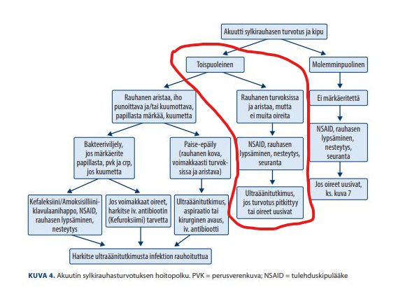
  

## Vierasesineistä 

- a. Ruokatorven vierasesine poistetaan aina jäykällä skoopilla 
- b. Ruokatorven perforaatio voi tuntua rintakipuna ja/tai kipuna kaulalla tai selässä
- c. jotain
- d. jotain 

  <button class="solution-button" data-label="Vastaus" data-hide-label="Piilota vastaus">
    Vastaus
  </button>
  

      b

a: Syvällä olevat haetaan taipuvilla skoopeilla. 
  

## Mitä teet seuraavaksi, jos potilas menee hengittämättömäksi äkillisesti ruokailun yhteydessä ja epäilynä on ruokakappale hengitysteissä? 

- a. Annat suusta suuhun hengitystä 
- b. Aloitat paineluelvytyksen
- c. Lyöt napakasti lapaluiden väliin 5 kertaa
- d. jotain

  <button class="solution-button" data-label="Vastaus" data-hide-label="Piilota vastaus">
    Vastaus
  </button>
  

      c

Ei mainintaa siitä, että potilas olisi tajuton -> vielä voidaan tajuissaan olevalle potilaalle yrittää läimäisyjä lapojen väliin ja tarvittaessa Heimlichin manööveriakin näiden jälkeen. 

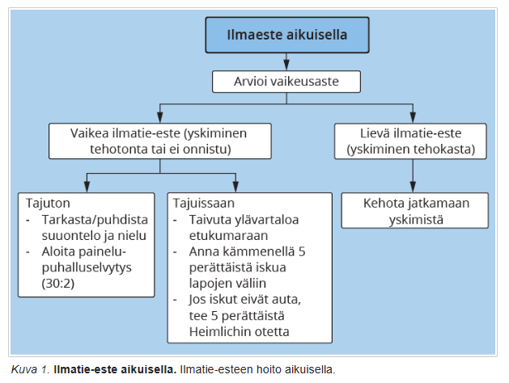
  

## 4-vuotias lapsi vastaa vain lyhyin lausein. Ääntäminen normaalia. Kehitys muuten normaalia. Mikä on todennäköisin syy 

- a. Kielen kehityksellinen häiriö
- b. Kireä kielijänne 
- c. Heikko varhainen vuorovaikutus kotona 
- d. Kuulovika

  <button class="solution-button" data-label="Vastaus" data-hide-label="Piilota vastaus">
    Vastaus
  </button>
  

      a

4-vuotiaan tulisi käyttää jo selvästi monisanaisia lauseita. Lapsi vastaa vain lyhyin lausein → viittaa ekspressiivisen kielen viiveeseen. Ääntäminen on normaalia → ei viittaa rakenteelliseen ongelmaan. Muu kehitys on normaalia → ei viittaa laaja-alaiseen kehityshäiriöön

b: Vaikuttaa lähinnä artikulaatioon (ääntämiseen), ei lausepituuteen tai kielen rakenteeseen

c: Voi vaikuttaa kielen kehitykseen, mutta yksinään ei yleensä aiheuta selkeää rakenteellista kielihäiriötä, jos muu kehitys on normaalia

d: Usein vaikuttaa myös ääntämiseen ja kielen ymmärtämiseen. 

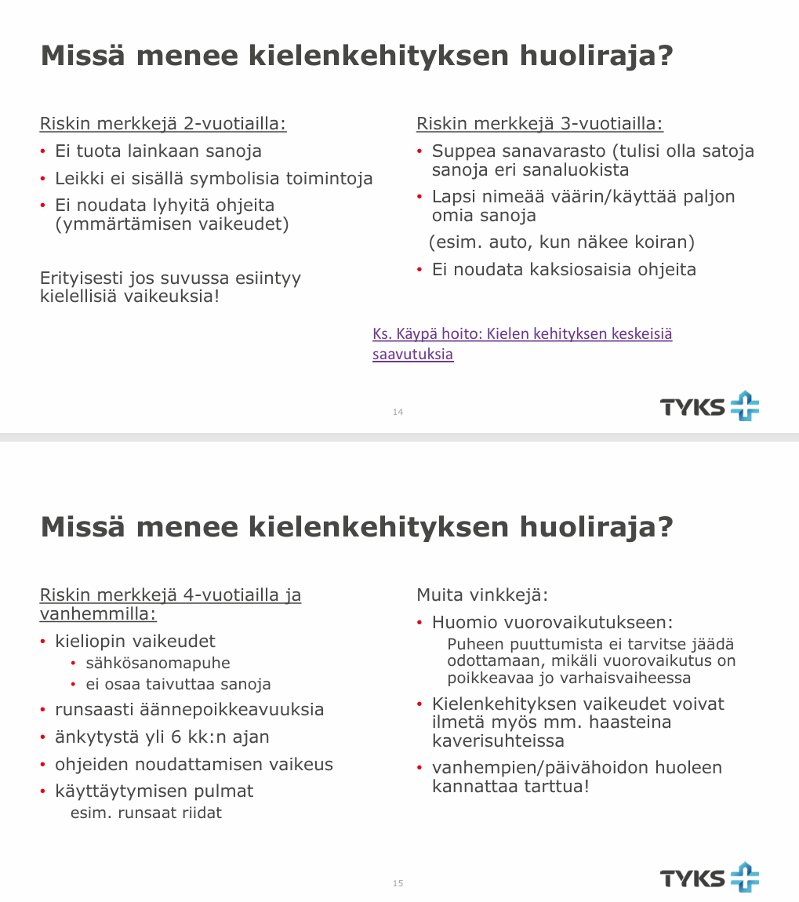
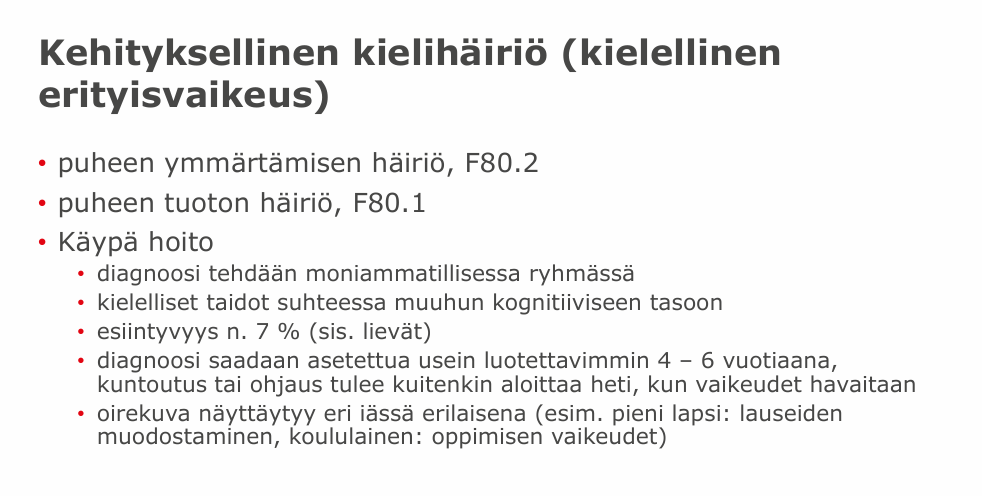
  

## Toteat 5-vuotiaalla lapsella perifeerisen kasvohermohalvauksen. Mitä teet seuraavaksi? 

- a. Päivystyksellisesti ESH
- b. Mittaat borreliavasta-aineet ja aloitat keftriaksonin 
- c. Prednisolon 60mg× 1/vrk 5 vrk:n ajan, minkä jälkeen annosta pienennetään 10 mg/vrk; hoidon kesto yhteensä 10 vrk
- d. Valasikloviiri 1 g × 3/vrk 7 vrk:n ajan

  <button class="solution-button" data-label="Vastaus" data-hide-label="Piilota vastaus">
    Vastaus
  </button>
  

      a

Kasvohermohalvauspotilasta voi aluksi tutkia ja hoitaa PTH, jos tilanne sopii Bellin pareesiin ja kyseessä on aikuinen. Lapsipotilaat lähetetään aina päivystykselliseen konsultaatioon KNK- ja/tai lastenlääkärille. 

b: Borrelialabrat kyllä otetaan käytännössä kaikilta nykyään; lapsilta vielä laajemmin. Kaikilta otetaan borreliavasta-aineet (S-Borr-Ab), lapsilta (<16 v.) tutkitaan lisäksi aina likvorin borrelia-PCR ja vasta-aineet (Li-BorrAb), Li-CXCL13. 

c: On Bellin pareesin ensisijainen hoito. Lasten kasvohermohalvauksissa Bellin pareesin osuus on vähäisempi kuin aikuisilla, jonka takia lasten kanssa tulee olla tarkempi. Lapsilla otetaan tämän takia käytännössä aina MRI, jota ei rutiininomaisesti tarvita aikuisten Bellin pareesin diagnosoimiseen. 

d: Käytetään Ramsay Huntin syndroomassa (herpes zoster oticus)
  

## Ihokasvaimen koon ja sijainnin kuvaus suhteessa ympäröiviin rakenteisiin ovat lähetetiedoissa tärkeitä, jotta lähetteen vastaanottava taho

- a. voi ohjata lähetteen tarvittaessa toiselle erikoisalalle
- b. pystyy määrittämään kasvaimen kasvunopeuden, kun potilas saapuu poliklinikalle
- c. pystyy määrittämään tarvittavan toimenpideajan, etenkin mikäli PAD-vastaus on tiedossa
- d. pystyy huomioimaan kiireellisyyden "suuret ovat kiireellisempiä kuin pienet" -periaatteen mukaisesti

  <button class="solution-button" data-label="Vastaus" data-hide-label="Piilota vastaus">
    Vastaus
  </button>
  

      c

Kasvaimen koko ja tarkka sijainti vaikuttavat suoraan siihen, kuinka vaativa leikkaus on kyseessä. Jos histologinen diagnoosi (PAD) on jo tiedossa, vastaanottava yksikkö pystyy arvioimaan vaadittavat marginaalit ja sen, tarvitaanko sulkuun esimerkiksi kielekesiirtoa tai ihonsiirrettä. Tämän perusteella toimenpiteelle voidaan varata optimaalinen aika.  

a: Erikoisala (kuten plastiikkakirurgia, ihotaudit tai korva-, nenä- ja kurkkutaudit) valitaan ensisijaisesti kasvaimen laadun, anatomisen alueen ja paikallisten hoitoketjujen perusteella, ei pelkän koon ja suhteellisten rakenteiden kuvauksen perusteella

b: Kyllä periaatteessa auttaa seuraamaan, kuinka nopeasti tuumori on voinut edetä, mutta ei ole tärkein syy. 

d: Kiireellisyys ei määräydy suoraviivaisesti periaatteella "suuret ovat kiireellisempiä". Esimerkiksi pieni, nopeasti kasvava melanooma, on huomattavasti vaarallisempi kuin kookkaampi, hitaasti kasvanut basaliooma.
  

## Pään ja kaulan alueen kasvaimen leikkaus- ja tai sädehoidon lisäksi potilaan hoitoon ja kuntoutukseen osallistuvat

- a. syöpähoitaja, korvalääkäri ja fysioterapeutti
- b. puheterapeutti, korvalääkäri ja onkologi
- c. syöpähoitaja, ravitsemusterapeutti, fysioterapeutti, puheterapeutti, korvalääkäri ja onkologi
- d. ravitsemusterapeutti, puheterapeutti, korvalääkäri ja onkologi

  <button class="solution-button" data-label="Vastaus" data-hide-label="Piilota vastaus">
    Vastaus
  </button>
  

      c

Pään ja kaulan alueen syöpien hoito ja kuntoutus vaativat aina moniammatillista tiimiä, koska tuumori ja sen hoidot (leikkaus, sädehoito, solunsalpaajat) vaikuttavat kriittisiin elintoimintoihin, kuten syömiseen, nielemiseen, puhumiseen ja liikkumiseen.
  

## Mitkä ovat syitä minkä takia kannattaisi suosia nielupaiseen hoidossa avausta paikallispuudutuksessa ja välttää kuuman vaiheen tonsillektomiaa?

- a. Nielurisaleikkaukseen verrattuna paikallispuudutuksessa tehdyn avauksen etuja ovat nopea kivun lievittyminen, yleisanestesiariskin välttäminen ja lyhyt sairausloma
- b. Nielurisaleikkaukseen verrattuna paikallispuudutuksessa tehdyn avaukseen liittyy pienempi paiseen uusimisen riski
- c. Nielurisaleikkaukseen verrattuna paikallispuudutuksessa tehty avaus soveltuu paremmin lapsille tai muutoin huonosti ko operoiville potilaille
- d. Jos potilaalla on krooninen tonsilliitti, saattaa nielurisaleikkaus pahentaa sen oireita

  <button class="solution-button" data-label="Vastaus" data-hide-label="Piilota vastaus">
    Vastaus
  </button>
  

      a

Varsinkin aikuisten ensimmäinen nielupaise hoidetaan useimmiten paikallispuudutuksessa tehtävässä avauksessa ja tyhjennyksessä. Se helpottaa nopeasti potilaan nielemis- ja kurkkukipua. Koska toimenpide tehdään polikliinisesti paikallispuudutuksessa, vältytään nukutuksen riskeiltä ja sairausloman tarve on huomattavasti lyhyempi (yleensä vain muutama päivä) kuin nielurisaleikkauksen jälkeen (jolloin sairausloma on tyypillisesti noin 2 viikkoa).

b: Tonsillektomia poistaa risakudoksen ja sen myötä paiseen uusiutumisriski pienenee merkittävästi. Paikallispuudutuksessa tehtyyn avaukseen liittyy siten suurempi paiseen uusiutumisen riski. 

c: Lapsille tai huonosti ko-operoiville potilaille paikallispuudutuksessa tehtävä avaus voi olla vaikea → yleisanestesia voi olla parempi ja varsinkin juuri lapsilla tonsillektomiaa harkitaan usein heti. 

d: Krooninen tonsilliitti on nimenomaan aihe nielurisaleikkaukselle, ja leikkaus parantaa tai poistaa tämän oireet, ei pahenna niitä.
  

## Mikä mekanismi selittää parhaiten Menièren taudin oireet?

- a. Endolymfan vähentynyt tuotanto
- b. Tasapainohermon tulehdus
- c. Endolymfaattisen tilan liiallinen paine
- d. Otoliittikiteiden siirtyminen kaarikäytävään 

  <button class="solution-button" data-label="Vastaus" data-hide-label="Piilota vastaus">
    Vastaus
  </button>
  

      c

Menieren taudin ajatellaan johtuvat endolymfan heikosta resorptiosta. Tämä johtaa lisääntyneeseen endolymfavolyymiin ja siten paineesen -> endolymfaattisen järjestelmän distensio -> vaurio vestibulaarisiin ja kokleaarisiin sisäkorvan osiin (Ménièren tauti = idiopaattinen endolymfaattinen hydrops).

Ménièren taudin tyypilliseen taudinkuvaan kuuluu kuulo- että tasapainoelinperäiset oireet kohtaustyyppisesti. Tyypillisimmät oireet ovat huimaus (Voimakas kiertohuimaus), humina, huonokuuloisuus matalilla äänillä (sensorineuraalinen) ja huonovointisuus. Tärkeimmät oireet voi siis muistaa ns. 4H:n triadina: Huimaus, Humina, Huonokuuloisuus, Huono vointi. Lisäksi voi olla korvan täyteyden tai kivun tunnetta. Yleensä oireet ilmenevät vain toisessa korvassa.

a: Kyseessä on nimenomaan endolymfan liikakertymä, ei vähentynyt tuotanto

b: Tämä olisi vestibulaarineuriitti

d: Tämä olisi hyvänlaatuinen asentohuimaus (HAH, BPPV)

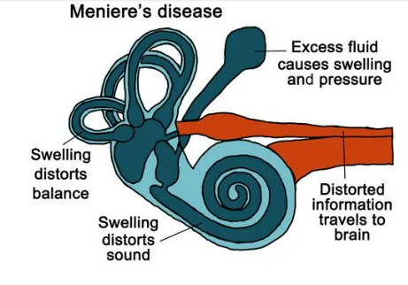

  

## Pään ja kaulan alueen kasvain voi joskus olla piiloutunut ja ensioireena onkin metastaasi kaulalla. Mikäli ohutneulanäytteen tulos vahvistaa metastaasiepäilyn ja KNK-statuksessa ei tule esiin primaarikasvainta, miten potilaan jatkotutkimukset organisoidaan?

- a. Kiireellinen lähete erikoissairaanhoitoon
- b. Kiireetön lähete erikoissairaanhoitoon
- c. Päivystyslähete erikoissairaanhoitoon
- d. Jatkotutkimuksena kaulan ultraääni avoterveydenhuollossa, sitten lähete erikoissairaanhoitoon

  <button class="solution-button" data-label="Vastaus" data-hide-label="Piilota vastaus">
    Vastaus
  </button>
  

      a

Pään ja kaulan alueen tuntemattoman primaarituumorin etsintä (CUP-oireyhtymä, Carcinoma of Unknown Primary) vaatii nopeita ja laajoja tutkimuksia, jotka voidaan tehdä vain erikoissairaanhoidossa. Jos KNK-statuksessa ei tule esiin primaarikasvainta, niin tarvitaan PET osoittamaan sen lokaatio. Lähete tehdään kiireellisenä. 

b: Pään ja kaulan alueen syövät ovat kyllä kiirellisiä asioita 

c: Ei ole päivystyksellistä tarvetta tyypillisesti

d: UÄ ei riitä kattavaksi primaarituumorin etsintäkeinoksi eikä tuo lisätietoa metastaasistakaan, kun metastaasista on jo näyte. 
  

## Pään ja kaulan alueella pahanlaatuinen muutos etenee joskus salakavalasti ja ensioireena onkin

- a. gustatorinen riniitti
- b. kielen kirvely
- c. aivohermon halvaus
- d. laaja-alainen aktiinikeratoosi

  <button class="solution-button" data-label="Vastaus" data-hide-label="Piilota vastaus">
    Vastaus
  </button>
  

      c

Perineuraalinen kasvu tai suora hermon puristus voi vaurioittaa aivohermoja. Esimerkiksi korvasylkirauhasen syövän ensioireena voi olla kasvohermohalvaus (VII aivohermo).

a: Gustatorinen riniitti tarkoittaa "makunuhaa" eli sitä, että nenä alkaa vuotaa vetistä eritettä ruokailun (erityisesti kuuman tai mausteisen ruoan) yhteydessä. Se on täysin hyvänlaatuinen, autonomisen hermoston heijasteeseen liittyvä vaiva.

b: Kielen kirvely on tyypillisesti hyvänlaatuinen oire, joka liittyy usein limakalvojen kuivuuteen, vitamiininpuutoksiin, raudanpuutteeseen, kandidiaasiin yms. Pahanlaatuinen kielikasvain aiheuttaa tyypillisesti kiinteän, parantumattoman haavauman tai kyhmyn ja paikallista kipua, ei niinkään epämääräistä laajaa kirvelyä. 

d: Aktiinikeratoosi (aurinkokeratoosi, seniili keratoosi) on ihon esiastemuutos, joka kuvastaa dysplasiaa kroonisen UV-säteilyaltistuksen takia.
  

## Ihon aktiinikeratoosi eli aurinkokeratoosi on levyepiteelikarsinooman esiaste eli premaligni ihomuutos. Suositeltavimpia aktiinikeratoosin hoitomenetelmiä ovat

- a. leikkaus, jäädytys/kryo, fotodynaaminen terapia (PDT), sädehoito
- b. leikkaus ja sädehoito
- c. jäädytys/kryo, fotodynaaminen terapia (PDT), sädehoito, laser
- d. jäädytys/kryo, fotodynaaminen terapia (PDT)

  <button class="solution-button" data-label="Vastaus" data-hide-label="Piilota vastaus">
    Vastaus
  </button>
  

      d

Aktiinikeratoosi on epidermiksen levyepiteelikarsinooman esiaste, joka kuvastaa dysplasiaa kroonisen UV-säteilyaltistuksen takia ja on usein pinnallinen ja laaja-alainen. Hoitomenetelmiksi valitaan herkästi ei-invasiivisia, kudosta säästäviä ja pinnallisia menetelmiä. 

Pienikokoisten ja yksittäisten aktiinisten keratoosien ensisijainen hoito on ihon jäädytyshoito (kryohoito ihotaudeilla). Laaja-alaisten ja kookkaiden tai kosmeettisesti näkyvillä alueilla sijaitsevien aktiinisten keratoosien hoidoksi suositellaan ensisijaisesti fotodynaamista (PDT) eli valoaktivaatiohoitoa tai voidehoitoa. 

Etenkin vartalon ja raajojen alueen pienikokoisten muutoksien hoidossa voidaan käyttää myös elektrodessikaatio- eli sähkökuorintahoitoa tai hiilidioksidilaserhoitoa.

a ja b: Kirurgista leikkausta ei suosita aktiinikeratoosien ensisijaisena hoitona, koska muutokset ovat pinnallisia ja niitä on usein paljon. Sädehoito puolestaan sisältää liikaa riskejä hyvänlaatuisten esiasteiden hoitoa ajatellen. 

c: Laserhoitoa voidaan joissain tapauksissa käyttää, mutta tämä vaihtoehto kaatuu siihen, että esiasteen hoitoon ehdotetaan sädehoitoa

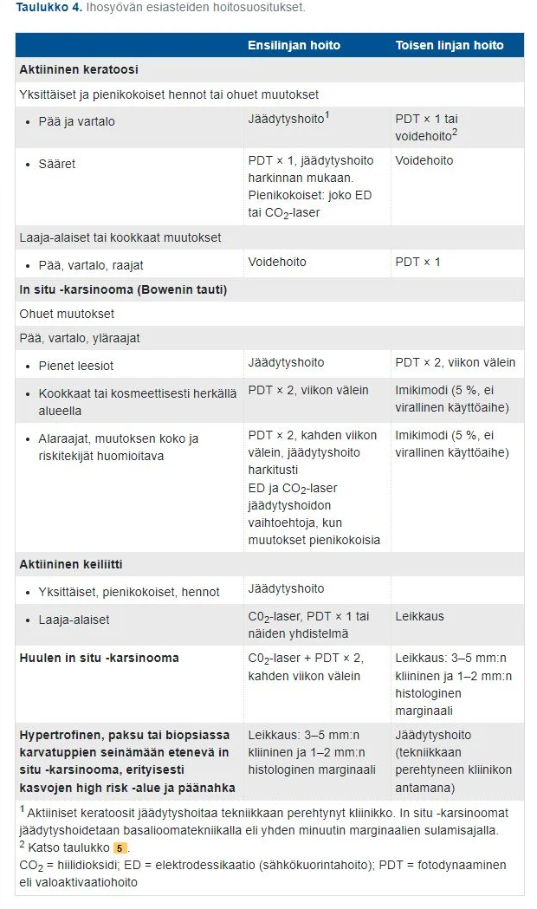
  

## 6-vuotiaalla flunssaoireilua ja silmien alueen turvotusta

6-vuotiaalla pojalla on ollut reilun viikon flunssaoireilua. Nenä on tukossa ja vuotaa paksua räkää. Eilisestä illasta lähtien potilaalla on esiintynyt lisääntyvää kipua vasemman silmän seudussa, ja yläluomeen on kehittynyt reilu turvotus ja punoitus. Toteat turvotusta myös silmien välissä. Kuumetta on 38,5 astetta. Silmä liikkuvat kaikkiin suuntiin ja mustuaiset reagoivat valolle symmetrisesti. Visukset vaikuttavat normaaleilta. Miten toimit?

- a. Aloitan kloramfenikoli-antibioottisilmätipat vasempaan silmään viikoksi
- b. Aloitan amoksisilliini-antibiootin p.o. viikoksi voimakasoireisen rinosinuiitin hoitoon
- c. Määrään setiritsiiniä p.o. ja natriumkromoklikaattisilmätipat vasempaan silmään
- d. Lähetän potilaan päivystyslähetteellä sairaalaan korva-, nenä- ja kurkkutaudeille iv-antibioottihoitoa, seurantaa ja mahdollista kuvantamista varten

  <button class="solution-button" data-label="Vastaus" data-hide-label="Piilota vastaus">
    Vastaus
  </button>
  

      d

Silmämunan vieruskudosten tulehdukset jaetaan preseptaalisiin eli silmäluomilla septumin edessä oleviin ja septumin takana eli silmäkuopassa oleviin orbitan selluliitteihin. Preseptaaliselluliitti on silmäluomeen rajoittuva tulehdus. Luomi ja silmän ympärysiho on punoittava, kuumoittava ja turvonnut, ja siinä voi olla märkäkertymää tai ihonekroosia. Silmien liikkuminen kaikkiin suuntiin, normaalit pupillireaktiot ja näkökyky viittaavat siihen, ettei infektio ole levinnyt orbitaalisektiolle. Syynä on useimmiten luomihaavasta lähtenyt tulehdus vamman tai luomikirurgian jälkeen, mutta voi olla lähtöisin myös sinuiitista, tulehtuneesta luomirakkulasta tai kyynelpussista. Potilaalla voi olla lievää lämpöä. Tulehdusarvot (CRP, B-Leuk) ovat lievästi tai kohtalaisesti koholla

Hoitona systeeminen mikrobilääkehoito useimmiten p.o. aikuisille ja yli 5-vuotiaille lapsille 7 vrk:n ajan. Jos taustalla olisi sinuiitti, niin ensisijainen antibiootti olisi amoksisilliini-klavulaanihappo. Varsinkin alle 5-vuotiaat lapset ja MRSA-kantajat kuuluvat erikoissairaanhoidon arvioon päivystyksellisesti. 

Preseptaaliselluliitti on erotettava orbitaselluliitista. Orbitaselluliitti on silmäkuoppaan ulottuva märkäinen tulehdus. Tulehdus voi levitä silmäkuoppaan ympäröivistä kudoksista, useimmiten nenän sivuonteloista, harvemmin hampaista tai luomitulehduksesta. Oireena turvotus ja punoitus silmäluomien alueella kuten preseptaaliselluliitissa, mutta mukana on aina myös silmälöydöksiä. Näkö on usein alentunut, silmä työntyy eteenpäin (proptoosi), silmäkuoppa on pinkeä, ja silmänpaine voi nousta. Silmässä voi näkyä relatiivinen afferentti mustuaisdefekti. Silmän liikkeet aristavat ja ovat rajoittuneet, ja potilas näkee kaksoiskuvia. Potilas on usein kuumeinen, ja tulehdusarvot ovat aina selvästi suurentuneet. Kyseessä on näköä, joskus jopa henkeä uhkaava tilanne, joka vaatii päivystyksellistä hoitoa erikoissairaanhoidossa. Tulehdus voi olla hengenvaarallinen, mikäli se leviää silmäkuopan kärjen kautta aivojen kovakalvon lokeroveriviemäriin (sinus cavernosukseen) aiheuttaen siellä tromboosin.

Orbitaselluliitin epäily on aihe päivystyslähetteeseen sairaalaan, jossa silmä-, korva- ja lastenlääkärin konsultaatiot sekä kuvantamistutkimukset (TT tai MK) ovat välittömästi saatavilla. Perusterveydenhuollosta aikuispotilaat lähetetään ensisijaisesti korvalääkärille ja lapsipotilaat lastenlääkärille. Tarvittaessa konsultoidaan silmä- ja infektiolääkäreitä. Hoitona on laajakirjoinen laskimonsisäinen mikrobilääke osastolla. Märkäpesäkkeet avataan herkästi kirurgisesti

Koska potilas on nuori ja turvotus sekä kuume on merkittävää, niin voisi olla järkevää lähettää potilas päivystykselliseen arvioon (tai vähintään konsultoida KNK-lääkäriä). 

a: Kyseessä ei ole konjunktiviitti, vaan syvempi kudostulehdus, johon paikalliset silmätipat eivät tehoa lainkaan. 

b: Tilanne ei ole "voimakasoireinen rinosinuiitti" vaan preseptaaliselluliitti (mahdollisesti jopa orbitaselluliittiin etenevä).

c: Allergialääkitys ei sovellu tähän vakavaan infektiotilanteeseen.

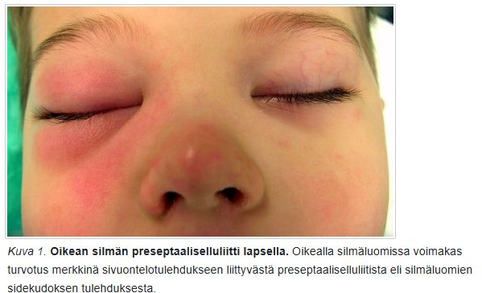
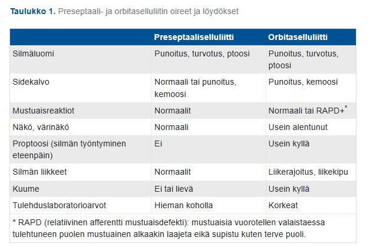
  

## Mikä seuraavista oireista ei ole tyypillinen äkillisessä kartiolisäkkeen tulehduksessa?

- a. Kaulan imusolmukkeet ovat kipeät ja suurentuneet
- b. Korvan takaa iho on punoittava ja aristava
- c. Korvakäytävä on turvonnut umpeen
- d. Tärykalvo on puhjennut ja vuotaa märkää 

  <button class="solution-button" data-label="Vastaus" data-hide-label="Piilota vastaus">
    Vastaus
  </button>
  

      c

Korvakäytävän umpeen turpoaminen on tyypillinen oire otitis externassa, jossa korvakäytävän iho tulehtuu ja turpoaa (joskus niin rajusti, ettei tärykalvoa edes näe). Mastoidiitissa itse korvakäytävä on yleensä avoin, koska kyseessä on yleensä välikorvatulehduksen komplikaatio, eikä korvakäytävä ole affisioitunut.

a: Tyypillistä; korvan takaiset ja kaulan yläosan imusolmukkeet reagoivat suurentumalla ja aristamalla 

b: Klassinen oirekuva, vahvin epäily mastoidiitista 

d: Mastoidiittipotilailla tärykalvo on usein suuren paineen vuoksi puhjennut spontaanisti (tai se on jouduttu puhkaisemaan), ja korvasta vuotaa jatkuvasti ja runsaasti märkää -> sopii sinänsä mastoiidin kuvaan ja kannattaisi epäillä mastoidiittia.

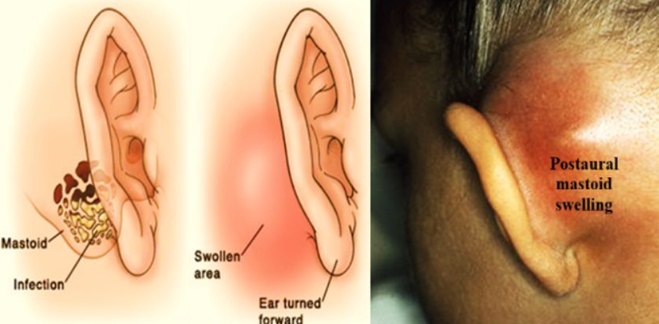
  

## Päivystykseen tulee aikuinen potilas, joka on kaatunut liukkaalla jäällä. Oikea yläetuhammas on poikki ja teet lähetteen hammaslääkärille. Mikä on hampaan numero?

- a. 11
- b. 41
- c. 32
- d. 12

  <button class="solution-button" data-label="Vastaus" data-hide-label="Piilota vastaus">
    Vastaus
  </button>
  

      a

Kansainvälisen käytännön mukaisesti hampaat tunnistetaan numeroparilla. Numeroparin ensimmäinen numero kuvaa sitä leukaneljännestä, jossa hammas sijaitsee (pysyvässä hampaistossa neljännekset 1–4 ja maitohampaistossa 5–8). Toinen numero kuvaa hampaan järjestysnumeroa keskiviivasta taaksepäin.

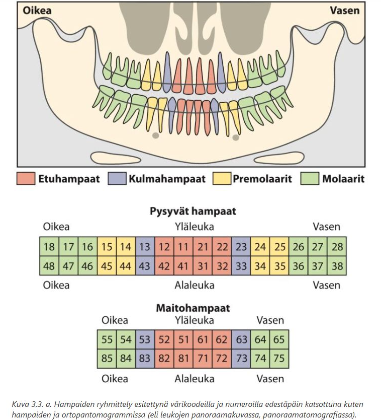

  

## Mikä löydös on tyypillisin hyvänlaatuiselle asentohuimaukselle (BPPV)?

- a. Kuulon heikkeneminen ja tinnitus vasemmassa korvassa
- b. Pitkäkestoinen spontaani nystagmus levossa
- c. Tasapainon jatkuva heikkeneminen ilman nystagmusta
- d. Toistuvat, lyhyet huimauskohtaukset pään asennon muutoksessa

  <button class="solution-button" data-label="Vastaus" data-hide-label="Piilota vastaus">
    Vastaus
  </button>
  

      d

HAH:n klassinen piirre on n. alle 1-2min kestävät vertigokohtaukset, varsinkin tietyissä pään asennoissa / asennon muutoksissa, kuten sängyssä kylkeä kääntäessä. 

a: HAH ei liity kuulo-oireita. Kuulon heikkeneminen ja tinnitus viittaavat huimauspotilaalla esimerkiksi Menièren tautiin.

b: Pitkäkestoinen, jatkuva spontaaninystagmus (silmävärve) levossa viittaa akuuttiin vestibulaarioireyhtymään (AVS) eli erityisesti vestibulaarineuriittiin tai keskushermostoperäiseen syyhyn. 

c: Jatkuva tasapainon heikkeneminen ilman silmävärvettä viittaa moneen syyhyn, kuten esim. ikääntymiseen liittyvään tasapainotajun heikentymään, polyneuropatiaan, pikkuaivojen toimintahäiriöön yms. 

  

## Mikä löydös on tyypillinen Menieren taudin yhteydessä?

- a. Äkillinen, lyhytkestoinen huimauskohtaus ilman kuulon muutosta.
- b. Krooninen tasapainovaikeus ilman korvaoireita.
- c. Toistuvat huimauskohtaukset, joihin liittyy kuulonvaihtelua ja korvan paineentunne.
- d. Jatkuva lievä huimaus ilman nystagmusta.

  <button class="solution-button" data-label="Vastaus" data-hide-label="Piilota vastaus">
    Vastaus
  </button>
  

      c

Ménièren taudin tyypilliseen taudinkuvaan kuuluu kuulo- että tasapainoelinperäiset oireet kohtaustyyppisesti. Tyypillisimmät oireet ovat huimaus (Voimakas kiertohuimaus), humina, huonokuuloisuus matalilla äänillä (sensorineuraalinen) ja huonovointisuus. Tärkeimmät oireet voi siis muistaa ns. 4H:n triadina: Huimaus, Humina, Huonokuuloisuus, Huono vointi. Lisäksi voi olla korvan täyteyden tai kivun tunnetta. Yleensä oireet ilmenevät vain toisessa korvassa. 

Menieren kohtaukset ovat tyypillisesti itsestäänrajoittuvia; kohtaukset kestävät tyypillisesti 20 min–12 t. Löydökset usein esiin vain kohtauksen aikana, välillä status voi olla normaali. Taudin pitkittyessä ilmenee pysyviä vaurioita, kuten pysyvä kuulonalenema. 

a: Äkillinen ja lyhytkestoinen huimaus ilman kuulomuutoksia viittaa hyvänlaatuiseen asentohuimaukseen (BPPV)

b ja d: Menièren tauti on luonteeltaan kohtauksellinen sairaus
  

## Anamnestisesti runsaasta ja/tai toistuvasta nenäverenvuodosta kärsivän potilaan hyvän hoidon toteuttamiseksi minua kiinnostavat

- a. veren hyytymisnopeutta kuvaavien kokeiden tulokset
- b. kaikki muut vaihtoehdot
- c. verenpainelukemat
- d. verenkuva

  <button class="solution-button" data-label="Vastaus" data-hide-label="Piilota vastaus">
    Vastaus
  </button>
  

      b

a: Esim. INR ja APTT voivat olla järkevää tarkistaa, jos vuodot ovat merkittäviä ja on epäily hyytymisongelmista (ja tietysti INR jos potilas käyttää varfariinia).

c: Verenpaine (korkea verenpaine altistaa ja pitkittää vuotoja; paineet voivat taas olla matalat runsaassa vuodossa volyymimenetyksen takia). 

d: Toistuvat tai runsaat vuodot voivat johtaa anemiaan. Lisäksi verenkuvasta nähdään trombosyytit ja trombosytopeni voikin olla suora syy vuotoherkkyydelle

  

## 6-vuotias Verneri on isän kanssa vastaanotollasi kuorsauksen vuoksi. Hengityskatkoksia ei ole havaittu. Verneri on allerginen siitepölyille ja monille eläimille. Vastaanotolla Verneri hengittää suun kautta ja toteat hänellä keskikokoiset nielurisat. Miten etenet?

- a. Määrään Vernerille akrivastiini-pseudoefedriini-kuurin
- b. Lähetän Vernerin siedätyshoitoon
- c. Lähetän Vernerin adenotonsillektomiaan
- d. Aloitan Vernerille nenäkortisonisuihkeen ja sovin puhelinkontaktin parin kuukauden päähän

  <button class="solution-button" data-label="Vastaus" data-hide-label="Piilota vastaus">
    Vastaus
  </button>
  

      d

Jos lapsella todetaan kookkaiden risojen aiheuttamia pitkäkestoisia oireita, voidaan harkita nielu- ja kitarisaleikkausta. Lähettämiskriteerinä: lapsella on todettu suurentuneet nielurisat ja/tai kitarisa (todettu tai epäily) ja lapsella on risoista johtuvia, haittaavia oireita pitkäkestoisesti (useiden kuukausien ajan). Tavanomaisia oireita lapsilla ovat jatkuva kuorsaus, unenaikaiset hengityskatkokset, jatkuva nenän tukkoisuus, suuhengitys ja nielemisvaikeudet.

Jos oireet ovat lievät tai oireena pelkästään nenän tukkoisuus, on hyvä tehdä ensin hoitokokeilu nenään suihkutettavalla glukokortikoidilla ja/tai montelukastilla (esim. 1-3 kk). Varsinkin kun potilaallamme on allergioita, niin säännöllinen nenäkortisonisuihke voi auttaa merkittävästi ja hoitoa tulisi kokeilla ennen kirurgisen hoidon harkitsemista. 

a: Pseudoefedriiniä ei suositella käytettäväksi lainkaan alle 12-vuotiailla eikä se muutenkaan sovellu pitkäaikaisen kuorsauksen hoitoon. 

b: Siedätyshoito on pitkä prosessi, jota voidaan harkita vaikean allergisen nuhan hoidossa, mutta se ei ole ensisijainen tai välitön ratkaisu lapsen anatomiseen kuorsaus- ja suuhengitysongelmaan

c: Kyseessä on sosiaalinen kuorsaus ilman uniapneaa (ei hengityskatkoksia), nielurisat ovat vain keskikokoiset, ja konservatiivista hoitoa (nenäkortisonia) ei ole vielä kokeiltu.
  

## Ensioireita, jotka herättävät epäilyn kasvojen ihoalueiden pahanlaatuisesta muutoksesta ovat

- a. ihon pieni tumma luomi ja kaulan imusolmukkeiden turvotus
- b. ihomuutoksen kukkakaalimaisuus, verestys ja punoitus
- c. ihon punoitus, kutina ja rupeutuminen
- d. ihoalueen kipu, kuumotus ja turvotus

  <button class="solution-button" data-label="Vastaus" data-hide-label="Piilota vastaus">
    Vastaus
  </button>
  

      b

Kukkakaalimaisuus (eksofyyttinen eli ulospäin suuntautuva kyhmyinen kasvu), verestys (haavautuminen ja vähäinenkin verenvuoto esimerkiksi pesun tai pyyhkimisen yhteydessä) sekä ympäröivä punoitus ovat klassisia pahanlaatuisuuteen viittaavia hälytysmerkkejä. 

a: Pieni tumma luomi voi sinänsä olla tuumori, mutta melanooman ABCDE-sääntöä (kts. alla) seuraamalla sellainen ei yleensä herätä epäilyä. 

c: Ihon punoitus, kutina ja rupeutuminen viittaavat tyypillisesti hyvänlaatuisiin ihosairauksiin, kuten ekseemaan tai atooppiseen ihoon 

d: Kipu, kuumotus ja turvotus ovat akuutin bakteeri-infektion (kuten ruusun) klassisia merkkejä, eivät ihosyövän ensioireita

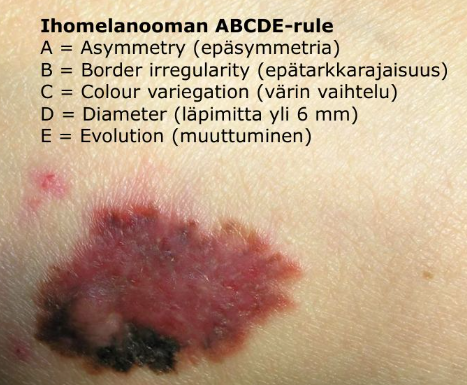
  

## Tk-vastaanotollesi tulee 6-vuotias poika, jolle kasvoi viikkoa aiemmin olleen ylähengitystietulehduksen yhteydessä kaulalle keskiviivaan punoittava patti. Toteat 3 cm resistenssin kieliluun ja kilpiruston välissä keskiviivassa, punoittava ja jkv aristava. Mitä teet?

- a. Lähete erikoissairaanhoitoon (epäilet mediaalista kaulakystaa)
- b. 7 vrk empiirinen antibioottihoito ja lähete erikoissairaanhoitoon
- c. oireenmukainen hoito kuten akuutissa ylähengitystieinfektiossa
- d. Lähete kaulan ultraääni + ohutneulanäyte

  <button class="solution-button" data-label="Vastaus" data-hide-label="Piilota vastaus">
    Vastaus
  </button>
  

      b

Kuvaus sopii hyvin infektoituneeseen thyreoglossaalikanavakystaan (mediaalinen kaulakysta). Mediaaliset kaulakystat ovat usein oireettomia ja huomaamattomia, kunnes ne flunssan (ylähengitystietulehduksen) yhteydessä infektoituvat saaden bakteeritartunnan. Koska patti on nyt punoittava ja aristava, kyseessä on akuutisti tulehtunut kysta. Tilanne vaatii heti empiirisen antibioottihoidon, jotta tulehdus saadaan rauhoittumaan ja estetään abskessin (märkäpesäkkeen) muodostuminen. Samalla potilaasta tehdään lähete KNK:lle, sillä mediaaliset kaulakystat uusiutuvat herkästi ja ne hoidetaan myöhemmin rauhallisessa vaiheessa kirurgisesti.

a: Pelkkä lähete ilman hoidon aloitusta voisi johtaa tilanteen komplisoitumiseen (esim. absekssin muodostuminen).

c: Kyseessä ei ole enää pelkkä tavallinen flunssan jälkitauti tai reaktiivinen imusolmuke (jotka sijaitsevat tyypillisesti kaulan sivuilla, eivät keskiviivassa kieliluun kohdalla), joten pelkkä oireenmukainen seuranta on vaarallista

d: Kaulan ultraääni ja ohutneulanäyte (ONB) kuuluvat kystan diagnostiikkaan, mutta akuutissa tulehdusvaiheessa neulan pistäminen kystaan voi levittää infektiota entisestään. Lisäksi lapsipotilaan diagnostiikka ja jatkohoito on turvallisinta keskittää suoraan erikoissairaanhoitoon, jossa ultraääni voidaan tehdä hallitusti.
  

## Korvakäytäväntulehdukselle altistavia tekijöitä on mm. likaisen veden pääsy korvaan, kuuma ja kostea ilmanala (esim. etelänmatkat), atooppinen iho, psoriasis yms. ihosairaudet ja diabetes. Mitä seuraavista potilaan tulee erityisesti välttää tulehduksen uusimisen tai pitkittymisen ehkäisemiseksi:

- a. kuulokojeiden käyttämistä
- b. Etelänmatkoja
- c. korvan puhdistamista pumpulipuikoilla
- d. korvan kostuttavien suihkeiden käyttäminen

  <button class="solution-button" data-label="Vastaus" data-hide-label="Piilota vastaus">
    Vastaus
  </button>
  

      c

Pumpulipuikkojen tai muiden vierasesineiden pistäminen korvaan on yksi yleisimmistä korvakäytäväntulehduksen (otitis externa) uusiutumisen ja pitkittymisen syistä. 

a: Jos potilas käyttää kuulokojetta, niin ei sen käytöstä tyypillisesti tarvitse luopua pysyvästi, vaikka potilas saisikin jossain kohtaa korvakäytävätulehduksen. Kojeen käyttöä voi kuitenkin olla syytä tauottaa akuutin tulehduksen aikana, jotta korvakäytävä saa tuulettua ja paraneminen nopeutuu. 

b: Matkoja ei tarvitse välttää. Tärkeämpää on suojata korvat uimisen yhteydessä ja kuivata korvat huolellisesti (mutta varovasti ilman puikkoja) aina uinnin tai suihkun jälkeen.

d: Kostuttavia suihkeita ei tarvitse välttää tyypillisesti ja ne voivat jopa olla hyödyllisiä infektioiden uusiutumisen ehkäisyssä, sillä ne suojaavat kuivaa, atooppista tai psoriaattista ihoa. 
  

## Lapsella kuorsausta, hengityskatkoja ja väsymystä

Yleensä terve kahdeksanvuotias tulee vanhempansa kanssa ajanvarausvastaanotolle, koska lapsella on puolen vuoden ajan esiintynyt nukkuessa kuorsausta ja hengityskatkoja. Lisäksi koulussa on havaittu väsymystä ja kotona iltapäiväunien tarvetta. Nielurisat näyttävät suurehkoilta. Nenänieluun ei ollut näkyvyyttä. Lähetät lapsen KNK-lääkärin arvioon. Todennäköinen hoito on:

- a. Seuranta puoli vuotta
- b. Tonsillotomia ja tarvittaessa adenotomia
- c. Adenotomia
- d. Uvulopalatoplastia

  <button class="solution-button" data-label="Vastaus" data-hide-label="Piilota vastaus">
    Vastaus
  </button>
  

      b

Lasten unihäiriöt, mukaan lukien kuorsaus ja obstruktiivinen uniapnea, voivat johtaa päivällä ilmenevään väsymykseen sekä neurokognitiivisiin ja käyttäytymisen ongelmiin, kuten tarkkaavaisuushäiriöihin, oppimisvaikeuksiin, impulsiivisuuteen ja ylivilkkauteen. Eivät niinkään aina ilmene klassisena päiväaikaisena väsymyksenä kuten aikuisilla. 

Sosiaalisesti häiritsevän kuorsauksen hoito perustuu oireiden ja löydösten vakavuuteen, ei pelkästään sosiaaliseen haittaan tai infektioiden yhteydessä pahenemiseen. Jos lapsi kuorsaa  jatkuvasti ja äänekkäästi on kyseessä todennäköisesti suurentuneet risakudokset (todettu tai epäily) ja se voi olla aihe lähetteelle ESH. Jos oirekuva on lievä, voi hyvinkin jäädä seuraamaan tilannetta. 

Potilaalla kuitenkin on selkeästi vaikeammat oireet kuin sosiaalinen kuorsaus ja oireet ovat jatkuneet jo puoli vuotta ja aiheuttavat lapselle selvää haittaa (väsymys koulussa, iltapäiväunien tarve). Hoitamaton uniapnea voi häiritä lapsen kognitiivista kehitystä, kasvua ja oppimista, joten passiivinen seuranta ei tässä vaiheessa ole oikea ratkaisu.

Ensisijainen hoitomuoto lasten uniapneassa on kirurgia, mikäli taustalla on hengitysteitä ahtauttavan risakudoksen liikakasvu (kuten useimmiten onkin). 

Vastaanotolla on todettu suurehkot nielurisat, jotka ovat ilmeinen syy hengitysteiden ahtaudelle. Nykyisten hoitosuositusten mukaan lapsille tehdään ensisijaisesti nielurisojen osapoisto (tonsillotomia) kokopoiston (tonsillektomia) sijaan, kun leikkausaiheena on pelkkä risojen suuri koko ja mekaaninen ahtaus. Samalla tehdään adenotomia yleensä. 

a: Vaikeaoireisessa kuvassa ei enää jatketa seurantalinjalla. 

c: Pelkkä kitarisan poisto ei riittäisi poistamaan oireita, koska lapsella on jo todettu suunielua ahtauttavat, suurehkot nielurisat.

d: Suulakea ja kitakielekettä muovaava leikkaus, jota käytetään joskus harvemmin aikuisten uniapnean ja kuorsauksen hoidossa. Sitä ei tehdä lapsille, joiden oireiden syynä on hyvänlaatuinen risakudoksen liikakasvu.
  

## Äänihuulen polyyppi

- a. paranee usein ilman toimenpiteitä
- b. Voi johtua äänihuulen traumasta
- c. esiintyy useimmin allergikolla
- d. pitää poistaa dysplasian asteen arvioimiseksi 

  <button class="solution-button" data-label="Vastaus" data-hide-label="Piilota vastaus">
    Vastaus
  </button>
  

      b

Äänihuulen polyyppi ei liity allergiseen taipumukseen (kuten usein nenäpolyyppi), vaan se syntyy muilla mekanismeilla. Toispuolisen äänihuulipolyypin takana lienee useimmiten äkillinen mekaaninen trauma, esimerkiksi yskän aiheuttama verenpurkauma. Polyyppi aiheuttaa jatkuvan äänen karheuden ja vuotoisuuden, koska äänirako ei pääse sulkeutumaan normaalisti. 

a ja d: Käytännössä aina hoidetaan kirurgisella poistolla, mutta ei sen takia, että arvioitaisiin dysplasiaa. Polyyppi ei vain tyypillisesti hoidu ilman kirurgiaa. Vain aivan vähäinen tuore turvotus katoaa itsestään tai puheterapeutin ohjeita noudattamalla, isommat eivät sitkeälläkään harjoittelulla.

  

## Suunpohjan turvottelua vanhuksella

TK-vastaanotollesi tulee 81-vuotias nainen, jolla 3-4 vuoden aikana on esiintynyt suunpohjan turvottelua, myös kipua syödessä ko. alueella, toisinaan lämpöilyä ja tilanne rauhoittunut 7 vrk antibioottikuurilla väliaikaisesti. Kaulalta palpoiden toteat suun pohjassa ko. puolella vähän aristavan resistenssin ja myös kielen alla turvotusta. Submandibulaarirauhanen laskutiehyt auki, ei kiveä palpoiden. Mitä teet?

- a. noin kuukauden antibiootti: amoksisilliini-klavulaanihappo tai kefaleksiinikuuri
- b. lähete erikoissairaanhoitoon
- c. amoksisilliini-klavulaanihappo tai kefaleksiinikuuri ja tulehduskipulääke 1 kk
- d. 1 kk tulehduskipulääke

  <button class="solution-button" data-label="Vastaus" data-hide-label="Piilota vastaus">
    Vastaus
  </button>
  

      b

Vaiva on jatkunut jo 3–4 vuotta ja rauhoittunut antibiooteilla vain väliaikaisesti. Tilanteen selvittäminen vaatii kuvantamista ensisijainen tutkimus on usein sylkirauhasten ultraäänitutkimus (kaulan uä), ja tarvittaessa voidaan tehdä tietokonetomografia (TT) tai magneettikuvaus (MRI). Erityisesti iäkkäällä potilaalla pitkittynyt toispuoleinen resistenssi ja turvotus vaativat samalla myös kasvaimen (tuumorin) poissulkemista.

Jos kyseessä on syvällä oleva sylkikivi tai rauhaskudoksen pysyvä vaurioituminen (krooninen sialadeniitti), lopullinen hoito on kirurginen (esim. tiehyen laajennus, sialendoskopia eli sylkirauhasen tähystys tai submandibulaarirauhasen poisto).

a, c, d = Antibiootti- tai tulehduskipulääkekuuri ei poista mekaanista estettä (kuten sylkikiveä) tai mahdollista kasvainta
  

## Millä löydöksellä voidaan erottaa perifeerinen vestibulaarinen nystagmus sentraalisesta nystagmuksesta?

- a. Sentraalinen nystagmus on lähes aina horisontaalinen
- b. Perifeerinen nystagmus ei vaimene katseen fiksaatiolla
- c. Perifeerisessä nystagmuksessa suunta vaihtelee katseen suunnan mukaan
- d. Perifeerinen nystagmus vaimenee yleensä fiksaation aikana

  <button class="solution-button" data-label="Vastaus" data-hide-label="Piilota vastaus">
    Vastaus
  </button>
  

      d

Katseen kohdistaminen tyypillisesti vaimentaa erityisesti perifeeristä nystagmusta. Tästä syystä perifeerinen nystagmus tulee usein kunnolla näkyviin vasta silloin, kun fiksaatio estetään esimerkiksi Frenzelin laseilla tai esim. valkoisella paperilla näkökentän edessä.

a: Sentraalinen nystagmus voi olla hyvinkin monimuotoista ja erityisesti vertikaalinen nystagmus viittaa vahvasti sentraaliseen syyhyn. 

c: Bidirektionaalinen nystamgus eli suuntaansa ääriasennoissa vaihtava nystagmus on hälytysmerkki sentraalisen huimauksen suhteen. 

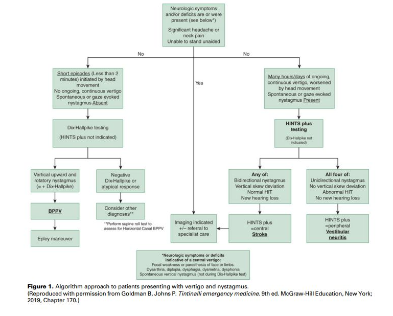
  

## Pahenevaa nenän tukkoisuutta

60-vuotiaalla naisella on ollut vuosia kroonista nenän tukkoisuutta ja hajuaistin alenemaa. Nenässä on jo aiemmin todettu polyyppejä. Potilas käyttää päivittäin mometasonifuroaatti nenäsumutetta. Viime viikkoina nenän tukkoisuus kuitenkin selvästi lisääntynyt. Miten seuraavista vaihtoehdoista voit todennäköisesti parhaiten tehostaa hoitoa?

- a. Aloittamalla suolavesihuuhtelut kannulla suihkeen lisäksi
- b. Liittämällä hoitoon antihistamiinin 3kk ajaksi
- c. Määräämällä kortisoninenäsuihketta, esim. flutikasonia, kaksinkertaisella annoksella
- d. Liittämällä hoitoon ksylometatsoliinisuihkeen 3kk ajaksi

  <button class="solution-button" data-label="Vastaus" data-hide-label="Piilota vastaus">
    Vastaus
  </button>
  

      a

Krooninen rinosinusiitti, johon liittyy nenän polyyppitauti (CRSwNP), on pitkäaikainen tulehdussairaus. Ensisijainen hoito kroonistuneessa poskiontelotulehdusoireilussa on nenään annosteltavat kortikosteroidisuihkeet ja nenän huuhtelu keittosuolaliuoksella. Suolavesihuuhteluita potilas ei ole vielä käyttänyt ja se onkin yleensä tärkeä kortisonisuihkeen tehon parantaja. 

b: Antihistamiinista on hyötyä allergisessa nuhassa, mutta se ei tehoa mekaanista tukkoisuutta aiheuttaviin nenäpolyyppeihin.

c: Toisen nenäkortisonin lisääminen ei pääsääntöisesti tehosta hoitoa merkittävästi. 

d: Supistava dekongestantti; tarkoitettu vain lyhytaikaiseen käyttöön, koska pitkäaikaisessa käytössä pahentaa tilannetta (rhinitis medicamentosa).
  

