# Valtakunnallinen kysymyspankki (Kuopion&Oulu) - Monivalinnat

Wikiin on saatu kerättyä Kuopion ja Oulun lääkiksistä valtakunnallista kysymyspankkia. Jotkut tärpeistä ei ole suoraan monivalintaa, kuten viime vuonna Turun tenteissä. Tähän kerätty ensin monivalinnat ja vasta tämän kirjan lopussa tulee avoimempia kysymyksiä. 

Aikaisemmissa kappaleissa olleet kysymykset jätetty tässä mainitsematta ja alla vain uusia kysymyksiä.

## Vanhemmat tuovat 2-vuotiaan tytön terveyskeskukseen kuorsauksen vuoksi. Vastaanotolla tyttö istuu suu jatkuvasti avoinna. Mistä tämä todennäköisimmin johtuu?

- a. purentavirhe, jonka vuoksi suu ei sulkeudu kunnolla.
- b. astma ja sen vuoksi hän joutuu hengittämään suun kautta.
- c. coana-atresia ja hän ei sen vuoksi pysty hengittämään nenän kautta.
- d. kookas kitarisa ja hän on sen vuoksi suuhengittäjä.

  <button class="solution-button" data-label="Vastaus" data-hide-label="Piilota vastaus">
    Vastaus
  </button>
  

      d
      
Nuorilla lapsilla jatkuva suuhengitys ja kuorsaus viittaavat kaikkein tavallisimmin kitarisan (adenoidin) hypertrofiaan. Suurentunut kitarisa tukkii nenänielua → nenähengitys estyy → lapsi hengittää suun kautta ja kuorsaa öisin

a: Purentavirhe ei ole yhtä yleinen syy suuhengitykseen näin pienellä lapsella

b: Astma on alahengitysteiden sairaus eikä aiheuta jatkuvaa suuhengitystä levossa

c: Coana-atresia on paljon harvinaisempi syy hengitysongelmille kuin risahypertrofia. Se tarkoittaa synnynnäistä tukkeumaa nenän takaosassa, nenäontelon ja nenänielun välisessä yhteydessä (koaanoissa), joka johtuu usein luusta tai sidekudoksesta; tyypillisesti kyseessä on nenäontelon takaosan ja alkusuun välisen membrana bucconasaliksen puhkeamishäiriö. Se on harvinainen tila, ja voi olla unilateraalinen (yleisempi) tai bilateraalinen. **Bilateraalisena se estää vauvaa hengittämästä nenän kautta, mikä aiheuttaa hengenahdistusta ja vaatii usein välitöntä hoitoa, koska vastasyntyneet hengittävät preferentiaalisesti nenän kautta.** Koska vastasyntynyt hengittää nenän kautta, molemminpuolinen atresia aiheuttaa hengitysvaikeuden ja syanoosin (mutta vauva muuttuu taas pinkiksi itkiessä, koska itkiessä vauva hengittää suun kautta), ja molemminpuoleinen koanaaliatresia on pediatrinen hätätilanne ja vaatii päivystyksellistä hoitoa, kuten intubaatiota ja kiireellistä leikkaushoitoa. Myöskään imeminen ja siten omatoiminen juominen ja syöminen eivät onnistu nenähengityksen puuttumisen vuoksi. Ruokintaletku on välttämätön. _Toispuolinen atresia voi olla vähäoireinen ja tulla ilmi vasta vuosienkin kuluttua._ Hoito on vastaavanlainen kuin molemminpuolisessa. Toispuoleisen atresian leikkaushoidolla ei usein ole kiire, ja toimenpide voidaan tehdä vasta lähempänä kouluikää, tarvittaessa kuitenkin jo ½–1 vuoden iässä.
  

## Isä tuo päivystykseen 2-vuotiaan pojan, joka valittelee kurkkukipua ja syöminen on mennyt huonoksi sen vuoksi. Korkeaa kuumetta, yskää ja nuhaa on ollut myös jo kolmisen päivää. Nielussa on peitteitä nielurisoissa. Mikä taudinaiheuttaja on todennäköisimmin kyseessä?

- a. A-ryhmän streptokokki
- b. Ebstein-Barr -virus
- c. Adenovirus
- d. Koronavirus

  <button class="solution-button" data-label="Vastaus" data-hide-label="Piilota vastaus">
    Vastaus
  </button>
  

      c

Nielutulehduksen aiheuttajaa ei oikein voi suoraan tunnistaa pelkästään löydösten perusteella, mutta sitä voi kuitenkin epäillä epidemiologian ja oireiden perusteella. Alle 5-vuotiailla yleisin aiheuttaja on adenovirus. 

a: Yleisin bakterielli aiheuttaja ja todennäköisyys nousee Centor-pisteiden noustessa. Alle 3-vuotiailla streptokokkifaryngiitit kuitenkin ovat harvinaisia. 

b: Olisi ehkä yleisin teineillä ja nuorilla aikuisilla 

d: Mahdollinen, mutta adenovirus on yleisempi tonsilliitin aiheuttaja pienillä lapsilla. 
  

## Mononukleoosin hoito

17-v nuorukaisella on ollut viiden päivän ajan aaltoilevaa kuumetta. Eilisestä alkaen myös kurkku on alkanut kipeytyä. Nieleminen käy kipeää, mutta on pystynyt syömään. Kaularauhaset ovat suurentuneet. Epäilet mononukleoosia ja se varmistuukin pikatestillä (S-MonAb posit). Peitteiden vuoksi otat myös nieluviljelyn, jonka vastaus tulee vasta 1-2 päivän päästä. Miten toimit? Valitse paras vaihtoehto.

- a. Selität, että kyseessä on virustauti, joka paranee itsestään. Suosittelet kipulääkettä oireenmukaisena hoitona. Potilaan tulee huolehtia riittävästä nesteytyksestä ja välttää fyysistä rasitusta, kunnes oireet ovat hävinneet. Nieluviljelyvastauksesta soitto, samalla voi kuulostella vointia.
- b. Koska kuumeilua on ollut jo viisi päivää, aloitat antibiootin. Nieluviljelyvastauksesta soitto, samalla voi kuulostella vointia.
- c. Nielemiskipu on huolestuttava oire ja suosittelet potilasta sairaalaseurantaan/ KNK-lääkärin arvioon ja teet lähetteen.
- d. Lähetät potilaan sairaalaan vatsan ultraäänitutkimusta varten, koska mononukleoosiin voi liittyä maksan suurentuminen ja pernan repeämisen riski.

  <button class="solution-button" data-label="Vastaus" data-hide-label="Piilota vastaus">
    Vastaus
  </button>
  

      a

Mononukleoosin tyypillinen aiheuttaja on Epstein-Barrin virus (EBV). Se on itsestään rajoittuva tauti eikä vaadi (tai edes ole) muuta hoitoa kuin oiremukaista. Peitteet kyllä voisivat hyvinkin johtua mononukleoosista, mutta nyt on kuitenkin otettu nieluviljely, joten mahdollisesti sen mukaan antibioottiakin voi harkita, jos mukana on bakteeri-infektio. 

b: Ei tarvitse aloittaa empiiristä antibioottia, oirekuva selittyy mononukleoosilla. 

c: Nielemiskipu kuuluu asiaan. Jos potilas kuitenkin pystyy nielemään, niin ei ole huolestuttavaa. 

d: Mononukleoosiin kyllä kuuluu hepatosplenomegaliaa, mutta niiden arvioiminen UÄ:llä ei ole tarpeellista. Pernan repeämisen riski on suurentunut splenomegaliasta johtuen, jonka takia kontaktiurheilu kielletään ainakin 4vk ajaksi. 
  

## Epäilet lapsella toimenpidettä vaativaa kitarisahypertrofiaa. Mikä seuraavista ei sovi epäilyysi?

- a. Suuhengitys
- b. Kuorsaus
- c. Nasaalinen puhe
- d. Syömisongelmat

  <button class="solution-button" data-label="Vastaus" data-hide-label="Piilota vastaus">
    Vastaus
  </button>
  

      d

Syömisongelmat eivät ole tyypillistä kitarisahypertrofialle, joka enemmänkin obstruktoi nenänielua -> suuhengitys, kuorsaus ja nasaalinen puhe

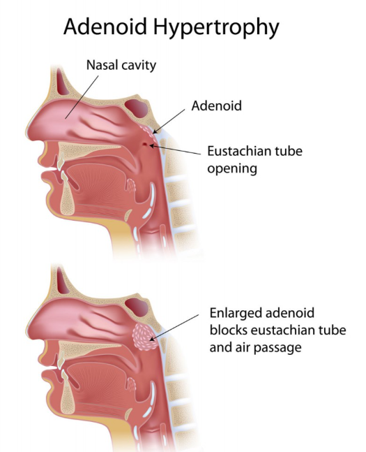
  

## Kroonisen nielurisatulehduksen tyypillinen nieluviljelylöydös?

- a. A-ryhmän streptokokki
- b. Mikä tahansa streptokokki
- c. Ei ole tyypillistä viljelylöydöstä
- d. Yleensä jokin ylähengitystievirus

  <button class="solution-button" data-label="Vastaus" data-hide-label="Piilota vastaus">
    Vastaus
  </button>
  

      c

Krooninen nielurisatulehdus ei yleensä ole aktiivinen akuutti infektio, vaan pitkäaikainen krooninen tulehdustila, joka yleensä syntyy toistuvien tonsilliittien taustalta. Liittyy proppuja ja pahanhajuista hengitystä, kryptien laajenemista, arpeutumista... 

Nieluviljelyssä ei yleensä kasva mitään diagnostisesti merkittävää ja löydökset ovat useimmiten sekaflooraa. 

Diagnoosi tehdään tyypillisen anamneesin ja kliinisen löydöksen perusteella. Ainoa tehokas hoito on nielurisojen poisto. Mikäli potilaan oireet huonontavat merkittävästi elämänlaatua, voidaan potilas lähettää erikoissairaanhoitoon nielurisaleikkausarvioon.

a-b ja d: GAS ja muut beetahemolyyttiset streptokokit ovat tyypillisiä akuutissa nielutulehduksessa, samoin virukset
  

## Nielupaiseen tyypillisiin oireisiin EI kuulu:

- a. Leukalukko
- b. Puuromainen puhe
- c. Nielemisvaikeus
- d. Pään käännön rajoitus

  <button class="solution-button" data-label="Vastaus" data-hide-label="Piilota vastaus">
    Vastaus
  </button>
  

      d

Nielupaise (pretonsillaaripaise) ilmenee tyypillisesti unilateraalisena nielun turvotuksena ja vaikeassa tilanteessa voidaan mahdollisesti todeta oireina leukalukkoa (trismus, suun avautumisvaje), puuromaista (hot potato) puhetta ja nielemisen vaikeudesta johtuvaa kuolaamista. 

Pään kääntämisen vaikeus ja kaulan punoitus, turvotus tai arkuus taas viittaavat syvempään paiseeseen kaulalla 
  

## Nielussa esiintyy ajoittain sattumalöydöksenä retentiokystia. Muutos voi aiheuttaa potilaassa huolta vaikka on usein oireeton, miten retentiokystaa EI tule hoitaa?

- a. Puudutus ja kystan tyhjennys neulalla
- b. Tonsillektomia
- c. Puudutus ja kystan avaus veitsellä
- d. Kystaa ei ole välttämättä pakko hoitaa mitenkään, potilaan informointi ja rauhoittelu riittää

  <button class="solution-button" data-label="Vastaus" data-hide-label="Piilota vastaus">
    Vastaus
  </button>
  

      a

Nielurisan kryptan tyhjenemisen estyessä voi muodostua retentiokysta. Se on hyvänlaatuinen ja oireeton. Potilas saattaa huomata sen sattumalta ja usein huolestuu tilanteesta. Usein oireetonta kystaa ei tarvitse hoitaa. Tarvittaessa kysta voidaan avata pintapuudutuksen jälkeen veitsellä ja imeä tyhjäksi ja tarvittaessa tonsillektomia estää kystan uusiutumisen. 

Neulalla tyhjennys ei ole hyvä hoito → kystan seinämä jää paikalleen ja kysta täyttyy lähes aina uudelleen. Lisäksi toimenpiteestä ei ole pitkäaikaista hyötyä
  

## Toispuolinen korvakipu potilaalla, jolla tärykalvo ja korvakäytävä ovat terveet? Valitse paras vaihtoehto. 

- a. Korvakäytävän trauma
- b. Leukanivelen sairaus
- c. Krooninen otiitti
- d. Laryngiitti

  <button class="solution-button" data-label="Vastaus" data-hide-label="Piilota vastaus">
    Vastaus
  </button>
  

      b

Kun potilaalla on toispuolinen korvakipu mutta korvakäytävä ja tärykalvo ovat täysin normaalit, kyse on usein heijastekivusta (referred otalgia) ja usein juuri leukanivelestä, joka on anatomisesti hyvin lähellä korvarakenteita. 

a: Korvakäytävän trauma näkyisi statuksessa

c: Krooninen otiitti -> yleensä korvalöydöksiä

d: Laryngiitti aiheuttaa kurkkukipua ja käheyttä, ei tyypillisesti yksipuolista korvakipua
  

## Hoitaja soittaa vuodeosastolta huonosti hengittävästä trakeostomoidusta potilaasta. Potilaalla on kuffillinen kanyyli ja todetaan että kanyyli on lähes tukossa. Miten kannattaa edetä?

- a. Kanyylin kostutus keittosuolalla ja varovainen imu
- b. Tyhjennät kuffin ja annat lisähappea
- c. Imukatetrilla tukoksen avaus
- d. Kanyylin poisto ja vaihto

  <button class="solution-button" data-label="Vastaus" data-hide-label="Piilota vastaus">
    Vastaus
  </button>
  

      c/d

Kuffillista (ilmakalvosimella varustettua) kanyylia käytetään trakeostooman teon jälkeen ensimmäisten päivien ajan ja silloin, kun respiraattorihoito tai aspiraatio-ongelma sitä vaatii. Muuten käytetään kuffitonta kanyylia. Kanyyli pyritään vaihtamaan kuffittomaan mahdollisimman pian, sillä se mahdollistaa potilaan puhumisen, vähentää ylähengitystieinfektioita ja helpottaa potilaan nielemistä sekä nopeuttaa vieroittautumista trakeostoomasta. Lisäksi kuffin aiheuttama paine henkitorven seinämään altistaa komplikaatioiden kehittymiselle, eikä kuffin ole todettu vähentävän potilaan aspiraatiota. 

Kanyylin tukkeutuminen vaatii usein välittömiä toimenpiteitä. Tukkeutumisen voi aiheuttaa muun muassa kuivunut lima tai hyytynyt veri. Tukos saadaan usein imulla poistettua. Monissa ohjeissa sanotaan, että sisäkanyyli kannattaa heti poistaa ja imutella vasta sen poistamisen jälkeen. Kohdassa D kuitenkin puhutaan "kanyylin" poistosta eikä sisäkanyylistä. Koko kanyylin poisto tehdään vasta jos imeminen ei avaa tukosta. Joissain mallivastauksissa D on kyllä oikea. 

a: Voi imeä ilman kostutusta  

b: Jos kanyyli vaikuttaa olevan täysin tukossa eikä imuletku mene siitä läpi ja tukosta saada avattua, tulee mahdollinen kuffi tyhjentää kanyylin ohi tapahtuvan ilmavirtauksen mahdollistamiseksi. 

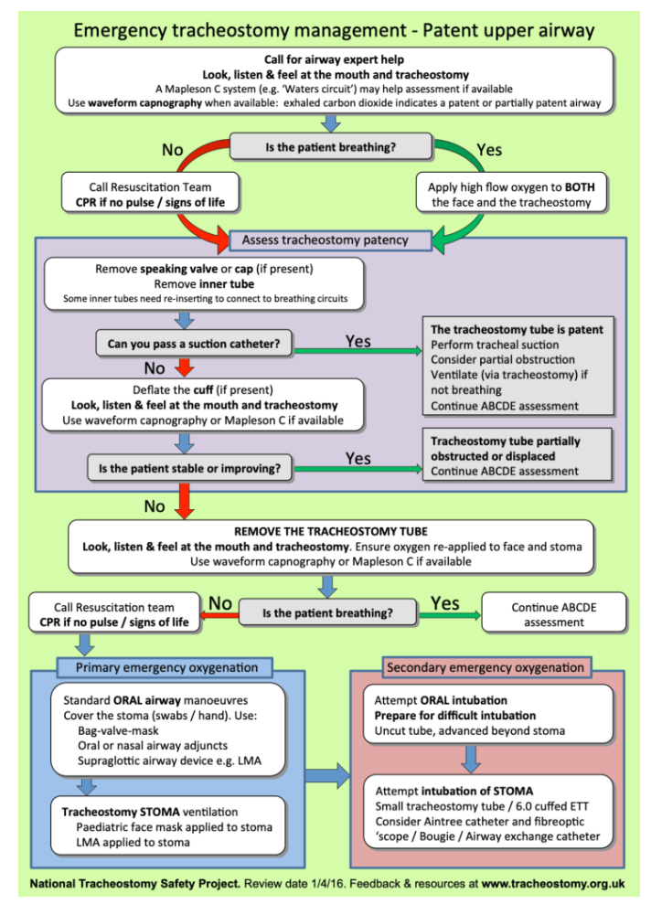
  

## Kaulapatti 

30-vuotias tupakoimaton perusterve mies hakeutuu tk-vastaanotollesi oikealla yläkaulalla muutama kuukausi sitten huomaamansa patin takia. Kollega on muutama viikko sitten pyytänyt kaulan UÄ:n jossa radiologi toteaa n. 3 cm kokoisen tarkkarajaisen imusolmukkeen sternocleidomastoideus-lihaksen alla, ONB on jäänyt epädiagnostiseksi. Miten etenet? 

- a. Seuranta ja potilas ottaa yhteyttä tarvittaessa, jos patti kasvaa
- b. Pyydät kontrolli UÄ ja ONB 3kk päästä
- c. Lähetät KNK:lle kiireellisyydellä 1-3 kk
- d. Lähetät KNK:lle kiireellisyydellä 1-7 vrk

  <button class="solution-button" data-label="Vastaus" data-hide-label="Piilota vastaus">
    Vastaus
  </button>
  

      d

Ohutneulabiopsia vain suuntaa antava, väärät negatiiviset löydökset tavallisia (hyvänlaatuisen ohutneulavastauksen taustalla voi olla syöpä). Potilas, jolla on kliinisesti epäilyttävä löydös, on lähetettävä jatkotutkimuksiin ohutneulabiopsiatuloksesta huolimatta. Jos potilaalla on nyt ollut jo muutama kuukausi kyseinen patti, niin on kyllä aiheellista lähettää potilas erikoissairaanhoitoon. 
  

## Missä iässä lapselle tulee tehdä pienoisaudiometria neuvolatarkastuksen yhteydessä?

- a) 18 kk
- b) 3 v
- c) 8 kk
- d) 12 kk

  <button class="solution-button" data-label="Vastaus" data-hide-label="Piilota vastaus">
    Vastaus
  </button>
  

      c

Ensimmäinen neuvolaseulonta 8 kuukauden iässä tähtää keskivaikeiden, vaikeiden ja erittäin vaikeiden kuulovikojen toteamiseen. 

Seulonta suoritetaan ns. pienoisaudiometria (uikkua) käyttäen 45 dB:n seulontatasolla. Tutkimus perustuu lapsen paikantamisvasteeseen eli siihen, että lapsi alkaa tuossa iässä katseellaan hakea äänilähdettä. Mikäli puuttuva vaste ei selity välikorvatulehduksella (ja mahdollinen korvatulehdus on hoidettu) ja tulos on poikkeava kontrollitutkimuksessa parin viikon kuluttua, tulee lapsi lähettää jatkotutkimuksiin erikoissairaanhoitoon.

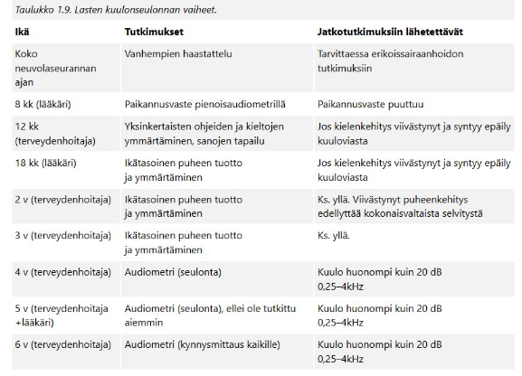
  

## Alla näet kuulokäyrän. Mihin kuulovian etiologiaan käyrässä näkyvät löydökset viittaavat?

- a) ikäkuuloon
- b) meluvammaan
- c) ototoksiseen vaurioon
- d) synnynnäiseen kuulovikaan

  <button class="solution-button" data-label="Vastaus" data-hide-label="Piilota vastaus">
    Vastaus
  </button>
  

      b

Kuva on suoraan otettu oppikirjan meluvamma-kappaleesta. Audiogrammissa meluvamma näkyy aluksi lähes **symmetrisenä, terävänä 3–6 kHz:n taajuusalueen kuoppana.** “Melukuoppa” syvenee ja laajenee, jos altistuminen jatkuu vuosia.
  

## Puhebanaanilla kuvataan puheäänen voimakkuutta ja spektriä audiogrammia vasten. Millä ihmisen kuuloalueella on keskeinen merkitys puheen tunnistamisessa erityisesti hälyisissä olosuhteissa?

- a) Matalilla taajuuksilla
- b) Keskitaajuuksilla
- c) Suurilla taajuuksilla
- d) Ultraäänillä

  <button class="solution-button" data-label="Vastaus" data-hide-label="Piilota vastaus">
    Vastaus
  </button>
  

      b

Audiogrammia tulkitessa taajuusalueet jaetaan yleensä kolmeen alueeseen: 

1. Matalat äänet/pienet taajuudet 0.125 - 0.5 kHz
2. Keskiäänet/-taajuudet 0.5 - 2 kHz
3. Korkeat äänet/suuret taajuudet 2 - 8 kHz

Puheen ymmärrettävyys (erityisesti hälyssä) perustuu ennen kaikkea konsonantteihin ja erityisesti korkeisiin konsonantteihin (esim. s, t ja k), jotka sijoittuvat korkeille taajuuksille. Ikäkuulossa varsinkin korkeiden taajuuksien kynnykset laskevat -> puheen ymmärtäminen hälyssä heikkenee. 

  

## Mikä voi olla syynä molemminpuoliseen kasvohermohalvaukseen?

- a) Bellin pareesi
- b) Neuroborrelioosi
- c) Aivohalvaus
- d) Alzheimerin tauti

  <button class="solution-button" data-label="Vastaus" data-hide-label="Piilota vastaus">
    Vastaus
  </button>
  

      b

Yleisin bilateraalisen kasvohermohalvauksen aiheuttaja on borrelioosi. Muut aiheuttajat ovat harvinaisia, esim. neurosarkoidoosi, ns. Meretojan tauti (autosomissa vallitsevasti periytyvä systeeminen amyloidoosi), polyradikuliitti, MS- ja Parkinsonin tauti. 

a: Bellin pareesi (eli idiopaattinen kasvohermohalvaus) on yleisin perifeerisen kasvohermohalvauksen aiheuttaja, mutta se on todella harvoin bilateraalinen; se on mahdollista, mutta äärimmäisen harvinaista (<2% tapauksista)

c: Mahdollista, mutta hyvin harvinaista (esim. bilateraalinen vaurio ponsin alueella) 

d: Ei ole tunnettu kasvohermopareesin aiheuttaja, vaikka aiheuttakin usein muutoksia ilmehtimisessä
  

## Ramsay Huntin syndroomaan liittyvät seuraavat oireet

- a) kuulon heikentyminen, tinnitus, huimaus
- b) kasvojen tunnon alentuminen ja rakkulat iholla
- c) kasvojen kipu ja pelkästään toisen suupielen roikkuminen
- d) hajuaistin alentuminen

  <button class="solution-button" data-label="Vastaus" data-hide-label="Piilota vastaus">
    Vastaus
  </button>
  

      a

Korvan alueen vyöruusua kutsutaan usein (tyypin 2) Ramsay Hunt -oireyhtymäksi, jolle on tyypillistä triadi: korvan kipu, rakkulat korvanlehdessä (voi myös olla suun ja nielun alueella) ja perifeerinen kasvohermohalvaus. 

VZV pysyy primaari-infektion jälkeen kehossa dormanttina dorsaalisissa hermoganglioissa ja aivohermoissa ja voi vuosia myöhemmin reaktivoitua iän tai muun immunosuppression myötä aiheuttaen vyöruusua (useimmiten unilateraalisesti vartalolla). Vesirokkoviruksen (VZV) reaktivaatio ganglion geniculin alueelta aiheuttaa (Tyypin 2) Ramsay Huntin oireyhtymän, jolle on perifeerisen kasvohalvauksen lisäksi herpesrakkuloita, yleisimmin korvassa. Osalle potilaista ilmaantuvat rakkulat siis vasta kasvohermohalvauksen alkamisen jälkeen ja diagnoosiksi voi ensikäynnillä tulla virheellisesti Bellin pareesi. Tämän takia potilaalle sanotaan, että on yhteydessä, jos korvan, suun tai nielun alueelle ilmenee rakkuloita tai kipua. 

Ramsay Huntin oireyhtymässä on usein facialishermon lisäksi vestibulokokleaarihermon affisioitumista. Ramsay-Huntin syndroomassa (korvan alueen vyöruusu) onkin oireina kasvohalvauksen lisäksi usein sensorineuraalinen kuulonlasku (jopa korvan kuuroutuminen), tinnitus ja huimaus

Korvan alueen vyöruusupotilas on syytä lähettää KNK-yksikköön, varsinkin jos tilaan liittyy kasvohermohalvaus, kuulo- tai tasapainomuutoksia tai voimakasta kipua. Tärkein hoito on valasikloviiri 1gx3/vrk p.o. 7 vrk ajan. Myös glukokortikoidia käytetään (samalla tavalla kuin Bellin pareesissa 10vrk ajan), mutta tämä ei ole yhtä tärkeää ja sen näytönaste on D -> voi olla käyttämättäkin, jos potilaalla on pieniäkin vasta-aiheita (esim. diabetes) 

b: Ei oikein sovi

c: Perifeerinen kasvohermohalvaus ei aiheuta pelkästään suupielen roikkumista, vaan myös yläkasvojen lihasten toiminta on affisioitunut (ei saa rypistettyä otsaa). 

d: Ei liity, CN I eli n. olfactorius välittää tätä aistia 
  

## Toteat potilaalla perifeerisen kasvohermohalvauksen ja otiitin. Miten toimit?

- a) Aloitat antibiootin ja pyydät viikon kuluttua kontrolliin.
- b) Aloitat antibiootin ja steroidin ja pyydät viikon kuluttua kontrolliin.
- c) Teet parasenteesin, aloitat antibiootin, ja pyydät viikon kuluttua kontrolliin.
- d) Teet potilaasta päivystyslähetteen erikoissairaanhoitoon.

  <button class="solution-button" data-label="Vastaus" data-hide-label="Piilota vastaus">
    Vastaus
  </button>
  

      d

Facialispareesipotilas, jolla otiitti tai muu korvasairaus tai aikaisempi korvaleikkaus halvauksen puolella -> päivystyksellinen KNK-konsultaatio (aiheuttaja voi olla korvaperäinen ja vaatii KNK:n hoitoa). 
  

## Mitä oireita voi liittyä Bellin pareesiin?

- a) maku- ja, tuntoaistit sekä kuulo ovat alentuneet
- b) makuaisti ja kuulo ovat alentuneet
- c) maku- ja tuntoaistit ovat alentuneet
- d) makuaisti on alentunut

  <button class="solution-button" data-label="Vastaus" data-hide-label="Piilota vastaus">
    Vastaus
  </button>
  

      d

Makuaistihäiriöt ovat tavallisia, koska CN VII:n chorda tympani-haara hermottaa anteriorisen kielen makuaistia. 

a ja b: Joillakin potilailla voivat voimakkaat äänet kuulua poikkeavan kovina (ns. hyperakusia), mutta kuulo ei ole sinänsä alentunut. N. facialis (kasvohermo) hermottaa stapedius-lihasta, joka kiinnittyy jalustimen kaulaan. Stapediuslihaksen supistuminen jäykistää kuuloluuketjua antaen siten suojaa voimakkailta ääniltä. Tätä kutsutaan stapediusrefleksiksi, jonka laukeamiskynnys äänille on tavallisesti 70–90 dB tasolla. 

c: Kasvohermo kyllä hermottaa hieman ulkokorvan tuntoaistia ja jotkut potilaat voivat tuntea puutuneisuutta tai kipua korvan takana/korvakäytävässä (tai kasvojenkin alueella). Kasvojen tuntohermotusta suorittaa enemmänkin n. trigeminus, joten tuntoaistin alenema ei ole merkittävä tutkittavat asia kasvohermopareesissa. 
  

## Millainen nystagmus liittyy vestibulaarineuroniittiin?

- a) suuntaa vaihtava horisontaalinen nystagmus
- b) suuntaa vaihtamaton vertikaalinen jatkuva nystagmus
- c) asentoprovokaatioiden mukaan suuntaa vaihtava horisontaalinen nystagmus
- d) suuntaa vaihtamaton horisontaalinen nystagmus

  <button class="solution-button" data-label="Vastaus" data-hide-label="Piilota vastaus">
    Vastaus
  </button>
  

      d

Vestibulaarineuriitti spontaania nystagmusta tai ainakin gaze induced, joka ilmenee varsinkin silmien ääriasennoissa ja tyypillisesti horisontaalisissa katseen suunnissa; katseen siirtäminen sivuille voi siis auttaa nystagmuksen esiintuomisessa, jos sitä ei suoraan havaita suorassa katseessa. Katseen fiksaatio voi myös vähentää nystagmusta, jolloin kannattaa käyttää Frenzelin laseja tai vielä helpompana vaihtoehtona laittaa valkoisen paperin näkölinjan eteen 

Vestibulaarineuriitissa todetaan **terveelle puolelle lyövä horisontaalis-rotatorinen nystagmus.** 

Miksi lyö terveelle puolelle: Jos ajatellaan fysiologiaa, niin pään ollessa suorassa molemmat vestibulaarihermot lähettävät signaaleita aivoihin samalla tahdilla, jolloin aistitaan pään olevan suorassa. Jos taas käännetään päätä esim. oikealle, niin oikea hermo alkaa signaloimaan tiheämpää tahtia ja vasen hermo hitaampaa -> tämä aistitaan pään kääntönä oikealle. Pään kääntyessä oikealle silmät taas kääntyvät vasemmalle, jos halutaan pitää katse suoraan eteenpäin (vestibulo-okulaarinen refleksi). Jos taas vestibulaarineuriitista johtuen toisen puolen vestibulaarihermo ei enää toimi ja lähettää signaaleita merkittävästi hitaammin kuin terve puoli, niin silloin lepotilassakin pään ollessa suorassa aistitaan, että pää olisi kääntynyt terveelle puolelle, joka signaloi normaaliin tahtiin. Jos esimerkiksi vasen vestibulaarihermo on heikosti toimiva vasemmanpuolisen vestibulaarineuriitin takia, niin tämä aistitaan pään kääntönä oikealle. Silmät yrittävät vastata tähän aistimukseen vetäytymällä vasemmalle. Pää ei kuitenkaan oikeasti ole kääntynyt, joten tämä silmien virheliike korjataan nopeasti, jolloin silmät palaavat takaisin oikealle (eli tässä esimerkissä terveen korvan suuntaan) ja tämä havaitaan nystagmuksen nopeana komponenttina -> nystagmus on terveen korvan suuntaan horisontaalinen ja sen mukana on usein vaihtelevan vahvuinen rotatorinen komponentti, jonka suunta on myös terveen korvan suuntaan. 

a ja c: Suuntaa vaihtavat nystagmus (bidirektionaalinen nystagmus) tarkoittaa sitä, että nystagmuksen nopea komponentti vaihtaa suntaa katsetta kohdistettaessa ensin toiselle sivulle ja sitten toiselle. Bidirektionaalinen nystagmus viittaa vertigon sentraaliseen syyhyn. Perifeerisessä syyssä nystagmus tyypillisesti vahvistuu katsottaessa nystagmuksen suuntaan ja heikentyy katsottaessa toiseen suuntaan, mutta nystagmuksen nopean komponentin suunta pysyy aina samana 

b: Vertikaalinen nystagmus on aina huolestuttava sentraalisen syyn suhteen

  

## Missä testissä voidaan provosoida esiin VOR:in sammumisesta johtuva korjaava nystagmussakadi?

- a) Dix-Hallpiken kokeessa
- b) Päännykäisytestissä
- c) Semontin manööverissä
- d) Skew-deviation testissä

  <button class="solution-button" data-label="Vastaus" data-hide-label="Piilota vastaus">
    Vastaus
  </button>
  

      b

VOR = vestibulo-okulaarinen refleksi = okulovestibulaarinen refleksi = doll's eye reflex = okulokefaalinen refleksi

Päännykäisy- eli impulssitestillä (HIT = Head Impulse Test) mitataan tämän refleksin toimintaa. Suoritus: 

1. Potilaan katse kohdistetaan suoraan eteen tutkijan nenään 
2. Pää nykäistään nopeasti sivulle 
3. Arvioidaan tapahtuuko korjausliikettä vai säilyykö katse fiksoituna

Ns. normaali löydös on, että katse säilyy fiksoituna ja epänormaali löydös on, että voidaan havaita myöhässä tuleva korjaussakadi. 

HIT on osa HINTS plus -tutkimusta, jolla voidaan erottaa AVH (sentraalinen vertigo) vestibulaarineuriitista. HUOM! normaali HIT on huolestuttava löydös ja viittaa sentraaliseen syyhyn. Jos taas löydös on epänormaali, niin se viittaa taas enemmän vestibulaarineuriittiin (löydös on epänormaali affisioidulle puolelle käännettäessä). Vestibulaarineuriitissa vestibulaarihermo ei toimi kunnolla, jolloin myöskään vestibulaari-okulaari-refleksi ei toimi.

a: Käytetään hyvänlaatuisen asentohuimauksen (HAH, BPPV) osoittamiseen ja tutkii otoliitteja posteriorisessa kaarikäytävässä. 

c: Toinen vaihtoehto Epleyn manööverille posteriorisen kaarikäytävän BPPV:n hoidossa. 

d: Osa HINTS plus -tutkimusta. Sentraaliseen huimaukseen viittaa se, että silmä hakeutuu peitettynä virheasentoon (dyskonjugaatio) ja kun silmä paljastetaan, voidaan havaita sen vertikaalista korjausliikettä (pelkästään horisontaaliset korvajusliikkeet ovat benignejä (esim. karsastus)). 

Tässä normaali nykäisytesti -> huimauspotilaalla huolestuttava löydös ja viittaa sentraaliseen syyhyn

Tässä taas epänormaali nykäisytesti (voi havaita korjaussakadin) -> huimauspotilaalla hyvä löydös ja viittaa vestibulaarineuriittiin

  

## 75-vuotiaalla miehellä on alkanut vuorokautta aiemmin pyörittävä huimaus ja oksentelu. Havaitset vertikaalisen spontaanin nystagmuksen. Mikä on työdiagnoosi?

- a) Hyvänlaatuinen asentohuimaus
- b) Menieren tauti
- c) Pikkuaivoinfarkti
- d) Vestibulaarineuroniitti

  <button class="solution-button" data-label="Vastaus" data-hide-label="Piilota vastaus">
    Vastaus
  </button>
  

      c

Vertikaalinen nystagmus on aina huolestuttava sentraalisen syyn suhteen. 

  

## 25-vuotias lääketieteen opiskelija yrittää rikkoa kliinisen opettajan tekemää ainejärjestön penkkipunnerrusennätystä. Nostaessaan painoa hänellä alkaa välittömästi kiertohuimaus sekä vasemman korvan tinnitus sekä kuulonalenema. Todennäköisin diagnoosi on:

- a) vertebralis-dissekaatio
- b) Perilymfafisteli
- c) Duraalinen fisteli
- d) Vestibulaarineuriitti

  <button class="solution-button" data-label="Vastaus" data-hide-label="Piilota vastaus">
    Vastaus
  </button>
  

      b

Harvinainen sisäkorvan ikkuna-avanne (perilymfafisteli) syntyy äkillisen ponnistuksen, vamman tai paineenvaihtelun yhteydessä tavallisimmin pyöreään tai soikeaan ikkunaan. Oireena on kuulonlasku, huimaus ja monesti voimakas tinnitus. 

a: Vertebralisdissekaatio aiheuttaa usein niskakipua lievän kaulatrauman jälkeen ja voi aiheuttaa kylläkin neurologisia oireita, mutta ei tyypillisesti äkillistä sisäkorvaoiretta ponnistuksen hetkellä. 

c: Tarkoittaa harvinaista ja hankittua yhteyttä meningiaalisten valtimoiden ja duran laskimosinusten välillä -> aiheuttaa korkeapaineista verenvirtausta alueella. Usein aiheuttaa kroonista sykkivää tinnitusta ja kroonisia pääkipuja. Usein idiopaattisia, mutta taustalla voi olla aikaisempi päätrauma, infektio, leikkaus tai sinustromboosi. Altistaa aivoverenvuodoille.  

d: Ei aiheuta kuulonalenemaa tai tinnitusta; huimausta kylläkin. Ei myöskään johdu äkillisestä ponnistelusta, vaan on joko idiopaattinen tai taustalla on oletettavasti jokin virusinfektio.

  

## Potilaalla on todettu äänihuulikyhmyjen aiheuttama käheys. Puheterapeutin ohjanta ei ole välttämätöntä, jos kyseessä on:

- a) nuori tyttö
- b) puheammatissa oleva nainen
- c) puheammatissa oleva mies
- d) nuori poika

  <button class="solution-button" data-label="Vastaus" data-hide-label="Piilota vastaus">
    Vastaus
  </button>
  

      d

Äänihuulikyhmyt ovat yleensä bilateraaliset massat äänihuulen limakalvolla. Ylimääräinen massa äänihuulen limakalvon värähtelevässä osassa aiheuttaa aina käheytymisen. Tämä johtuu ensisijaisesti siitä, että limakalvoaalto ei synny symmetrisesti ja koko värähdyksestä tulee epäsäännöllinen. Toissijaisesti käheys syntyy siitä, että muutos estää ääniraon sulkeutumisen. Kyhmyt syntyvät äänihuuliin kohtaan, jossa mekaaninen rasitus on suurinta (rasitusvamma). Limakalvon värähdyslaajuus on kaikkein suurin äänihuulen etu- ja keskikolmannesten rajalla. Jos ääntä rasitetaan liikaa, syntyy tähän kohtaan ensin mikroverenvuoto ja turvotus. Kroonistuessaan ne muodostavat ylimääräisen fibroottisen kyhmyn subepiteliaaliseen tilaan. Jos ääntä edelleen rasitetaan, alkaa levyepiteeli paksuuntua ja muuttuu keratiinia muodostavaksi. Kyhmyt syntyvät siten limakalvon venytyksestä ja hankauksesta, ja ne ovat periaatteessa aina molemminpuolisia, mutta eivät välttämättä kooltaan symmetrisiä.

**Äänihuulikyhmyt ovat yleisimpiä erityisesti kahdelle potilasryhmälle: nuoret joukkupelejä harrastavat pojat ja äänityötä tekevät/muuten kovaääniset nuoret naiset.** Äänihuulikyhmyjen aiheuttaja on runsas ja voimakas äänenkäyttö, joka aiheuttaa mikrotraumojen kautta limakalvon paksuuntumista. 

Poikien hoitamiseksi riittää valistus: ei saa huutaa kilpaa. Poikien äänihuulikyhmyt katoavat äänenmurroksen yhteydessä. 

a: Jos tytöllä todetaan äänihuulikyhmyt, tämä viittaa yleensä ongelmaan joko limakalvon värähtävässä mekanismissa tai äänenkäyttötavassa. Nämä tytöt ovat usein kuuluvaäänisiä. Tyttöjen tapauksessa kannattaa harkita foniatrista konsultaatiota. On nimittäin tavallista, että ääni tulee myöhemminkin herkästi käheytymään ja kestää huonosti rasitusta 

b ja c: Kaikki äänityötä tekevät aikuiset kyhmypotilaat pitää lähettää ääniterapiaan. Kyhmyt katoavat vain rasitusta vähentämällä. Jos ääniterapia ei auta, osa aikuisten äänihuulikyhmyistä hoidetaan harvoin kirurgisesti. Hoidoksi ja uusiutumisen ehkäisyyn puhetyöläiselle äänenvahvistuslaite. 

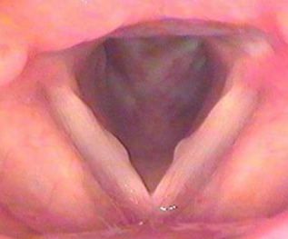
  

## Pirjo on tupakoimaton 42-vuotias personal trainer ja aerobic-ohjaaja. Flunssan jo parannuttua useita viikkoja sitten hänen äänensä ei ole palautunut ja toteat sen myös objektiivisesti käheäksi. Peilitutkimuksessa toteat toisessa äänihuulessa muutoksen joka on todennäköisimmin:

- a) Polyyppi
- b) Granulooma
- c) Kysta
- d) Papillooma

  <button class="solution-button" data-label="Vastaus" data-hide-label="Piilota vastaus">
    Vastaus
  </button>
  

      a

Kurkunpään polyyppi ei liity allergiseen taipumukseen (kuten usein nenäpolyyppi), vaan se syntyy muilla mekanismeilla. Toispuolisen äänihuulipolyypin takana lienee useimmiten äkillinen mekaaninen trauma. 

Pirjo on ääntään paljon kuormittava (personal trainer, aerobic-ohjaaja) → voimakas fonotrauma mahdollinen. Flunssa on voinut myös aiheuttaa voimakasta yskää, joka voi myös olla äänihuulitrauman taustalla. Trauma aiheuttaa verenpurkauman ja se kasvaa usein pehmeäksi, helttamaiseksi tai pallomaiseksi ulokkeeksi äänihuulen mediaalireunassa. Polyyppi aiheuttaa jatkuvan äänen karheuden ja vuotoisuuden, koska äänirako ei pääse sulkeutumaan normaalisti.

Käytännössä aina hoidetaan kirurgisella poistolla

b: Granuloomat voivat johtua useista, osin tuntemattomista tekijöistä. Maha- ja sappihappojen takaisinvirtaus ja sen aiheuttama krooninen rykiminen lienee yksi syy. Myös mekaaninen vamma esimerkiksi intubaation yhteydessä voi aiheuttaa samanlaisen muutoksen. Kyseessä on värähtelevän äänihuulen takaosan kiinnitysalueen eli kannuruston processus vocaliksen haavauma, jonka seurauksena rustokalvoon tulee vaurio. Alueelle kohdistuu voimakas paine, jos käytetään puristeista, matalaa ääntä. Sen vuoksi granulooma on tyypillisempi miehillä. _Jos granulooma ei ole kovin suuri, se ei aiheuta äänen käheyttä._ Oireena useimmiten on palan tai vierasesineen tuntu ja paikallinen kipu kurkussa. Joskus potilas hakeutuu lääkäriin korvassa tuntuvan vihlovan kivun vuoksi.

c: Mahdollisia, mutta kystat ovat harvinaisempia eivätkä aina suoraan liity äänen liikakäyttöön tai traumaan

d: HPV-peräinen ja todella harvinainen

  

## 1-vuotias Eero tulee vanhempien kanssa aamuyöstä terveyskeskuspäivystykseen. Hänellä on ollut pari päivää yskää, mutta nyt yöllä yskä on muuttunut haukkuvaksi ja sisäänhengitys vinkuvaksi. Mitä teet?

- a) Annan Eeron hengittää salbutamolia höyrystävällä inhalaattorilla.
- b) Laitan Eeron istumaan höyrystimen ääreen.
- c) Annan Eerolle kerta-annoksen betametasonia im.
- d) Aloitan astmalääkityksen ja amoksisilliinikuurin.

  <button class="solution-button" data-label="Vastaus" data-hide-label="Piilota vastaus">
    Vastaus
  </button>
  

      c

Oikeana vaihtoehtona voisi vielä olla: Annan Eeron hengittää raseemista adrenaliinia (levoadrenaliinia) höyrystävällä inhalaattorilla. Tämä kysymys toistuu tenteissä ja oikeana vaihtoehtona on välillä adrenaliini. 

---

Eerolla vaikuttaa olevan laryngiitti ja erityisesti siis pseudokruppi (valekuristustauti, laryngotrakeiitti, laryngotrakeobronkiitti). Lasten akuutissa laryngiitissa voidaan usein todeta subglottisen tilan ja trakean yläosien sekä jopa bronkusten ahtautumista. **Oireena on käheä, kuiva ja haukkuva yskä (seal bark cough), joka alkaa äkillisesti ja pahenee usein yöllä, sekä joskus myös sisäänhengitysvaikeus ja vinkuminen (insiratory stridor).** Diagnoosi on kliininen. Yleisin sairastumisikä on 6 kuukautta – 3 vuotta.

Lieväoireiset lapset hoidetaan kotona. Kylmä hengitysilma ja kohoasento helpottavat lapsen oloa. 

Oireiden vaikeutuessa annetaan kerta-annos beetametasonia tai deksametasonia (ensisijaisesti p.o., mutta i.m. tai aerosolinakin mahdollinen). Lapsen annetaan myös tarvittaessa hengittää adrenaliinia (levoadrenaliini 1:1 000 sellaisenaan) höyrystävällä inhalaattorilla. Inhaloitava raseeminen adrenaliini lievittää tehokkaasti laryngiitista johtuvan hengitysvaikeuden oireita; sen vaikutuksen kesto on n. 1–2 t. Jos lapsi ei vastaa adrenaliinille, saattaa kyseessä olla bakterielli trakeiitti tai jopa epiglottiitti. 

Seurannassa tarkkaillaan hengitystiheyttä, happisaturaatiota ja pulssia. Jos tila ei helpota ja/tai lapsi vaikuttaa levottomalta tai väsähtäneeltä, hänet kuljetetaan istuvassa asennossa sairaalahoitoon. Raseemista adrenaliinia saaneet potilaat on lähetettävä ensiavun jälkeen herkästi sairaalahoitoon, koska hengitysvaikeus palaa yleensä 1–2 t:n kuluessa. 

Lapsi voidaan ottaa osastoseurantaan, ja joskus jopa teho-osastolle. Intubaatiota pyritään välttämään, jottei lisättäisi subglottisen tilan turvotusta ja aiheutettaisi sinne limakalvovauriota. Trakeotomioita tarvitaan lapsille akuutin laryngiitin vuoksi nykyään erittäin harvoin. Erotusdiagnostisesti on syytä muistaa hengitysteiden vierasesineet, epiglottiitti ja muihin nielun ja kaulan alueen infektioihin liittyvä kurkunpään turvotus.

a ja d: Oirekuva ei sovi astmaan. Astmassa vinkuna olisi enemmänkin uloshengityksessä, koska obstruktio on intratorakaalisella alueella. Inspiratorinen stridor taas enemmänkin havaittavissa ylemmissä ahtaumissa. 

b: Perinteisesti hengitysilmaa on kostutettu laryngiittipotilaiden oireiden helpottamiseksi, joskaan sairaalaolosuhteissa tehdyissä tutkimuksissa höyryhengityksestä ei ole todettu olevan hyötyä.
  

## Endoskooppikuvassa nähdään

- a) äänihuulen granulooma
- b) äänihuulen papilloma
- c) äänihuulen polyyppi
- d) äänihuulen kysta

  <button class="solution-button" data-label="Vastaus" data-hide-label="Piilota vastaus">
    Vastaus
  </button>
  

      a

Granulooma on useimmiten unilateraalinen möllykkä äänihuulen takaosan kiinnitysalueella eli kannuruston processus vocaliksen alueella. 

Granuloomat voivat johtua useista, osin tuntemattomista tekijöistä. Maha- ja sappihappojen takaisinvirtaus ja sen aiheuttama krooninen rykiminen lienee yksi syy. Myös mekaaninen vamma esimerkiksi intubaation yhteydessä voi aiheuttaa samanlaisen muutoksen. 

Granulooma on usein vaalea väriltään, joskus punertava. 

b: Kurkunpään papillomatoosi on harvinainen ja hyvänlaatuinen sairaus, jonka seurauksena äänihuulien limakalvolle kasvaa pehmeää kudosmassaa. Ei tyypillisesti muodosta granulooman tyylistä yhtä selkeää vaaleaa möllykkää. 

c: Äänihuulipolyyppi näyttää erilaiselta. Polyypin koko vaihtelee nuppineulanpään kokoisesta kapillaareja sisältävästä punaisesta nappulasta laajaan, sukkulamaiseen, koko äänihuulen pituiseen turvotukseen.

d: Kysta voi olla limakalvonsisäinen tai sijaita äänijänteen alla lihaskudoksen ympäröimänä. Ei aiheuta samalla tavalla ulkopuolista massaa kuin granulooma. 

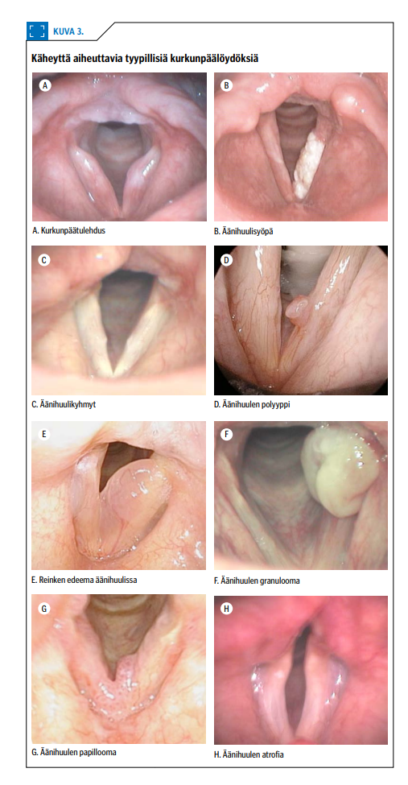
Tässä äänihuulikysta

  

## Laryngectomian eli kurkunpään poiston jälkeen potilaalle asetetaan puheproteesi

- a) henkitorven ja ruokatorven välille
- b) henkitorven ja alanielun välille
- c) henkitorven ja kurkunpään välille
- d) trakeostomaan

  <button class="solution-button" data-label="Vastaus" data-hide-label="Piilota vastaus">
    Vastaus
  </button>
  

      a

Potilaille, joille on totaalilaryngektomia, voidaan asentaa trakeoesofageaalinen nk. puheproteesi ruokatorven ja henkitorven seinämän läpi. Proteesi toimii läppänä estäen juoman/ruuan kulkeutumisen henkitorven puolelle, mutta sallii ilman pääsyn henkitorvesta nieluun. Tämän proteesin avulla suuri osa potilaista oppii tyydyttävän puheen. Proteesi pitää puhdistaa päivittäin. Proteesi vaihdetaan tarvittaessa erikoissairaanhoidon poliklinikalla. Toimimaton proteesi aiheuttaa nesteiden vuotoa ruokatorvesta hengitysteihin, joka voi johtaa aspiraatiopneumoniaan.

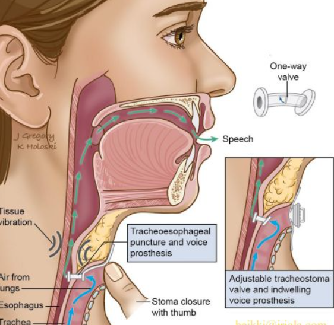
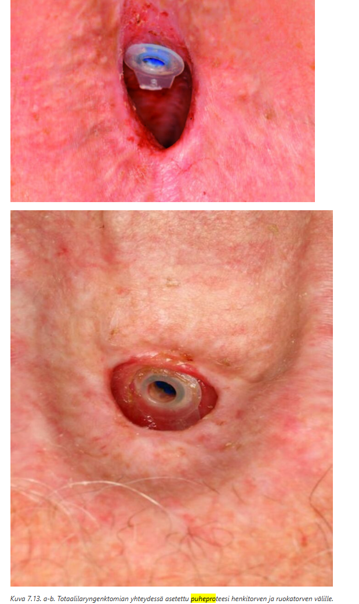

  

## Anterolle on tehty aorttaleikkaus, jonka jälkeen ääni on ollut hyvin käheä 3 vko ajan. Mikä seuraavista on todennäköisin äänihuulilöydös statustutkimuksessa?

- a) Vasemman äänihuulen paralyysi
- b) Oikean äänihuulen paralyysi
- c) Molempien äänihuulien paralyysi
- d) Äänihuulen granulooma

  <button class="solution-button" data-label="Vastaus" data-hide-label="Piilota vastaus">
    Vastaus
  </button>
  

      a

Äänihuulia hermottaa n. recurrens (kiertäjähermo), joka kiertää vasemmalla puolella aortan kaaren -> syy vaurioitumiseen voi olla intratorakaalinen ja juurin aorttaleikkauksesta johtuvaa. Oikealla hermo kiertää a. subclavian alta -> ei vaurioidu aorttaleikkauksessa tyypillisesti. 

  

## Pysyvän hampaan irtoamisvamman jälkeen on

- a) syytä puhdistaa irronneen hampaan hammasjuuri harjaamalla, vitaliteetin säilyttämiseksi
- b) suositeltavaa neuvoa potilasta säilömään irronnut hammas puhtaaseen astiaan ja hakeutumaan hammaslääkärivastaanotolle 1-2 vrk sisällä
- c) syytä reponoida hammas välittömästi kuoppaansa ja ohjata potilas hammaslääkäripäivystykseen jatkohoitoon
- d) järkevintä joka tapauksessa hylätä hammas ja kehottaa potilasta hakeutumaan implanttiarvioon, jos kuukausien mittaan kokee tilanteesta haittaa

  <button class="solution-button" data-label="Vastaus" data-hide-label="Piilota vastaus">
    Vastaus
  </button>
  

      c

Takaisinistuttaminen tulisi tehdä mahdollisimman nopeasti, jopa 30min - 1 tunti on ns. kriittinen raja. 

Ohjeet hampaan takaisinistutuksesta voi antaa potilaalle puhelimitse tai implantaatio voidaan tehdä yleislääkärinkin toimesta, jos potilas on päivystyksessä tai osastolla valmiiksi. Naapurihampaan asento on hyvä indikaattori takaisinistutuksen onnistumiselle. 

Istuttamisen jälkeen potilas on välittömästi ohjattava hammaslääkäripäivystykseen, koska hammas on kiskotettava hammaslääkärin vastaanotolla. Nykytiedon mukaan kiskotus voi olla jopa vain viikon mittainen.

Mikrobilääkekuuri annettuna heti hampaan takaisinistutuksen jälkeen voi vähentää komplikaatioita. Tetanussuoja on myös aina traumoissa varmistettava, ja epäselvissä tapauksissa on annettava tehosteannos.

a: Kokonaisena irronnut pysyvä hammas puhdistetaan varovasti liasta niin, että juuren pinnalla olevaa kalvoa ei hangata eikä tarpeettomasti kosketella.

b: Liian hidasta toimintaa. Hampaan säilytys on myös väärin: jos implantaatio ei onnistu heti, niin hammas tulee asettaa maitoon (tai jos ei ole maitoa niin kielen alla tai ainakin kosteassa) ja viedä se mukanaan hammaslääkäripäivystykseen. 

d: Vaikka hammas myöhemmin menetettäisiin, on tärkeää istuttaa se takaisin, sillä tämä toimenpide parantaa implantoinnin mahdollisuutta ja siirtää hampaan proteesilla korvaamista.
  

## Yleisin verenvuotoalue nenässä on

- a) Kiesselbachin alue
- b) McBurneyn piste
- c) sphenopalatina-valtimon tyvi
- d) keskikuorikon etureuna

  <button class="solution-button" data-label="Vastaus" data-hide-label="Piilota vastaus">
    Vastaus
  </button>
  

      a

Keiesselbachin alueella (a.k.a. Littlen alue tai Kiesselbachin kolmio) sijaitsee Kiesselbachin plexus, joka on nenän septumia ruokkiva anastomoottinen arteriaverkosto. On rikkaan suonistonsa takia tyypillinen sijainti (n. 90%) anteriorisille nenäverenvuodoille. 

b: On tyypillinen appendisiitin kipulokalisaatio; Piste on navan ja oikean suoliluun etukärjen (spina iliaca anterior superior) yhdysjanan ala- ja keskikolmanneksen rajalla

c: Keskikuorikon takapään kohdalla sijaitsevan foramen sphenopalatinumin kautta nenään tuleva a.sphenoplatina (a. maxillariksen eli a. carotis externan haara) suonittaa suunnilleen keskikuorikkotason alapuolelta nenänkäytävien ala- ja takaosaa. Tämä valtimo on merkityksellinen vaikeiden posterioristen nenäverenvuotojen hoidon kannalta.

d: Ei yleisimpiä vuotokohtia

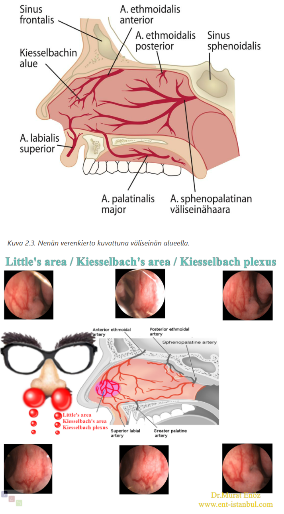
  

## Epiglottiitti voi aiheuttaa nopeasti etenevää hengenahdistusta ja ilmatieongelman. Epiglottiittiepäily herää, jos potilaalla on

- a) haukkuva yskä
- b) käheä ääni ja lievää kurkkukipua
- c) huomattava kurkkukipu ja vaikeuksia niellä omaa sylkeään
- d) polttelevaa/karvastelevaa tunnetta rintalastan takana ja ylävatsalla

  <button class="solution-button" data-label="Vastaus" data-hide-label="Piilota vastaus">
    Vastaus
  </button>
  

      c

Epiglottiitille (ja supraglottiitille) tyypillisimmät oireet ovat nopeasti nouseva korkea kuume, vahva kurkkukipu, sen aiheuttama kuolaaminen (Kipu kurkussa voi olla niin kova, että se estää nielemisen. Pahimmillaan potilas kuolaa, koska ei pysty nielemään edes sylkeään) ja tilan edetessä lisääntyvä hengitysvaikeus. Oireet ovat usein voimakkaampia kuin muista syistä aiheutuvissa kurkkukivuissa. Kun oireet ovat voimakkaita, potilas pyrkii vaistomaisesti etukumaraan istuvaan asentoon (tripod asento), jottei turpea kurkunkansi pääsisi painumaan taaksepäin hengitystien esteeksi

Epiglottiitti eli kurkunkansitulehdus ja supraglottiitti (laaja-alaisempi äänihuulitason yläpuolinen kurkunpäätulehdus) ovat infektioita, jotka saattavat edetä henkeä uhkaaviksi. **Jos epäilet epiglottiittia tai supraglottiittia, ohjaa potilas korvalääkärin tutkittavaksi päivystyksenä** etukumarassa istuvassa asennossa. Tauti saattaa edetä nopeasti, ja siksi potilas, jolla on hengenahdistusta, tulee lähettää jatkohoitoon lääkärin saattamana

a: Haukkuva (seal bark) yskä on tyypillistä lasten laryngiitille (pseudokruppi) 

b: Epiglottiitti aiheuttaa nopeasti kehittyvää vaikeaa kurkkukipua; ei ole lievä sairaus missään nimessä 

d: Enemmänkin refluksiin viittaavaa

  

## Epäilet lapsipotilaallasi alahengitysteiden vierasesinettä. Tilanne edellyttää

- a) vierasesineen mahdollisuuden poissulkemista keuhkoröntgenkuvalla
- b) erikoissairaanhoidossa yleisanestesiassa tapahtuvaa bronkoskopiaa potilaan voinninmukaisella kiireellisyydellä
- c) vierasesineen mahdollisuuden poissulkemista happisaturaatiomittauksella: yli 95 % saturaatioarvo ei anna aihetta jatkotoimiin
- d) ainoastaan keuhkoauskultaatiota: normaali kuuntelulöydös poissulkee vierasesineen

  <button class="solution-button" data-label="Vastaus" data-hide-label="Piilota vastaus">
    Vastaus
  </button>
  

      b

Lopullinen alahengitystievierasesineiden diagnoosi perustuu bronkospiaan, joka samalla toimii hoidollisena toimenpiteenä. **Pelkkä epäilykin vierasesineestä riittää bronkoskopiaan,** koska jos asiaa jää seuraamaan, niin potilaalle voi kehittyä oireettoman vaiheen jälkeen ilkeän ja vaikeahoitoisen pneumonia, jonka yhteydessä esineen poistaminen on entistä vaikeampaa. 

Epäily: Oireet alkavat usein voimakkaalla yskänkohtauksella. Alkuvaiheessa on usein myös hengityksen vinkumista ja jopa syanoosia. Oireet kestävät muutamia minuutteja ja loppuvat, vaikka vierasesine jää bronkukseen. Äkillisesti alkanutta voimakasta yskänkohtausta ja hengitysvaikeutta on lapsella aina pidettävä vierasesineaspiraationa, ellei muuta syytä todeta.

a: Thoraxkuvalla on rajallinen merkitys: se voi olla normaali tai siinä voidaan todeta atelektaasi ja emfyseemat, myöhemmin pneumonia .

c: Ei riitä 

d: Ei riitä 
  

## Nielurisan maligniteetti 

Potilaasi on 33-vuotias, joka tulee vastaanotollesi vasemmanpuoleisen pari kuukautta jatkuneen kurkkukivun takia. Toteat vasemman nielurisan olevan selvästi kookkaampi, limakalvo on rikkoutunut ja nielurisa on palpoiden arka ja kova. Hän ei ole käyttänyt tupakkatuotteita tai alkoholia. Mikä on potilaasi todennäköisin nielurisan pahanlaatuisen kasvaimen riskitekijä?

- a) Human immunodeficiency virus (HIV)
- b) Human papilloma virus (HPV)
- c) Sytomegalovirus (CMV)
- d) Ebstein-Barrin virus (EBV)

  <button class="solution-button" data-label="Vastaus" data-hide-label="Piilota vastaus">
    Vastaus
  </button>
  

      b

Suunielusyöpien määrä on ollut viime vuosikymmeninä reilussa nousussa ja tätä ajaa pääasiassa HPV:n yleistyminen. Noin kaksi kolmasosaa suunielun syöpätapauksista on HPV16-liittyviä (HPV16 on korkean riskin HPV samoin kuten HPV18) ja niiden ilmaantuvuus nousee koko ajan. Suunielun HPV-infektioon liittyvien syöpien riskiä lisää suuri seksikumppaneiden lukumäärä. 

Suuren riskin HPV-infektioon (16,18) liittyviä syöpiä todetaan erityisesti nielurisoissa ja kielen tyvessä, usein myös tupakoimattomilla potilailla. Potilaat ovat keskimäärin muita pään ja kaulan alueen syöpiä sairastavia potilaita nuorempia. HPV-positiiviset syövät reagoivat kuitenkin onkologisiin hoitoihin hyvin, ja niiden ennuste on siksi selvästi parempi kuin muiden syiden aiheuttamien pään ja kaulan alueen levyepiteelisyöpien. Rokotuksen avulla on mahdollista vähentää merkittävästi HPV-liittyvien tautitapausten ilmaantumista, mikäli rokotuskattavuus nousee riittävän korkeaksi.

a: Lisää mm. lymfoomariskiä, mutta ei ole tyypillisin nielurisan karsinooman riskitekijä

c: Ei liity merkittävästi nielurisan pahanlaatuisiin kasvaimiin

d: Liittyy nasofaryngeaalisiin syöpiin ja Burkittin lymfoomaan, ei ensisijaisesti tonsillasyöpään
  

## 5 viikon kestoinen korvasärky, äänen jatkuva käheys, nielemisen vaikeus ja ylimääräisen tunne kurkussa ovat oireita, joita esiintyy potilaalla, jolla on limakalvon pahanlaatuinen muutos

- a) suunielun alueella
- b) nenänielun alueella
- c) alanielun alueella
- d) kurkunpään alueella

  <button class="solution-button" data-label="Vastaus" data-hide-label="Piilota vastaus">
    Vastaus
  </button>
  

      d

Kurkunpään syövän tavallisin oire on äänen käheys, koska kurkunpäässä on äänihuulet. Yli kolme viikkoa kestänyt äänen käheys on aina aihe huolelliseen selvitykseen. Supraglottisen syövän oireena voi olla palan tunne kurkussa, nielemiskipu, veriyskä, korvaan säteilevä kipu käheyden lisäksi. Glottisessa kasvaimessa kyhmy kaulalla merkkinä mahdollisesta etäpesäkkeestä on harvinaista, kun taas supraglottisessa tämä on tavallisempaa imuteiden eroavaisuuksien takia. Suuret kurkunpään syöpäkasvaimet ahtauttavat ilmatietä aiheuttaen hengenahdistusta.
  

## Retrofaryngeaalisen tilan

- a) infektio esiintyy harvoin lapsilla.
- b) infektion esiintyessä aikuisella tulisi ottaa huomioon myös atyyppisen mykobakteerin mahdollisuus.
- c) infektiossa oireena on usein niskajäykkyys sekä nielun takaosan turvotus.
- d) abscessi voidaan dreneerata intraoraalisesti paikallispuudutuksessa.

  <button class="solution-button" data-label="Vastaus" data-hide-label="Piilota vastaus">
    Vastaus
  </button>
  

      c

Para- ja retrofaryngeaaliset absessit muistuttavat oireiltaan ja etiologialtaan peritonsillaariabsessia. Tärkeinä erotusdiagnostisina löydöksinä ovat pään kääntämisen vaikeus sekä kaulan turvotus, punoitus tai arkuus. Hoitona ovat kirurginen avaus erikoissairaanhoidossa ja mikrobilääkitys viljelynäytteen perusteella. Kirurginen paiseen tyhjennys tapahtuu tapauskohtaisesti joko intraoraalisesti, johon liitetään tarvittaessa välitön tonsillektomia, tai ulkoisesti kaulalta paiseen inkisio ja dreneeraus. 

a: Retrofaryngeaalinen absessi on juuri lapsilla tyypillinen ja ovatkin yleisimpiä < 5-vuotiailla. Ikävuoden 4 jälkeen retrofaryngeaaliset imusolmukkeet regressoituvat -> infektiot harvinaistuvat. Vrt. peritonsillaariabskessi, joka taas nuorilla aikuisilla yleisempää (voi kyllä olla minkä tahansa ikäiselläkin). 

b: Atyyppinen mykobakteeri (ei-tuberkuloottinen ympäristömykobakteeri) voi aiheuttaa erityisesti lapsilla tavallisesti toispuoleisen kaulan lymfadenopatian, jossa imusolmuketta peittävä iho voi olla sinertävän punoittava. Tavallisesti toispuolisesti kaulan, leukakulman tai korvan edustan alueella eli lateraalisesti todetaan sinertävän punoittavan ihon alla affisioitunut imusolnuke. Lapsi on kuumeeton ja hyväkuntoinen. Alueelle kehittyy usein fisteli, ja märän eritys voi kestää kuukausia. Infektio kuitenkin yleensä paranee itsestään. ATM-lymfadeniittien parantava hoito on kuitenkin ollut tulehtuneen imusolmukkeen kirurginen poisto, mutta tätä suositusta ei aina noudateta. 

d: Mahdolliset toimenpiteet tehdään yleensä yleisanestesiassa eikä paikallispuudutuksessa.
  

## 9-vuotias kuumeinen lapsi tulee tk-vastaanotolle isän saattamana. Kaulalla on kipeä kyhmy eikä oikein suostu syömään. Toteat kookkaan aristavan imusolmukesuurentuman vasemmalla leukakulman alla eikä suu aukea kunnolla tutkimuksia varten. Hengitys on vapaata ja helppoa. Mitä teet?

- a) 5-7 vrk empiirinen antibioottikuuri ja riittävä kipulääkitys
- b) 5-7 vrk empiirinen antibioottikuuri ja riittävä kipulääkitys ja lähete hammaslääkärille
- c) lähete kaulan ultraäänitutkimukseen ja tarvittaessa ONB
- d) lähete erikoissairaanhoitoon päivystyksen

  <button class="solution-button" data-label="Vastaus" data-hide-label="Piilota vastaus">
    Vastaus
  </button>
  

      d

Yhdistelmä kuume + trismus + kaulan aristava massa viittaa syvään kaulainfektioon. Vaikka hengitys on nyt vapaa, tilanne voi huonontua nopeasti. Tämä ei ole perusterveydenhuollossa seurattava tai empiirisesti hoidettava tilanne, vaan vaatii KNK-lääkärin hoitoa. 
  

## Aivoinfarktiepäily vai oliko sittenkään

Päivystykseen tuodaan ambulanssilla 68-vuotias diabetesta sairastava nainen aivoinfarktiepäilyn takia. Tutkiessasi potilasta toteat oikealla puolella suupielen ja kulmakarvan liikkeen heikentyneen. Lisäksi oikealla silmäluomet eivät sulkeudu kokonaan. Potilas tuo ilmi oikean korvan kivun sekä lievän huimaustuntemuksen. Korvaa tutkiessasi huomaat vasemmalla korvanlehdessä ja osin poskella punoittavan ihottuman ja ihorakkuloita. Mitä epäilet? 

- a. Freyn syndrooma
- b. Ramsay-Huntin syndrooma
- c. Bellin pareesi
- d. Komplisoitunut korvan ruusu

  <button class="solution-button" data-label="Vastaus" data-hide-label="Piilota vastaus">
    Vastaus
  </button>
  

      b

Korvan alueen vyöruusua kutsutaan usein (tyypin 2) Ramsay Hunt -oireyhtymäksi, jolle on tyypillistä triadi: korvan kipu, rakkulat korvanlehdessä (voi myös olla suun ja nielun alueella) ja perifeerinen kasvohermohalvaus. 

VZV pysyy primaari-infektion jälkeen kehossa dormanttina dorsaalisissa hermoganglioissa ja aivohermoissa ja voi vuosia myöhemmin reaktivoitua iän tai muun immunosuppression myötä aiheuttaen vyöruusua (useimmiten unilateraalisesti vartalolla). Vesirokkoviruksen (VZV) reaktivaatio ganglion geniculin alueelta aiheuttaa (Tyypin 2) Ramsay Huntin oireyhtymän, jolle on perifeerisen kasvohalvauksen lisäksi herpesrakkuloita, yleisimmin korvassa. Osalle potilaista ilmaantuvat rakkulat vasta kasvohermohalvauksen alkamisen jälkeen ja diagnoosiksi voi ensikäynnillä tulla virheellisesti Bellin pareesi. Tämän takia potilaalle sanotaan, että on yhteydessä, jos korvan, suun tai nielun alueelle ilmenee rakkuloita tai kipua. 

Ramsay Huntin oireyhtymässä on usein facialishermon lisäksi vestibulokokleaarihermon affisioitumista. Ramsay-Huntin syndroomassa (korvan alueen vyöruusu) onkin oireina kasvohalvauksen lisäksi usein sensorineuraalinen kuulonlasku (jopa korvan kuuroutuminen), tinnitus ja huimaus

Korvan alueen vyöruusupotilas on syytä lähettää KNK-yksikköön, varsinkin jos tilaan liittyy kasvohermohalvaus, kuulo- tai tasapainomuutoksia tai voimakasta kipua. Tärkein hoito on valasikloviiri 1gx3/vrk p.o. 7 vrk ajan. Myös glukokortikoidia käytetään (samalla tavalla kuin Bellin pareesissa 10vrk ajan), mutta tämä ei ole yhtä tärkeää ja sen näytönaste on D -> voi olla käyttämättäkin, jos potilaalla on pieniäkin vasta-aiheita (esim. diabetes) 

a: Freyn syndrooma (tai aurikulotemporaalinen oireyhtymä) on harvinainen tila, jossa syöminen, ajattelu ruoasta tai jopa ruoan näkeminen aiheuttaa hikoilua ja punoitusta poskella, ohimolla tai korvan takana, koska sylkirauhasten hermot ovat vaurioituneet, usein korvasylkirauhasen leikkauksen seurauksena.

c: Bellin pareesi on idiopaattinen kasvohermohalvaus. Sille ei ole tyypillistä rakkulat eikä huimaus. 

d: Voi harvinaisesti aiheuttaa, mutta korvan rakkulamainen kuvaus ei oikein sovi ruusuun, joka olisi enemmänkin punaista yhtenevää turvotusta.  

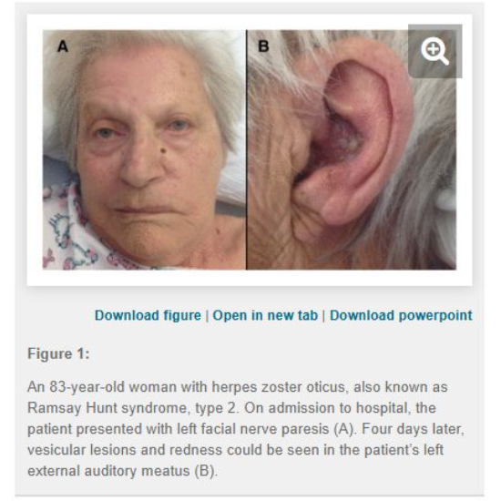
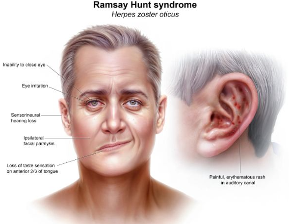
  

## 2.5-vuotias lapsi tuodaan tk-päivystykseesi samana päivänä alkaneen yskän takia. Äidin kertomana lapsi oli päivällisen yhteydessä alkanut yskiä voimakkaasti, kasvojen iho oli muuttunut sinertäväksi ja lapsi oli hengittänyt noin 10 minuutin ajan äänekkäästi ja raskaasti. Nyt vastaanotollasi lapsi hengittää normaalisti, ei yski ja leikkii normaalisti. Keuhkojen auskultaatiossa oikealla lievästi hiljaisemmat hengitysäänet. Mitä epäilet?

- a) Vierasesine hengitysteissä
- b) Vierasesine ruokatorvessa
- c) Akuutti astmakohtaus
- d) Akuutti laryngiitti

  <button class="solution-button" data-label="Vastaus" data-hide-label="Piilota vastaus">
    Vastaus
  </button>
  

      a
´
Alahengitystievierasesineen tapauksessa oireet alkavat usein voimakkaalla yskänkohtauksella. Alkuvaiheessa on usein myös hengityksen vinkumista ja jopa syanoosia. Oireet kestävät muutamia minuutteja ja loppuvat, vaikka vierasesine jää bronkukseen. Äkillisesti alkanutta voimakasta yskänkohtausta ja hengitysvaikeutta on lapsella aina pidettävä vierasesineaspiraationa, ellei muuta syytä todeta. 

Lopullinen alahengitystievierasesineiden diagnoosi perustuu bronkospiaan, joka samalla toimii hoidollisena toimenpiteenä. **Pelkkä epäilykin vierasesineestä riittää bronkoskopiaan,** koska jos asiaa jää seuraamaan, niin potilaalle voi kehittyä oireettoman vaiheen jälkeen ilkeän ja vaikeahoitoisen pneumonia, jonka yhteydessä esineen poistaminen on entistä vaikeampaa. 

Hengitysäänet kuuluvat hiljaisempina oikealla, koska vierasesine on mennyt oikeaa pääbronkusta pitkin. **Yleensä vierasesineet juuri kulkevat oikealle,** koska oikeanpuoleinen bronkus on vertikaalisemmassa kulmassa kuin vasen -> painovoima vetää oikealle helpommin. 
  

## 40-vuotiaalla aikaisemmin terveellä naisella alkoi tänään aamulla voimakas pyörittävä huimaus, pahoinvointi ja oksentelu. Kuulo on normaali. Korvat eivät soi. Kliinisessä tutkimuksessa toteat spontaanin oikealle lyövän nystagmuksen. Potilaalla on todennäköisimmin:

- a) vasemman korvan tasapainoelimestä joutuva sairaus
- b) oikean korvan tasapainoelimestä joutuva sairaus
- c) hyvänlaatuinen asentohuimaus
- d) pikkuaivoinfarkti

  <button class="solution-button" data-label="Vastaus" data-hide-label="Piilota vastaus">
    Vastaus
  </button>
  

      a

Jatkuva huimaus ja nystagmus -> akuutti vestibulaarioireyhtymä (AVS) ja on tärkeintä erottaa takaverenkierron häiriö (AVH) ja vestibulaarineuriitti. Tämä tehtäisiin HINTS plus tutkimuksella, mutta kysymyksenannossa ei testin tuloksia ole (paitsi kuulo eli "Plus"-osio normaali). Huomioiden potilaan ikä, ei kyseessä todennäköisesti ole AVH ja oirekuva muutenkin sopii hyvin vestibulaarineuriittiin. 

Syy on todennäköisesti vasemmalla, koska vestibulaarineuriitissa nystagmus lyö terveen korvan puolelle. Miksi lyö terveen korvan puolelle? Vastaus:

Jos ajatellaan fysiologiaa, niin pään ollessa suorassa molemmat vestibulaarihermot lähettävät signaaleita aivoihin samalla tahdilla, jolloin aistitaan pään olevan suorassa. Jos taas käännetään päätä esim. oikealle, niin oikea hermo alkaa signaloimaan tiheämpää tahtia ja vasen hermo hitaampaa -> tämä aistitaan pään kääntönä oikealle. Pään kääntyessä oikealle silmät taas kääntyvät vasemmalle, jos halutaan pitää katse suoraan eteenpäin (vestibulo-okulaarinen refleksi). 

Jos taas vestibulaarineuriitista johtuen toisen puolen vestibulaarihermo ei enää toimi ja lähettää signaaleita merkittävästi hitaammin kuin terve puoli, niin silloin lepotilassakin pään ollessa suorassa aistitaan, että pää olisi kääntynyt terveelle puolelle, joka signaloi normaaliin tahtiin. Jos esimerkiksi vasen vestibulaarihermo on heikosti toimiva vasemmanpuolisen vestibulaarineuriitin takia, niin tämä aistitaan pään kääntönä oikealle. Silmät yrittävät vastata tähän aistimukseen vetäytymällä vasemmalle. Pää ei kuitenkaan oikeasti ole kääntynyt, joten tämä silmien virheliike korjataan nopeasti, jolloin silmät palaavat takaisin oikealle (eli tässä esimerkissä terveen korvan suuntaan) ja tämä havaitaan nystagmuksen nopeana komponenttina -> nystagmus on terveen korvan suuntaan horisontaalinen ja sen mukana on usein vaihtelevan vahvuinen rotatorinen komponentti, jonka suunta on myös terveen korvan suuntaan. 

c: Huimaus BPPV:ssä kestää < 1-2 min ja tapahtuu kohtauksittaisesti. 

  

## Minkälainen nystagmus sopii parhaiten korvaperäiseen huimaukseen?

- a) Suuntaa vaihtava
- b) Horisontaalis-rotatorinen
- c) Vertikaalinen
- d) Maahanpäin lyövä

  <button class="solution-button" data-label="Vastaus" data-hide-label="Piilota vastaus">
    Vastaus
  </button>
  

      b

Esim. vestibulaarineuriitille on tyypillistä terveelle puolelle lyövä horisontaalis-rotatorinen nystagmus. Hyvänlaatuisessa asentohuimauksessa (BPPV) nystagmus ei ole jatkuvaa, mutta voidaan saada Dix-Hallpikella indusoitua; tyypillinen on sairaan korvan puolelle kiertävä nystagmus. 

a: Suuntaa vaihtava (bidirektionaalinen) nystagmus herättää aina huolen sentraalisesta nystagmuksesta. Bilateraalinen/Bidirektionaalinen = Nystagmus vaihtaa suntaa (eli nopea komponentti vaihtaa suuntaa) katsetta kohdistettaessa ensin toiselle sivulle ja sitten toiselle

c-d: Vertikaalisesti liikkuvat nystagmukset herättävät aina huolta sentraalisesta nystagmuksesta. 

Tässä on bidirektionaalinen nystagmus 

Tässä on horisontaalis-rotatorinen nystagmus oikealle. 

Tässä on vertikaalinen nystagmus 

  

## Diagnosoit potilaalla äkillisen kuulonmenetyksen oikealla. Mitkä ovat äänirautakokeiden tulokset?

- a) Rinne +/+, Weber lateralisoi oikealle
- b) Rinne -/+, Weber ei lateralisoi
- c) Rinne +/+, Weber lateralisoi vasemmalle
- d) Rinne -/+, Weber lateralisoi oikealle

  <button class="solution-button" data-label="Vastaus" data-hide-label="Piilota vastaus">
    Vastaus
  </button>
  

      c

Äkillisellä kuulonmenetyksellä tyypillisesti tarkoitetaan idiopaattista sensorineuraalista kuulonmenetystä. Se tarkoittaa tilaa, jossa sensorineuraalinen kuulo huononee vähintään kolmella vierekkäisellä taajuudella ≥ 30 dB alle 3 vrk:n aikana tuntemattomasta syystä. Akillisen kuulonmenetyksen ilmaantuvuus on 8–15/100 000 henkeä/vuosi -> saattaa tulla vastaankin. Etiologiaksi on epäilty sisäkorvan verenkiertohäiriötä (epätodennäköinen, kun ilmaantuu eniten 30-60-vuotiaiden joukossa), virustulehdusta, autoimmuunisairautta (ehkä todennäköisin), sisäkorvan kalvorepeämää tai sisäkorvan solujen stressireitin poikkeavaa aktivaatiota. Korva on inspektoiden normaali.

Koska on sensorineuraalinen kuulonmenetys ja yleensä unilateraalinen, niin todetaan sensorineuraalisen kuulovian kuva äänirautakokeissa. 

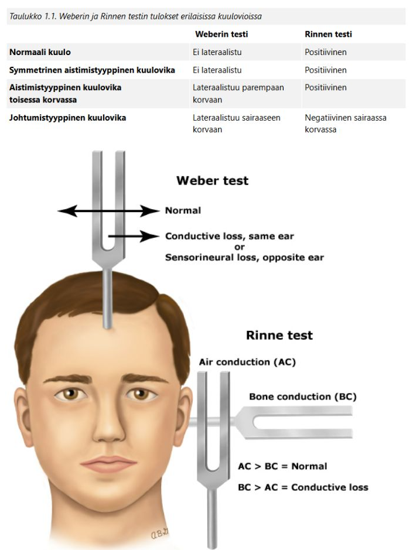
  

## Teet 42-vuotiaalle miehelle poskionteloiden ultraäänitutkimuksen sinuiittiepäilyn vuoksi. Mikä seuraavista on tyypillinen UÄ-löydös bakteeriperäisessä akuutissa poskiontelotulehduksessa?

- a) Kaiku 1,5 cm kohdalla
- b) Kaiku 2,5 cm kohdalla
- c) Useat kaiut välillä 0–3 cm
- d) Kaiku 5 cm kohdalla

  <button class="solution-button" data-label="Vastaus" data-hide-label="Piilota vastaus">
    Vastaus
  </button>
  

      d

Eritesisältöinen ontelo antaa takaseinäkaiun n. 4-7 cm:n syvyydestä. Anturin oikea suuntaaminen poskiontelon takaseinää kohti on tärkeää (jos suuntaa liian lateraalisesti, niin saa terveestäkin ontelosta takaseinäkaiun). 

Kun poskiontelo on ilmapitoinen ja limakalvoltaan normaali, ultraääni heijastuu ontelon etuseinästä ja saadaan tyypillisesti n. 1-2cm:n syvyydestä kaiku. 

  

## Teet 38-vuotiaalle poskisärystä ja paineoireesta kärsivälle potilaalle poskiontelopunktion. Neulan asettamisen jälkeen sen läpi alkaa valua kirkasta oljenkeltaista nestettä. Mikä on diagnoosi?

- a) Kysta
- b) Polypoosi
- c) Bakteeriperäinen poskiontelotulehdus
- d) Likvorvuoto poskionteloon

  <button class="solution-button" data-label="Vastaus" data-hide-label="Piilota vastaus">
    Vastaus
  </button>
  

      a

Kirkas, oljenkeltainen neste on tyypillistä poskiontelon retentiokystalle, joka on hyvänlaatuinen limakalvon liman retentiosta johtuva muutos. Kystat ovat yleensä oireettomia ja todetaan sattumalta, mutta voivat aiheuttaa poskiontelon paineoireita ja kipua. Eivät yleensä aiheuta infektiota tai märkäistä eritettä. 

Kystan diagnostiikka perustuu kliiniseen tutkimukseen ja tarvittaessa kuvantamiseen, ja kirkas neste erottaa sen bakteeriperäisestä sinuiitista, jossa erite on yleensä sameaa tai märkäistä.

b: Polyposis voi aiheuttaa tukkoisuutta ja paineoireita, mutta ei tyypillisesti johda kirkkaan nesteen erittymiseen poskiontelopunktiossa. 

c: Bakteeriperäisessä sinuiitissa erite on yleensä sameaa, kellertävää tai vihertävää, ja siihen liittyy usein kuume ja voimakkaampi infektio-oireisto.

d: Liittyy trauma- tai leikkaushistoriaan, ja yleensä kirkasta vetistä vuotoa voi tulla nenästä

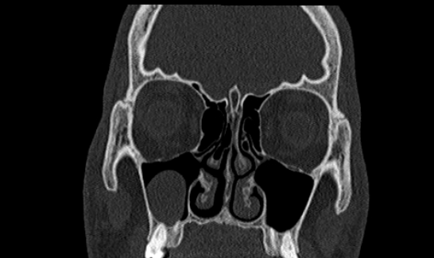
  

## Epäilet 19-vuotiaalla kausiluonteista nuhaa sairastavalla potilaalla koivuallergiaa. Mikä seuraavista väitteistä ei pidä paikkaansa?

- a) Allergisessa nuhassa nenän limakalvot voivat olla lividit.
- b) Allerginen nuha on astman riskitekijä.
- c) Kaikilla atoopikoilla esiintyy allergista nuhaa.
- d) Allerginen nuha voi olla ympärivuotista.

  <button class="solution-button" data-label="Vastaus" data-hide-label="Piilota vastaus">
    Vastaus
  </button>
  

      c

Kaikilla atoopikoilla ei ole allergista nuhaa; atopia tarkoittaa taipumusta tuottaa IgE-vasta-aineita harmittomia aineita vastaan (eli taipumusta herkistyä tavallisille elinympäristössä oleville allergeeneille), mutta kliinisiä oireita (nuha, ihottuma, astma) ei välttämättä esiinny kaikilla. 

a: Lividi = sinertävä tai harmahtava väri; Allergisessa riniitissa nenämukoosa on oikeastaan tyypillisesti kalpea/sinertävä eikä suorastaan punertava (vaikka voikin olla) väriltään

b: Yleisin komorbiditeetti (toinen sairaus) potilailla, joilla on allerginen riniitti, on astma. Jopa 80 % astmapotilaista sairastaa kroonista riniittiä, ja allergista riniittiä sairastavista noin 20-40 %:lla on astma. Allergista riniittiä sairastavalla on 2-3 kertainen elinaikainen riski sairastua astmaan verrattuna henkilöön, joka ei sairasta allergista riniittiä. Hoitamaton allerginen nuha lisää astmaan sairastumisen riskiä. 

d: Voi olla, jos altistuminen on ympärivuotista (esim. kotona eläin, jolle on allerginen). 
  

## Potilas on ollut tappelussa, ja saanut syvän viiltohaavan korvan eteen oikealle. Toteat hänellä totaalin perifeerisen kasvohermohalvauksen oikealla. Miten toimit?

- a) Suturoit haavan ja pyydät potilaan kontrolliin parin päivän päästä. Halvaus todennäköisimmin liittyy turvotukseen, ja hermon toiminta tulee palautumaan.
- b) Suturoit haavan ja teet potilaasta kiireettömän lähetteen erikoissairaanhoitoon.
- c) Lähetät potilaan päivystyksenä erikoissairaanhoitoon.
- d) Suturoit haavan ja aloitat profylaktisen antibioottikuurin.

  <button class="solution-button" data-label="Vastaus" data-hide-label="Piilota vastaus">
    Vastaus
  </button>
  

      c

Potilaalla on totaalinen perifeerinen kasvohermohalvaus viiltohaavan yhteydessä → tämä viittaa suoraan hermovaurioon. Terävä hermon katkeaminen -> tavoitteena usein välitön korjaus. Tylpissä venytysvammoissa voisi ehkä jäädä seuraamaan. 
  

## Potilaalla on kasvoissa selkeä heikkous vasemmalla suupielessä, mutta otsa rypistyy symmetrisesti. Potilaalla on:

- a) perifeerinen kasvohermohalvaus vasemmalla
- b) N. hypoglossuksen toiminnan häiriö vasemmalla
- c) N. trigeminuksen sentraalinen halvaus
- d) sentraalinen vaurio oikealla

  <button class="solution-button" data-label="Vastaus" data-hide-label="Piilota vastaus">
    Vastaus
  </button>
  

      d

Aivohermon VII ylemmän mononeuronin leesiot johtavat kontralateraaliseen pareesiin kasvojen alemmissa lihaksissa. Otsan lihakset säästyvät bilateraalisen hermotuksen takia. Motorisella aivokuorella olevat kasvojen yläosasta vastaavat ylemmät motoneuronit hermottavat molempia tumakkeita, kun taas alaosasta vastaavat hermottavat vain vastakkaisen puolen tumaketta.

a: Perifeerisessä kasvohermohalvauksessa (eli kasvohermotumakkeen tai sen jälkeisen CN VII vaurioituminen), jossa vika on alemmassa motoneuronissa, sekä ylä- että alakasvojen mimiikka katoaa vaurion puolella

b: CN XII eli hypoglossaalihermo säätelee kielen motorista toimintaa ja leesiot sen alempaan motoneuroniin johtaa kielen deviaatioon leesion ipsilateraaliselle puolelle. Ylemmän motoneuronin vauriossa taas deviaatio suuntautuu vaurion vastapuolelle (usein ei ole kuitenkaan esillä) 

c: Trigeminus (CN V) hermottaa kasvojen tuntoa ja puremisen lihaksia, ei kasvolihaksia -> ei suupielen roikkumista. 

  

## Mikä seuraavista EI ole indikaatio nielurisojen poistolle?

- a) Neljä nielutulehdusta vuoden sisällä
- b) Kolme ylähengitystieinfektiota puolen vuoden sisällä
- c) Toistuva nielupaise
- d) Krooninen nielurisatulehdus

  <button class="solution-button" data-label="Vastaus" data-hide-label="Piilota vastaus">
    Vastaus
  </button>
  

      b

Aikuisilla nielurisatulehdukset ovat yleisin leikkauksen syy. Potilaan voi lähettää kiireettömästi leikkausarvioon, jos on toistuva akuutti nielutulehdus vähintään 3x puolen vuoden kuluessa tai 4x vuoden kuluessa tai jos on pitkäaikaisia nielutulehdusoireita yli 3kk ajan (jatkuva tai aaltoileva kurkkukipu). Nielupaiseen yhteydessä on yleinen käytäntö poistaa nielurisat aikuisilla toisen paiseen paiseen yhteydessä (lapsilla usein jo ensimmäisen yhteydessä ns. kuuman vaiheen tonsillektomiana). 
  

## Nielupaise. Kaikki muut pitävät paikkansa PAITSI:

- a) Nielupaiseen diagnostiikassa nielun palpaatio sormella, spaattelilla tai pumpulipuikolla on hyvä apu.
- b) Nielupaiseen hoito vaatii anaerobisiin bakteereihin tehoavan mikrobilääkkeen inkision tai aspiraation lisäksi.
- c) Yleinen oire nielupaiseeseen liittyen on korvaan säteilevä kipu.
- d) Nielupaiseen erotusdiagnostiikassa on muistettava lymfooma, varsinkin jos oireet ovat lievät ja hiljalleen kehittyneet.

  <button class="solution-button" data-label="Vastaus" data-hide-label="Piilota vastaus">
    Vastaus
  </button>
  

      b

Kun paise avautuu hyvin ja potilas on kliinisesti hyvävointinen, ensisijainen mikrobilääke on fenoksimetyylipenisilliini (aikuiselle 1 milj IU x3/vrk), jonka kestoksi suositellaan 10 vrk.

Vain jos paise ei avaudu, peritonsilliitin hoidossa katetaan anaerobiset taudinaiheuttajat laajempikirjoisella mikrobilääkkeellä (penisilliinin lisäksi määrätään aikuisille metronidatsolia 400 mg × 3/vrk)

a: On hyvä tunnustella paiseen konsistenssia 

c: Totta 

d: Lymfooma voi aiheuttaa hitaasti kehittyvän toispuolisen tonsillan suurenemisen 
  

## Miten erotat perifeerisen kasvohermohalvauksen sentraalisesta?

- a) Perifeerisessä halvauksessa koko toinen puoli kasvoista on halvaantunut
- b) Perifeerisessä halvauksessa toinen kulmakarva ei nouse
- c) Perifeerisessä halvauksessa vain toinen suupieli roikkuu
- d) Perifeerisessä halvauksessa molemmat suupielet roikkuvat

  <button class="solution-button" data-label="Vastaus" data-hide-label="Piilota vastaus">
    Vastaus
  </button>
  

      a

Sentraalisessa pareesissa pääasiassa todetaan vain alakasvojen lihasten pareesi -> leesiosta kontralateraalinen suupieli roikkuu

  

## Mikä on tyypillinen löydös Ramsay Huntin syndroomassa?

- a) rengasihottuma
- b) rakkulat korvan seudussa
- c) herpeskeratiitti
- d) huuliherpes

  <button class="solution-button" data-label="Vastaus" data-hide-label="Piilota vastaus">
    Vastaus
  </button>
  

      b

Korvan alueen vyöruusua kutsutaan usein (tyypin 2) Ramsay Hunt -oireyhtymäksi, jolle on tyypillistä triadi: korvan kipu, rakkulat korvanlehdessä (voi myös olla suun ja nielun alueella) ja perifeerinen kasvohermohalvaus. 

VZV pysyy primaari-infektion jälkeen kehossa dormanttina dorsaalisissa hermoganglioissa ja aivohermoissa ja voi vuosia myöhemmin reaktivoitua iän tai muun immunosuppression myötä aiheuttaen vyöruusua (useimmiten unilateraalisesti vartalolla). Vesirokkoviruksen (VZV) reaktivaatio ganglion geniculin alueelta aiheuttaa (Tyypin 2) Ramsay Huntin oireyhtymän, jolle on perifeerisen kasvohalvauksen lisäksi herpesrakkuloita, yleisimmin korvassa. Osalle potilaista ilmaantuvat rakkulat siis vasta kasvohermohalvauksen alkamisen jälkeen ja diagnoosiksi voi ensikäynnillä tulla virheellisesti Bellin pareesi. Tämän takia potilaalle sanotaan, että on yhteydessä, jos korvan, suun tai nielun alueelle ilmenee rakkuloita tai kipua. 

Ramsay Huntin oireyhtymässä on usein facialishermon lisäksi vestibulokokleaarihermon affisioitumista. Ramsay-Huntin syndroomassa (korvan alueen vyöruusu) onkin oireina kasvohalvauksen lisäksi usein sensorineuraalinen kuulonlasku (jopa korvan kuuroutuminen), tinnitus ja huimaus

Korvan alueen vyöruusupotilas on syytä lähettää KNK-yksikköön, varsinkin jos tilaan liittyy kasvohermohalvaus, kuulo- tai tasapainomuutoksia tai voimakasta kipua. Tärkein hoito on valasikloviiri 1gx3/vrk p.o. 7 vrk ajan. Myös glukokortikoidia käytetään (samalla tavalla kuin Bellin pareesissa 10vrk ajan), mutta tämä ei ole yhtä tärkeää ja sen näytönaste on D -> voi olla käyttämättäkin, jos potilaalla on pieniäkin vasta-aiheita (esim. diabetes) 

  

## Epäilet kurkkukipuisella potilaallasi epiglottiittia. Valitse alla olevista oikea vaihtoehto:

- a) syljen nielemisen onnistuminen poissulkee epiglottiitin
- b) potilaat pyrkivät yleensä etukumaraan asentoon
- c) potilaan suunielussa on aina tulehdusmuutoksia
- d) epiglottiittiin liittyy yleensä kurkunpään alapuolisten rakenteiden turpoamista

  <button class="solution-button" data-label="Vastaus" data-hide-label="Piilota vastaus">
    Vastaus
  </button>
  

      b

Kun oireet ovat voimakkaita, potilas pyrkii vaistomaisesti etukumaraan istuvaan asentoon (tripod asento), jottei turpea kurkunkansi pääsisi painumaan taaksepäin hengitystien esteeksi. 

a: Syljen nielemisen epäonnistuminen ja sen aiheuttama kuolaaminen on epiglottiitille tyypillistä, mutta varsinkin alkuvaiheissa syljen nieleminen kyllä vielä onnistuu 

c: Epiglottiitti on kurkunkannen tulehdus eikä se aina näy tulehduksena suunielussa 

d: Liittyy enemmänkin kurkunpään yläosien turvotus (supraglottiitti). Alaosien umpeutuminen taas on tyypillisempää pienten lasten laryngiitille (pseudokruppi). 
  

## Hätätrakeostomialla eli koniotomialla tarkoitetaan

- a) kannurustojen (cartilago arytenoidea) välistä tehtävää reittiä kaulan ihon ja trakean välillä
- b) kieliluun superioripuolelle tehtävää avausta, jolla saadaan ilmaväylä nieluun
- c) kilpiruston (cartilago thyroidea) ja sormusruston (cartilago cricoidea) väliin tehtävää ilmatieavausta
- d) alakaulalle kilpirauhasen läpi tehtävää ripeää ilmatieavausta

  <button class="solution-button" data-label="Vastaus" data-hide-label="Piilota vastaus">
    Vastaus
  </button>
  

      c

Koniotomia tehdään hätätilanteessa, jossa potilasta uhkaa tukehtuminen ylähengitystie-esteen takia ja mahdollista vierasesinettä ei ole saatu poistettua ja kun intubointi tai ventilaatio maskilla ei onnistu/ole valmiutta siihen. 

Toimenpiteessä palpoidaan kilpiruston ja sormusruston välinen alue ja mennään lig. cricothyroideum (medianum) eli cricothyroid membrane -rakenteesta läpi yhdellä viillolla, jonka jälkeen sisälle työnnettään ohut intubaatioputki tai pieni trakeostomiakanyyli. 

  

## Kielen värinä on merkittävä kliininen löydös. Toispuoleisena oire viittaa tietyn hermon vaurioon. Minkä?

- a. n. hypoglossus
- b. n. facialis
- c. n. glossopharyngeus
- d. n. lingualis

  <button class="solution-button" data-label="Vastaus" data-hide-label="Piilota vastaus">
    Vastaus
  </button>
  

      c

N. hypoglossus eli CN XII on kielen motorisesta toiminnasta vastaava aivohermo. Kielen faskikulaatioiden tautalla voi olla mm. ALS, joka on tärkein aivohermon XII alemman motoneuronin toimintaan vaikuttava sairaus. 

Alle olevassa videossa potilaalla on ALS:n aiheuttamat kielifaskikulaatiot.

b: N. facialis on kasvolihasten aivohermo, ei kielen. Se kyllä hermottaa anteriorisen kielen makuaistia, mutta ei osallistu kielen motoriikkaan 

c: Makuaistista kielen takaosassa, mutta ei osallistu kielen lihasten hermotukseen

d: N. lingualis on trigeminuksen n. mandibulariksen (CN V3) haara ja vastaa kielen tuntoaistista, mutta ei ole motorinen hermo 

  

## Mikä on vuotavan putkikorvan ensisijainen hoito?

- a. Putken poisto paikallispuudutuksessa ja huolellinen huuhtelu
- b. Riittävän tehokas kivun hoito
- c. Antibiootti suun kautta 5-7 vuorokautta
- d. Paikallinen antibiootti+kortisonitippa 5-7 vuorokautta

  <button class="solution-button" data-label="Vastaus" data-hide-label="Piilota vastaus">
    Vastaus
  </button>
  

      d

Jos putkikorvapotilaalla todetaan ylähengitystieinfektion yhteydessä märkäistä vuotoa korvassa, voidaan diagnosoida äkillinen välikorvatulehdus (AOM). Putkikorvaan liittyvän äkillisen välikorvatulehduksen riskitekijät ovat samat kuin äkillisessä välikorvatulehduksessa, samoin patogeenit (Streptococcus pneumoniae, Haemophilus influenzae ja Moraxella catarrhalis sekä Streptococcus pyogenes).

Hoitona ensisijaisesti pelkkä paikallinen antimikrobiaalitippahoito (ja yhdessä usein kortikosteroidi), esim. siprofloksasiini + hydrokortisoni tai siprofloksasiini + fluosinoloni. Tippoja käytetään  5–7 vrk:n ajan. Paikallinen hoito on tehokkaampaa kuin suun kautta otettava mikrobilääkehoito ja haittavaikutukset ovat vähäisemmät. 

a: Putkia ei poisteta yleensä mekaanisesti, ne poistuvat itsessään 2 vuoden sisällä epiteelimigraation takia. 

b: Antimikrobiaalihoito on aiheellista välikorvatulehduksessa

c: Hoitoon tulee liittää suun kautta otettava antibiootti, jos lapsi on voimakasoireinen tai vuoto jatkuu yli viikon tippahoidosta huolimatta (joissain lähteissä, kuten dioissa aikaraja on 3-4pv). 
  

## Korvaoireinen potilas tulee kiireettömälle vastaanotolle. Missä seuraavista tilanteista sinun tulisi epäillä kroonista välikorvantulehdusta ja kolesteatoomaa?

- a. Potilaalla on kuulo heikentynyt toispuoleisesti. Korvakäytävään kertyy paljon vaikkua.
- b. Potilaalla on ollut toistuvasti korvan vuotamista, joka rauhoittuu tippakuurilla. Korvakäytävä on muuten siisti, mutta tärykalvon seudussa on karstaa joka ei irtoa huuhtelulla.
- c. Potilaalla on kroonista korvakipua.
- d. Potilaalla on aina flunssan yhteydessä paineen tunnetta ja kipua korvassa ja korva on joskus puhjennutkin.

  <button class="solution-button" data-label="Vastaus" data-hide-label="Piilota vastaus">
    Vastaus
  </button>
  

      b

Kolesteatooma (helmiäinen) viittaa keratiinikertymään yleensä välikorvassa/kartiolisäkkeessä. Korvakäytävän tai tärykalvon ihon keratinisoituva levyepiteeli kasvaa välikorvan ja kartiolisäkkeen sisään ja muodostaa sinne luuta syövyttävän, kasvainta muistuttavan massan. Taustalla on usein reunanmyötäinen tärykalvoperforaatio, jonka kautta tärykalvon tai korvakäytävän ihon epidermistä kasvaa välikorvan puolelle. 

Krooninen välikorvatulehdus syntyy useimmiten jatkumona äkillisen välikorvatulehduksen jälkeen. Korva vuotaa märkää tärykalvoperforaation kautta joko jatkuvasti tai ajoittain. Äkillisen välikorvatulehduksen katsotaan muuttuneen krooniseksi, kun oireet ovat kestäneet yli 3 kk. Kroonisen välikorvatulehduksen taudinkuva on hyvin monimuotoinen ja se voidaan jakaa aktiiveihin (märkäinen krooninen korvatulehdus sekä kolesteatooma) ja inaktiiveihin tautitiloihin (tärykalvon reikä, kuuloluuketjun katkos, adhesiiviotiitti).

Potilaan toistuvat vuotamiset korvasta viittaavat krooniseen välikorvatulehdukseen. Irtoamaton karsta viittaa kolestatoomaan.  

  

## Potilaalla on suukipua, knk-statuksessa huomaat limHuulen limakalvomuutosakalvolla seuraavanlaisen muutoksen. Mikä on ensisijainen diagnoosi ja hoito?

a. Krooninen kandidoosi, hoitona laaja-alainen interventio yhteistyössä hammaslääkärin kanssa
b. Akuutti hiivatulehdus, hoitona flukonatsoli suonensisäisesti
c. Herpeettinen suutulehdus (Stomatitis herpetica), hoitona asikloviiri tai valasikloviiri sekä riittävä kipulääkitys
d. Limakalvon afta, potilasinformaatio ja tarvittaessa paikallishoitotuotteiden kokeilu

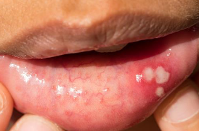

  <button class="solution-button" data-label="Vastaus" data-hide-label="Piilota vastaus">
    Vastaus
  </button>
  

      d

Aftat ovat suun kipeitä, pyöreitä tai soikeita haavaumia, jotka uusiutuvat vaihtelevin väliajoin ja parantuvat itsekseen 1–6 viikossa. Etiologia ei aina selvä: mm. stressi, tupakoinnin lopettaminen ja natriumlauryylisulfaattia sisältävät hammastahnat voivat laukaista. Uusiutuvat aftat voivat liittyä sairauksiin, kuten keliakiaan, stressiin, ruoka-allergiaan, vitamiinipuutteisiin, lääkkeisiin ja hormonaalisiin tekijöihin. 

Niitä voi esiintyä huulten sisäpinnalla, posken limakalvolla, suunpohjassa, kielessä, lakikaarissa ja jopa epiglottiksessa. Uusiutuessaan ne ilmenevät yleensä eri paikassa. Leesio on kivulias, mutta vaaraton. 

Hoitona käytetään mm. paikallista lidokaiinia, sekä paikallista ja systeemistä kortikosteroidia. Myös biologisia lääkkeitä kuten anti-TNF alfa vasta-aineita tutkitaan. Hyvä suuhygienia on tärkeää. Hammastahnaksi suositellaan vaahtoamatonta valmistetta.
  

## Potilas tulee vastaanotolle tulosyyllä "nielemisvaikeus/palantunne". Mikä alla olevista on oikein?

- a. Yli vuoden kestäneet ajoittaiset nielemisvaikeudet viittaavat vahvasti psyykkisperäiseen vaivaan.
- b. Ajoittaiset nielemisvaikeudet, jotka eivät tunnu riippuvan nieltävän ruoan konsistenssista, viittaavat ruokatorven perforaatioon tai akuuttiin epiglottiittiin.
- c. Muutamien viikkojen tai kuukausien aikana kehittynyt iäkkään potilaan hiljalleen paheneva nielemisvaikeus, johon liittyy laihtuminen, viittaa vahvasti kasvaimeen.
- d. Jos nielemisvaikeuden tunne ja palan tunne nielussa on kestänyt yli 3 kk, vaatii se jatkotutkimuksia erikoissairaanhoidossa (aina MRI-kuvaus).

  <button class="solution-button" data-label="Vastaus" data-hide-label="Piilota vastaus">
    Vastaus
  </button>
  

      c

Tämä on klassinen maligniteetin hälytyskuva eli iäkäs potilas, progressiivinen oire ja laihtuminen -> syöpä, kunnes toisin todistetaan

a: Pitkäkestoinen ja ajoittainen oire voi olla funktionaalinen, mutta ei nyt suoraan vahvasti viittaa siihen 

b: Ruokatorven perforaatio ja epiglottiitti ovat äkillisiä, rajuoireisia ja usein henkeä uhkaavia -> eivät aiheuta "ajoittaisia" nielemisvaikeuksia. 

d: Palan tunne (globus) ei todellakaan aina vaadi MRI:tä ja on usein funktionaalinen 
  

## Millä tasolla hermovaurio on sentraalisessa kasvohermohalvauksessa?

- a. hypothalamuksessa
- b. tumaketasolla aivosillassa
- c. aivorungon tumaketason yläpuolella
- d. ganglion geniculissa

  <button class="solution-button" data-label="Vastaus" data-hide-label="Piilota vastaus">
    Vastaus
  </button>
  

      c

Sentraalisessa kasvohermohalvauksessa hermovaurio on tumaketason yläpuolella ja seurauksena on toisen puolen alempien kasvolihasten toiminnan heikkeneminen. Erityisesti vastakkaisen puolen suupielen jäykkä liikkumattomuus; ylemmät lihakset, kuten otsan, säästyvät bilateraalisen hermotuksen takia. 

Perifeerisessä kasvohermohalvauksessa hermovaurio on tumaketasolla aivosillassa tai sitä perifeerisemmin ja ja seurauksena on mm. saman puolen kasvonlihasten toiminnan heikkeneminen

a: Hypothalamus ei ole kasvohermon motorisen säätelyn pääasiallinen rakenne

b: Tumaketason vaurio aiheuttaa perifeerisen kasvohermohalvauksen

d: Ganglion geniculi kuuluu perifeeriseen kasvohermoon ja sijaitsee canalis nervi facialiksessa temporaaliluussa. Vesirokkoviruksen (VZV) reaktivaatio ganglion geniculin alueelta aiheuttaa (Tyypin 2) Ramsay Huntin oireyhtymän, jolle on perifeerisen kasvohalvauksen lisäksi herpesrakkuloita, yleisimmin korvassa.

  

## Millainen kuulovika on tyypillinen alkuvaiheen Menieren taudille?

- a. Toispuolinen aistimistyyppinen
- b. Molemminpuolinen aistimistyyppinen
- c. Toispuolinen johtumistyyppinen
- d. Molemminpuolinen johtumistyyppinen

  <button class="solution-button" data-label="Vastaus" data-hide-label="Piilota vastaus">
    Vastaus
  </button>
  

      a

Yleensä Menieren tauti alkaa unilateraalisena (vain toisessa korvassa), mutta etenee suurella osalla bilateraaliseksi. Lähteestä riippuen n. 10-50% lopulta kehittää bilateraalisen taudinkuvan. Taudin pitkittyessä pysyviä vaurioita; tauti on siis useimmiten progressiivinen. Kuulovika jää pysyväksi, kaikkia taajuuksia koskevaksi, mutta tauti ei kuitenkaan kuurouta korvaa täysin.

Ménièren tauti = idiopaattinen endolymfaattinen hydrops. Tasapainoelimen nestetilojen, peri- ja endolymfan ionipitoisuuksien ajatellaan häiriintyvän ja sen seurauksena tasapainoelimen toiminta häiriintyy kohtauksellisesti. Yleensä vain toisessa korvassa. Taudin pitkittyessä pysyviä vaurioita. Ménièren taudin diagnoosi perustuu kliiniseen kuvaan ja tyypilliset oireet voi muistaa säännöstä 4H: Huimaus (voimakas kiertohuimaus), Humina (suhina, paineen tunne korvassa), Huonokuuloisuus matalilla äänillä (sensorineuraalinen), Huonovointisuus (ja oksentelu). 
  

## Vestibulaarineuroniittiin voi liittyä…

- a. bassopään kuulonalenema
- b. sairastuneen korvan tinnitus
- c. oksentelua
- d. jatkuva suuntaa vaihtamaton vertikaalinen nystagmus

  <button class="solution-button" data-label="Vastaus" data-hide-label="Piilota vastaus">
    Vastaus
  </button>
  

      c

Oksentelu ja pahoinvointi on tyypillistä vestibulaarineuriitin huimauksen yhteydessä. 

a: Kuulo on tyypillisesti normaali. Kuulon alenema huimauksen aikana ohjaa ajatukset sentraaliseen syyhyn (HINTS plus -testin "plus"-osa tarkoittaa kuulon testaamista bedside)

b: Ei aiheuta tinnitusta; tinnitus liittyy enemmänkin harvinaiseen labyrintiittiin (samoin kuten kuulonalenema, jos syy ei ole sentraalinen). 

d: Vertikaalinen nystagmus on tyypillistä sentraaliselle huimaukselle 
  

## Vestibulaarineuroniittia voidaan hoitaa

- a. amoksisilliinillä
- b. beetahistidiinillä
- c. prednisolonilla
- d. Epleyn manoverilla

  <button class="solution-button" data-label="Vastaus" data-hide-label="Piilota vastaus">
    Vastaus
  </button>
  

      c

**Itsestäänrajoittuneisuuden takia vestibulaarineuriitin ensisijainen hoito on seuranta ja oireenmukainen hoito.** Vestibulaarineuriitin akuutti vaihe helpottaa tyypillisesti itsestään n. 2-3 päivässä (jopa 1-2vk). Jonkinlainen jäännösoireisto jää usein viikkojen ja jopa kuukausien ajaksi. 

Alkuun tarvittaessa lyhytkestoisesti pahoinvointilääke. Tasapainoelimen toimintaa lamaavien lääkitysten, kuten pahoinvointilääkkeiden, käyttöä pyritään rajoittamaan vain lyhytkestoiseksi, jotta sentraalinen kompensaatio ei estyisi. Osastohoidon aikana pahoinvointiin tehokkaimmin vaikuttaa droperidoli (DHBP, 0,625 mg suoneen tarvittaessa toistettuna 1-3 kertaa). Ondansetronia on saatavilla myös kielenalustablettina, mikä helpottaa sen antamista pahoinvoivalle potilaalle (4 mg 1-4 kertaa vuorokaudessa).

**Glukokortikoidihoidon hyötyyn liittyy eräistä positiivisista tutkimustuloksista huolimatta merkittävää epävarmuutta ja suuri osa suomalaisistakin artikkeleista ottaa kannan, että glukokortikoidihoidon käyttöä ei voida pitää erityisen hyvin perusteltuna. Joskus sitä kuitenkin käytetään, toisin kuin näitä muita vaihtoehtoja.**

a: Vesibulaarineuriitti ei ole bakteeritauti (taustalla todennäköisesti jokin virusinfektio). 

b: Beetahistiiniä käytetään Menieren taudin peruslääkkeenä. 

d: Epleyn manööveri on posteriorisen kanavan BPPV:n ensisijainen hoito. 
  

## Tukkoinen nenä ja kurkkukipua

51-vuotias mies tulee vastaanotolle. Potilaalla ei ole allergioita eikä mitään jatkuvia nenäoireita tai toistuvia bakteeriperäisiä rinosinuiitteja aiemmassa anamneesissa. Oireet alkoivat 3 päivää sitten. Potilaalla on pientä kurkkukipua. Nenä on tukkoinen ja vuotaa enimmäkseen kirkasta eritettä. Lisäksi poskissa on paineen tunnetta. Kuumetta ei ole. Mikä seuraavista vaihtoehdoista on todennäköisin diagnoosi?

- a. Virusflunssa
- b. Krooninen polypoottinen rinosinuiitti
- c. Vasomotorinen nuha
- d. Akuutti bakteeriperäinen rinosinuiiti

  <button class="solution-button" data-label="Vastaus" data-hide-label="Piilota vastaus">
    Vastaus
  </button>
  

      a

Kuulostaa ihan tyypilliseltä flunssalta. 

b: Ei ole viitteitä kroonisesta oireilusta. 

c: Ei-infektioperäinen nuha, jota laukaisee esim. hajut, stressi, lämpötilanvaihtelut... Tyypillisesti ei kuitenkaan kurkkukipua tai tällaista flunssamaista kokonaiskuvaa

d: Ei viitteitä bakteeri-infektiosta (märkäisyyttä ja pitkittyneitä/uudestaan pahentuneita oireita)
  

## Minkä pään ja kaulan alueen syövän ilmaantuvuus on eniten lisääntynyt viime vuosien aikana?

- a. kurkunpään syöpä
- b. huulisyöpä
- c. nielusyöpä
- d. kielisyöpä

  <button class="solution-button" data-label="Vastaus" data-hide-label="Piilota vastaus">
    Vastaus
  </button>
  

      c

Pään ja kaulan alueen syöpien kokonaisilmaantuvuus on nousussa, mutta erityisesti tätä nostavat nielusyöpien yleistyminen. Pääasiassa nousu johtuu HPV16:n lisääntymisestä, joka on nykyään yleisin nielusyövän riskitekijä. Myös suuontelon syövät ovat vahvassa nousussa; tämäkin osittain HPV:sta johtuen (yhteys kuitenkin kiistanalainen). 

Huulisyöpien ja kurkunpään syöpien ilmaantuvuus on taas vähentynyt viime vuosikymmeninä. 

  

## Toteat lapsipotilaalla perifeerisen kasvohermohalvauksen ja otiitin. Miten toimit?

- a. Aloitat antibiootin ja pyydät viikon kuluttua kontrolliin.
- b. Aloitat antibiootin ja steroidin ja pyydät viikon kuluttua kontrolliin.
- c. Teet parasenteesin, aloitat antibiootin, ja pyydät viikon kuluttua kontrolliin.
- d. Teet potilaasta päivystyslähetteen erikoissairaanhoitoon.

  <button class="solution-button" data-label="Vastaus" data-hide-label="Piilota vastaus">
    Vastaus
  </button>
  

      d

Kasvohermohalvauksen hoito kuuluu aina erikoissairaanhoitoon, jos sen taustalla epäillään olevan otiitti. Lasten facialispareesit tulee muutenkin lähettää aina KNK- tai lastentautien yksikköön (jotkut aikuisten facialispareesit voi hoitaa ainakin aluksi PTH:ssa, jos on suhteellisen varma, että kyseessä on Bellin pareesi). 
  

## 75-vuotiaalla miehellä on alkanut vuorokautta aiemmin pyörittävä huimaus ja oksentelu. Havaitset vertikaalisen spontaanin nystagmuksen. Mikä seuraavista on ensimmäinen työdiagnoosi?

- a. hyvänlaatuinen asentohuimaus
- b. Menieren tauti
- c. pikkuaivoinfarkti
- d. vestibulaarineuroniitti 

  <button class="solution-button" data-label="Vastaus" data-hide-label="Piilota vastaus">
    Vastaus
  </button>
  

      c

Vertikaalinen nystagmus herättää aina epäilyn sentraalisesta huimauksesta. 

  

## Submandibulaaripatti

51-vuotias tupakoimaton mies tulee tk-vastaanotollesi pikkuhiljaa 3–4 kuukauden aikana vasemmalle kaulalle kasvaneen kyhmyn vuoksi. Palpoiden toteat vasemmassa submandibulaarirauhasessa 2.5 cm kokoisen ylimääräisen resistenssin, joka on melko aristamaton, muutoin KNK-status on normaali. Mitä teet?

- a. lähete uä-tutkimukseen tai lähete erikoissairaanhoitoon
- b. annat ohjeen juoda riittävästi ja lypsää rauhasta päivittäin
- c. kontrolli 6 kk kasvutaipumuksen selvittämiseksi
- d. amoksisilliini-klavulaanihappo tai kefaleksiinikuuri ja tulehduskipulääke 7 vrk

  <button class="solution-button" data-label="Vastaus" data-hide-label="Piilota vastaus">
    Vastaus
  </button>
  

      a

3vk sääntö: Jos potilaalla on pään tai kaulan alueen syöpään viittaava oire yli 2-3 viikkoa, hänet on ohjattava erikoissairaanhoitoon vaikka statuksessa ei olisikaan poikkeavaa. 

Nyt on jo selvä syöpään viittava poikkeavuus eli siis patti submandibulaarirauhasessa, joka on hitaasti kasvanut. Sitä tulee tutkia kiireellisesti enemmän eikä voi jäädä seuraamaan tai hoitamaan empiirisesti. PTH:ssa voi tehdä UÄ-tutkimuksen ja samalla ohutneulanäytteen tai lähettää potilaan suoraan 1-7vrk kiireellisyydellä ESH. 
  

## Parotiskyhmy

68-vuotias nainen on aiemmin käynyt vastaanotolla korvanedussylkirauhasen kyhmyn vuoksi. Hänet on kollega lähettänyt tutkimuksiin, joissa selviää parotisrauhasen pintalohkon 2 cm kokoinen kasvain, josta ohutneulanäytteen vastauksena pleomorfinen adenooma, ei maligneja piirteitä. Tehtävänäsi on suunnitella jatkot. Mitä teet?

- a. kontrolli 6 kk kasvutaipumuksen selvittämiseksi
- b. 7 vrk empiirinen antibioottikuuri ja kontrolli 6 kk
- c. avobiopsia diagnoosin varmistamiseksi
- d. lähete erikoissairaanhoitoon

  <button class="solution-button" data-label="Vastaus" data-hide-label="Piilota vastaus">
    Vastaus
  </button>
  

      d

Pleomorfinen adenooma kattaa noin 70 % kaikista sylkirauhasten hyvänlaatuisista kasvaimista ja sijaitsee yleensä parotisrauhasessa. Oireena tyypillisesti kivuton hitaasti suureneva kyhmy sylkirauhasessa kyhmy sylkirauhasessa. Kipu ei poissulje hyvänlaatuisen muutoksen mahdollisuutta ja hidas kasvu ei poissulje malignia. 

Hoidetaan kirurgisella poistolla, koska malignisaatioriski. Jos kasvainta ei leikata, muutama prosentti pitkällä aikavälillä, vuosien saatossa, muuttuu syöväksi. 

Pleomorfisen adenooman ominaispiirre on sen uusiutumistaipumus etenkin riittämättömän kirurgisen hoidon jälkeen. Kirurgisessa hoidossa on tärkeää, että kasvain poistetaan ensimmäisen leikkauksen yhteydessä riittävin tervekudosmarginaalein.  Liian niukka poisto tai kasvaimen kapselin hajoaminen leikkauksen yhteydessä lisäävät kasvaimen uusiutumisriskiä, joka on adekvaatin leikkauksen jälkeen noin 2 %. 
  

## Mikä on yleisin akuutin välikorvatulehduksen aiheuttaja?

- a. moraxella catarrhalis
- b. RS-virus
- c. virus-bakteeri sekainfektio
- d. Pseudomonas

  <button class="solution-button" data-label="Vastaus" data-hide-label="Piilota vastaus">
    Vastaus
  </button>
  

      c

Näin varsinkin lapsilla. Välikorvatulehduksen taustalla on yleensä ylähengitystievirusinfektio, joka aiheuttaa korvatorven vajaatoiminnan ja sitä kautta mahdollistaa bakteerien kertymisen välikorvaan -> akuutti välikorvatulehdus. 

a: On kyllä yksi yleisimmistä aiheuttajabakteereista. Kaksi muuta yleisintä on Haemophilus influenzeae (non-typeable) ja Streptococcus pneumoniae. 

b: RSV on yleinen imeväisten ja pienten lasten alempien hengitystieinfektioiden aiheuttaja. Lisäksi RSV-infektioita todetaan runsaasti myös vanhuksilla.

d: Äkillisen korvakäytävätulehduksen (AOE) tavallisimmat aiheuttajabakteerit ovat Pseudomonas aeruginosa ja Staphylococcus aureus
  

## Trakeostomiapotilaan vaikeutunut hengitys 

Terveyskeskuksen vuodeosastolla on syöpähoitojen jälkeen trakeostomoitu potilas. Hän on syönyt ja juonut ongelmitta viikon mittaan, hengitys on ollut vaivatonta. Äkkiä hoitaja ilmoittaa, että hengitys on vaikea ja työläs. Paikanpäällä huomaat potilaan hengitystyön selvästi korostuneeksi ja kaulalta kuuluu inspiriumin ja ekspiriumin vingahdus. Mitä teet?

- a. annan avaavaa lääkettä ja adrenaliinia
- b. avustan hengitystä maskilla happilisän kanssa
- c. poistan trakeostoomakanyylin, se on luultavasti tukkeutunut
- d. putsaan kanyyliä sen olleessa paikallaan potilaan kaulalla

  <button class="solution-button" data-label="Vastaus" data-hide-label="Piilota vastaus">
    Vastaus
  </button>
  

      d

Äkillinen hengityksen vaikeutuminen viittaa vahvasti siihen, että ilma ei kulje kanyylin läpi ja tämän yleisin syy on kanyylin tukkeutuminen (limatulppa, kuivuminen, veri). 

Tukos saadaan usein imulla poistettua. Sisäkanyylin voi poistaa ja imeä ulkokanyylin kautta kanyyliä tyhjäksi sekä putsata sisäkanyylin. Koko kanyyliä ei tarvitse poistaa, jos nämä toimenpiteet riittävät. 

  

## 7-vuotiaalla tytöllä on ollut useamman kuukauden aikana lukuisia nenäverenvuotoja. Hän on vanhempansa kanssa vastaanotollasi. Vuotoa on mahdollisesti tullut molemmista sieraimista, se on tyrehtynyt kotikonstein. Miten toimit?

- a. Jäät seuraamaan tilannetta. Vuodot eivät ole vaarallisia.
- b. Otat hyytymisverikokeita ja hemoglobiinin.
- c. Laapistat todennäköisen vuotopaikan tutkimisen jälkeen.
- d. Lähetät potilaan korvalääkärille tähystämistä varten.

  <button class="solution-button" data-label="Vastaus" data-hide-label="Piilota vastaus">
    Vastaus
  </button>
  

      c

Runsaat tai häiritsevät toistuvat nenäverenvuodot voi koittaa hoitaa laapistamalla todennäköinen vuotopaikka (useimmiten Locus Kiesselbach). Tilanteen voi kontrolloida n. kuukauden päästä ja ellei laapistus auta, voi potilaan lähettää erikoissairaanhoitoon arvioon. 
  

## Mihin seuraavista välikorvan sairauksista liittyy suurin johtumistyyppinen kuulovika?

- a. Tärykalvon kookas reikä
- b. Liimakorvatauti
- c. Tärykalvon tympanoskleroosi
- d. Kuuloluuketjun katkos

  <button class="solution-button" data-label="Vastaus" data-hide-label="Piilota vastaus">
    Vastaus
  </button>
  

      d

Kuuloluuketjun katkos voi aiheuttaa jopa n. 60 dB johtumistason laskun, mikä on suurin mahdollinen välikorvasairauksissa. 

a: Äänen johtuminen heikkenee, mutta tärykalvon liike siirtyy edelleen osittain kuuloluuketjuun → tyypillisesti n. 30 dB kuulon alenema. Samoin korvakäytävän tukkiva vahatulppa. Mikäli sinulla on normaali kuulo, voit testata 30 dB kuulovikaa tukkimalla korvakäytävän sormella tai tulpalla

b: Välikorvan eritteen vuoksi johtuminen heikkenee; n. 20-30 dB; joskus jopa ad 45dB

c: Pienet kalkkeumat tärykalvossa → ei yleensä ollenkaan laskua, joskus vähän
  

## Iäkkäälle potilaallesi on sovitettu kuulokojeet. Vastaanotolla hän kertoo, että voimakkaat äänet kuulostavat häiritsevän kovilta. Mikä kuulojärjestelmän vaurio on tämän ilmiön taustalla?

- a. Sisempien karvasolujen vaurio
- b. Ulompien karvasolujen vaurio 
- c. Kuulohermon vaurio
- d. Kuuloaivokuoren vaurio

  <button class="solution-button" data-label="Vastaus" data-hide-label="Piilota vastaus">
    Vastaus
  </button>
  

      b

Koklean ulompien karvasolujen uskotaan liittyvän mekaanisen ääniaallon säätelemiseen sisäkorvassa (niin vahvistus kuin heikennys)

Ulommilla karvasoluilla on paljon efferenttiä hermotusta. Olivocochlear bundle lähettää asetyliinikoliinivälitteisiä viestejä soluun -> K+ virtaa ulos ->  hyperpolarisaatio -> prestiinimolekyylit relaksoituvat -> basilaarimembraani vedetään alas -> vähentää basilaamimembraanin värähtelyä -> vähentää karvasolujen aktivaatiota -> vähentää äänekkäitä ääniä. 

Prestiinimolekyylit voivat taas jännittyä ja nostaa basilaarimembraania, jos halutaan kuulla ääniä tarkemmin (cochlear amplifier)

**Varsinkin ikäkuuloon (presbyacusis) liittyy ulompien karvasolujen tuhoutuminen ja sen myötä recruitment eli epämiellyttävyyskynnysten pieneneminen ja korvan dynaamisen alueen kaventuminen** -> Kovat äänet kuulostavat epämiellyttäviltä ja äänen vahvistaminen tai kojeen vahvistuksen lisääminen ei paranna puheen tunnistamista. 

Recruitment: Vaurioituneet karvasolut eivät pysty normaaliin tapaan kompressoimaan ääntä -> viereiset solut ylireagoivat -> äkillinen epänormaali aistitun äänenvoimakkuuden nousu. Yhteisvaikutus on se, että hiljaisia ääniä on vaikea kuulla ja kovia ääniä epämiellyttävä kuulla -> kuulokojeen vahvistuksen tärkein rajoittava tekijä on epämiellyttävyys kovillä äänillä

a: Varsinaisesta reseptoritoiminnasta ja äänisignaalin tuotosta vastaavat noin 3500 sisäkarvasolua.
  

## Potilaallasi on tasainen suuritaajuinen tinnitus minkä hän kuulee pään sisällä. Missä kuuloradan alueella nykykäsityksen mukaan tinnitusääni syntyy?

- a. Sisäkorvan sisemmissä karvasoluissa
- b. Kuulohermossa
- c. Väliaivoissa
- d. Kuuloaivokuorella 

  <button class="solution-button" data-label="Vastaus" data-hide-label="Piilota vastaus">
    Vastaus
  </button>
  

      d

Korkeataajuuksinen tinnitus syntyy useimmiten hermoverkkojen ylivirittyneisyydestä kuuloaivokuorella, usein suhteessa puutteelliseen sisäkorvan ärsykkeeseen (esim. kuulon heikkeneminen). Joskus harvoin tinnitus voi olla objektiivista, jolloin sen voi kuulla stetoskoopillakin (tällöin ei synny aivokuorella vaan on yleensä vaskulaarisesta syystä johtuvaa). 

a: Sisäkorvan karvasolut → vaurio voi laukaista tinnitusärsykkeen, mutta tinnitusääni ei varsinaisesti “synny” karvasoluissa. Matalataajuinen tinnitus voi olla mm. Menieren taudin aiheuttamaa, jolloin etiologia voi olla sisäkorvassa. 

b: Tinnitus sinänsä syntyy aivoissa 

c: Tinnitus sinänsä syntyy aivoissa
  

## Potilas alkaa korvakäytävän puhdistuksen yhteydessä yskimään. Minkä tuntohermon ärsytys saa tuolloin aikaan yskänrefleksin?

- a. N. facialis
- b. N. auricularis magnus
- c. N. vagus 
- d. N. glossofaryngius

  <button class="solution-button" data-label="Vastaus" data-hide-label="Piilota vastaus">
    Vastaus
  </button>
  

      c

Korvakäytävää hermottaa n. vaguksen r. auriculotemporalis. Jotkut ihmiset yskivät tahtomattaan, kun korvakäytävää siivotaan puikolla; tämä johtuu n. vaguksen stimulaatiosta (n. vagus on myös vastuussa yskärefleksistä)

a: Korvakäytävän takaseinää hermottaa kyllä osittain kasvohermon sensorinen haara, mutta kasvohermo ei ole vastuussa yskärefleksistä. 

b: N. auricularis magnus (C2,3 eli kaulapunoksen haara) hermottaa suurimman osan korvalehdestä

d: Ei osallistu korvan tuntohermotukseen, vaikka osallistuukin nielun ja kitalaen tuntoon sekä nielemis- ja kakomisrefleksiin

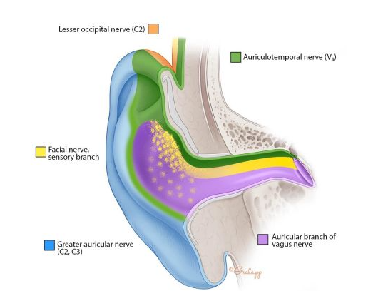
  

## Mitä suuretta hälypuhetestillä mitataan?

- a. sanojen tunnistusprosenttia
- b. signaali-kohinakynnystä
- c. kuulokynnystä
- d. kuulolaitteen vahvistusta

  <button class="solution-button" data-label="Vastaus" data-hide-label="Piilota vastaus">
    Vastaus
  </button>
  

      b

Hälypuhetestien avulla tutkitaan puhetunnistusta taustahälyssä. Testin tulos on hälypuhekynnys eli signaali-kohinasuhde (yksikkö dB SNR), jolla tutkittava tunnistaa oikein puolet testin puhemateriaalista.

Hälypuhetesti kuvaa puheaudiometriaa paremmin suoriutumista käytännön kuunteluympäristössä.
  

## Leukakulman muutos

41-vuotias tupakoimaton mies tulee tk-vastaanotollesi pikkuhiljaa 3-4 viikon aikana vasemmalle kaulalle kasvaneen kyhmyn vuoksi. Palpoiden toteat 4 cm kokoisen kiinteän resistenssin leukakulman alla ja lisäksi pienempiä imusolmukkeita samalla puolen kaulaa ja soliskuopassa, oikealla normaalit imusolmukkeet. KNK-status on normaali. UÄ-tutkimuksessa on epäspesifi resistenssi ja onb on lk 0, pilaantunut/riittämätön näyte. Mitä teet?

- a. nieluviljelyn perusteella suunnattu antibiootti
- b. lähete erikoissairaanhoitoon
- c. empiirinen antibioottikuuri 7-10 vrk:ta
- d. kontrolli ja uusi UÄ-tutkimus 2-3 kk

  <button class="solution-button" data-label="Vastaus" data-hide-label="Piilota vastaus">
    Vastaus
  </button>
  

      b

Ohutneulabiopsia on vain suuntaa antava, väärät negatiiviset löydökset tavallisia (hyvänlaatuisen ohutneulavastauksen taustalla voi olla syöpä). Tässä tapauksessa näytteen on vielä kerrottu olevan riittämätön. 

Potilas, jolla on kliinisesti epäilyttävä löydös, on lähetettävä jatkotutkimuksiin ohutneulabiopsiatuloksesta huolimatta. Jos potilaalla on nyt ollut jo kuukauden ajan kyseinen patti, niin on kyllä aiheellista lähettää potilas erikoissairaanhoitoon. 
  

## Aiemmin terveellä 2- vuotiaalla lapsella ilmeni kotona ruokapöydän alla leikkiessä äkillisesti kova yskänkohtaus ja hengityksen vinkunaa. Vastaanotolle tultaessa potilas on nyt oireeton, mutta potilaan saturaatio on 91 %. Miten toimit?

- a. otat keuhkojen röntgenkuvan ja sen ollessa normaali, kotiutat hyvävointisen potilaan
- b. lapsi leikkii normaalisti, keuhkojen auskultaatiossa ei vinkunaa, seuraat seuraavaan päivään
- c. toteat obstruktion ja aloitat salbutamolin annostelun
- d. aloitat lisähapen antamisen ja lähetät potilaan päivystyksenä erikoissairaanhoitoon

  <button class="solution-button" data-label="Vastaus" data-hide-label="Piilota vastaus">
    Vastaus
  </button>
  

      d

Epäily vierasesineestä. Oireet alkavat usein voimakkaalla yskänkohtauksella. Alkuvaiheessa on usein myös hengityksen vinkumista ja jopa syanoosia. Oireet kestävät muutamia minuutteja ja loppuvat, vaikka vierasesine jää bronkukseen. Äkillisesti alkanutta voimakasta yskänkohtausta ja hengitysvaikeutta on lapsella aina pidettävä vierasesineaspiraationa, ellei muuta syytä todeta.

Lopullinen alahengitystievierasesineiden diagnoosi perustuu bronkospiaan, joka samalla toimii hoidollisena toimenpiteenä. **Pelkkä epäilykin vierasesineestä riittää bronkoskopiaan,** koska jos asiaa jää seuraamaan, niin potilaalle voi kehittyä oireettoman vaiheen jälkeen ilkeän ja vaikeahoitoisen pneumonia, jonka yhteydessä esineen poistaminen on entistä vaikeampaa. 

a: Thoraxkuvalla on rajallinen merkitys: se voi olla normaali tai siinä voidaan todeta atelektaasi ja emfyseemat, myöhemmin pneumonia .

b: Ei riitä, vierasesine-epäily

c: Vierasesine-epäily on suurempi kuin astman epäily 
  

## 5kk tukkoinen nenä, poskiontelopunktio ja S. aureus kasvaa

Vastaanotollesi tulee 42-vuotias mies, jolla on ainakin viiden kuukauden ajan ollut jatkuvaa nenän tukkoisuutta, liman valumista kurkkuun ja paineoireita kasvoilla, oikealla puolella hieman enemmän. Lisäksi hän kokee hajuaistin heikentyneen. Nenästeroidi on ollut viime viikot käytössä. Potilas on syönyt jo 3 antibioottikuuria oireilun vuoksi ja kokee oireet erittäin häiritsevinä. Teet potilaalle poskiontelopunktion, jonka eritteessä kasvaa staphylococcus aureus. Miten tulkitset tilanteen ja miten toimit?

- a. Kroonisen rinosinuiittin akutisoituminen. Aloitan amoksisilliini-klavullaanihappo kuurin ja suosittelen pelkkiä suolavesihuuhteluita sekä lopetan nenästeroidin lisääntyneen infektioalttiuden vuoksi
- b. Akuutti bakteeriperäinen poskiontelotulehdus. Aloitan oksasilliini antibiootin viljelymäärityksen perusteella
- c. Akuutti bakteeriperäinen poskiontelotulehdus. Aloitan empiirisesti amoksisilliini antibiootin viikoksi
- d. Krooniseen rinosinuiittiin liittyvä bakteerikolonisaatio. Jatkan paikallishoitoa ja teen lähetteen korva-, nenä- ja kurkkutaudeille

  <button class="solution-button" data-label="Vastaus" data-hide-label="Piilota vastaus">
    Vastaus
  </button>
  

      d

Sama kaveri, joka oli Turun 2024 tentissä. Silloin tila oli viel äsiinä, että nenästeroidia ei ollut aloitettu ja tilanne vaikutti krooniselta rinosinuiitilta, koska kroonisen rinosinuiitin oireita ovat nenän tukkoisuus, eritteisyys, liman valuminen, kasvojen paineoireet ja hajuaistin heikkeneminen. Diagnoosi tehdään perusterveydenhuollossa ja se perustuu oireisiin ja kliinisiin löydöksiin, kuten nenän limakalvotulehdukseen, limaan ja polyyppeihin sekä rakenteellisten altistavien tekijöiden (nenän väliseinän vinous) arviointiin.

Ensisijainen hoito kroonisessa rinosinuiitissa on nenään annosteltavat kortikosteroidisuihkeet ja nenän huuhtelu keittosuolaliuoksella. Potilaalle voitiin siis aloittaa terveyskeskuksessa esim. mometasonifuroaattinenäsumute. 

Nyt kun potilas on jo käyttänyt nenästeroidia eikä se ole auttanut. Mikäli konservatiivisista hoidoista huolimatta oireiden hallinta ei ole riittävää, voidaan potilas lähettää erikoissairaanhoitoon, jossa harkitaan sivuonteloiden tähystysleikkausta (FESS). Leikkauksessa onteloiden aukkoja laajennetaan ja tarvittaessa muita rakenteellisia ahtauksia avataan. 

Punktiossa kasvava S. aureus on todennäköisesti kolonisaatiota. Jos jokin bakteeri kasvaa nenässä, niin se on yleensä S. aureus, koska se kolonisoi useimmiten nareksen. 

a,b,c: Potilaan oirekuvassa mikään ei viittaa siihen, että kyseessä olisi akutisoitunut tilanne.
  

## Tupakka on merkittävä pään- ja kaulan alueen syövän riskitekijä. Kuinka suuri osa suomalaisista miehistä tupakoi vuonna 2020?

- a) 10 %
- b) 15 % 
- c) 20 %
- d) 25 %

  <button class="solution-button" data-label="Vastaus" data-hide-label="Piilota vastaus">
    Vastaus
  </button>
  

      b (2024 n. 10%)

**Vuonna 2024 taas suomalaisista 20–64-vuotiaista naisista yhdeksän prosenttia ja miehistä 11 prosenttia tupakoi päivittäin.** Tämän ikäisestä väestöstä nikotiinipusseja käytti päivittäin naisista kaksi prosenttia ja miehistä kahdeksan prosenttia.

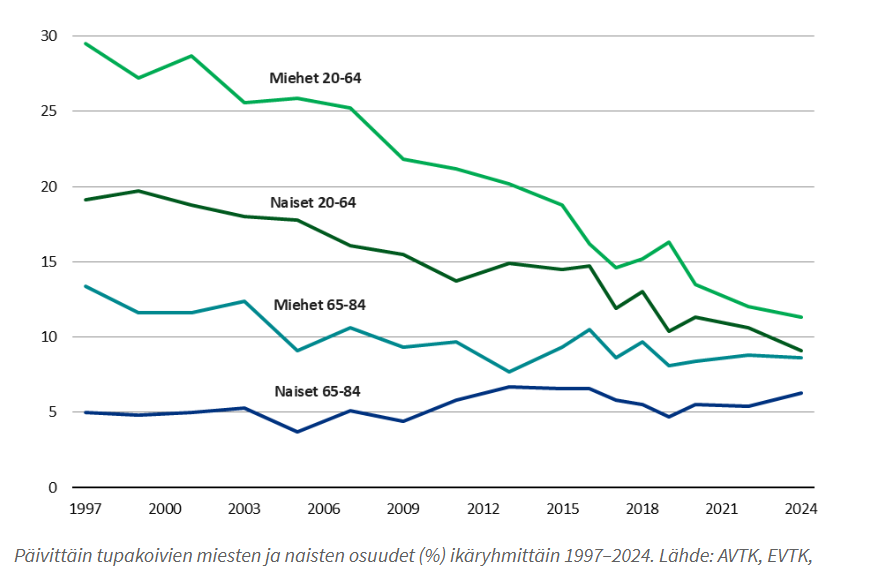
  

## Minkä pään- ja kaulan alueen syövän ilmaantuvuus on kasvanut eniten viimeisen 10 vuoden aikana?

- a) naisten kielisyöpä
- b) miesten kurkunpäänsyöpä
- c) miesten huulisyöpä
- d) miesten nielusyöpä 

  <button class="solution-button" data-label="Vastaus" data-hide-label="Piilota vastaus">
    Vastaus
  </button>
  

      d

Pään ja kaulan alueen syöpien kokonaisilmaantuvuus on nousussa, mutta erityisesti nielusyövät ovat yleistymässä. Pääasiassa nousu johtuu HPV16:n lisääntymisestä, joka on nykyään yleisin nielusyövän riskitekijä. 

  

## Mikä seuraavista riskitekijöiden kombinaatioista todennäköisesti johtaa parhaaseen ennusteeseen potilaalla, jolla todetaan nielusyöpä?

- a) HPV negatiivinen ja vähän tupakoinut
- b) HPV positiivinen ja vähän tupakoinut 
- c) HPV negatiivinen ja paljon tupakoinut
- d) HPV positiivinen ja paljon tupakoinut

  <button class="solution-button" data-label="Vastaus" data-hide-label="Piilota vastaus">
    Vastaus
  </button>
  

      b

HPV-positiiviset syövät reagoivat onkologisiin hoitoihin hyvin, ja niiden ennuste on siksi selvästi parempi kuin muiden syiden aiheuttamien pään ja kaulan alueen levyepiteelisyöpien. Tupakoiminen tietysti laskee ennustetta. 
  

## Potilaalle on tehty totaali laryngektomia. Mikä seuraavista mahdollistaa hänelle parhaan puheen tuoton leikkauksesta toivuttuaan?

- a) ruokatorvipuhe
- b) puhevibraattori
- c) puhekommunikaattori
- d) puheproteesi

  <button class="solution-button" data-label="Vastaus" data-hide-label="Piilota vastaus">
    Vastaus
  </button>
  

      d

Kurkunpääsyöpä on yksi yleisimpiä pään ja kaulan alueen syöpiä ja sen yleisimmät riskitekijät ovat tupakointi ja alkoholinkäyttö. Laajalle levinneen kurkunpääsyövän hoitona käytetään laryngektomiaa eli leikkausta, jossa koko kurkunpää poistetaan. Leikkauksen yhteydessä potilaalle asennetaan pysyvä trakeostooma, jonka kautta hän hengittää. Kurkunpään poistoleikkauksen jälkeen potilaan on mahdotonta tuottaa ääntä normaalilla tavalla.

Laryngektomoitujen kurkunpääsyöpäpotilaiden puheen kuntoutukseen kuuluu vaihtoehtoisen puhetavan kuntoutus, joista yleisin on puheproteesi. Puheproteesi on lankarullan muotoinen apuväline, joka asennetaan henkitorven ja ruokatorven väliin leikkauksessa. Puheproteesi asennetaan nykyään lähes kaikille kurkunpään poistoleikkaukseen joutuville puheen tuottamisen avuksi. Tämän jälkeen potilaan on mahdollista tuottaa hyvälaatuista puhetta sulkemalla trakeostooma-aukko, jolloin ilma ohjautuu puheproteesin läpi ruokatorveen ja sieltä suuonteloon.

  

## 2-vuotias potilaasi on sairastanut akuutin otiitin 3 viikkoa sitten. Häntä on tuolloin hoidettu amoksisilliinilla. Äidin mukaan lapsi oli välillä oireeton, mutta nyt uudelleen nuhainen ja haroo korviaan. Toteat akuuttiin otiittin sopivat löydökset. Minkä antibiootin aloitat?

- a) amoksisilliini-klavulaanihappo
- b) amoksisilliini 
- c) kefaklori
- d) atsitromysiini

  <button class="solution-button" data-label="Vastaus" data-hide-label="Piilota vastaus">
    Vastaus
  </button>
  

      b

Ensisijaiset välikorvatulehduksen hoidossa käytettävät antibiootit ovat amoksisilliini ja amoksisilliini-klavulaanihappo. Amoksisilliinin käytön puolesta puhuvat sen kapeampi kirjo ja vähäisemmät (suolisto)haittavaikutukset amoksisilliini-klavulaanihappoon nähden. Jos se jo toimi aikaisemmin potilaalle, niin sitä voidaan yrittää uudelleen. Antibiootin valinnassa tulee ottaa huomioon lapsen kokonaistilanne sekä lääkkeen haittavaikutusprofiili ja alueellinen aiheuttajabakteerien herkkyystilanne.
  

## Mikä on akuutin sinuiitin tavallisin orbitan alueen komplikaatio?

- a) preseptaalinen selluliitti 
- b) orbitaselluliitti
- c) subperiosteaalinen absessi
- d) orbita-absessi

  <button class="solution-button" data-label="Vastaus" data-hide-label="Piilota vastaus">
    Vastaus
  </button>
  

      a

Preseptaaliselluliitti on silmäluomeen rajoittuva tulehdus. Luomi ja silmän ympärysiho on punoittava, kuumoittava ja turvonnut, ja siinä voi olla märkäkertymää tai ihonekroosia. Syynä on useimmiten luomihaavasta lähtenyt tulehdus vamman tai luomikirurgian jälkeen, mutta voi olla lähtöisin myös sinuiitista, tulehtuneesta luomirakkulasta tai kyynelpussista. 

Potilaalla voi olla lievää lämpöä. Tulehdusarvot (CRP, B-Leuk) ovat lievästi tai kohtalaisesti koholla. Hoitona systeeminen mikrobilääkehoito useimmiten p.o. aikuisille ja yli 5-vuotiaille lapsille 7 vrk:n ajan. Alle 5-vuotiaat lapset ja MRSA-kantajat kuuluvat erikoissairaanhoidon arvioon päivystyksellisesti

b: Orbitaselluliitti tarkoittaa silmäkuoppaan ulottuvaa tulehdusta. Tulehdus voi levitä silmäkuoppaan ympäröivistä kudoksista, useimmiten nenän sivuonteloista, harvemmin hampaista tai luomitulehduksesta. Se voi olla lähtöisin myös kyynelpussin tai -rauhasen tulehduksesta tai silmän sisäisestä tulehduksesta. Oireena turvotus ja punoitus silmäluomien alueella kuten preseptaaliselluliitissa, mutta mukana on aina myös silmälöydöksiä. Näkö on usein alentunut, silmä työntyy eteenpäin (proptoosi), silmäkuoppa on pinkeä, ja silmänpaine voi nousta. Silmässä voi näkyä relatiivinen afferentti mustuaisdefekti. Silmän liikkeet aristavat ja ovat rajoittuneet, ja potilas näkee kaksoiskuvia. Potilas on usein kuumeinen, ja tulehdusarvot ovat aina selvästi suurentuneet. 

Orbitaselluliitti on näköä, joskus jopa henkeä uhkaava tilanne, joka vaatii päivystyksellistä hoitoa erikoissairaanhoidossa. Tulehdus voi olla hengenvaarallinen, mikäli se leviää silmäkuopan kärjen kautta aivojen kovakalvon lokeroveriviemäriin (sinus cavernosukseen) aiheuttaen siellä tromboosin. Orbitaselluliitin epäily on aihe päivystyslähetteeseen sairaalaan, jossa silmä-, korva- ja lastenlääkärin konsultaatiot sekä kuvantamistutkimukset (TT tai MK) ovat välittömästi saatavilla. Perusterveydenhuollosta aikuispotilaat lähetetään ensisijaisesti korvalääkärille ja lapsipotilaat lastenlääkärille. Tarvittaessa konsultoidaan silmä- ja infektiolääkäreitä. Hoitona on laajakirjoinen laskimonsisäinen mikrobilääke osastolla. Märkäpesäkkeet avataan herkästi kirurgisesti.  

c: Sinuiittien vakavimpia komplikaatioita ovat silmäkuopan (orbitan) ja kallonsisäiset tulehdukset. Osalle orbitaselluliittipotilaista kehittyy märkäpesäke, yleensä periostin alle. Tämä näkyy kliinisen kuvan nopeana ja selvänä huononemisena. Aikuisilla märkäpesäke on usein avattava kirurgisesti, mutta lasta voidaan yleensä hoitaa konservatiivisesti osastoseurannassa. 

d: Orbitaselluliitti voi aiheuttaa absessin orbitaan

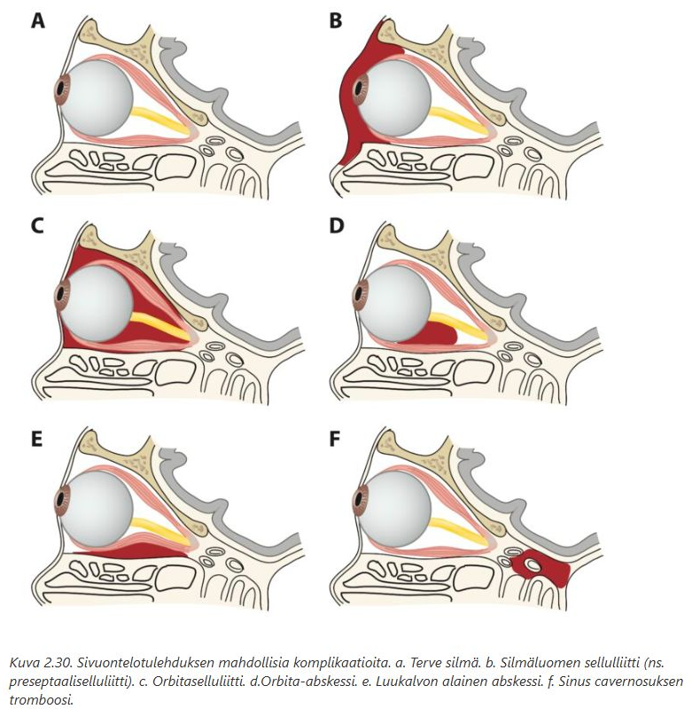

  

## 3-vuotiaalla Maijalla on ollut 3 vrk kurkku kipeä, kuumetta, nuhaa ja ripulia. Kliinisessä statuksessa toteat suuret, katteiset nielurisat, nenässä sameaa eritettä ja silmissä punoitusta. Mikä seuraavista on todennäköisin sairauden aiheuttaja?

- a) streptococcus pyogenes
- b) adenovirus 
- c) koronavirus
- d) Epstein-Barr virus

  <button class="solution-button" data-label="Vastaus" data-hide-label="Piilota vastaus">
    Vastaus
  </button>
  

      b

Adenovirus on yleisin nielutulehduksen aiheuttaja alle 5-vuotiailla. Sille on myös tyypillistä ripuli ja konjunktiviitti, kuten nyt myös potilaallamme. 

a: A-ryhmän streptokokki on yleisin bakteeri, joka aiheuttaa nielutulehdusta, mutta se on harvinainen pienillä lapsilla. 

c: Voisi aiheuttaa, mutta adenovirus on yleisempi tämänlaisen taudinkuvan aiheuttaja 

d: Yleisempi teineillä ja nuorilla aikuisilla. Pienillä lapsilla infektio on yleensä oireeton. 
  

## Arvioi kuuloa

Tutkit iäkästä potilasta vastaanotollasi. Potilas ja valittaa huonoa kuuloa, kuitenkin puhelimessa hän on vielä kuullut. Tärykalvostatus on normaali, W ei lateralisoidu ja R +/+. Teet vielä puhe- ja kuiskauskuulon tutkimisen ja toteat, että potilas ei kuule puhetta yli 1 m päästä. Pyydät seuraavaksi audiogrammin. Millä tasolla oletat potilaan kuulon keskimäärin olevan mittauksessa?

- a) noin 30 dB
- b) noin 40 dB
- c) noin 50 dB 
- d) noin 80 dB

  <button class="solution-button" data-label="Vastaus" data-hide-label="Piilota vastaus">
    Vastaus
  </button>
  

      c

Hyvä muistisääntö on, että normaalin puheen voimakkuus on n. 60 dB SPL ja kuiskauksen voimakkuus n. 30 dB SPL metrin etäisyydeltä korvasta. Näitä arvioimalla voi nopeasti testata kuuloa vastaanotolla/bedside. 
  

## Mihin sairauteen alla olevassa audiogrammissa näkyvä kuulovika liittyy todennäköisimmin? 

- a) tärykalvon reikä
- b) alasimen pitkän haarakkeen katkos
- c) vaikkutulppa korvakäytävässä
- d) otoskleroosi 

  <button class="solution-button" data-label="Vastaus" data-hide-label="Piilota vastaus">
    Vastaus
  </button>
  

      d

Otoskleroosi (otospongioosi) on luisen sisäkorvan pesäkkeinen sairaus, jonka etiologia on tuntematon. Pesäkkeen yleisin esiintymispaikka on soikean ikkunan seutu ja jalustin ns. luutuu kiinni soikeaan ikkunaan. Tärkein oire on (70–80 %:ssa molemminpuolinen) konduktiivinen kuulovika, joka johtuu jalustimen luutumisesta soikeaan ikkunaan, eikä ääni välity enää normaalisti kuuloluuketjusta sisäkorvaan. Tauti on yleisempi naisilla kuin miehillä (2:1). Se ilmenee tavallisesti 30–40 vuoden iässä. 

Potilaalla on audiometriassa todettavissa oikean korvan lieväasteinen konduktiivinen kuulovika. **Luujohtokäyrässä on todettavissa otoskleroosille tyypillinen ns. Carhartin kuoppa, jossa kuoppamainen aleneminen on maksimissaan 2 000 Hz:n kohdalla.** Otoskleroosiin liittyy usein kombinoitunut kuulovika, jolloin sekä ilma- että luujohtokäyrä laskevat. Pienillä taajuuksilla on kuitenkin selvä ero ilma- ja luujohtokäyrien välillä (kuten tässäkin ero on suurempi).  
  

## Mihin sairauteen alla olevassa audiogrammissa näkyvä kuulovika liittyy todennäköisimmin?

- a) meluvamma
- b) ikäkuulo
- c) synnynnäinen kuulovika 
- d) krooninen korvatulehdus

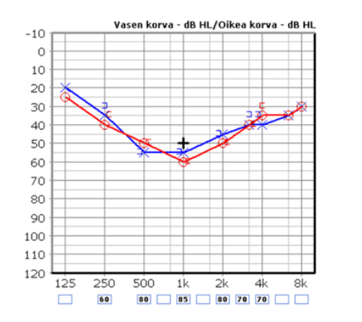

  <button class="solution-button" data-label="Vastaus" data-hide-label="Piilota vastaus">
    Vastaus
  </button>
  

      c

U:n muotoinen (ns. cookie-bite hearing loss) sensorineuraalinen kuulonalenema viittaa tyypillisesti perimään liittyvään syyhyn. Yleisin aiheuttaja on TECTA-geenin mutaatio, joka häiritsee membrana tectorian kehittymistä sisäkorvassa -> keskitaajuuksien kuuleneminen heikkenee. 
  

## Mihin sairauteen alla olevassa audiogrammissa näkyvä kuulovika liittyy todennäköisimmin?

a) otoskleroosi
b) tärykalvon reikä
c) Menieren tauti 
d) vestibulaari schwannooma

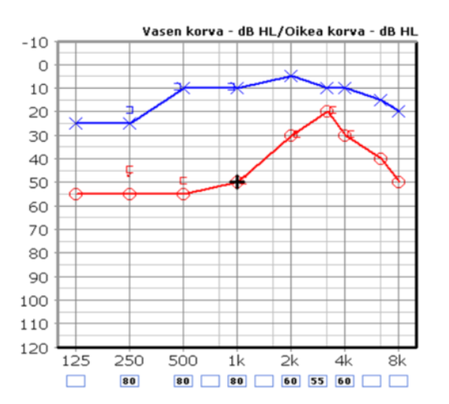

  <button class="solution-button" data-label="Vastaus" data-hide-label="Piilota vastaus">
    Vastaus
  </button>
  

      c

Tyypillinen Menieren aiheuttama kuva audiogrammissa on matalilta frekvensseiltä alkava fluktuoiva sensorineuraalinen kuulovika, joka progressoituu "huipulliseksi" eli sekä matalia että korkeita taajuuksia affisioivaksi ja lopulta tasaiseksi kaikkia frekvenssejä kattavaksi. Toinen korva on yleensä ainakin aluksi pahempi, mutta tila etenee suurella osalla (n. 10-50%) bilateraaliseksi. 

  

## Epäilet lapsella toimenpidettä vaativaa kitarisahypertrofiaa. Mikä seuraavista sopii epäilyysi?

- a. Kuorsaus
- b. Inspiratorinen stridor
- c. Korvakipu
- d. Toispuoleinen nenän tukkoisuus

  <button class="solution-button" data-label="Vastaus" data-hide-label="Piilota vastaus">
    Vastaus
  </button>
  

      a

Lapsilla tavallisimpia nielurisojen leikkausaiheita ovat risahypertrofiaan liittyvät obstruktiiviset oireet. Yleisin ilmentymä on unenaikaiset hengityshäiriöt, kuten uniapnea ja jatkuva kuorsaus. 
  

## Nuhaa ja paineoireita

Vastaanotollesi tulee 43-vuotias nainen, jolla on ollut 2vrk ajan nuhaa ja kurkkukipua, mutta ei kuumetta. Potilas tuo esiin paineoireet molemmissa poskipäissä etenkin kumartuessa eteenpäin. Statuksessa toteat nenän limakalvot turpeiksi ja nenäontelossa kirkasta sitkeää limaa. Kasvojen alueella ei ole turvotuksia. Tutkit potilaan vielä Sinuscanilla, jossa toteat kaksi korkeahuippuista käyrää 1cm ja 4,5cm kohdalla. Mikä on todennäköinen diagnoosi ja kuinka hoidat potilaan?

- a. Löydös viittaa bakteeriperäiseen akuuttiin sinuiittiin, aloitat nenästeroidisumutteen ja antibiootiksi amoksisilliinin 500mg x3, 7vrk kuuri
- b. Löydös on normaali, kyseessä komplisoitumaton ylähengitystietulehdus ja ohjeistat oireenmukaisen hoidon.
- c. Löydös viittaa mahdolliseen limakalvoturvotukseen poskionteloissa, aloitat nenästeroidisumutteen ja ohjeistat oireenmukaisen hoidon.
- d. Löydös viittaa molemminpuoliseen poskionteloiden kystaan, aloitat nenästeroidisumutteen ja teet lähetteen 8-30vrk kiireellisyydellä KNK:lle.

  <button class="solution-button" data-label="Vastaus" data-hide-label="Piilota vastaus">
    Vastaus
  </button>
  

      c

Oireet, status ja Uä tukevat turvotusta poskionteloissa virusperäisen flunssan yhteydessä. Flunssan yhteydessä aikuisilla esiintyy nenän tukkoisuutta, eritystä ja sivuonteloiden paine- ja kipuoireita, jotka useimmiten paranevat itsestään eivätkä yleensä vaadi aktiivista hoitoa. Lieväoireiset sivuontelopotilaat näyttävät hyötyvän kortikosteroidista parhaiten. 

a: Ei ole märää osoitettavissa -> ei akuuttia bakteerisinuiittia -> ei antibioottia

b: Oireenmukainen hoito kyllä varmaan riittäisi, mutta steroidisumutteesta voi olla hyötyä

d: Ei ole viitteitä kystasta 

  

## Teet potilaalle tympanometrian. Tuloksena on kuvan mukainen käyrä. Mistä voi olla kyse?

- a. Välikorvatulehdus
- b. Avoin korvatorvi
- c. Tukkeutunut tympanostomiaputki
- d. Korvakäytävän tulehdus

  <button class="solution-button" data-label="Vastaus" data-hide-label="Piilota vastaus">
    Vastaus
  </button>
  

      a

Tasaisen (B-tyypin) käyrän takana on useimmiten erite välikorvassa. Tasainen käyrä voi myös merkitä epäonnistunutta mittausta (tulppa ei ole tiivis) tai reikää tärykalvossa. Tällainen tulos saadaan myös, jos tärykalvossa on avoin tympanostomiaputki. 

  

## 9-vuotiaalla pojalla on ollut kuukausien mittaan useita nenäverenvuotoja vuoronperään molemmista sieraimista. Poika on vanhempansa kanssa ajanvarausvastaanotolla tästä syystä. Nenä ei tällä hetkellä vuoda. Kuinka toimit?

- a) Juveniili angiofibrooma on todennäköinen diagnoosi toistuvassa molempien sierainten vuodossa. Lähetän lapsen korvalääkärille jatkotutkimuksiin kiireellisyydellä 1-7 päivää.
- b) Lapsilla vuotopaikka on yleensä nenän etuosassa. Tutkin lapsen ja laapistan molemmat Locus Kieselbachit. Sovin kontrollikäynnin tai soiton 1 kk päähän.
- c) Tutkin potilaan ja laapistan todennäköisen vuotopaikan jommalta kummalta Locus Kieselbachilta. Sovin kontrollikäynnin 1 kk päähän; silloin tarvittaessa toisen puolen käsittely.
- d) Toistuvat vuodot voivat olla merkki hyytymishäiriöstä. Ohjelmoin verikokeita ja jään seuraamaan tilannetta.

  <button class="solution-button" data-label="Vastaus" data-hide-label="Piilota vastaus">
    Vastaus
  </button>
  

      c

Runsaat tai häiritsevät toistuvat nenäverenvuodot voi koittaa hoitaa laapistamalla todennäköinen vuotopaikka (useimmiten Locus Kiesselbach). Tilanteen voi kontrolloida n. kuukauden päästä ja ellei laapistus auta, voi potilaan lähettää erikoissairaanhoitoon arvioon. 

a: Juveniili angiofibrooma (angiofibroma juvenilis) on pääsääntöisesti _puberteetti-ikäisillä_ pojilla esiintyvä hyvänlaatuinen kasvain, jonka etiologiaa ei täysin ymmärretä. Se alkaa tavallisesti nenän takaosan sivuseinämän kudoksesta, lähellä arteria sfenopalatinaa. Ensimmäisiä oireita ovat nenän tukkoisuus, nenäverenvuoto sekä välikorvaoireet (korvien lukkoisuus, kipu) korvatorven tukkeutumisen seurauksena. Jos murrosikäisellä potilaalla ilmenee edellä mainittuja oireita, juveniili angiofibrooma on otettava huomioon. Vaikka kasvain on hyvänlaatuinen, se voi syövyttää ympäröiviä rakenteita ja edetä kallon sisälle, jolloin se voi painaa aivohermoja. Tyyppioireina ovat tuolloin näköoireet (näön heikkeneminen tai kaksoiskuvat) näköhermon puristuksen seurauksena.

b: Samalla kertaa voi laapistaa vain toisen puolen nenästä. Nenän väliseinän molempia puolia ei saa laapistaa samalla kertaa, koska vaarana on rustonekroosi ja sen seurauksena reikä nenän väliseinässä.

d: Toistuvat nenäverenvuodot ovat yleisiä ilman hyytymishäiriötäkin. 
  

## 73-vuotiaalla miehellä on pari kolme kertaa vuodessa toistuvia akuutteja externiotiitteja. Muuten ei korvaongelmia ja kuulon kokee hyväksi. Mitä hoidossa tulee huomioida?

- a) Kyseessä voi olla korvakäytävän ihon maligniteetti. Lähetän potilaan kertaalleen korvalääkärille hyvää statusta ja otomikroskopiaa varten.
- b) Taustalla voi olla krooninen externiotiitti, ihon ärsytystila. Iho kannattaa hoitaa hyvään tasapainoon kostuttavalla ihoöljyllä ja miedoilla kortisonituotteilla.
- c) Otiitit ajoittuvat luultavasti allergiakauteen. Hoidoksi kannattaa ohjelmoida ihoa rauhoittamaan ja korvatorvien toimintaa edistämään antihistamiini ja kortisoninenäsuihke.
- d) Infektioita ei esiinny kovin usein, joten hyvä akuutin infektion hoito riittää: korvan huuhtelu ja imukuivaus sekä antibioottikortisonitippa tai Otiborin-tippa infektion asteesta riippuen.

  <button class="solution-button" data-label="Vastaus" data-hide-label="Piilota vastaus">
    Vastaus
  </button>
  

      b
      
Viittaa toistuvaan ärsytys-/ihoperäiseen ongelmaan, ei vaaralliseen taustasairauteen. Toistuvat externiitiitit iäkkäällä potilaalla johtuvat hyvin usein korvakäytävän kuivasta ja hauraasta ihosta sekä ihon suojan heikkenemisestä. Perushoito on avain: säännöllinen kostuttava ihoöljy ja tarvittaessa mieto paikalliskortisoni. Pumpulipuikkojen ja turhan huuhtelun välttäminen on myös tärkeää. 

a: Korvakäytävän maligniteetti on todella harvinainen ja aiheuttaa usein jatkuvia oireita (ei harvakseltaan kuten tässä). 

c: Korvatorven toiminta vaikuttaa välikorvaan, ei korvakäytävään. 

d: Tämä akuuttihoito ei ota kantaa siihen, miksi infektiot toistuvat. Ihon kunnon parantaminen on tärkeää tulehdusten ehkäisemisessä. 
  

## Krooninen korvakipu

62-vuotias nainen, tulee kiireettömälle vastaanotolle. Hän on juuri eläköitynyt ja tekee paljon käsitöitä. Oikeassa korvassa on jo vajaan vuoden ajan tuntunut kipua aika usein ja erityisesti iltaisin. Tärykalvo näyttää mielestäsi terveeltä ja liikkuu hyvin. Mikä seuraavista on epätodennäköisin syy korvakivulle?

- a.Niska-hartiaseudun lihaskireydet
- b.Leukanivelen kipu
- c.Krooninen välikorvatulehdus
- d.Bruksismi

  <button class="solution-button" data-label="Vastaus" data-hide-label="Piilota vastaus">
    Vastaus
  </button>
  

      c

Tärykalvo näyttää siistiltä ja liikkuu hyvin -> välikorva on todennäköisimmin eritteestä vapaa -> ei ole kroonista välikorvatulehdusta. Potilaan krooniset korvakivut todennäköisesti johtuvat heijastekivusta erityisesti leuasta tai niska-hartiaseudulta. 
  

## Potilas tulee vastaanotolle tulosyyllä "nielemisvaikeus/palantunne". Missä tilanteessa potilas kannattaa ohjata korvalääkärin arvioon?

- a.Nielemisvaikeus ja palan tunne liittyy kiinteiden nielemiseen ja paikantuu alanieluun, oireet ovat pahentuneet hiljalleen muutamien kuukausien aikana.
- b.Palan tunteeseen liittyy ylävatsakipua, kuiva yskä ja äänen käheysvaivaa.
- c.Kaulan palpaatiossa henkitorven päällä tuntuu potilaan nielaistessa ylimääräistä
- d.Nielemisvaikeus liittyy ensisijaisesti nesteisiin ja potilaalla on lisäksi puhevaikeutta ja kaksoiskuvia

  <button class="solution-button" data-label="Vastaus" data-hide-label="Piilota vastaus">
    Vastaus
  </button>
  

      a

Viittaa alanielun alueen tuumoriin. 

b: Viittaa eniten refluksiin

c: Yleistä, ei suoraan viittaa tuumoriin. Yleensä taustalla on lihasten supistuminen nielaistessa. 

d: Viittaa neurologiseen ongelmaan 
  

##  Potilaan kaulan alueelle, m. sternocleidomastoideuksen eteen on kehittynyt punoittava vähäisesti fluktuoiva turvotus ja punoitus voimakkaan nielukivun yhteydessä. Potilaalla on myös vaikeutta kääntää päätään. Epäilet kyseessä olevan

- a. lymfadeniitti
- b. parafaryngeaalinen paise
- c. vena jugularis internan tromboosi
- d. ilmaemfyseema

  <button class="solution-button" data-label="Vastaus" data-hide-label="Piilota vastaus">
    Vastaus
  </button>
  

      b

Tässä kuvauksessa on useita syvän kaulan infektion hälytysmerkkejä (infektio voimakkaan nielukivun yhteydessä ja vaikeutta kääntää päätään). Todennäköisesti kyseessä on parafaryngeaalinen paise. 

a: Lymfadeniitti on yleensä aristava suurentunut imusolmuke. Ei aiheuta selkeää kaulan liikerajoitusta. 

c: Lemierren oireyhtymä tarkoittaa infektiivistä tromboflebiittia v. jugularis internassa ja yleensä kehittyy bakteriellin faryngiitin ja syvän kaulainfektion (esim. juuri parafaryngeaalisen tai retrofaryngeaalisen absessin) komplikaationa. Ilmenee kipuna ja arkuutena kaulalla. On harvinaisempi komplikaatio ja kehittyy yleensä myöhäisessä vaiheessa.  

d: Ilmaemfyseema tuntuisi krepitaationa, ei suoraan fluktoivana. 
  

## 50-vuotiaalla naisella toistuu pari kertaa kesässä märkäinen korvakäytävätulehdus. Joskus kivulias tulehdus on iskenyt myös etelänmatkalla. Muuten korvat ovat oireettomat. Miten hoidat?

- a) Infektioita ei ole kovin usein. Akuutit tulehdukset hoidetaan viikon Ciproxin-Hydrocortison -tippakuurilla. Mahdollinen pseudomonas hoituu myös tällä kuurilla.
- b) Ohjelmoit korviin vesisuojauksen ja ennaltaehkäisyyn kesän ajaksi ja etelän lomille Otiborin-tipan parina iltana viikossa, etenkin sauna- ja uintireissujen jälkeen.
- c) Aloitat krooniseen externiotiittiin Hydrocortison voiteen ohuelti korvakäytävän suulle parin viikon jaksoissa syklisesti tauottaen.
- d) Lähetän potilaan korvalääkärin arvioon toistuvien infektioiden takia, jotta perussyy saadaan selville

  <button class="solution-button" data-label="Vastaus" data-hide-label="Piilota vastaus">
    Vastaus
  </button>
  

      b

Toistuvat kesäiset externiitit johtuvat usein kosteudesta korvakäytävässä ja siten ihon suojapinnan häiriintymisestä ja bakteerien (etenkin Pseudomonas) lisääntymisestä. Paras hoito on estää tulehdus ennen kuin se alkaa -> vesisuojaus tärkeintä. Otiborin (boorihappo ja etanoli) voi auttaa estämään bakteerikasvua lomilla. 

a: Kyllä infektioita on aika usein. 

c: Kroonisen externiotiitin oireita on jatkuva kutina ja oireita myös tulehdusten välillä; tässä korvat ovat oireettomat infektioiden välissä. 

d: Infektioiden perussyy on tässä suhteellisen selkeä eikä ole epäilyä mistään maligniteetista tai ihosairaudesta 
  

## Kutinaa korvissa ja atopiaa 

27-vuotiaalla lääketieteenopiskelijalla on kutinaa molemmissa korvakäytävissä. Hänellä on siitepöly allergiaa ja atopiaa, muuten perusterve. Korvakäytävien iho on punoittava, mutta muuten siisti. Käytävissä on vähäisesti kuivaa hilseilevää vaikkua. Välillä korvat kipeytyvät ja tuntuvat kosteilta, mutta varsinaisia märkiviä tulehduksia ei ole ollut. Miten hoidetaan?

- a) Aloitetaan antihistamiini todennäköisen allergisen ekseeman hoitoon.
- b) Aloitetaan ihoöljy korvakäytäviin ja hydrocortisonvoide ohuelti korvakäytävien suulle.
- c) Otiborin-tippakuuri viikoksi eradikoimaan tilannetta ylläpitävä mikrobifloora.
- d) Otiborin-tippakuuri viikoksi eradikoimaan tilannetta ylläpitävä ekseemaiholla yleistymään päässyt sienifloora

  <button class="solution-button" data-label="Vastaus" data-hide-label="Piilota vastaus">
    Vastaus
  </button>
  

      b

Vaikuttaa krooniselta korvakäytävän tulehdukselta/ekseemalta. Kutinaa helpottaa parhaiten paikallinen kortikosteroidivalmiste joko tippana tai voiteena. Iho on yleensä kuiva kroonisessa tulehduksessa, joten lisäksi ohjeistetaan usein korvaöljyn käyttö (otitis externan paikallishoidossa noudatetaan yleisiä dermatologisia periaatteita: akuutissa (kosteassa) vaiheessa kostea hoito, kroonisessa (hilsehtivässä) vaiheessa rasvainen hoito). 

a: Korvakäytävän ekseema ei todennäköisesti ole allergiavälitteinen 

c ja d: Ei merkkejä infektioista. Krooninen korvakäytävätulehdus on yleensä ihon inflammatorinen ongelma, ei infektio. Jos kuitenkin on eritettä, niin otetaan bakteeri- ja sieniviljelyt. 
  

## Milloin externiotiitista kannattaa ottaa viljely?

- a) Aina, jotta hoito voidaan kohdistaa oikeaan taudinaiheuttajaan.
- b) Aina, jotta lääkitys voidaan vaihtaa kohdistetusti, jos hoito ei näytä tehoavan.
- c) Kun korvakäytävässä havaitaan silmämääräisesti sienikasvua.
- d) Harkinnanvaraisesti hankalassa tai toistuvassa taudinkuvassa.

  <button class="solution-button" data-label="Vastaus" data-hide-label="Piilota vastaus">
    Vastaus
  </button>
  

      d

Esim. tulehduksen pitkittyessä merkittävästi -> paikallishoitoa muutetaan ja suunnataan viljelyvastausten mukaisesti. 

a, b: Tärkein akuutin korvakäytävätulehduksen (AOE) hoito on alkuun korvakäytävän atraumaattinen puhdistus (ensin imulla, sitten huuhtelemalla keittosuolaliuoksella* ja lopuksi imukuivaamalla) ja kotiin annetaan korvatippoja. Lievässä tulehduksessa, jossa ei ole korvakäytävän turvotusta, voi riittää riittää esim. boorihappo-etanolikorvatipat eikä edes tarvitse kohdistettuja antibiootteja. Mikäli akuutti tulehdus ei parane nopeasti, on syytä tarkentaa esitietoja ja suorittaa lisätutkimuksia. Korvan tutkimuksella poissuljetaan tärykalvoreikä, tärykalvon tai korvakäytävän ihon granulaatiokudos. Korvakäytävään jäänyt tippasakka tai tippojen aiheuttamat allergiset ja toksiset reaktiot (säilytysaineet, neomysiini) aiheuttavat kutinaa, mikä taas voi johtaa korvan jatkuvaan raapimiseen. Pitkäkestoinen antibiootti-steroidi- tippahoito voi altistaa myös sienitulehduksille.

c: Sieni-infektioissa voi myös riittää vain huolellinen puhdistus ja esim. boorihappo-etanolitipat. Vaikeammassa infektiossa voidaan käyttää sienilääkkeitä ja vasta tarvittaessa otetaan viljelyt. 
  

## Tukkoinen nenä

35-vuotiaalla miehellä on ollut nenän vaihtelevaa tukkoisuutta useita kuukausia. Ei infektioita tai todettuja allergioita. Ei tupakointia tai nenävenevuotoja. Oikean sieraimen tulkitset normaaliksi. Vasemmassa sieraimessa on seuraavanlainen näkymä. Muu knk-status normaali, peilaamiset eivät onnistu. Mitä johtopäätöksiä teet?

- A) Septumissa on deviaatiota ja alaosassa ahtauttava crista. Potilas hyötyisi septoplastiasta ja kannattaa lähettää kiireettömästi knk-arvioon.
- B) Sieraimessa näkyy tyypillinen kalpea polyyppi. Polypoosi ahtauttaa nenähengitystä. Kannattaa aloittaa nenäkortisonisuihke ja lähettää potilas kiireettömästi korvalääkärin arvioon
- C) Näkyvillä on tavalliset rakenteet. Tukkoisuus liittyy limakalvojen toimintaan. Tarkennat anamneesia ja teet mahdollisesti hoitokokeilun kostuttavilla nenäsuihkeilla.
- D) Sieraimessa pilkottaa juveniili angiofibrooma, myöskään maligniteettia ei voida poissulkea. Lähetät potilaan kiireelliseen jatkohoitoarvioon knk-lääkärille.

  <button class="solution-button" data-label="Vastaus" data-hide-label="Piilota vastaus">
    Vastaus
  </button>
  

      c

Kuvassa näkyy oikealla siisti alakuorikko ja sen päällä siisti kiiltävä keskikuorikko. Vasemmalla septum näyttää siistiltä. Limakalvot ovat jokseenkin kuiva -> hoitokokeilu kostuttavilla suihkeilla.

Nenän vaihteleva tukkoisuus voi viitata nenäsykliin, jossa nenäkäytävät hengittävät vuorotellen (turpeus vaihtelee), n. 1–4 t:n sykleissä, jolloin tukkoisemman puolen limakalvo toipuu ilmavirran aiheuttamasta rasituksesta. 

a: Septum näyttää suorahkolta 

b: Kalpea "polyyppi" on keskikuorikko, se on normaali rakenne

d: Ei ole todettavissa angiofibroomaa
  

## 20-vuotiaan naisen pitkään ollut lävistys on akuutisti punoittava, arka ja turvonnut. Yleisoireita ei ole. Miten hoidat?

- a) Kyseessä on viivästynyt vierasesinereaktio, joka rauhoittuu korun poiston myötä.
- b) Kyseessä on viivästynyt herkistyminen nikkelille. Tilanne rauhoittuu korun poiston myötä.
- c) Kyseessä on lävistyksen infektoituminen. Hoitona on korun poisto, haavan puhdistus ja ciprofloksasiini-kuuri.
- d) Kyseessä on lävistyksen infektoituminen. Hoitona on haavan puhdistus ja kefexin-kuuri.

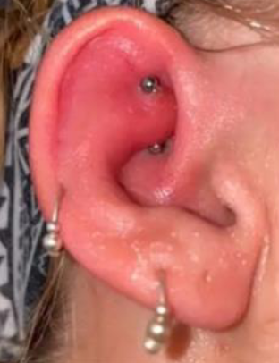

  <button class="solution-button" data-label="Vastaus" data-hide-label="Piilota vastaus">
    Vastaus
  </button>
  

      c

Pitkään ollut lävistys ja nyt tulehduksen merkkejä -> infektioepäily ensisijaisesti. Koru tulee poistaa ja infektio hoitaa. 
  

## Huimausta

55-vuotias nainen on aiemmin kärsinyt pyörittävistä huimauskohtauksista sängyssä kylkeä kääntäessä. Nyt oire on ollut hankalampana viikon ajan. Asentoa muuttaessa maisema pyörii ja tulee pahoinvointia hetkiseksi. Kävellessä on keinuttava olo ja tasapainon epävakautta. Mistä on kyse?

- a) Menieren tauti
- b) ikääntymiseen liittyvä sekatyyppinen huimaus
- c) vestibulaarineuriitti
- d) hyvänlaatuinen asentohuimaus

  <button class="solution-button" data-label="Vastaus" data-hide-label="Piilota vastaus">
    Vastaus
  </button>
  

      d

Vain hetken kestävä huimaus asennonmuutosten yhteydessä viittaa vahvasti hyvänlaatuiseen asentohuimaukseen. Käytännössä huimausoireet pahenevat päätä liikuttaessa riippumatta huimauksen etiologiasta, mutta BPPV:lle on tyypillistä <1-2min kestävät huimauskohtaukset, jotka laukaisee pään liikuttaminen ja paikallaan pysyessään tila on paljon oireettomampi. Muut näistä aiheuttavat jatkuvaa ja pidempikestoista huimausta (Menieren taudin kohtaukset 20min-12 tuntia ja vestibulaarineuriitissa päiviä). 
  

## Mitä teet jos nenäverenvuoto on runsasta ja laapistus ei onnistu esim. vuoto tulee jostain taaempaa?

- a. Puudutat nenää uudestaan ja yrität uudestaan laapistaa
- b. Laitat potilaalle takatampoonin virtsakatetrilla
- c. Puristat potilaan nenää ja laitat jääpussin potilaan hartioille
- d. Puudutat nenän, ja laitat etutampoonin

  <button class="solution-button" data-label="Vastaus" data-hide-label="Piilota vastaus">
    Vastaus
  </button>
  

      d

Jos vuoto jatkuu tai se on ollut runsasta tai mikäli vuoto tulee nenän takaosista, eikä vuotokohtaa pystytä identifioimaan, tehdään etutamponaatio. Siinä käytetään sulamattomia tamponeja, joiden pituus on 8–10 cm. Ne voidaan rasvata, jolloin ne menevät nenään helpommin. Sulavat tamponit yksinään eivät yleensä ole tarpeeksi jämäköitä hoitamaan merkittävää vuotoa. Nenässä tamponit kostutetaan keittosuolalla tai traneksaamihapolla, jolloin ne turpoavat ja pehmenevät. Tamponin annetaan olla paikallaan yleensä kolme päivää. Nenään saadaan aikaan hallittu infektio, joka trombosoi vuotaneen suonen tukkoon. Mikrobilääkeprofylaksi on perusteltua, jos potilaan puolustuskyky on selkeästi alentunut esim. sepsiksen, tehohoidon tai leukopenian vuoksi. Hyväkuntoinen etutamponoitu potilas ei tarvitse sairaalahoitoa. 

a: Laapistus ei onnistu, tarvitaan muuta 

b: Takatamponaatio tehdään, jos vuoto ei tyrehdy etutamponaatiolla. Toimenpide on harvoin tarpeen ja tehdään yleensä erikoissairaanhoidossa. 

c: Hyvää ensihoitoa jo ennen laapistustakin, mutta tämä ensiapu ei riitä ainoaksi vaikeammissa vuodoissa

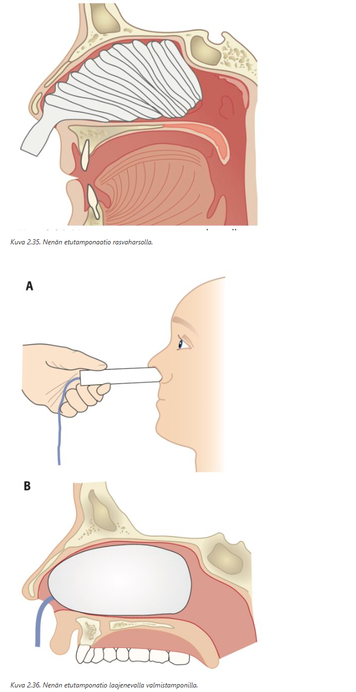
  

## Papalle sisäkorvaistute

Pidät terveyskeskusvastaanottoa ja luoksesi saapuu 72-vuotias potilas, jolla on hyvässä hoitotasapainossa oleva sepelvaltimotauti sekä verenpainetautia ja hyperkolesterolemiaa. Potilaalla on ollut kuulokojeet käytössä nyt 7-vuotta. Viimeisempien vuosien aikana kokee, ettei kojeista huolimatta pärjää. Potilas oli lehdestä lukenut sisäkorvaistutteesta ja toivoisi ainakin tällaisen selvittelyn mahdollisuutta. Miten vastaat? 

- a) Potilaan ikä on este sisäkorvaistuteleikkaukselle, kerrot tämän ja kannustat terveellisiin elämäntapoihin
- b) Kannustat käyttämään kojeita ja toteat, ettei peruskunto riittäisi leikkaukseen
- c) Epäilet ennemmin sentraalista keskushermoston prosessia puheen ymmärtämisen taustalla ja suosittelet potilasta neurologisiin selvityksiin ensin
- d) Teet lähetteen KNK:lle sisäkorvaistuteajatuksella

  <button class="solution-button" data-label="Vastaus" data-hide-label="Piilota vastaus">
    Vastaus
  </button>
  

      d

Sisäkorvaistutteelle ei ole valtakunnallisia leikkauskriteerejä, mutta istutetta harkitaan, jos kuulokojeilla ei saada potilaalle riittävän hyvää toiminnallista kuuloa. 

a: Sisäkorvaistutteelle ei ole ikärajaa 

b: Potilaan peruskunto vaikuttaa ihan hyvältä; käytännössä kaikilla on hypertensiota ja -kolesterolemiaa ja potilaan sepelvaltimotauti on hyvässä hoitotasapainossa. 

c: Ei ole syytä epäillä; kuulo todennäköisesti vain laskenut sen verran, että kojeet eivät enää riitä 
  

## Kuinka suuri voi enimmillään olla tärykalvon reikään liittyvä johtumistyyppinen kuulovika?

- a. 20 dB PTA
- b. 30 dB PTA
- c. 40 dB PTA
- d. 50 dB PTA

  <button class="solution-button" data-label="Vastaus" data-hide-label="Piilota vastaus">
    Vastaus
  </button>
  

      d

Mallivastauksissa vastaus on 30 dB, mutta suurimmassa osassa lähteitä kuulonalenema vaihtelee mitättömästä aivan maksimissaan 50 dB asti. Yleensä alenema on n. 20-30 dB. 

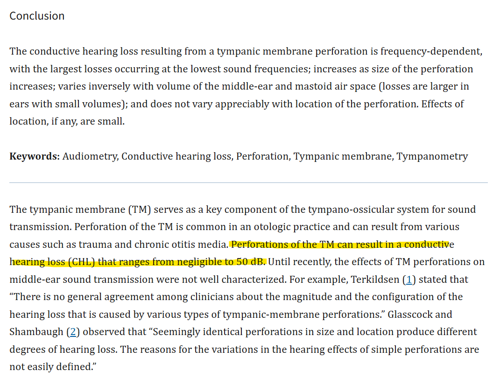
  

## Tympanometria

3v lapsi tulee vastaanotollesi korvakontrolliin 3kk sitten sairastetun välikorvan tulehduksen jälkeen. Lapsi on hyvävointinen ja vanhemmat epäilevät että lapsi kuulisi ajoittain huonosti. Korvastatus jää epävarmaksi. Teet tympanometrian ja saat alla olevan käyrän. Mitä teet?

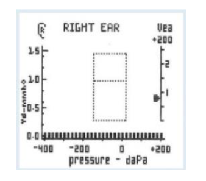

- a. Kyseessä normaali löydös, ei jatkotutkimuksia.
- b. Kyseessä on ns. Flunssa korva, teet lähetteen knk:lle
- c. Kyseessä on parantumassa oleva liimakorva, kontrolli 3kk tk:ssa
- d. Kyseessä on liimakorva, teet lähetteen knk:lle

  <button class="solution-button" data-label="Vastaus" data-hide-label="Piilota vastaus">
    Vastaus
  </button>
  

      d

Mahdollisesti 3kk ajan eritteisyyttä korvassa -> liimakorva -> lähete KNK:lle. Mallivastauksissa on vastauksena c, mutta tympanometria on tasainen B-käyrä (eritettä välikorvassa) eikä se sinänsä viittaa siihen, että liimakorva olisi parantumassa. 
  

## Kielikipua 

35v satunnaisesti tupakoiva mies tulee vastaanotollesi kielikivun takia. Kipu on jatkunut 4vko ajan ja alkanut vaikeuttaa syömistäkin. Inspektoiden kieli on normaali, limakalvot ehyet ja liikekin hyvä. Mitä on tärkeää tehdä?

- a. Tarkistat lastalla kieliheijasteen
- b. Palpoit kielen kauttaaltaan
- c. Otat pvk, crp, b-12-vitamiini pitoisuudeen, TfR
- d. Lähetät KNK:lle 8-30vrk kiireellisyydellä

  <button class="solution-button" data-label="Vastaus" data-hide-label="Piilota vastaus">
    Vastaus
  </button>
  

      b

Kielen pahanlaatuiset muutokset voivat olla submukoottisia ja eivät alkuvaiheessa näy päällepäin -> kyhmy tai kovettuma tuntuu vain palpaatiossa. 

a: Kieliheijaste ei oikein ole termi edes 

c: Kielen kipu voi kyllä johtua esim. raudan tai b12-vitamiinin puutteesta, mutta ne yleensä aiheuttaisivat limakalvomuutoksia 

d: Lähete voi olla tarpeen, jos on syöpäepäily ja silloin se olisi 1-7vrk (tai 8-30vrk lievässä epäilyssä). Ennen lähetteen tekemistä kuitenkin kielen palpaatio on tärkeää. 
  

## Mikä on tyypillinen akuutin purulentin otiitin löydös?

- a) A-tyyppinen tympanometrialöydös
- b) Paksu ja pullottava tärykalvo
- c) C-tyyppinen tympanometrialöydös
- d) Seröösi erite tympanumissa

  <button class="solution-button" data-label="Vastaus" data-hide-label="Piilota vastaus">
    Vastaus
  </button>
  

      b

Äkillisen välikorvatulehduksen (AOM) diagnostiset kriteerit ovat tärykalvon tulehduksen merkit + välikorvaerite + vähintään yksi yleiseen tai paikalliseen infektioon viittaava oire tai löydös: yleisimmin ylähengitystieinfektioon viittaavat oireet, kuten nuha, yskä, kuume, kurkku- tai korvakipu, kuulon heikkeneminen ja itkuisuus

a: Viittaa normaaliin välikorvaan, jossa ei ole eritettä

c: Viittaa korvatorven vajaatoimintaan ja alipaineiseen välikorvaan 

d: Pelkkä erite ei kerro akuutista otiitista, varsinkaan jos se on kirkasta eikä märkäistä

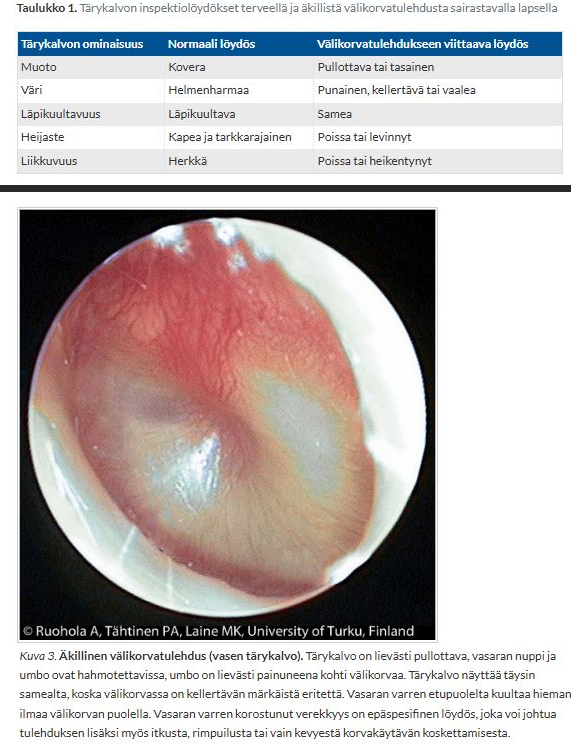
  

## Lapsella on todettu viikko sitten akuutti otiitti. Hän on saanut amoksisilliinikuurin, mutta siitä huolimatta vointi on heikentynyt ja korvan taakse on ilmaantunut punoitus ja turvotus. Lapsi on korkeakuumeinen. Mikä on todennäköinen diagnoosi?

- a) Akuutti mastoidiitti
- b) Akuutti sfenoidiitti
- c) Krooninen välikorvantulehdus
- d) Välikorvan kolesteatooma

  <button class="solution-button" data-label="Vastaus" data-hide-label="Piilota vastaus">
    Vastaus
  </button>
  

      a

Äkillinen välikorvatulehdus (AOM) ja punoitus/turvotus korvan takana sekä anteriorisesti rotatoitunut korva viittaa mastoidiittiin (kartiolisäkkeen tulehdus), joka vaatii päivystyksellistä KNK-arviota. 

b: Harvinainen ja ei aiheuttaisi korvan takaista turvotusta

c: Krooninen eli kuukausien–vuosien kulku -> ei korkeaa kuumetta tai äkillistä yleiskunnon romahtamista

d: Kolesteatooma eli helmiäinen ei ole äkillinen kuumeinen infektio, vaan kehittyy hitaasti. Ei myöskään aiheuta punoitusta akuutisti korvan takana. 

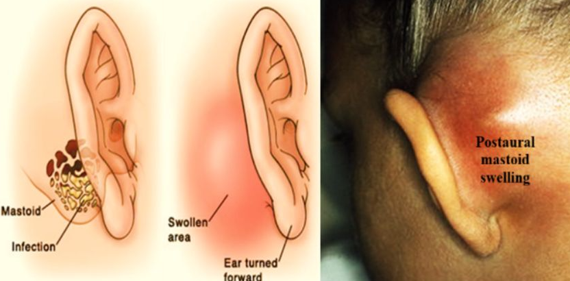
  

## Mikä seuraavista väittämistä on oikein?

- a) Allergikot saavat muita harvemmin sinuiitin flunssan jälkitautina.
- b) Sinuiitti on lapsilla tavallinen virusinfektion jälkitauti.
- c) Stafylococcus aureus on yleisin akuutin sinuiitin aiheuttajabakteeri.
- d) Vain hyvin pieni osa (0,5–2 %) virusflunssista komplisoituu ja aiheuttaa bakteriellin sinuiitin

  <button class="solution-button" data-label="Vastaus" data-hide-label="Piilota vastaus">
    Vastaus
  </button>
  

      d

Valtaosa poskiontelo-oireista flunssan yhteydessä on virusperäistä limakalvoturvotusta ja todellinen bakteerisinuiitti on harvinainen -> antibiootteja ei aloiteta rutiinisti poskiontelo-oireisille, jos ei ole merkkejä bakteeri-infektiosta. 

a: Päinvastoin, allerginen nuha aiheuttaa turvotusta ja huonompaa poskionteloiden ilmastoitumista -> allergikot ovat alttiimpia sinuiitille

b: Pienillä lapsilla poskiontelot eivät ole vielä täysin kehittyneet -> bakteerinen sinuiitti on harvinaisempi kuin aikuisilla

c: Bakteriellin sivuontelotulehduksen yleisimmät aiheuttajabakteerit ovat Haemophilus influenzae, Streptococcus pneumoniae (ja ehkä Moraxella Catarhhalis eli trio olisi sama kuin välikorvatulehduksissa); Staphylococcus aureus on jossain lähteissä nro 3 ja ainakin kroonisessa sinuiitissa korkealla listalla 
  

## Mikä väittämistä on oikein?

- a) Orbitaselluliitti on poskiontelotulehduksen jälkitauti pienillä lapsilla.
- b) Orbitaselluliitti voi edetä orbita-abskessiksi ja aiheuttaa silmän sokeutumisen.
- c) Orbitaselluliitti voidaan hoitaa peroraalisella amoksisilliinilla.
- d) Orbitaselluliitin oireena on vain pitkittynyt, purulentti nuha.

  <button class="solution-button" data-label="Vastaus" data-hide-label="Piilota vastaus">
    Vastaus
  </button>
  

      b

Orbitaselluliitti tarkoittaa silmäkuoppaan ulottuvaa tulehdusta. Tulehdus voi levitä silmäkuoppaan ympäröivistä kudoksista, useimmiten nenän sivuonteloista, harvemmin hampaista tai luomitulehduksesta. Se voi olla lähtöisin myös kyynelpussin tai -rauhasen tulehduksesta tai silmän sisäisestä tulehduksesta. 

Orbitaselluliitti on näköä, joskus jopa henkeä uhkaava tilanne, joka vaatii päivystyksellistä hoitoa erikoissairaanhoidossa. Tulehdus voi olla hengenvaarallinen, mikäli se leviää silmäkuopan kärjen kautta aivojen kovakalvon lokeroveriviemäriin (sinus cavernosukseen) aiheuttaen siellä tromboosin. Orbitaselluliitin epäily on aihe päivystyslähetteeseen sairaalaan, jossa silmä-, korva- ja lastenlääkärin konsultaatiot sekä kuvantamistutkimukset (TT tai MK) ovat välittömästi saatavilla. Perusterveydenhuollosta aikuispotilaat lähetetään ensisijaisesti korvalääkärille ja lapsipotilaat lastenlääkärille. Tarvittaessa konsultoidaan silmä- ja infektiolääkäreitä.

a: Voi syntyä kaiken ikäisille

c: Hoitona on laajakirjoinen laskimonsisäinen mikrobilääke osastolla. Märkäpesäkkeet avataan herkästi kirurgisesti.  

d: Oireena turvotus ja punoitus silmäluomien alueella kuten preseptaaliselluliitissa, mutta mukana on aina myös silmälöydöksiä. Näkö on usein alentunut, silmä työntyy eteenpäin (proptoosi), silmäkuoppa on pinkeä, ja silmänpaine voi nousta. Silmässä voi näkyä relatiivinen afferentti mustuaisdefekti. Silmän liikkeet aristavat ja ovat rajoittuneet, ja potilas näkee kaksoiskuvia. Potilas on usein kuumeinen, ja tulehdusarvot ovat aina selvästi suurentuneet. 

  

## Mikä väittämistä on oikein?

- a) Akuutti tonsilliitti on aina bakteeritauti.
- b) Peritonsilliitissa infektio leviää retrofaryngeaalisesti.
- c) Mononukleoosi on helposti erotettavissa A-Streptokokin aiheuttamasta nielutulehduksesta kliinisen kuvan perusteella.
- d) Akuuttiin bakteeritonsilliittiin ei yleensä kuulu yskä.

  <button class="solution-button" data-label="Vastaus" data-hide-label="Piilota vastaus">
    Vastaus
  </button>
  

      d

Yskän puuttuminen onkin osa Centor-pisteytystä, joka ennustaa streptokokkitonsilliitin todennäköisyyttä. Yskä on tyypillisempi oire virusinfektiolle

a: On hyvin usein virustauti; esim. adenovirus tai EBV 

b: Peritonsilliitissa infektio leviää peritonsillaaritilaan tonsillakapselin ulkopuolelle -> nielupaise 

c: Mononukleoosi voi näyttää täysin streptokokkitonsilliitilta (korkea kuume, peitteiset risat, imusolmukesuurentumat...). Nielutulehduksen aiheuttajaa ei siis voida varmuudella päätellä löydösten ja oireiden perusteella. 
  

## Mikä väittämistä on oikein?

- a) Nenäpolyypoosilla ei ole merkitystä sinuiitin synnylle
- b) Hammasperäinen sinuiitti on useimmiten bilateraalinen.
- c) Rinosinuiitissa mukosiliaaritoiminta hidastuu ja voi näin johtaa bakterielliin sinuiittiin.
- d) A-Streptokokeista n. 30 % on resistenttejä penisilliinille

  <button class="solution-button" data-label="Vastaus" data-hide-label="Piilota vastaus">
    Vastaus
  </button>
  

      c

Virusinfektio aiheuttaa limakalvojen värekarvojen heikentynyttä toimintaa ja mukosiliaarinen eskalaattori, joka mm. siirtää mikrobeja pois limakalvoilta, heikkenee -> bakteereja kertyy -> sinuiitti

a: Polyypit voivat ahtauttaa ostiumeja ja estää onteloiden ilmastoitumista -> riskitekijä rinosinuiitille; Polypoosin myös ajatellaan olevan kroonisen rinosinuiitin yksi muoto 

b: Hammasperäinen sinuiitti on yleensä unilateraalinen (hyvin harvoin bilateraalinen ja vaatisi samanaikaisesti molemmanpuolisista hampaista lähteneen infektion). 

d: Suomessa ei ole osoitettu tapausta, jossa A-streptokokki olisi nielutulehduksessa resistentti penisilliinille
  

## Mikä väittämistä on oikein?

- a) Jos potilaalle on tehty poskionteloiden avarrusleikkaus (FESS, infundibulotomia), poskiontelot voidaan huuhdella alakäytäväaukon kautta.
- b) Jos potilaalle on tehty infundibulotomia ja potilaalla epäillään sinuiittia, kannattaa poskiontelot ensisijaisesti huuhdella ennen mahdollisen antibioottihoidon aloitusta.
- c) Caldwell-Luc-leikatuilla potilailla poskiontelon huuhteluaukko sijaitsee keskikäytävässä.
- d) Poskionteloleikkauksen jälkeen sinuiitti on epätodennäköinen.

  <button class="solution-button" data-label="Vastaus" data-hide-label="Piilota vastaus">
    Vastaus
  </button>
  

      b

Jos potilaalla on voimakkaita äkillisen poskiontelotulehduksen oireita, FESS-leikkauksessa olleilla ontelo voidaan huuhdella tylpällä lavaatiokärjellä keskikuorikon alta tai vaihtoehtoisesti punktoida normaaliin tapaan alakuorikon alta. Leikattujen potilaiden poskionteloeritteen viljelyssä löydetään useammin Pseudomonas aeruginosaa ja gramnegatiivisia aerobisia bakteereja mutta vähemmän anaerobeja kuin leikkaamattomilla potilailla. Myös beetalaktamaasia tuottavat bakteerikannat ovat leikatuissa onteloissa yleisiä. 

a: Infundibulotomiassa avataan poskiontelon luonnollusta ostiumia ja ostiomeataalista kompleksia. Avautuma on keskikäytävään -> huuhtelu voidaan tehdä keskikäytäväaukon kautta 

c: Jos  potilaalle on tehty Caldwell–Lucin leikkaus (poskiontelon radikaalileikkaus eli poistetaan poskiontelon limakalvo poskiontelon etuseinämään tehdyn luuaukon kautta), niin poskiontelopunktiota ei voi tehdä. CLL on monissa paikoissa joutunut unohduksiin tai julistettu lähes pannaan, koska potilas toipuu FESS-leikkauksesta nopeammin ja jälkivaivat ovat vähäisempiä kuin CLL:ssä.

d: Sinuiitti on yhä mahdollinen, vaikka ilmastoituminen paraneekin leikkauksen jälkeen
  

## 59-vuotias rinosinuiittioireista kärsivä mies on käynyt sinusten KKTT-kuvissa. Lausunnossa todetaan, että osteomeataaliset yksiköt ovat ahtaat molemmin puolin. Mikä on osteomeataalinen yksikkö?

- a) Alakäytävässä sijaitseva alue, jossa poskiontelon ostium sijaitsee.
- b) Nenän virtausdynaamisesti ahtain kohta alakuorikon kärjen tuntumassa.
- c) Keskikäytävässä sijaitseva alue, jossa poskiontelon ostium sijaitsee.
- d) Nenän virtausdynaamisesti ahtain kohta keskikuorikon kärjen tuntumassa.

  <button class="solution-button" data-label="Vastaus" data-hide-label="Piilota vastaus">
    Vastaus
  </button>
  

      c

Akuutti bakteerin aiheuttama rinosinuiitti johtuu yleensä ostiomeataalisen yksikön tukkeutumisesta. Ostiomeataalinen yksikkö siis pääasiassa viittaa sivuonteloiden (erityisesti seulalokeroiden, otsaonteloiden ja poskionteloiden) yhteiseen ilmastointireittiin. 

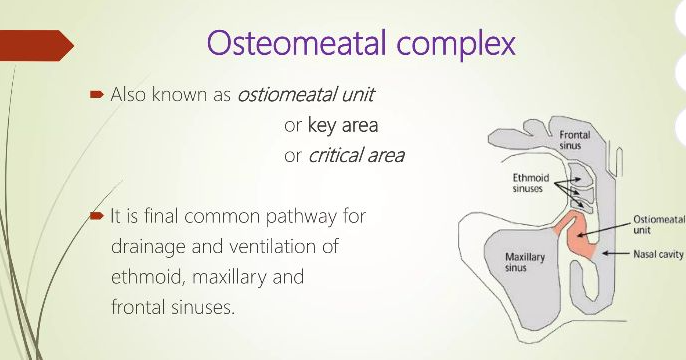

  

## Toteat 4-vuotiaalla lapsella oikeassa nenäkäytävässä kookkaan polyyppimaisen massan. Toinen puoli on täysin siisti. Mitä epäilet ja miten toimit?

- a) Kasvainepäilyn vuoksi tällaisissa tilanteissa täytyy aina ottaa muutoksesta koepala.
- b) Potilaalla on todennäköisesti nenäpolypoosi, jota hoidetaan nenästeroidisuihkeella.
- c) Potilaalla on graavi nenäpolypoosi, jota hoidetaan lapsilla 2 viikon prednisolonikuurilla.
- d) Lähetät potilaan ESH:oon korvalääkärin tutkimuksiin. Siellä tehdään kuvantamistutkimukset meningoseele-epäilyn vuoksi.

  <button class="solution-button" data-label="Vastaus" data-hide-label="Piilota vastaus">
    Vastaus
  </button>
  

      d

Kookas nenäkäytävän massa on aina vähän epäilyttävä, kun se on unilateraalinen. Yleensä ei kyse ole tavallisesta polyypoosista (lapsilla harvinaisia ja polypoosi yleensäkin bilateraalista, vaikka lapsilla voikin olla unilateraalisia koanaalipolyyppejä). 

Meningoseele tai muut keskushermoston pullistumat voivat joskus projisoitua nenäkäytävään. **Tärkeää tehdä kuvantaminen ennen mitään koepalaa, jotta ei vahingoiteta aivokalvoja.**

a: Biopsia nenämuutoksesta on syytä ottaa erityisesti silloin, kun se on toispuolinen (epätyypillistä polypoosille), mutta lapsipotilaat lähetetään aina erikoissairaanhoitoon eikä biopsioita ei oteta. 

b ja c: Ei ole nenäpolypoosia todennäköisesti 

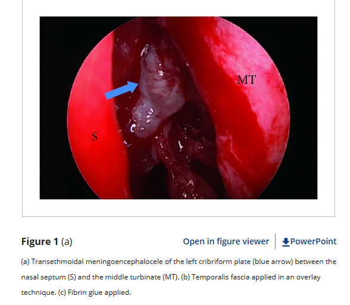

  

## Vastaanotollasi on 45-vuotias nainen, jolla on ollut nenän tukkoisuutta puolen vuoden ajan. Limakalvosupistuksen jälkeen toteat nenässä polyypit. Mikä on keskeisintä polyyppitaudin hoidossa?

- a) Hoitaa polyyppien taustalla oleva infektio pitkällä antibioottikuurilla.
- b) Polyypit tulee aina poistaa korvalääkärin toimesta, koska ne tukkivat nenäkäytäviä.
- c) Aloittaa paikallinen nenästeroidi ja ohjeistaa potilasta käyttämään sitä säännöllisesti päivittäin.
- d) Aloittaa nenästeroidi ja ohjeistaa potilasta käyttämään nenästeroidia jaksoittaisesti

  <button class="solution-button" data-label="Vastaus" data-hide-label="Piilota vastaus">
    Vastaus
  </button>
  

      c/d

Ensisijainen hoito kroonisessa rinosinuiitissa (niin ei-polypoottisessa kuin polypoottisessakin) on nenään annosteltavat kortikosteroidisuihkeet ja nenän huuhtelu keittosuolaliuoksella. **Nenästeroidia voidaan käyttää säännöllisesti, mutta ei sitä usein ikuisesti käytetä yhtäjaksoisesti.** Jos noin 2 kuukauden paikallishoito ei riittävästi helpota oireita, voidaan harkita paikallishoidon lisäksi peroraalista 2 viikon kortikosteroidikuuria. Jos oireet ovat parantuneet, hoidon jatkosta päätetään potilaan aiemman sivuontelotulehdusanamneesin perusteella. Jos oireet jatkuvat, suositellaan NSO-kuvausta ja mikrobiviljelyn tekemistä keskikäytävästä tai poskiontelopunktion yhteydessä. Niiden perusteella arvioidaan lisälääkityksen tarve. Lisähoidon jälkeen tehdään seurantatutkimus. 

Jos oireet eivät ole helpottaneet hoidon avulla, suositellaan lähetettä erikoissairaanhoitoon. Leikkaushoitoa suositellaan pitkittyneissä tai usein toistuvissa sivuontelotulehduksissa, kun muilla hoidoilla ei ole päästy riittävän hyvään tulokseen

a: Taustalla on enemmänkin pitkittynyt tulehdus kuin infektio 

b: Ei aina poisteta. 
  

## Potilas tulee terveyskeskuksen päivystysvastaanotolle valittaen äkillisesti heikentynyttä kuuloa. Kuuloseulassa näyttää seuraavalta. Tärykalvostatus on siisti, teet äänirautakokeet ja saat seuraavat kuulontutkimusta vastaavat tulokset:

- a) Rinne +/+, weber lateralisoi oikealle
- b) Rinne +/+, weber ei lateralisoi
- c) Rinne +/+, weber lateralisoi vasemmalle
- d) Rinne +/-, weber ei lateralisoi

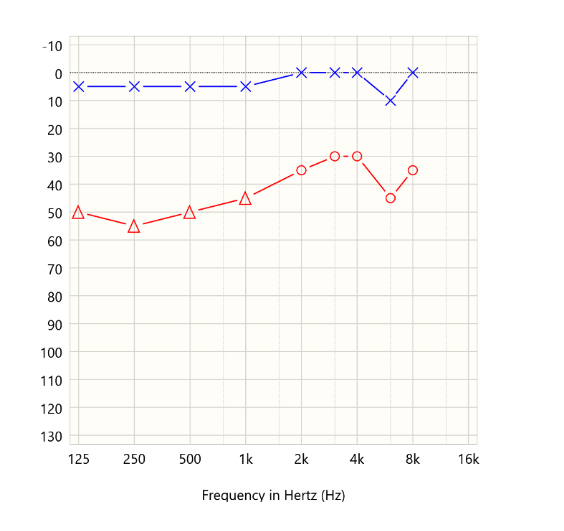

  <button class="solution-button" data-label="Vastaus" data-hide-label="Piilota vastaus">
    Vastaus
  </button>
  

      c

Audiometriassa on mitattu vain ilmajohtomittaukset, koska kyseessä on audiometriaseulonta. On todettavissa oikean korvan kuulonalenema (punainen väri ja O-merkki -> oikea korva). Äkillinen kuulonmenetys on tyypillisesti sensorineuraalinen -> oikean korvan sensorineuraalinen kuulonalenema. Se näkyy äänirautatutkimuksissa siten, että Rinne on normaali molemmissa korvissa ja Weber lateralisoi vasemmalle (eli terveeseen korvaan; jos olisi konduktiivinen vika oikealla, niin Weber lateralisoituisi oikealle). 

Jos ihmettelet mikä kolmio on audiogrammissa, niin mikäli kynnysarvo on saatu käyttämällä peiteääntä vastakkaiseen korvaan, suositus on käyttää oikean korvan merkitsemiseksi punaista kolmiota (∆) ja vasemman sinistä neliötä. 

  

## Diagnosoit akuutin kuulonmenetyksen. Selität potilaalle kliinisten tutkimuksiesi perusteella tilan johtuvan varmasti:

- a) Aivokasvaimesta, joka tulee paljastumaan MRI kuvauksella
- b) Etiologiaa ei tiedetä, eikä sitä useinkaan saada jatkotutkimuksissa selville
- c) Virustulehduksesta, todennäköisimmin herpesryhmän viruksesta
- d) Potilaan saamasta kylmästä viimasta oikeaan korvaan motoristikauden aloituksen yhteydessä

  <button class="solution-button" data-label="Vastaus" data-hide-label="Piilota vastaus">
    Vastaus
  </button>
  

      b

Äkillinen kuulonmenetys (idiopathic sudden sensorineural hearing loss tai sudden deafness) tarkoittaa tilaa, jossa sensorineuraalinen kuulo huononee vähintään kolmella vierekkäisellä taajuudella ≥ 30 dB alle 3 vrk:n aikana tuntemattomasta syystä

Etiologia on epäselvä, mutta on epäilty sisäkorvan verenkiertohäiriötä (epätodennäköinen, kun ilmaantuu eniten 30-60-vuotiaiden joukossa), virustulehdusta, autoimmuunisairautta (ehkä todennäköisin), sisäkorvan kalvorepeämää tai sisäkorvan solujen stressireitin poikkeavaa aktivaatiota. 

a: Ei todennäköinen; voisi olla taustalla hitaasti kehittyneen kuulonaleneman taustalla, mutta ei äkillisen 

c: On mahdollinen, ei kuitenkaan ole varmaa 

d: Ei todennäköinen; kylmä viima altistaa enemmänkin eksostooseille korvakäytävässä, mutta ne eivät aiheuta äkillistä kuulonmenetystä (mahdollisesti hitaasti kehittyvää konduktiivista alenemaa, mutta usein oireettomia). 
  

## Kummallinen huimauskohtaus

37-vuotias potilas tulee kiireajalle huimauksen vuoksi. Nyt potilas on oireeton, mutta hän kertoo pari päivää sitten saaneen ”kummallisen” huimauskohtauksen. Kuulo oli ensin mennyt oikeasta korvasta kovin tukkoiseksi ja tuntunut tulevan ”kuin ämpäristä”. Sen jälkeen oli alkanut voimakas pyörittävä huimaus, jota oli kestänyt noin kolme tuntia. Tukea oli pitänyt ottaa seinistä ja potilas oli joutunut oksentamaan. Huimauksen pikkuhiljaa väistyttyä, olo oli hömelö. Seuraavana päivänä vointi oli aika lailla normaali. Huimausta on nyt puolen vuoden ajan ollut vastaavasti useampia kertoja, mutta tämä oli ehdottomasti pahin. Kerrot potilaalle ennen tarkempia tutkimuksia epäileväsi tarinan perusteella:

- a) Hyvänlaatuista asentohuimausta
- b) Vestibulaarimigreeniä
- c) TIA-kohtauksia
- d) Menieren tautia

  <button class="solution-button" data-label="Vastaus" data-hide-label="Piilota vastaus">
    Vastaus
  </button>
  

      d

Ménièren tauti = idiopaattinen endolymfaattinen hydrops. Tasapainoelimen nestetilojen, peri- ja endolymfan ionipitoisuuksien ajatellaan häiriintyvän ja sen seurauksena tasapainoelimen toiminta häiriintyy kohtauksellisesti.

Ménièren taudin diagnoosi perustuu kliiniseen kuvaan. Tyypilliset oireet ovat 4H:ta: Huimaus (voimakas kiertohuimaus; kohtaukset kestävät 20min-12t), Humina (suhina, paineen tunne korvassa), Huonokuuloisuus matalilla äänillä (sensorineuraalinen), Huonovointisuus ja oksentelu. 

Löydökset tulevat usein esiin vain kohtauksen aikana, välillä status voi olla normaali. Taudin edetessä kuulonalenema voi edetä jopa kaikkia taajuuksia affisioivaksi ja pysyväksi. 

a: Kohtaus kesti liian pitkään; BPPV:n kohtaukset kestävät <1-2min 

b: Jos potilaan oireisto muistuttaa Ménièren tautia, mutta ei todeta kuulonalenemaa, tulee migreeniin liittyvä huimaus kyllä pitää mielessä. Potilas ei kuitenkaan kuvaile päänsärkykohtauksia, joten Menieren tauti on nro 1 työdiagnoosi

c: Potilas on nuori eikä ole merkittäviä TIA-riskitekijöitä. Oireet myös kestivät monia tunteja, joka ei ole TIA:lle (transient ischemic attack) tyypillistä (TIA kestää yleensä alle tunnin, tyypillisimmin 2–15 minuuttia)
  

## Korvaperäisen huimauksen päällä ollessa on normaalia että

- a) Nystagmuksen suunta vaihtelee
- b) Äänirautakokeet indikoivat konduktiivista kuulovikaa
- c) Potilaalla on pahoinvointia
- d) Peittokokeessa peitetty silmä alkaa devioimaan vertikaalisesti

  <button class="solution-button" data-label="Vastaus" data-hide-label="Piilota vastaus">
    Vastaus
  </button>
  

      c

Pahoinvointi on tyypillistä huimaukselle. Esim. vestibulaarineuriitissa voidaankin usein tarvita pahoinvointilääkkeitä oireenmukaisena hoitona. 

a: Bidirektionaalinen nystagmus viittaa sentraaliseen syyhyn (HINTS plus -testin N-osa eli nystagmus)

b: Kuulonalenema ei ole normaalia korvaperäiselle huimaukselle ja sentraalinen syy tulisi poissulkea (HINTS plus -testin plus-osa eli kuulon testaaminen)

d: Vertikaalinen skew (HINTS plus -testin TS-osa eli test of skew) on huolestuttavaa sentraalisen syyn suhteen 
  

## Potilas sanoo sairastavansa Menieren tautia, johon hän nyt pyytää uusimaan eläköityneen kollega Virtasen reseptin orfenadriinin ja parasetamolin yhdistelmävalmisteesta puhelimitse, mitä teet:

- a) Uusit reseptin
- b) Teet lähetteen korvataudeille diagnoosin varmistamiseksi
- c) Teet lähetteen Fysiatrialle diagnoosin varmistamiseksi, valmiste on kuitenkin lihasrelaksantin ja kipulääkkeen yhdistelmä ja viittaa Tules-vaivaan.
- d) Et uusi lääkettä ja pyydät potilaan vastaanotollesi

  <button class="solution-button" data-label="Vastaus" data-hide-label="Piilota vastaus">
    Vastaus
  </button>
  

      d

Orfenadriini (esim. Norflex) + parasetamoli ei ole ensisijainen Menieren taudin hoito, vaan lihasrelaksantin ja kipulääkkeen yhdistelmä, joka viittaa TULES-vaivaan. Jos ne ovat auttaneet, niin Menieren tauti ei ole todennäköinen, vaan potilas vaatii uuden arvion. 

b: Menieren taudin voi diagnosoida PTH:ssakin anamneesin ja statuksen perusteella; lähete KNK:lle ei ole asianmukainen ennen kuin nykyinen vaiva arvioidaan TK:ssa

c: Lähete fysiatrialle ei ole asianmukainen ennen kuin nykyinen vaiva arvioidaan TK:ssa
  

## 50-vuotias mies tulee vastaanotollesi jo puoli vuotta jatkuneen hajuaistin aleneman vuoksi. Mikä seuraavista vaihtoehdoista on yleisin kroonisen hajuaistihäiriön syy?

- a) Akuutti virusinfektio
- b) Parkinsonin tauti
- c) Kallonpohjan kasvain
- d) Septumdeviaatio

  <button class="solution-button" data-label="Vastaus" data-hide-label="Piilota vastaus">
    Vastaus
  </button>
  

      a

Krooninen hajuaistihäiriö (anosmia tai hyposmia) aikuisella johtuu useimmiten aiemmin olleesta virusinfektiosta. Taustalla on usein virusperäinen nenän limakalvovaurio. Usein potilas kertoo hajuaistin heikentyneen akuutin flunssan tai influenssan jälkeen. Alenema voi parantua hiljalleen itsestään; harvoin se voi myös jäädä todellakin pitkäaikaiseksi ja pysyväksi. 

b: Parkinsonissa hajuaistin heikkeneminen on varhainen merkki, mutta on harvinaisempi 

c: Mahdollinen, mutta harvinasempi 

d: Voi aiheuttaa lievää hajuaistin heikentymistä, jos nenäontelo tukossa, mutta merkittävä hajuaistin vähenemä on harvinaista. Usein oire liittyy enemmän ilman kulun vaikeuteen kuin hajuaistin vähenemään. 
  

## 35-vuotias mies kärsii jatkuvasta nenän tukkoisuudesta. Hän kertoo käyttävänsä nenän ksylometatsoliinisuihketta useita kertoja päivässä ja kokee ainoastaan siitä olevan hetkellistä apua oireeseen. Mikä seuraavista vaihtoehdoista EI pidä paikkaansa?

- a) Lääkeainenuha voi johtaa nenän limakalvon levyepiteelimetaplasiaan.
- b) Lääkeainenuhassa vieroitus avaavasta nenäsuihkeesta tehdään ensisijaisesti nenästeroidilla.
- c) Lääkeainenuhaan liittyvässä rebound-ilmiössä limakalvoturvotus ei palaudu lääkkeen vaikutuksen mentyä ohi.
- d) Vaikeammissa tapauksissa voidaan vieroituksessa käyttää peroraalista kortisonilääkitystä.

  <button class="solution-button" data-label="Vastaus" data-hide-label="Piilota vastaus">
    Vastaus
  </button>
  

      c

Lääkeainenuha (rhinitis medicamentosa) syntyy pitkäaikaisesta dekongestanttisuihkeen (esim. ksylometatsoliini) käytöstä. Rebound-ilmiössä limakalvot turpoavat, kun lääkkeen vaikutus lakkaa -> nenän tukkoisuus pahenee ja potilas käyttää lääkettä jatkuvasti pahentaen sykliä. Turvotus kuitenkin yleensä palautuu ajan myötä vieroituksen jälkeen, kun limakalvo tottuu pois lääkkeestä. 

a: Pitkäaikainen käytön seurauksena voi syntyä limakalvon metaplasiaa. 

b ja d: Nenästeroidit vähentävät limakalvotulehdusta ja turvotusta vieroituksen aikana ja on ensisijainen hoito vieroituksen auttamisessa. Jos se ei riitä, niin systeeminen glukokortikoidikin voi olla aiheellinen.
  

## 25-vuotiaalla naisella on jokakeväinen voimakasoireinen allerginen nuha, joka oireilee maksimaalisesta lääkityksestä huolimatta. Teet lähetteen siedätyshoitoon. Mikä seuraavista väitteistä on oikein?

- a) Siedätyshoidon jälkeen potilas ei tarvitse oirelääkkeitä.
- b) Siedätyshoito voidaan toteuttaa koivulle ja timoteille kielenalustableteilla.
- c) Siedätyshoito voidaan aloittaa empiirisesti ilman allergiatutkimuksia, jos oireisto täsmää.
- d) Siedätyshoidolla voidaan hoitaa myös polypoosia eikä potilas tarvitse muita lääkkeitä.

  <button class="solution-button" data-label="Vastaus" data-hide-label="Piilota vastaus">
    Vastaus
  </button>
  

      b

Suomessa siedätyshoitoa toteutetaan kielenalustabletein heiniä, lehtipuita ja pölypunkkia vastaan sekä pistoksin lisäksi kissan- ja koiranhilsettä vastaan. 

a: Siedätyshoito tehoaa noin 10 vuotta ja vähentää allergisen riniitin oireita sekä lääkehoidon tarvetta. Se ei kuitenkaan aina täysin poista oirelääkkeiden tarvetta. 

c: Diagnoosin varmistaa ja hoidon suunnittelee allergisten sairauksien hoitoon perehtynyt lääkäri yhdessä potilaan tai lapsipotilaan huoltajan kanssa

d: Polypoosin ensisijainen hoito on nenästeroidi eikä siedätyshoitoa käytetä pelkkänä hoitona 
  

## Työskentelet yliopistosairaalan akuuttipäivystyspisteessä. Klo 02.30 ambulanssi tuo vastaanotollesi 52-vuotiaan miehen, jolla on helakka nenäverenvuoto. Vuotoa tulee molemmista sieraimista ja valuu nieluun. Hemodynamiikka on vakaa. Pika-Hb 115, ei vertailuarvoja. Statustamalla et löydä vuotopaikkaa nenän etuosasta. Vuoto jatkuu. Miten toimit?

- a) Niistätytät nenän tyhjäksi ja potilas jää puristamaan sieraimia yhteen 15 minuutin ajaksi. Todennäköisesti vuoto lakkaa näin.
- b) Asetat takatamponaation rajun vuodon takia. Näin turvaat potilaan pääsyn jatkohoitoon.
- c) Otat vuotolaboratoriokokeita ja päivystys-ct:n pitäen mielessä, että kysymyksessä voi olla myös maligniteetti.
- d) Konsultoit korvalääkäriä päivystyksellisesti, jotta vuoto voidaan hoitaa endoskooppisesti.

  <button class="solution-button" data-label="Vastaus" data-hide-label="Piilota vastaus">
    Vastaus
  </button>
  

      d

Merkittävä vuoto ja ei todettavissa vuotokohtaa Locus Kiesselbachista. Jos korvalääkäriä ei olisi saatavilla, niin etutamponaatio olisi ensisijainen yritys. Tamponi on potilaalle epämiellyttävä, ja vuotokohta on löydettävissä ja hoidettavissa lähes aina nenän endoskopiassa. Nyt kun ollaan jo yliopistosairaalan päivystyksessä, niin korvalääkäriä kannattaa konsultoida endoskooppisen hoidon toteuttamiseksi. Jos oltaisiin muualla, niin tamponoitu potilas voidaan myös lähettää korvayksikköön vuotokohdan paikallistamista ja hoitamista varten.

a: Ei riitä näissä tilanteissa yleensä 

b: Takatamponaatio tehdään vain harvoin ja yleensä korvalääkärin toimesta 

c: Ei ole nyt tärkeintä
  

## Pikkulapsen hengitystieinfektion yhteydessä ilmenevä sisäänhengityksen stridor viittaa

- a) bronkiittiin
- b) mahdolliseen hengitysteiden vierasesineesen ja vaatii bronkoskopian.
- c) laryngiittiin
- d) pneumoniaan

  <button class="solution-button" data-label="Vastaus" data-hide-label="Piilota vastaus">
    Vastaus
  </button>
  

      c

Lasten akuutissa laryngiitissa voidaan usein todeta subglottisen tilan ja trakean yläosien sekä jopa bronkusten ahtautumista. **Oireena on käheä, kuiva ja haukkuva yskä (seal bark cough), joka alkaa äkillisesti ja pahenee usein yöllä, sekä joskus myös sisäänhengitysvaikeus ja vinkuminen (insiratory stridor).** Diagnoosi on kliininen ja tilaa kutsutaan pseudokrupiksi. Yleisin sairastumisikä on 6 kuukautta – 3 vuotta.

a, b, d: Alempien hengitysteiden ahtaumat useimmiten aiheuttavat uloshengityksen vaikeuksia ja vinkunaa, ei sisäänhengityksen kuten ylempien hengitysteiden ahtauma 
  

##  Mikä vaihtoehdoista voi olla äänihuulihalvauksen aiheuttaja?

- a. kilpirauhassyöpä
- b. kaikki annetut vaihtoehdot voivat olla äänihuulihalvauksen taustalla
- c. kaularanka- tai ruokatorvileikkaus
- d. syy voi jäädä tuntemattomaksi

  <button class="solution-button" data-label="Vastaus" data-hide-label="Piilota vastaus">
    Vastaus
  </button>
  

      b

Syövät voivat kompressoida n. recurrens-hermoja -> äänihuulihalvaus. Samoin leikkauksissa hermot voivat vaurioitua. Välillä syy trauma ja välillä se on myös tuntematon. Noin 20—30 % äänihuulihalvauksista jää taustaltaan tuntemattomaksi. Tällöin puhutaan idiopaattisesta halvauksesta. On viitteitä, että ainakin osa näistä, kuten muistakin yksittäisistä aivohermohalvauksista, on virustulehduksen aiheuttamia. Pieni osa halvauksista johtuu erilaisista ääreis- ja keskushermoston sairauksista, kuten sarkoidoosista, kollageenisairauksista jne. 

Kun recurrenshalvaus on todettu, eikä etiologia ole selvä, on tutkittava ainakin KNK-statuksen lisäksi aivohermostatus ja kaulan palpointi sekä varjoainetehosteinen TT. Äänihuulihalvauksen syyn selvittäminen kuuluu erikoislääkärille. TT otetaan kallonpohjasta alkaen ulottuen vas. puoleisessa pareesissa rintakehän alueelle saakka ja oik. puoleisessa riittää solisluutasolle asti. Vasemmalla n. recurrens kiertää aortankaaren -> rintakehän sisäiset tuumorit ja prosessit voivat aiheuttaa paresin. Oikealla taas kiertää subclavian -> ei tarvitse kuvata niin alhaalta. 
  

## Mikä on tavallisin atrofisen dysfonian aiheuttaja?

- a. Ikääntyminen
- b. Neurologiset sairaudet kuten Parkinsonin tauti
- c. Puhetyö
- d. Krooninen laryngiitti

  <button class="solution-button" data-label="Vastaus" data-hide-label="Piilota vastaus">
    Vastaus
  </button>
  

      a
      
Presbyfonia eli ikäkäheys.
  

## 1-vuotias tyttö tulee vanhempien kanssa aamuyöstä terveyskeskuspäivystykseen. Hänellä on ollut pari päivää yskää, mutta nyt yöllä yskä on muuttunut haukkuvaksi ja sisäänhengitys vinkuvaksi. Mitä teet?

- a. Lähetän lapsen ambulanssilla keskussairaalan lastenpäivystykseen
- b. Annan lapsen hengittää salbutamolia höyrystävällä inhalaattorilla
- c. Annan hengittää raseemista adrenaliinia höyrystävällä inhalaattorilla
- d. Laitan lapsen istumaan höyrystimen ääreen

  <button class="solution-button" data-label="Vastaus" data-hide-label="Piilota vastaus">
    Vastaus
  </button>
  

      c

Aikaisemmin oli jo sama kysymys, mutta silloin tämän vaihtoehdon tilalla oli "annan kerta-annoksen betametasonia im.". 

Potilaalla vaikuttaa olevan laryngiitti ja erityisesti siis pseudokruppi (valekuristustauti, laryngotrakeiitti, laryngotrakeobronkiitti). Lasten akuutissa laryngiitissa voidaan usein todeta subglottisen tilan ja trakean yläosien sekä jopa bronkusten ahtautumista. **Oireena on käheä, kuiva ja haukkuva yskä (seal bark cough), joka alkaa äkillisesti ja pahenee usein yöllä, sekä joskus myös sisäänhengitysvaikeus ja vinkuminen (insiratory stridor).** Diagnoosi on kliininen. Yleisin sairastumisikä on 6 kuukautta – 3 vuotta.

Lieväoireiset lapset hoidetaan kotona. Kylmä hengitysilma ja kohoasento helpottavat lapsen oloa. 

Oireiden vaikeutuessa annetaan kerta-annos beetametasonia tai deksametasonia (ensisijaisesti p.o., mutta i.m. tai aerosolinakin mahdollinen). Lapsen annetaan myös tarvittaessa hengittää adrenaliinia (levoadrenaliini 1:1 000 sellaisenaan) höyrystävällä inhalaattorilla. Inhaloitava raseeminen adrenaliini lievittää tehokkaasti laryngiitista johtuvan hengitysvaikeuden oireita; sen vaikutuksen kesto on n. 1–2 t. Jos lapsi ei vastaa adrenaliinille, saattaa kyseessä olla bakterielli trakeiitti tai jopa epiglottiitti. 

Seurannassa tarkkaillaan hengitystiheyttä, happisaturaatiota ja pulssia. Jos tila ei helpota ja/tai lapsi vaikuttaa levottomalta tai väsähtäneeltä, hänet kuljetetaan istuvassa asennossa sairaalahoitoon. Lapsi voidaan ottaa osastoseurantaan, ja joskus jopa teho-osastolle. Intubaatiota pyritään välttämään, jottei lisättäisi subglottisen tilan turvotusta ja aiheutettaisi sinne limakalvovauriota. Trakeotomioita tarvitaan lapsille akuutin laryngiitin vuoksi nykyään erittäin harvoin. Erotusdiagnostisesti on syytä muistaa hengitysteiden vierasesineet, epiglottiitti ja muihin nielun ja kaulan alueen infektioihin liittyvä kurkunpään turvotus.

a: Raseemista adrenaliinia saaneet potilaat on lähetettävä ensiavun jälkeen herkästi sairaalahoitoon, koska hengitysvaikeus palaa yleensä 1–2 t:n kuluessa. Ensiapua adrenaliinilla kyllä on aiheellista ennen lähettämistä sairaalaan. 

b: Ei vaikuta olevan astma, vaan kyseessä on infektio -> ei salbutamolia avaamaan alempia hengitysteitä

d: Perinteisesti hengitysilmaa on kostutettu laryngiittipotilaiden oireiden helpottamiseksi, joskaan sairaalaolosuhteissa tehdyissä tutkimuksissa höyryhengityksestä ei ole todettu olevan hyötyä.

  

## Tympanometria ja välikorvatulehdus? 

Flunssainen 2,5-vuotias lapsi on tuotu terveyskeskukseen ja hänet on ohjattu päivystävän sairaanhoitajan vastaanotolle. Flunssaa on ollut noin neljä päivää. Hoitajan mielestä lapsella on välikorvantulehdus: hän on tehnyt tympanometrian ja tärykalvoissa oli hänen mielestään punoitusta. Aikasi säästämiseksi hän pyytää allekirjoitusta antibioottireseptiin. Tympanometria näyttää tältä molemmissa korvissa:

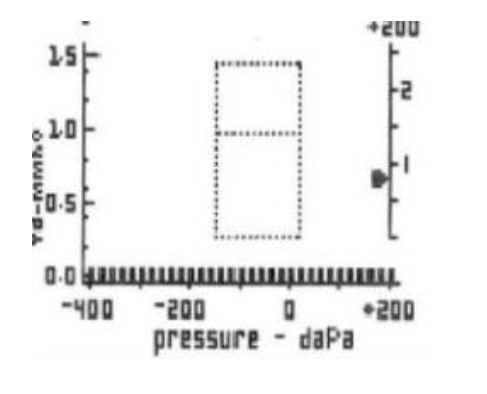

Sairauskertomuksesta näet, että lapselle on laitettu muutamaa kuukautta aiemmin toistuvien korvatulehdusten vuoksi tympanostomiaputket. Miten etenet ja miksi?

- a. Vaikka päivystyksessä on kovin kiireistä, pyydän lapsen tutkittavaksi. Tympanostomiaputkien vuoksi tympanogrammi ei ole luotettava.
- b. En allekirjoita reseptiä, vaan pyydän hoitajaa lähettämään lapsen kotiin. B-käyrä on merkkinä siitä, että putket ovat avoimet eikä välikorvantulehdus ole silloin mahdollinen.
- c. Tympanogrammissa on B-käyrä, joten korvatulehdus on todennäköinen, allekirjoitan reseptin. Ohjelmoin kontrollin kuitenkin lääkärin vastaanotolle, koska putket ovat todennäköisesti tukkeutuneet.
- d. En allekirjoita reseptiä, vaan pyydän hoitajaa lähettämään lapsen kotiin, koska päivystyksessä on kiireistä. Tympanogrammin tuloksen vuoksi pyydän lapsen kuitenkin kontrolliin parin päivän päästä, jotta pystyn tutkimaan korvat rauhassa.

  <button class="solution-button" data-label="Vastaus" data-hide-label="Piilota vastaus">
    Vastaus
  </button>
  

      a

Tasainen B-käyrä tärykalvoputkellisella tarkoittaa, että putki on avoin. Välikorvantulehdus kyllä on mahdollinen putkienkin kanssa, mutta silloin märkää nähtäisiin vuotavan putkesta. Tämän takia potilas on tärkeä tutkia kunnolla. Wikissä olevassa valtakunnallisen pankin tärpissä oikea vastaus oli "En allekirjoita reseptiä, vaan pyydän hoitajaa lähettämään lapsen kotiin. B-käyrä on merkkinä siitä, että putket ovat avoimet eikä välikorvantulehdus ole silloin mahdollinen.", mutta kyllä lapsi on tutkittava. Vaihtoehtona ei edes ollut tätä a-vaihtoehtoa, mutta Helsingin yhdessä tentissä vaihtoehtoja oltiin muokattu järkevämmäksi, joten vaihtoehdot on sieltä otettu. 

b: Välikorvantulehdus on mahdollinen avoimien putkienkin kanssa

c: Tympanometriassa on kylläkin B-käyrä, mutta se ei suoraan kerro välikorvaeritteisyydestä samalla tavalla putkitetuilla potilailla kuin ei-putkitetuilla. Ei-putkitetuillakin B-käyrä voi myös johtua tärykalvoreiästä eikä suoraan kerro, onko kyseessä välikorvaeritteisyys. B-käyrä ei myöskään erottele akuuttia ja kroonista eritettä.  

d: Kyllä lapsi kannattaa tutkia nyt; ei se korvien tarkastaminen kauaa kestä
  

## Alla näet kuulokäyrän. Mihin kuulovian etiologiaan käyrässä näkyvät löydökset viittaavat?

a. meluvammaan
b. ikäkuuloon
c. korvakäytävän vaikkutulppaan
d. MS-tautiin

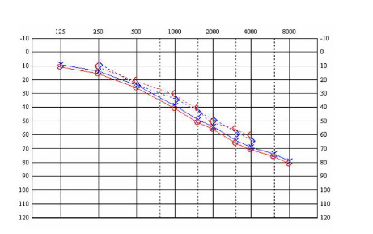

  <button class="solution-button" data-label="Vastaus" data-hide-label="Piilota vastaus">
    Vastaus
  </button>
  

      b

Ikääntymiseen liittyen tapahtuu sisäkorvan aistinsolujen hidasta degeneroitumista. Ikähuonokuuloisuus (prebyacusis) on sensorineuraalinen kuulovika, joka tyypillisesti affisioi pääasiassa korkeita taajuuksia. Kuulokäyrä tyypillisesti viettää molemmissa korvissa oikealle alaspäin symmetrisesti.

a: Audiogrammissa meluvamma näkyy aluksi lähes symmetrisenä, terävänä 3–6 kHz:n taajuusalueen kuoppana. 

c: Olisi konduktiivinen kuulovika 

d: Kuulo usein normaali; välillä voi ilmentyä akuuttia kuulonmenetystä. Jos kuulonalenemaa olisi, niin ei olisi yleensä korkeataajuksisten äänien alenemaa vaan kaikkien taajuuksien tai pelkästään matalien taajuuksien. 
  

##  Alla näet kuulokäyrän. Minkä tyyppinen kuulovika on kyseessä?

- a. Sekamuotoinen
- b. Sensorineuraalinen
- c. Konduktiivinen
- d. Ototoksinen

  <button class="solution-button" data-label="Vastaus" data-hide-label="Piilota vastaus">
    Vastaus
  </button>
  

      c

Virallinen määritelmä konduktiiviselle kuulovialle audiogrammissa on, että luu- ja ilmajohtokynnysten keskiarvon ero 0.5, 1 ja 2 kHz taajuuksilla >= 15 dB. Tässä luujohtokynnykset eivät ole selvästi alle 20dB (raja kuulovialle) -> ei ole kombinoitua vikaa vaan pelkästään konduktiivinen vika, joka alentaa ilmajohtokynnyksiä. 
  

## Mikä seuraavista ei aiheuta konduktiivista kuulovikaa?

- a. Ototoksinen vaurio
- b. Otoskleroosi
- c. Vaikkutulppa
- d. Kuuloluuketjun fiksaatio

  <button class="solution-button" data-label="Vastaus" data-hide-label="Piilota vastaus">
    Vastaus
  </button>
  

      a

Ototoksiset lääkkeet (esim. aminoglykosidit, vankomysiini) vaurioittavat sisäkorvaa, erityisesti aistinsoluja Cortin elimistössä → johtaa sensorineuraaliseen kuulovikaan, ei konduktiiviseen

b: Kuuloluuketjun fiksaatio stapesin "luutuessa" soikeaan ikkunaan -> konduktiivinen kuulovika

c: Ääni ei pääse tärykalvolle normaalisti → konduktiivinen kuulovika

d: Äänen normaali johtuminen estyy → konduktiivinen kuulovika
  

## Punajäkälä ja nyt uusi limakalvomuutos

Potilaasi on 64-vuotias mies, joka ei tupakoi eikä käytä alkoholia. Aikanaan vuosia sitten suun limakalvomuutoksesta otettu näytepala ja tästä patologin antama diagnoosi oli punajäkälä. Nyt oikean posken limakalvolle on muutaman kuukauden kuluessa kehittynyt limakalvomuutos, jonka potilas on huomannut hampaiden pesun yhteydessä. Punoittava, laakea, aristava. Miten toimit?

- a. Mahdollisesti levyepiteelikarsinooma, koska punajäkälä riskitekijänä. Kiireellisyys 1-7 vrk.
- b. Limakalvomelanooma pitää poissulkea, vaikka onkin epätodennäköinen. Lähete heti seuraavalle arkipäivälle.
- c. Kliinisesti erytroplakia. Seuranta.
- d. Todennäköisesti edelleen punajäkälä, mutta parempi varmistaa. Kiireellisyys 1-3 kk.

  <button class="solution-button" data-label="Vastaus" data-hide-label="Piilota vastaus">
    Vastaus
  </button>
  

      a

Tyypillinen muutos varsinkin punajäkälässä on retikulaarinen muutos symmetrisesti limakalvoilla; havaitaan siis vaaleaa verkkokuvioitusta (ns. Wickhamin strioja). 

Punajäkälä ja likenoidit reaktiot (samankaltaisia leesioita, mutta reaktiivisena esim lääkkeille) altistavat syövälle. N. 1% punajäkälöistä ja n. 2-3% likenoideista reaktioista muuttuu syöväksi.

b: Levyepiteelikarsinooma on paljon todennäköisempi

c: Ei voida sanoa suoraan näin

d: Ei voida odottaa näin pitkään pään alueen syöpien kanssa. 
  

## Alla oleva kuulokäyrä tuodaan sinulle näytille. Mikä seuraavista voi selittää kuulonaleneman?

- a. Suurentunut kitarisa
- b. Akustikusneurinooma
- c. Otoskleroosi oikealla
- d. Liimakorva vasemmalla

  <button class="solution-button" data-label="Vastaus" data-hide-label="Piilota vastaus">
    Vastaus
  </button>
  

      d

Audiogrammissa todettavissa vasemman korvan (sininen ja X ilmajohdoissa) lievä konduktiivinen kuulovika (luujohtokuulot normaalit). Taustalla voi olla liimakorva (3kk eritettä välikorvassa). 

a: Voi altistaa välikorvatulehduksille ja liimakorvalle, mutta vaihtoehdoissa on selkeämmin oikea vastaus  

b: Sensorineuraalinen kuulovika 

c: Oikealla ei kuulovikaa. 
  

##  Molemminpuolinen äänihuulihalvaus on yleensä iatrogeeninen kaulan kirurgian komplikaatio, jonka seurauksena potilaan

- a. puheääni on käheä ja hengitys on ahdas
- b. puheääni ja hengitys ovat normaalit
- c. puheääni on käheä mutta hengitys on normaali
- d. puheääni on normaali mutta hengitys on ahdas

  <button class="solution-button" data-label="Vastaus" data-hide-label="Piilota vastaus">
    Vastaus
  </button>
  

      d

Bilateraalisessa n. recurrens -pareesissa häiritsevin oire on yleensä hengenahdistus, koska täydellisessä halvauksessa liikkumattomien äänihuulten väliin jää vain 2–3 mm:n rako. Symmetrinen lihasjänteys tekee äänestä soinnikkaan, mutta aiheuttaa erityisesti nukkuessa ja vähäisessäkin rasituksessa kuuluvan inspiratorisen hengitysäänen.

Ääni voi aluksi olla heikko, mutta paranee muutaman viikon kuluessa ennalleen. 

Mikäli potilas sietää hengenahdistuksen, ei hoitoa välttämättä tarvita. Hoidossa pyritään löytämään kompromissi, joka täyttää potilaan tarpeet. Joillekin se on pysyvä hengitystieavanne ja puheläpällinen trakeostomiakanyyli, toisille kirurgisesti väljennetty kurkunpää.

c: Unilateraalisessa n. recurrens -pareesissa häiritsevin oire on taas yleensä äänen käheys. Vaikeusaste vaihtelee lievästä vuotoisuudesta ja äänen väsymistaipumuksesta täysin kuiskaavaan ääneen.
  

## Mitä sensorisia toimintoja on kasvohermolla?

- a. kasvojen kiputunto
- b. kielen takaosan makutunto
- c. kielen etuosan makutunto
- d. kyyneleritys

  <button class="solution-button" data-label="Vastaus" data-hide-label="Piilota vastaus">
    Vastaus
  </button>
  

      c

Kulkee chorda tympani -haaran kautta -> anteriorinen 2/3 kielestä

a: Trigeminuksen (CN V) tehtäviä

b: Kielen takaosa (1/3) saa makutunnon Glossopharyngeus-hermon (CN IX) kautta

d: Kyyneleritys on facialiksen parasympaattinen toiminto, ei sensorinen
  

## 17-vuotiaalla perusterveellä naisella on ollut viikon ajan kurkkukipua ja kuumeilua. Nyt vastaanotollasi potilas kertoo kivun muuttuneen toispuoliseksi ja kivun säteilevän samanpuoliseen korvaan. Suun avaaminen on myös hankaloitunut. Mitä epäilet?

- a. Peritonsillaariabskessi
- b. Hammasinfektio
- c. Leukanivelen luksaatio
- d. Mononukleoosi

  <button class="solution-button" data-label="Vastaus" data-hide-label="Piilota vastaus">
    Vastaus
  </button>
  

      a

Nielutulehduksen yleisin komplikaatio on peritonsillaariabskessi eli nielupaise. Todetaan useimmiten toispuolisena turvotuksena ja voimakkaana kurkkukipuna n. 3-7pv tonsilliitin/faryngiitin alusta. Kurkkukipu on pahempi paiseen puolella. Ilmenee erityisesti nuorilla aikuisilla, mutta voi esiintyä minkä ikäisellä potilaalla tahansa. 

Vaikeassa tilanteessa mahdollinen leukalukko (trismus), puuromainen (hot potato) puhe ja nielemisen vaikeudesta johtuva kuolaaminen. Turvotus työntää uvulaa poispäin. Kaulan alueen lymfadenopatiaa havaittavissa usein. Usein aiheuttaa kipua korvaan. 

b: Sopii anamneesin perusteella nielupaiseeksi 

c: Ei syytä luksaatiolla ja sopii anamneesin perusteella nielupaiseeksi

d: Ei aiheuttaisi trismusta tai vain toispuolista kipua
  

## Hyttynen purrut silmäluomea? 

9-vuotias atoopikkolapsi tuodaan helmikuussa vastaanotollesi silmäluomen punoituksen takia. Anamneesissa saat tietää, että lapsella on ollut progredioivaa nuhaa 2vko ajan, sekä eilen oikealle silmäluomiin oli noussut turvotusta sekä punoitusta. Et saa näkyvyyttä silmämunaan turvotuksen alta ja lapsi ei anna kivun takia jatkaa tutkimusta. Nenästä valuttaa kellertävää räkää molemmin puolin ja lapsi valittaa päätä kipeäksi. Korvasta mitaten lapsella on lämpöä 38,4 astetta. Lapsen äiti miettii olisiko jokin hyttynen voinut puraista silmäluomesta yön aikana. Mitä näillä tiedoilla tulee epäillä ja miten toimit?

- a. Kasvojen erysipelasta, teet päivystyslähetteen KNK:lle ja neuvot potilasta hakeutumaan viipymättä jatkohoitoon.
- b. Vaikeaa konjunktiviittia, aloitat kloramfenikolitipat ja voiteen viikon kuurina, sovit soittokontrollin 7vrk päähän
- c. Orbitaselluliittia, teet päivystyslähetteen KNK:lle ja neuvot potilasta hakeutumaan viipymättä jatkohoitoon.
- d. Preseptaaliselluliittia, aloitat Kefexinin painonmukaisella annoksella tee lähetteen KNK:lle kiireellisyydellä 1-7vrk

  <button class="solution-button" data-label="Vastaus" data-hide-label="Piilota vastaus">
    Vastaus
  </button>
  

      c

Orbitaselluliitti tarkoittaa silmäkuoppaan ulottuvaa tulehdusta. **Tulehdus voi levitä silmäkuoppaan ympäröivistä kudoksista, useimmiten nenän sivuonteloista,** harvemmin hampaista tai luomitulehduksesta. Se voi olla lähtöisin myös kyynelpussin tai -rauhasen tulehduksesta tai silmän sisäisestä tulehduksesta. Oireena turvotus ja punoitus silmäluomien alueella kuten preseptaaliselluliitissa, mutta mukana on aina myös silmälöydöksiä. Näkö on usein alentunut, silmä työntyy eteenpäin (proptoosi), silmäkuoppa on pinkeä, ja silmänpaine voi nousta. Silmässä voi näkyä relatiivinen afferentti mustuaisdefekti. **Silmän liikkeet aristavat ja ovat rajoittuneet,** ja potilas näkee kaksoiskuvia. Potilas on usein kuumeinen, ja tulehdusarvot ovat aina selvästi suurentuneet. 

Orbitaselluliitti on näköä, joskus jopa henkeä uhkaava tilanne, joka vaatii päivystyksellistä hoitoa erikoissairaanhoidossa. Tulehdus voi olla hengenvaarallinen, mikäli se leviää silmäkuopan kärjen kautta aivojen kovakalvon lokeroveriviemäriin (sinus cavernosukseen) aiheuttaen siellä tromboosin. Orbitaselluliitin epäily on aihe päivystyslähetteeseen sairaalaan, jossa silmä-, korva- ja lastenlääkärin konsultaatiot sekä kuvantamistutkimukset (TT tai MK) ovat välittömästi saatavilla. Perusterveydenhuollosta aikuispotilaat lähetetään ensisijaisesti korvalääkärille ja lapsipotilaat lastenlääkärille. Tarvittaessa konsultoidaan silmä- ja infektiolääkäreitä. Hoitona on laajakirjoinen laskimonsisäinen mikrobilääke osastolla. Märkäpesäkkeet avataan herkästi kirurgisesti.  

a: Kasvojen erysipelas (ruusu) on tavallisesti poskilla ja kasvoilla, mutta orbitan alueen syvä turvotus, kuume ja silmäkipu viittaa syvempään infektioon

b: Konjunktiviitti aiheuttaa punoitusta, roskantunnetta, joskus eritteitä; ei yleensö tällaista oirekuvaa 

d: Preseptaaliselluliitti on lievempi kuva eikä todeta silmäoireita, kuten silmän liikerajoitusta

  

## Kandi ottanut nokkiinsa

23-vuotiaalla lääketieteen opiskelijalla on tullut riitaa ystävän kanssa yökerhossa parhaasta KNK-alan opettajasta. Ystävä on hetkellisen mielenhäiriön takia lyönyt opiskelijaa nyrkillä kasvoille. Seuraavana aamuna opiskelija huomaa nenänsä olevan molemminpuolin tukkoinen, nenän varsi on turvonnut ja erittäin kipeä. Hän päättää hakeutua vastaanotollesi. Nenän varsi on voimakkaasti turvoksissa, alaluomissa on pinnallista hematoomaa ja toteat seuraavanlaisen näkymän (ks. kuva)

- a. Nenäluun ja septumin murtuma sekä dislokaatio, teet lähetteen knk:lle 1-7vrk kiireellisyydellä.
- b. Nenäluun kontuusio ja voimakas limakalvoturvotus, pyydät potilaan kontrolliin 2vko päähän
- c. Nenäluun murtuma ja septumhematooma, teet lähetteen knk päivystykseen
- d. Nenäluun hyväasentoinen murtuma ja normaalit alakuorikot, ei kontrolleja

  <button class="solution-button" data-label="Vastaus" data-hide-label="Piilota vastaus">
    Vastaus
  </button>
  

      c

Turvotus tulee septumista ja viittaa septumhematoomaan. Nenämurtumat kuuluu lähettää päivystyksellisesti korvalääkärille, jos on avomurtuma tai nenän väliseinän vamma/hematooma (tai mahdollisesti vielä ne murtumat, joissa ei ole ehtinyt turvotusta vielä kohoamaan). Muut voi lähettää 1-7vrk kiireellisyydellä KNK:lle paikallispuudutuksessa tehtävää reponointia varten, joka tehdään turvotuksen laskettua. 

Nenän väliseinän hematooma hoidetaan päivystyksellisesti infektioriskin ja väliseinän myöhemmän paksuntumisen tai ruston tuhoutumisen riskin takia. Hematooma voi ilmaantua 1-2 vuorokauden viiveellä oireillen lisääntyvällä tukkoisuudella ja kivulla. Hoito on ensisijaisesti se, että paikallispuudutuksessa avataan limakalvo, tyhjennetään hematooma imulla ja asetetaan kevyesti komprimoiva tamponi pariksi vuorokaudeksi. 
  

