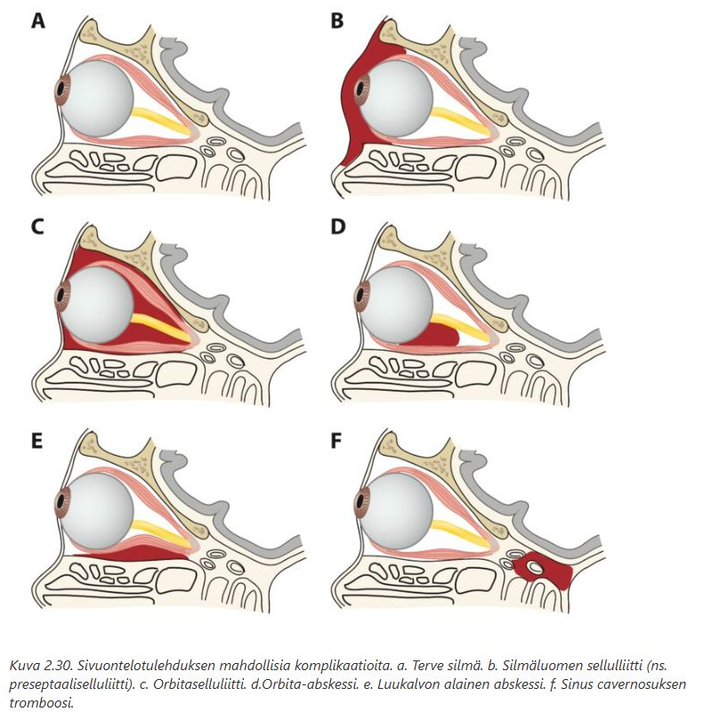

# O/V -tehtävät 

Valtakunnallisissa tärpeissä on myös useita tehtäviä, joissa pitää arvioida onko väittämä oikein (O) vai väärin (V). Tämän tyyppisiä tehtäviä ei ole ollut Turun tenteissä.  

## 2-vuotias poika, joka on saanut sormiruokaa syödessä ankaran yskänpuuskan. Nyt oire on jo mennyt ohi. Lapsi saturoituu hyvin, auskultoiden ei kuulu poikkeavaa.

- a. Lapsi lähetetään thoraxkuvaan ja harkitaan jatkotoimia sen jälkeen.
- b. Lapsi laitetaan päivystyksenä KNK-klinikkaan bronkoskopiaa varten.
- c. Jäädään seuraamaan tilannetta ja laitetaan lapsi kotiin.
- d. Anamneesin perusteella kyseessä on ruokatorven vierasesine, eikä jatkotoimenpiteitä tarvita

  <button class="solution-button" data-label="Vastaus" data-hide-label="Piilota vastaus">
    Vastaus
  </button>
  

      V, O, V, V

a: Thoraxkuva voi olla täysin normaali, vaikka keuhkoputkessa olisi vierasesine. Jatkotoimia ei arvioida thx-kuvan perusteella. 

b: Lapsen äkillinen yskänkohtaus = aspiraatio, kunnes toisin todistetaan; bronkoskopialla varmistetaan diagnoosi ja samalla voidaan kalastaa vierasesine pois. Tämä tulee tehdä päivystyksellisesti pelkän epäilyksenkin takia, koska jos vierasesineen antaa jäädä muhimaan, niin se aiheuttaa vaikeahoitoisen pneumonian. 

c: Alahengitystievierasesineen oirekuvassa yleensä on alussa yskänpuuska, jota seuraa oireeton vaihe. Tilannetta ei voi oireettomuuden takia jäädä seuraamaan, koska muuten potilaalle kehittyy pneumonia. 

d: Äkillinen yskänpuuska viittaa hengitysteihin, ei ruokatorveen
  

## 70-vuotias mies, jolla on operoitu poskionteloita toistuvien poskiontelotulehdusten vuoksi. Vasemmalle on tehty aikoinaan Luc-Caldwell ja oikealle runsas 10 vuotta sitten FESS. Nyt potilaalla on ollut pitkään, yli 2 vk ajan kova flunssa ja epäilet tulehdusta poskionteloissa.

- a. Paras hoito on empiirinen antibioottikuuri esim. amoksisilliini viikon ajaksi.
- b. Poskiontelot kannattaa huuhdella. Vasemmalle tehdään punktio ja oikealle lavaatio alakäytävän kautta.
- c. Potilas pitää lähettää kuutamokuvaan ennen hoitopäätöstä, sen jälkeen poskiontelot lavatoidaan tarpeen mukaan.
- d. Lavaatio kannattaa tehdä primääristi. Se tehdään oikealle keskikäytävän ja vasemmalle alakäytävän aukon kautta.

  <button class="solution-button" data-label="Vastaus" data-hide-label="Piilota vastaus">
    Vastaus
  </button>
  

      V, V, V, O

a ja d: Leikattu poskiontelo voidaan huuhdella käyrällä lavaatiokärjellä antrostomia-aukosta, joka on löydettävissä joko alakuorikon ala-lateraalipuolelta (alakäytäväantrostomia tai Caldwell-Lucin leikkaus) tai keskikuorikon lateraalipuolelta hieman keskikuorikon alareunan tason yläpuolelta (FESS-leikkaus). On varottava aikaansaamasta limakalvorikkoumia keskikuorikkoon.

b: Jos potilaalle on tehty Caldwell–Lucin leikkaus (poskiontelon radikaalileikkaus eli poistetaan poskiontelon limakalvo poskiontelon etuseinämään tehdyn luuaukon kautta), niin poskiontelopunktiota ei voi tehdä.

c: Akuuteissa sinuiiteissa kliininen kuva + anamneesi riittää hoitopäätökseen; kuvantaminen ei ole rutiinisti tarpeellista
  

## 2-vuotias lapsi, jolla silmä on muurautunut umpeen. Lapsella on ollut kova nuha noin viikon ajan. Nyt lapsi kuumeilee ad 40C. Lapsi on väsähtänyt ja kipeä.

- a. Kyseessä on sinuiitti ja lapselle pitää tehdä punktiot.
- b. Lapsen tila on septinen ja se vaatii päivystyslähetteen KNK-klinikkaan.
- c. Lapsella on sidekalvotulehdus. Se voidaan hoitaa antibioottisilmätipoilla ja amoksisilliinikuurilla.
- d. Kyseessä on todennäköisesti etmoidiitin seurauksena tullut orbitaselluliitti tai orbita-abskessi

  <button class="solution-button" data-label="Vastaus" data-hide-label="Piilota vastaus">
    Vastaus
  </button>
  

      V, O, V, O

a: 2-vuotiaalla poskiontelot ovat vielä huonosti kehittyneet ja punktiot eivät ole ensisijainen hoito. 

b: Korkea kuume + yleisvoinnin lasku + silmäoireet -> komplisoitunut tilanne -> päivystyksellisen erikoissairaanhoitoon

c: Sidekalvotulehdus ei nosta kuumetta tällä tavalla eikä laske yleistilaa merkittävästi eikä muurauta silmää umpeen. 

d: Pienillä lapsilla etmoidaalisinuiitti on yleinen, koska ne ovat kehittyneet jo pienenä. Se voi levitä orbitaan ja aiheuttaa ns. orbitaselluliitin (ja kehittyä abskessiksikin), joka aiheuttaa silmäoireita ja voi olla jopa hengenvaarallinen. 

  

## 35-vuotias nainen. Keväisin potilaalla on voimakkaat nuha- ja silmäoireet, ajoittain alahengitystieoireita. Antihistamiini on ollut säännöllisessä käytössä, mutta siitä ei ole riittävää apua.

- a. Antihistamiinia voi ottaa kaksin- tai kolminkertaisella annoksella, jotta oireet pysyvät kurissa. Muuta lääkitystä tai tutkimuksia ei tarvita.
- b. Nenästeroidi tulisi aloittaa hyvissä ajoin ennen siitepölykauden alkua ja käyttää sitä säännöllisesti koko siitepölykauden ajan. Lisänä esim. kromoglikaattisilmätipat ja
antihistamiinitabletit.
- c. Potilaalla tulisi olla tehokas oirelääkitys ainakin yhden siitepölykauden ajan. Jos se ei riitä, voidaan harkita tablettisiedätystä ainakin pujolle.
- d. Potilaalle pitää aloittaa tehokas oirelääkitys (säännöllinen nenästeroidi, tarpeen mukaan antihistamiini ja silmätipat). Myös astmatutkimukset kannattaa tehdä, sillä potilaalla on ainakin hyperreaktiviteetti keuhkoputkissa, myös astma on mahdollinen.

  <button class="solution-button" data-label="Vastaus" data-hide-label="Piilota vastaus">
    Vastaus
  </button>
  

      V, O, V, O

a: Allergisessa nuhassa nenästeroidi on tehokkain lääke, ei antihistamiinin annoksen nosto. Antihistamiinin suurentaminen yksin ei riitä, eikä se hoida nenän tulehdusta. Lisäksi alahengitystieoireet vaativat lisäselvitystä.

b: Tämä on perushoito allergisessa nuhassa. Ennalta aloitettu ja säännöllisesti käytetty nenästeroidi toimii parhaiten. Silmäoireisiin paikallishoito, antihistamiini lisänä. 

c: Ei voi vain aloittaa siedätystä jollekin allergeenille, jos ei tiedetä sen aiheuttavan oireita. Potilaalal tulee siis olla varmistettu IgE-välitteinen (S-IgE-Pse tai S-All-IgE), oireita aiheuttava allergia. Pujo ei myöskään ole yleisimpiä allergeeneja, joten se ei olisi "ainakin"-listalla. Yleisimmät siedätyshoidon kohteet ovat koivu (65 %) ja timotei (29 %). 

d: Alahengitystieoireet allergikolla = astma pitää aina poissulkea. Allergista riniittiä sairastavalla on 2-3 kertainen elinaikainen riski sairastua astmaan verrattuna henkilöön, joka ei sairasta allergista riniittiä.
  

## Palvelutalossa asuva 89-vuotias monisairas vanhus (mm. MCC, HTA, lievä muistiongelma) tuodaan vastaanotolle. Hän on syönyt lounaalla lihakastiketta ja perunoita. Lounaan jälkeen vesikään ei ole mennyt alas. Hengitys on vapaata.

- a. Potilaalla on todennäköisesti vierasesine hengitysteissä. Potilaasta pitää tehdä kiireellinen lähete (R1, 1–7 pv) jatkotoimenpiteisiin.
- b. Ilmeisimmin kyseessä on ruokatorvessa oleva lihapala, joka on juuttunut paikoilleen.
- c. Potilas ei välttämättä ole nukutuskelpoinen. Hänet pitää lähettää päivystyksenä ESH:oon gastroesofagokopiaan, joka voidaan tehdä hereillä.
- d. Vastaanotolla tehdään LI (laryngoscopia indirecta). Ellei siinä ole löydöksiä, ei jatkotoimia tarvita

  <button class="solution-button" data-label="Vastaus" data-hide-label="Piilota vastaus">
    Vastaus
  </button>
  

      V, O, O, V

a: Ongelma alkoi syömisen jälkeen ja vesikään ei mene alas, mutta hengitys onnistuu normaalisti. Potilaalla ei myöskään ollut alahengitystievierasesineaspiraatiolle tyypillistä yskäkohtausta alkuun. Tämä viittaa ruokatorven eikä hengitysteiden ongelmaan.

b: Tila sopii ns. steakhouse syndroomaan, joka tarkoittaa akuuttia ruokatorven tukosta, yleensä huonosti pureskellun ruuan takia. 

c: 89-vuotias monisairas → nukutusriskit. Gastroskopia voidaan kuitenkin tehdä hereillä ja on hoitava toimenpide. 

d: LI ei näe ruokatorveen eikä sulje pois ruokatorvitukosta. 
  

## 68-vuotias mies, jolla yläleuassa kokoproteesi ja alaleuassa osaproteesi. Potilas on syönyt kanankoipia illalla. Sen jälkeen on tuntunut pisto kilpiruston alapuolella joka nielaisulla.

- a. Vierasesine on ruokatorvessa ja ruokatorven perforaatioriski on todellinen.
- b. Potilaasta pitää ottaa THX-kuva ja varmistaa, ettei luunpalaa näy ruokatorven alueella.
- c. Peilitutkimuksilla voidaan varmistaa, ettei vierasesinettä larynxissa tai hypofarynxissa ole. Jos löydös on siisti, ei jatkotoimenpiteitä tarvita.
- d. Potilas pitää lähettää päivystyksenä esofagoskopiaan KNK-klinikkaan.

  <button class="solution-button" data-label="Vastaus" data-hide-label="Piilota vastaus">
    Vastaus
  </button>
  

      O, V, V, O

a: Kanankoiven luu on terävä. Pisto nieltäessä + anatominen sijainti viittaa ruokatorveen / hypofarynxiin ja perforaatioriski on todellinen. 

b: Pienet luut ja ruodot näkyvät usein huonosti eikä normaali THX-kuva sulje pois vierasesinettä. 

c: Peilitutkimus ei näe ruokatorveen ja oireet voivat jatkua, vaikka vierasesine olisi jo edennyt alemmaksi tai painunut seinämään. 

d: Terävä vierasesine + oireet = päivystysendoskopia. Tämä on sekä diagnostinen että hoitava toimenpide.
  

## Potilaasi on 78-vuotias nainen, jolla on vasemmalle nenänsiivekkeeseen tullut rupeutuva ja vallireunainen ihomuutos kesän aikana. Muutoksen koko on 8 mm. Miten toimit?

- a. Kirjoitat kortisonivoiteesta (hydrocortison 1 %) reseptin ja pyydät kontrolliin kuukauden kuluttua.
- b. Otat muutoksesta stanssibiopsian ja lähetät potilaasi saman tien (R1) erikoissairaanhoitoon.
- c. Otat muutoksesta valokuvan, stanssibiopsian ja pyydät PAD-vastauksen kiireellisenä, koska epäilet basalioomaa. Jos kyseessä on PAD- vastauksen perusteella basaliooma, lähetät potilaasi erikoissairaanhoitoon R2-kiireellisyydellä.
- d. Otat muutoksesta valokuvan ja lähetät potilaan kiireettömänä (R3) erikoissairaanhoitoon.

  <button class="solution-button" data-label="Vastaus" data-hide-label="Piilota vastaus">
    Vastaus
  </button>
  

      V, V, O, V

Ihomuutosten tapauksessa yleensä c on oikea toimintamalli. Dokumentoidaan muutos, otetaan siitä PAD joko stanssilla tai veneviillosta. Vasta PAD-tulosten jälkeen yleensä päätetään, miten jatkohoidon kanssa toimitaan. 

a: Epäily maligniteetista → tulee ottaa näyte

b: Basalioomaepäilyn kanssa voi kyllä odottaa PAD-vastausta, ei ole niin kiirettä ESH-lähetteen kanssa. Monet basalioomat voi myös hoitaa itse PTH:ssa, kunhan vain varmistaa marginaalin toteutumisen. 

d: Muutoksista otetaan aina mahdollisuuksien mukaan näyte ennen ESH-lähetettä. 
  

## Äiti tuo 4-vuotiaan tyttärensä vastaanotolle. Lapsi oli leikkinyt kolikoilla. Nyt lapsi ei suostu syömään eikä juomaan. Lapsen hengitys on rauhallista. Mitä teet?

- a. Epäilet hengitysteiden vierasesinettä. Teet KNK-statuksen ja suosittelet seuraamaan tilannetta kotona.
- b. Epäilet ruokatorven yläahtauman vierasesinettä. Lähetät lapsen päivystyksenä KNK- lääkärille ruokatorven tähystystä varten.
- c. Teet KNK- statuksen peilauksineen, koska kolikon pitäisi näkyä hyvin epäsuorassa laryngoskopiassa.
- d. Teet epäsuoran laryngoskopian, koska ruokatorven yläahtauma näkyy epäsuorassa laryngoskopiassa ja vierasesineen saa sieltä helposti pois.

  <button class="solution-button" data-label="Vastaus" data-hide-label="Piilota vastaus">
    Vastaus
  </button>
  

      V, O, V, V

a: Hengitys rauhallista, mutta syöminen/juominen ei onnistu -> viittaa vahvasti siihen, että vierasesine on ruokatorvessa, ei hengitysteissä

c: Kolikko ruokatorvessa ei yleensä näy epäsuorassa laryngoskopiassa

d: Ruokatorven yläahtauma ei ole näkyvissä eikä siten myöskään poistettavissa helposti vastaanotolla
  

## Väittämiä nuhasta 

- a. Jos epäilet potilaallasi allergista nuhaa, ei ihotesti (Prick-testi) ole välttämätön taudin diagnosoimiseksi. Usein allergisen nuhan aiheuttaja paljastuu anamneesin perusteella.
- b. Nenästeroidia ei saa käyttää pitkiä aikoja yhtäjaksoisesti, koska se ohentaa liikaa nenän limakalvoja.
- c. Tarkan anamneesin ja hyvän statuksen perusteella voi avohoidossa aloittaa nenästeroidihoitokokeilun oletettuun koivuallergiaan.
- d. Allerginen nuha on yleisin ikäihmisillä ja nenästeroidia kannattaa aina kokeilla ensisijaisena lääkkeenä

  <button class="solution-button" data-label="Vastaus" data-hide-label="Piilota vastaus">
    Vastaus
  </button>
  

      O, V, O, V

a: Allergisen nuhan aiheuttajat selviävät usein haastattelemalla. Spesifin IgE:n määritys tai ihopistokokeet tuovat diagnoosiin varmuutta, mutta ne eivät selkeässä tilanteessa ole aina pakollisia. 

b: Nenästeroideja kyllä käytetään tyypillisesti pitkiäkin aikoja. Modernit nenän kortikosteroidit eivät merkittävästi ohenna limakalvoja eivätkä aiheuta systeemisiä kortisonihaittoja normaalikäytössä. Ne voivat kyllä aiheuttaa kuivuutta, mutta sen takia samalla yleensä suositellaan nenäkannulla huuhtelua lisäksi kosteuttamaan limakalvoja. 

c: Esimerkiksi tyypillinen keväinen oireilu → voidaan aloittaa hoitokokeilu ilman testejä. 

d: Allerginen nuha on yleisintä lapsilla ja nuorilla. Ikäihmisillä nuha on useammin ei-allerginen (erityisesti vasomotorinen tai atrofinen). 
  

## Väittämiä rinosinuiitista

- a. Rinosinuiitissa mukosiliaaritoiminta heikkenee virusinfektion vuoksi. Se voi johtaa eriteretention kertymiseen poskionteloon.
- b. Aikuisella toispuoleinen märkäinen nuha ja ajoittainen nenäverenvuoto herättävät aina epäilyn nenäkäytävän vierasesineestä.
- c. Jos potilaalla on käytössä nenästeroidi, se pitää lopettaa ylähengitysteiden virusinfektion yhteydessä.
- d. Leikki-ikäisillä lapsilla bakteerien aiheuttama poskiontelotulehdus ja välikorvatulehdus ovat yhtä yleisiä virusinfektion jälkitauteina

  <button class="solution-button" data-label="Vastaus" data-hide-label="Piilota vastaus">
    Vastaus
  </button>
  

      O, V, V, V

a: Viruinfektio häiritsee mukoosasolujen värekarvatoimintaa ja siten voi johtaa eritteiden ja mikrobien kertymiselle poskionteloon. Tämä voikin johtaa virustaudin jälkeen akuuttiin bakterielliin rinosinuiittiin. 

b: Lapsella tämä herättäisi vierasesine-epäilyn, aikuisilla vierasesineet ovat harvinaisempia ja he yleensä osaavat kertoa onko nenään tungettu jotain. Aikuisilla tämä oirekuva voisi herättää epäilyn tuumorista. 

c: Nenästeroidia ei tarvitse lopettaa flunssan aikana ja se voi jopa helpottaa oireita. 

d: Leikki-ikäisillä välikorvatulehdus on erittäin yleinen jälkitauti ja bakteeriperäinen sinuiitti on selvästi harvinaisempi. 
  

## Sinuiiteista väittämiä

- a. Jos potilaalle on tehty poskionteloiden avarrusleikkaus (FES, infundibulotomia), poskiontelot voidaan huuhdella alakäytäväaukkojen kautta.
- b. Tavallinen aiheuttajabakteeri kroonisessa sinuiitissa voi olla Stafylococcus aureus.
- c. Lapsilla seulalokeroston tulehdus voi levitä orbitaan ja aiheuttaa orbitaselluliitin. Se voidaan hoitaa peroraalisella antibiootilla avohoidossa.
- d. Jos potilaalle on tehty infundibulotomiat ja epäilet sinuiittia, kannattaa poskiontelot ensisijaisesti huuhdella. Se on usein riittävä hoito, ellei lavaatiossa tule märkäistä eritettä.

  <button class="solution-button" data-label="Vastaus" data-hide-label="Piilota vastaus">
    Vastaus
  </button>
  

      V, O, V, O

a: FESS-leikkauksessa (Functional Endoscopic Sinus Surgery) avarretaan luonnollista ostiumia keskikäytävään, ei alakäytävään 

b: Totta. Akuutissa bakteriellissa sinuiitissa yleisimmät aiheuttajabakteerit ovat Haemophilus influenzae, Streptococcus pneumoniae, Moraxella catarrhalis ja Staphylococcus aureus. S. aureus on yleisin kroonisessa muodossa.

c: Orbitaselluliitti on päivystyksellinen tila ja vaatii iv-antibiootin. Preseptaaliselluliitti taas voitaisiin hoitaa p.o.-lääkityksellä yleensä.

d: Totta. Jos rinosinuiittipotilaalle on tehty poskionteloleikkaus tähystimen avustuksella (ESS, FESS, infundibulotomia, keskikäytäväantrostomia), voidaan poskiontelo huuhdella lavaatiossa punktion sijaan. Tämä voi usein riittää.  
  

## Allergisesta nuhasta kärsivä potilas on tavallinen yleislääkärin vastaanotolla. Mitkä seuraavista väittämistä pitävät paikkansa ja mitkä ovat väärin?

- a. Allerginen nuha on yleisin ikäihmisillä ja nenästeroidia kannattaa aina kokeilla ensisijaisena lääkkeenä.
- b. Nenästeroidia tulee käyttää siitepölykauden ajan yhtäjaksoisesti, vaikka se voi aiheuttaa lievää nenäverenvuotoa limakalvojen kuivumisesta johtuen.
- c. Siedätyshoidon vasta-aihe on hoitamaton tai huonossa hoitotasapainossa oleva astma.
- d. Huolellisen anamneesin ja hyvän statuksen perusteella voi avohoidossa aloittaa nenästeroidihoitokokeilun siitepölyallergiaan

  <button class="solution-button" data-label="Vastaus" data-hide-label="Piilota vastaus">
    Vastaus
  </button>
  

      V, O, O, O

a: Allerginen nuha on yleisintä lapsilla ja nuorilla. Ikäihmisillä nuha on useammin ei-allerginen (erityisesti vasomotorinen tai atrofinen). 

b: Nenän kortikosteroidit ovat ensisijainen hoito allergisessa nuhassa. Ne tehoavat parhaiten säännöllisessä käytössä koko altistuskauden ajan, yleensä jo ennen kautta aloitettuna. Lievä nenäverenvuoto on tavallinen haitta, mutta ei yleensä estä hoidon jatkamista. Kuivumista estämään suositellaan kosteutusta esim. suolavesihuuhteluilla. 

c: Astma ei ole suoraan este siedätyshoidolle, mutta se tulee hoitaa tasapainoon ennen siedätyshoitoa. 

d: Allergisen nuhan diagnoosi on ensisijaisesti kliininen, vaikka sen tukena voikin käyttää spesifiä IgE:n määritystä tai ihopistokokeita. 
  

## Potilaasi on 65-vuotias mies, jolla korva on kipeytynyt kylpyläloman jälkeen. Nyt korvasta vuotaa märkäistä eritettä.

- a. Siprofloksasiini-hydrokortisoni- korvatipat tehoavat hyvin eksterniin otiittiin.
- b. Kyseessä on korvakäytävätulehdus. Sen harvinainen aiheuttaja voi olla Pseudomonas aeruginosa.
- c. Välikorvatulehduksen on aiheuttanut todennäköisesti streptokokki tai hemofilus. Hoidoksi sopii amoksisilliini-klavulaanihappo.
- d. NaCl-huuhtelu ja imukuivaus riittävät hoidoksi. Kontrolleja ei tarvita.

  <button class="solution-button" data-label="Vastaus" data-hide-label="Piilota vastaus">
    Vastaus
  </button>
  

      O, V, V, V

a: Akuutin korvakäytävätulehduksen (AOE) hoidossa puhdistuksen jälkeen potilaalle annetaan kotiin korvatippavalmiste, joka voi lievässä tapauksessa olla vain antiseptinen (boorihappo+sprii) tai vaikeammassa tulehduksessa mikrobilääke+glukokortikoidi (esim. juuri siprofloksasiini+hydrokortisoni; tehoaa sekä gram-negatiivisiin että -positiivisiin taudinaiheuttajiin). 

b: Korvakäytävätulehduksen (niin akuutin kuin kroonisenkin) yksi yleisistä aiheuttajista on korvaan päässyt vesi (swimmer's ear). Potilaalla todennäköisesti on tämä ja se johtuu yleensä (ei siis harvinaisesti) Pseudomonas aeruginosasta, joka sattuu olemaan yleisin yksittäinen akuutin otitis externan aiheuttaja; toinen yleinen aiheuttaja on S. aureus (ei niin vahvasti yhteydessä uimiseen). 

c: Kliininen kuva viittaa ulkokorvatulehdukseen, ei välikorvatulehdukseen. Systeeminen antibiootti ei ole ensisijainen hoito tavallisessa otitis externassa.

d: Tärkein akuutin korvakäytävän tulehduksen (AOE) hoito on kyllä NaCl-huuhtelu ja korvakäytävän puhdistus, mutta tämän lisäksi yleensä annetaan korvatippoja. Korvakäytävä on kuitenkin saatava puhtaaksi eritteestä, muuten korvatipoista ei ole hyötyä.
  

## Krooninen nuha voi johtua useasta eri syystä. Mitkä väittämät pitävät paikkansa ja mitkä ovat väärin?

- a. Atrofisessa nuhassa limakalvojen turpeudesta johtuen nenä on ahdas ja tuntuu tukkoiselta.
- b. Aikuisella toispuoleinen tukkoisuus ja toistuva nenäverenvuoto voivat olla merkki nenäkäytävän tuumorista.
- c. Joskus kuivat, karstaiset ja ärtyneet nenän limakalvot voivat olla merkki systeemitaudista kuten granulomatoottisesta polyangiitista (GPA).
- d. Atrofinen nuha on tavallisin ikäihmisillä ja se hoidetaan aina nenästeroidilla.

  <button class="solution-button" data-label="Vastaus" data-hide-label="Piilota vastaus">
    Vastaus
  </button>
  

      V, O, O, V

a: Atrofisessa nuhassa limakalvo on ohentunut ja kuiva eikä nenä ole sinänsä ahdas, vaikka se on tukossa. Tukkoisuuden tunne johtuu siitä, kun atrofisessa nenäontelossa staattinen lima karstoittuu. Taustalla ei siis ole sinänsä limakalvojen turpeus, pikemminkin niiden ohentuminen. 

b: Yksipuolinen tukkoisuus + verenvuoto aikuisella on aina hälyttävä löydös tuumorin suhteen. Nenäontelon kasvaimet ovat yleisesti ottaen harvinaisia, mutta toispuoleisessa tukkoisuudessa ja toistuvissa verenvuodoissa tulee muistaa epäillä. Lapsella tämä herättäisi pääasiassa epäilyn vierasesineestä. Nenäontelon kasvaimet ovat yleisesti ottaen harvinaisia

c: GPA voi aiheuttaa nenän alueen vaskuliittia -> krooninen karstainen nuha, verenvuodot ja jopa septumperforaatio. 

d: Atrofinen nuha esiintyy tyypillisesti ikäihmisillä, mutta sen hoito ei ole nenästeroidi (kuivattaisi limakalvoja entisestään). Ensisijainen hoito on limakalvojen kosteutus (suihkeet, nenähuuhtelut, sierainaukkojen rasvaus, höyryhengitys...). 
  

## Arvioi, mitkä väittämät sinuiittia koskien ovat oikein ja mitkä väärin.

- a. Arviolta 10 % tavallisista virusflunssista etenee bakterielliksi sinuiitiksi.
- b. Leikki-ikäisillä lapsilla bakteerien aiheuttama poskiontelotulehdus ja välikorvatulehdus ovat yhtä yleisiä virusinfektion jälkitauteina.
- c. Allergikon on hyvä aloittaa nenästeroidi heti virusflunssan alussa, koska se voi ehkäistä taudin pitkittymistä ja sinuiitin kehittymistä.
- d. Rinosinuiitissa mukosiliaaritoiminta vilkastuu virusinfektion vuoksi

  <button class="solution-button" data-label="Vastaus" data-hide-label="Piilota vastaus">
    Vastaus
  </button>
  

      V, V, O, V

a: Bakterielli rinosinuiitti komplisoi n. 0.5-2% virusinfektioita. 

b: Välikorvatulehdus on lapsilla erittäin yleinen jälkitauti ja bakteerisinuiitti on selvästi harvinaisempi. 

c: Allergikon käyttämää nenästeroidia ei keskeytetä flunssan aikana ja sen aloittaminenkin voi olla järkevää, koska allergisella potilaalla limakalvoturvotus on flunssassa usein normaalia voimakkaampaa ja siten altistaa helpommin pitkälle taudinkuvalle tai sinuiitin kehittymiselle. 

d: Virusinfektio pikemminkin vaurioittaa värekarvatoimintaa ja heikentää mukosiliaarista kuljetusta. 
  

## Väittämiä sinuiiteista

- a. Leikki-ikäisillä lapsilla seulalokeroiden tulehdus on harvinaisempi kuin poskiontelotulehdus.
- b. Rinosinuiitissa mukosiliaaritoiminta vilkastuu virusinfektion vuoksi. Se voi johtaa eriteretention kertymiseen poskionteloon.
- c. Hammasperäinen sinuiitti on harvoin toispuoleinen.
- d. Poskiontelon radikaalileikkauksen (Caldwell-Luc) jälkeen sinuiittiepäilyssä poskionteloa ei saa punktoida

  <button class="solution-button" data-label="Vastaus" data-hide-label="Piilota vastaus">
    Vastaus
  </button>
  

      V, V, V, O

a: Leikki-ikäisillä seulalokerosto on parhaiten kehittynyt sivuonteloista -> sen tulehdus todennäköisin. Poskiontelot eivät ole vielä yleensä hyvin kehittyneet ja poskiontelotulehdus on harvinainen. 

b: Virusinfektio heikentää (ei siis vilkasta) värekarvatoimintaa → erite kertyy poskionteloihin → bakteeriperäisen jälkitaudin riski kasvaa

c: Hammasperäinen sinuiitti on useimmiten yksipuolinen, koska se liittyy tietyn hampaan infektioon tai operaatioon. Käytännössä kyllä voi olla molemminpuolinen, mutta silloin vaatisi molemminpuolisen infektion sattumalta samaan aikaan. 

d: Caldwell-Luc-leikkaus (CLL) = poskiontelon radikaalileikkaus eli poistetaan poskiontelon limakalvo poskiontelon etuseinämään tehdyn luuaukon kautta. Caldwell-Lucin leikkauksella leikattu poskiontelo arpeutuu ja punktiota ei enää tehdä. 

Endoskooppinen nenäkirurgia (FESS) on kuitenkin muuttanut oleellisesti poskiontelotulehduksen hoitokäytäntöjä. Potilas toipuu FESS-leikkauksesta nopeammin ja jälkivaivat ovat vähäisempiä kuin CLL:ssä. Ensin mainittu on myös nenän ja sivuonteloiden toiminnan kannalta fysiologisempi. CLL on monissa paikoissa joutunut unohduksiin tai julistettu lähes pannaan.
  

## Väittämiä sinuiiteista ja komplikaatioista

- a. Lapsella toispuoleinen punoitus, turvotus ja aristus silmäluomissa voivat viitata preseptaaliselluliittiin. Se voidaan hoitaa avohoidossa esim. amoksisilliinilla.
- b. Jos potilaalle on tehty infundibulotomiat, ja potilaalla epäillään sinuiittia, kannattaa poskiontelot ensisijaisesti lavatoida alakäytävien kautta.
- c. Jos potilaalla todetaan NSO-kuvassa varjostunut poskiontelo, mutta huuhtelussa vesi ei kierrä, on tuumori mahdollinen. 
- d. Pienellä lapsella tulehdus seulalokeroissa voi aikuisia helpommin johtaa komplikaatioon

  <button class="solution-button" data-label="Vastaus" data-hide-label="Piilota vastaus">
    Vastaus
  </button>
  

      V, V, O, O

a: Silmän preseptaalinen selluliitti tarkoittaa silmäluomeen rajoittuvaa tulehdusta ja se voi kehittyä luomihaavasta tai olla mm. sinuiitin komplikaatio. Hoitona systeeminen mikrobilääkehoito useimmiten p.o. aikuisille ja yli 5-vuotiaille lapsille 7 vrk:n ajan. **Ensisijaisesti flukloksasilliinia, jos taustalla ihorikko, ja amoksisilliini-klavulaanihappoa, jos taustalla sinuiitti.** Alle 5-vuotiaat lapset ja MRSA-kantajat kuuluvat erikoissairaanhoidon arvioon päivystyksellisesti

b: FESS / infundibulotomia → poskiontelot huuhdellaan keskikäytävän avarretun ostiumin kautta, ei alakäytävien kautta. 

c: Esteellinen kierto huuhtelussa → poskiontelon ahtauma. Jos radiologinen varjostuma + ei kiertoa → epäiltävä tuumoria tai muuta anatomista estettä. 

d: Ethmoidilokerostossa (seulalokerot) seinämät ovat lapsilla ohuempia → infektion leviäminen orbita-alueelle helpompaa. 
  

## Vierasesineistä

- a. Kilpiruston alapuolella tuntuva pisto viittaa ruokatorven vierasesineeseen.
- b. Jos lapsella on leikkiessä tullut ankara yskänpuuska, joka on mennyt ohi, voi kyseessä silti olla hengitysteiden vierasesine.
- c. Korkea ikä, runsas lääkitys ja ruokatorven motiliteettihäiriöt voivat altistaa esim. lihapalan juuttumiselle ruokatorveen. Tuolloin erikoissairaanhoidossa voidaan tehdä tähystys taipuisalla tähystimellä (gastroesofagoskopia) ilman nukutusta.
- d. Jos potilaalla on ruokatorven terävä vierasesine, komplikaationa voi olla ruokatorven perforaatio

  <button class="solution-button" data-label="Vastaus" data-hide-label="Piilota vastaus">
    Vastaus
  </button>
  

      O, O, O, O 

a: Voi viitata ruokatorveen juuttuneeseen vierasesineeseen. Kilpiruston yläpuolella tuntuva pisto viittaisi taas enemmänkin nielun tai kurkunpään vierasesineeseen. 

b: Totta. Jos alempiin hengitysteihin pääsee vierasesine, oireisto alkaa tyypillisesti muutaman minuutin voimakkaalla yskänkohtauksella, jota seuraa oireeton vaihe, joka kestää tunteja tai päiviäkin ennen pneumoniavaihetta. Jos edes epäilee vierasesinettä hengitysteissä, niin tehdään herkästi bronkoskopia, joka on ensisijainen diagnostinen tutkimus ja samalla toimii hoidollisena toimenpiteenä, jos vierasesine löydetään. 

c: Totta, tähystys tehdään päivystyksellisesti yleensä. 

d: Totta, tämän takia tähystys juuri tehdään päivystyksellisesti, koska perforaatio on hengenvaarallinen. 
  

## Nuhaväittämiä 

- a. Atrofisessa nuhassa limakalvojen turpeudesta johtuen nenä tuntuu tukkoiselta.
- b. Krooniseen vesinuhaan voidaan kokeilla nenästeroidia, vaikkei potilaalla todettaisikaan IgE-luokan vasta-aineita allergeeneille.
- c. Tehokkain hoito ohentuneille nenän limakalvoille ovat suolavesi- ja öljysuihkeet.
- d. Nenäpolypoosi liittyy aina allergiaan

  <button class="solution-button" data-label="Vastaus" data-hide-label="Piilota vastaus">
    Vastaus
  </button>
  

      V, O, O, V 

a: Atrofisessa nuhassa limakalvo on ohentunut ja kuiva, ei turvonnut. Tukkoisuuden tunne voi johtua karstoista ja limakalvon kuivumisesta, ei limakalvoturpeesta.

b: Krooninen vetistävä nuha voi olla ei-allerginen ja nenän kortikosteroidi voi vähentää limakalvoturvotusta ja oireita, vaikka IgE-testit olisivatkin negatiiviset. Esim. jos tässä vesinuhalla tarkoitetaan vasomotorista nuhaa, niin sen hoito perustuu samoihin perusperiaatteisiin kuin allergisen riniitin hoito: nenän suolavesihuuhtelu, nenään annosteltavat kortikosteroidit (vähintään 2-3 kuukautta) ja nenän kostutusvalmisteet.

c: Totta, atrofisessa riniitissä ensisijainen hoito on limakalvojen kostutus. 

d: Nenäpolypoosi voi liittyä ei-allergiseenkin krooniseen riniittiin. 
  

## Nuhaa

- a. Allerginen nuha on tärkeä hoitaa astmaatikoilla. Heillä nenän toiminnalla on merkitystä hyvän astman hoitotasapainon saavuttamisessa.
- b. Astma on ehdoton este siedätyshoidolle.
- c. Siedätyshoito suun kautta koivulle ja timoteille kestää 5 vuotta.
- d. Nenästeroidi on vasta-aiheinen, jos potilaalla on septumperforaatio.

  <button class="solution-button" data-label="Vastaus" data-hide-label="Piilota vastaus">
    Vastaus
  </button>
  

      O, V, V, O 

a: Oikein. Jopa 80 % astmapotilaista sairastaa kroonista riniittiä, ja allergista riniittiä sairastavista noin 20-40 %:lla on astma. Astmapotilailta pitää aina tutkia mahdollinen allerginen nuha. Hoitamattomina sekä astma että allerginen riniitti heikentävät merkittävästi elämänlaatua ja aiheuttavat kustannuksia. 

b: Huonossa hoitotasapainossa oleva astma on vasta-aihe siedätyshoidolla, ei astma itsessään, jos se on hyvin hoidettu. 

c: Väärin, siedätyshoidon toteutus ilma-allergeeneja vastaan kestää 3 vuotta. Siedätyshoito tehoaa noin 10 vuotta ja vähentää allergisen riniitin oireita sekä lääkehoidon tarvetta.

d: Totta. Nenästeroidi kuivattaa limakalvoa ja heikentää parantumista. Pahimmassa tapauksessa liiallinen nenästeroidien käyttö voi jopa olla septumperforaation taustalla. Nenän limakalvojen kostutus voi vähentää nenän karstoittumista ja vuototaipumusta ja sitä suositellaan kaikille septumperforaatiopotilaille. Nenän kaivelun välttäminen on tärkeää, jotta perforaatio ei laajene. Jos perforaatioon liittyvät oireet haittaavat potilasta, perforaatio voidaan hoitaa kirurgisesti tai silikonisella peittolevyllä
  

## Ihosyövistä

- a. Basosellulaarinen karsinooma on ihon yleisin pahanlaatuinen kasvain.
- b. Tyvisolusyöpä voi tyypillisesti lähettää etäpesäkkeitä.
- c. Imikimodi-voidetta voidaan käyttää pinnallisten basalioomien hoidossa.
- d. Epäilyttävä ihomuutos voidaan poistaa avohoidossa kokonaisuudessaan, kunhan diagnoosi ja poiston riittävyys on varmistettu PAD-näytteellä.

  <button class="solution-button" data-label="Vastaus" data-hide-label="Piilota vastaus">
    Vastaus
  </button>
  

      O, V, O, O 

a: Oikein. Seuraavaksi levyepiteelikarsinooma ja sitten melanooma. 

b: Basaliooma metastasoi todella harvoin, vaikka paikallinen invaasio onkin tavallista. 

c: Jos ihon syöpäkasvainta ei ole ensimmäisessä leikkauksessa poistettu kokonaan, suositellaan kasvaimen uusiutumisen estämiseksi ensisijaisesti uusintaleikkausta. Tyvisolusyövän yhteydessä aluetta voidaan hoitaa harkituissa tapauksissa myös nestetyppijäädytyksellä, fotodynaamisella hoidolla tai imikimodivoiteella, jos kyseessä on pienen riskin kasvain eikä leikkausmarginaali ole jäänyt vajaaksi syvyyssuunnassa

d: Näin toimitaan usein ainakin basalioomien kanssa, levyepiteelikarsinoomat ja melanoomat useimmiten ESH. 
  

